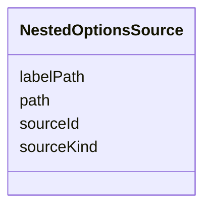

---
search:
  boost: 10.0
---

# Class: NestedOptionsSource


_Resolves a field's options from a nested multivalued attribute of one specific document, for a value object with no standalone Git contract of its own -- Project.spec.milestones is the motivating case. optionsFrom resolves one option per whole document of a declared kind; this resolves one option per entry of a list nested inside a single document instead._


<div data-search-exclude markdown="1">


URI: [jumo:NestedOptionsSource](https://jumo.dev/schemas/jumo-v1/NestedOptionsSource)





<!-- no inheritance hierarchy -->

## Slots

| Name | Cardinality and Range | Description | Inheritance |
| ---  | --- | --- | --- |
| [sourceKind](sourceKind.md) | 1 <br/> [String](String.md) | The declared ContractKind holding the nested list | direct |
| [sourceId](sourceId.md) | 1 <br/> [Identifier](Identifier.md) | The metadata | direct |
| [path](path.md) | 1 <br/> [String](String.md) | Dotted path to the nested multivalued attribute within the resolved document'... | direct |
| [labelPath](labelPath.md) | 0..1 <br/> [String](String.md) | Dotted path, relative to each nested entry, used as the option's display titl... | direct |


## Usages

| used by | used in | type | used |
| ---  | --- | --- | --- |
| [ProjectionField](ProjectionField.md) | [optionsFromNested](optionsFromNested.md) | range | [NestedOptionsSource](NestedOptionsSource.md) |


## Identifier and Mapping Information


### Annotations

| property | value |
| --- | --- |
| jumo.state_authority | GIT |
| jumo.model_role | PROJECTION |
| jumo.audience | REALM_PRIVATE |
| jumo.sensitivity | INTERNAL |
| jumo.boundary_eligible | True |
| jumo.schema_profiles | draft-2020-12,native-json-schema,prompted-json-validated |


### Schema Source


* from schema: https://jumo.dev/schemas/jumo-v1


## Mappings

| Mapping Type | Mapped Value |
| ---  | ---  |
| self | jumo:NestedOptionsSource |
| native | jumo:NestedOptionsSource |


## LinkML Source

<!-- TODO: investigate https://stackoverflow.com/questions/37606292/how-to-create-tabbed-code-blocks-in-mkdocs-or-sphinx -->

### Direct

<details>
```yaml
name: NestedOptionsSource
annotations:
  jumo.state_authority:
    tag: jumo.state_authority
    value: GIT
  jumo.model_role:
    tag: jumo.model_role
    value: PROJECTION
  jumo.audience:
    tag: jumo.audience
    value: REALM_PRIVATE
  jumo.sensitivity:
    tag: jumo.sensitivity
    value: INTERNAL
  jumo.boundary_eligible:
    tag: jumo.boundary_eligible
    value: true
  jumo.schema_profiles:
    tag: jumo.schema_profiles
    value: draft-2020-12,native-json-schema,prompted-json-validated
description: Resolves a field's options from a nested multivalued attribute of one
  specific document, for a value object with no standalone Git contract of its own
  -- Project.spec.milestones is the motivating case. optionsFrom resolves one option
  per whole document of a declared kind; this resolves one option per entry of a list
  nested inside a single document instead.
from_schema: https://jumo.dev/schemas/jumo-v1
attributes:
  sourceKind:
    name: sourceKind
    description: The declared ContractKind holding the nested list. Must name a declared
      kind (Rego), the same check optionsFrom uses.
    from_schema: https://jumo.dev/schemas/jumo-v1
    rank: 1000
    owner: NestedOptionsSource
    domain_of:
    - NestedOptionsSource
    range: string
    required: true
  sourceId:
    name: sourceId
    description: The metadata.id of the one document of sourceKind to read. A literal
      address, not resolved from another field on this same document -- proportionate
      while exactly one instance of sourceKind is ever declared (true of Project today);
      broaden to cross-field addressing only if that stops holding.
    from_schema: https://jumo.dev/schemas/jumo-v1
    owner: NestedOptionsSource
    domain_of:
    - McpCatalogProvenancePin
    - McpCatalogIdentity
    - McpCatalogFieldCandidate
    - McpRegistrySyncStatus
    - NestedOptionsSource
    range: Identifier
    required: true
  path:
    name: path
    description: Dotted path to the nested multivalued attribute within the resolved
      document's own spec, e.g. `spec.milestones`.
    from_schema: https://jumo.dev/schemas/jumo-v1
    owner: NestedOptionsSource
    domain_of:
    - DocumentationRoot
    - PromptBody
    - ApiOperation
    - ChangeSetFile
    - ProjectionOptionCondition
    - NestedOptionsSource
    - ProjectionField
    range: string
    required: true
  labelPath:
    name: labelPath
    description: Dotted path, relative to each nested entry, used as the option's
      display title. Defaults to the entry's own `id` when absent.
    from_schema: https://jumo.dev/schemas/jumo-v1
    rank: 1000
    owner: NestedOptionsSource
    domain_of:
    - NestedOptionsSource
    range: string

```
</details>

### Induced

<details>
```yaml
name: NestedOptionsSource
annotations:
  jumo.state_authority:
    tag: jumo.state_authority
    value: GIT
  jumo.model_role:
    tag: jumo.model_role
    value: PROJECTION
  jumo.audience:
    tag: jumo.audience
    value: REALM_PRIVATE
  jumo.sensitivity:
    tag: jumo.sensitivity
    value: INTERNAL
  jumo.boundary_eligible:
    tag: jumo.boundary_eligible
    value: true
  jumo.schema_profiles:
    tag: jumo.schema_profiles
    value: draft-2020-12,native-json-schema,prompted-json-validated
description: Resolves a field's options from a nested multivalued attribute of one
  specific document, for a value object with no standalone Git contract of its own
  -- Project.spec.milestones is the motivating case. optionsFrom resolves one option
  per whole document of a declared kind; this resolves one option per entry of a list
  nested inside a single document instead.
from_schema: https://jumo.dev/schemas/jumo-v1
attributes:
  sourceKind:
    name: sourceKind
    description: The declared ContractKind holding the nested list. Must name a declared
      kind (Rego), the same check optionsFrom uses.
    from_schema: https://jumo.dev/schemas/jumo-v1
    rank: 1000
    owner: NestedOptionsSource
    domain_of:
    - NestedOptionsSource
    range: string
    required: true
  sourceId:
    name: sourceId
    description: The metadata.id of the one document of sourceKind to read. A literal
      address, not resolved from another field on this same document -- proportionate
      while exactly one instance of sourceKind is ever declared (true of Project today);
      broaden to cross-field addressing only if that stops holding.
    from_schema: https://jumo.dev/schemas/jumo-v1
    owner: NestedOptionsSource
    domain_of:
    - McpCatalogProvenancePin
    - McpCatalogIdentity
    - McpCatalogFieldCandidate
    - McpRegistrySyncStatus
    - NestedOptionsSource
    range: Identifier
    required: true
  path:
    name: path
    description: Dotted path to the nested multivalued attribute within the resolved
      document's own spec, e.g. `spec.milestones`.
    from_schema: https://jumo.dev/schemas/jumo-v1
    owner: NestedOptionsSource
    domain_of:
    - DocumentationRoot
    - PromptBody
    - ApiOperation
    - ChangeSetFile
    - ProjectionOptionCondition
    - NestedOptionsSource
    - ProjectionField
    range: string
    required: true
  labelPath:
    name: labelPath
    description: Dotted path, relative to each nested entry, used as the option's
      display title. Defaults to the entry's own `id` when absent.
    from_schema: https://jumo.dev/schemas/jumo-v1
    rank: 1000
    owner: NestedOptionsSource
    domain_of:
    - NestedOptionsSource
    range: string

```
</details></div>