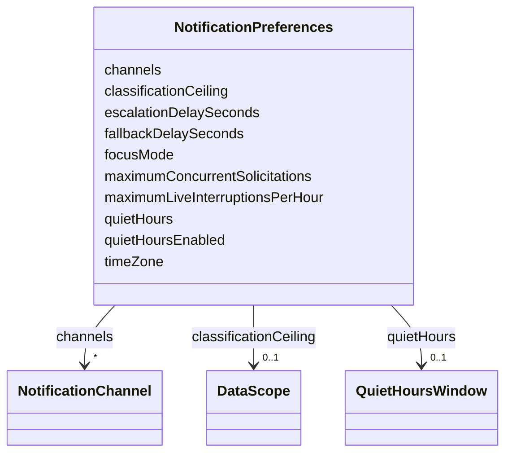

---
search:
  boost: 10.0
---

# Class: NotificationPreferences

<div data-search-exclude markdown="1">


URI: [jumo:NotificationPreferences](https://jumo.dev/schemas/jumo-v1/NotificationPreferences)





<!-- no inheritance hierarchy -->

## Slots

| Name | Cardinality and Range | Description | Inheritance |
| ---  | --- | --- | --- |
| [quietHoursEnabled](quietHoursEnabled.md) | 0..1 <br/> [Boolean](Boolean.md) |  | direct |
| [channels](channels.md) | * <br/> [NotificationChannel](NotificationChannel.md) |  | direct |
| [classificationCeiling](classificationCeiling.md) | 0..1 <br/> [DataScope](DataScope.md) |  | direct |
| [timeZone](timeZone.md) | 0..1 <br/> [String](String.md) |  | direct |
| [quietHours](quietHours.md) | 0..1 <br/> [QuietHoursWindow](QuietHoursWindow.md) |  | direct |
| [focusMode](focusMode.md) | 0..1 <br/> [Boolean](Boolean.md) |  | direct |
| [maximumLiveInterruptionsPerHour](maximumLiveInterruptionsPerHour.md) | 0..1 <br/> [Integer](Integer.md) |  | direct |
| [maximumConcurrentSolicitations](maximumConcurrentSolicitations.md) | 0..1 <br/> [Integer](Integer.md) |  | direct |
| [fallbackDelaySeconds](fallbackDelaySeconds.md) | 0..1 <br/> [Integer](Integer.md) |  | direct |
| [escalationDelaySeconds](escalationDelaySeconds.md) | 0..1 <br/> [Integer](Integer.md) |  | direct |


## Usages

| used by | used in | type | used |
| ---  | --- | --- | --- |
| [PreferencesSpec](PreferencesSpec.md) | [notifications](notifications.md) | range | [NotificationPreferences](NotificationPreferences.md) |


## Identifier and Mapping Information


### Annotations

| property | value |
| --- | --- |
| jumo.state_authority | GIT |
| jumo.model_role | VALUE_OBJECT |
| jumo.audience | REALM_PRIVATE |
| jumo.sensitivity | INTERNAL |
| jumo.boundary_eligible | True |
| jumo.schema_profiles | draft-2020-12,native-json-schema,prompted-json-validated |


### Schema Source


* from schema: https://jumo.dev/schemas/jumo-v1


## Mappings

| Mapping Type | Mapped Value |
| ---  | ---  |
| self | jumo:NotificationPreferences |
| native | jumo:NotificationPreferences |


## LinkML Source

<!-- TODO: investigate https://stackoverflow.com/questions/37606292/how-to-create-tabbed-code-blocks-in-mkdocs-or-sphinx -->

### Direct

<details>
```yaml
name: NotificationPreferences
annotations:
  jumo.state_authority:
    tag: jumo.state_authority
    value: GIT
  jumo.model_role:
    tag: jumo.model_role
    value: VALUE_OBJECT
  jumo.audience:
    tag: jumo.audience
    value: REALM_PRIVATE
  jumo.sensitivity:
    tag: jumo.sensitivity
    value: INTERNAL
  jumo.boundary_eligible:
    tag: jumo.boundary_eligible
    value: true
  jumo.schema_profiles:
    tag: jumo.schema_profiles
    value: draft-2020-12,native-json-schema,prompted-json-validated
from_schema: https://jumo.dev/schemas/jumo-v1
attributes:
  quietHoursEnabled:
    name: quietHoursEnabled
    from_schema: https://jumo.dev/schemas/jumo-v1
    rank: 1000
    owner: NotificationPreferences
    domain_of:
    - NotificationPreferences
    range: boolean
  channels:
    name: channels
    from_schema: https://jumo.dev/schemas/jumo-v1
    rank: 1000
    owner: NotificationPreferences
    domain_of:
    - NotificationPreferences
    range: NotificationChannel
    multivalued: true
  classificationCeiling:
    name: classificationCeiling
    from_schema: https://jumo.dev/schemas/jumo-v1
    rank: 1000
    owner: NotificationPreferences
    domain_of:
    - NotificationPreferences
    range: DataScope
  timeZone:
    name: timeZone
    from_schema: https://jumo.dev/schemas/jumo-v1
    rank: 1000
    owner: NotificationPreferences
    domain_of:
    - NotificationPreferences
    range: string
    pattern: ^.{1,}$
  quietHours:
    name: quietHours
    from_schema: https://jumo.dev/schemas/jumo-v1
    rank: 1000
    owner: NotificationPreferences
    domain_of:
    - NotificationPreferences
    range: QuietHoursWindow
    inlined: true
  focusMode:
    name: focusMode
    from_schema: https://jumo.dev/schemas/jumo-v1
    rank: 1000
    ifabsent: 'false'
    owner: NotificationPreferences
    domain_of:
    - NotificationPreferences
    range: boolean
  maximumLiveInterruptionsPerHour:
    name: maximumLiveInterruptionsPerHour
    from_schema: https://jumo.dev/schemas/jumo-v1
    rank: 1000
    owner: NotificationPreferences
    domain_of:
    - NotificationPreferences
    range: integer
    minimum_value: 0
    maximum_value: 100
  maximumConcurrentSolicitations:
    name: maximumConcurrentSolicitations
    from_schema: https://jumo.dev/schemas/jumo-v1
    rank: 1000
    owner: NotificationPreferences
    domain_of:
    - NotificationPreferences
    range: integer
    minimum_value: 0
    maximum_value: 100
  fallbackDelaySeconds:
    name: fallbackDelaySeconds
    from_schema: https://jumo.dev/schemas/jumo-v1
    rank: 1000
    owner: NotificationPreferences
    domain_of:
    - NotificationPreferences
    range: integer
    minimum_value: 1
    maximum_value: 604800
  escalationDelaySeconds:
    name: escalationDelaySeconds
    from_schema: https://jumo.dev/schemas/jumo-v1
    rank: 1000
    owner: NotificationPreferences
    domain_of:
    - NotificationPreferences
    range: integer
    minimum_value: 1
    maximum_value: 604800

```
</details>

### Induced

<details>
```yaml
name: NotificationPreferences
annotations:
  jumo.state_authority:
    tag: jumo.state_authority
    value: GIT
  jumo.model_role:
    tag: jumo.model_role
    value: VALUE_OBJECT
  jumo.audience:
    tag: jumo.audience
    value: REALM_PRIVATE
  jumo.sensitivity:
    tag: jumo.sensitivity
    value: INTERNAL
  jumo.boundary_eligible:
    tag: jumo.boundary_eligible
    value: true
  jumo.schema_profiles:
    tag: jumo.schema_profiles
    value: draft-2020-12,native-json-schema,prompted-json-validated
from_schema: https://jumo.dev/schemas/jumo-v1
attributes:
  quietHoursEnabled:
    name: quietHoursEnabled
    from_schema: https://jumo.dev/schemas/jumo-v1
    rank: 1000
    owner: NotificationPreferences
    domain_of:
    - NotificationPreferences
    range: boolean
  channels:
    name: channels
    from_schema: https://jumo.dev/schemas/jumo-v1
    rank: 1000
    owner: NotificationPreferences
    domain_of:
    - NotificationPreferences
    range: NotificationChannel
    multivalued: true
  classificationCeiling:
    name: classificationCeiling
    from_schema: https://jumo.dev/schemas/jumo-v1
    rank: 1000
    owner: NotificationPreferences
    domain_of:
    - NotificationPreferences
    range: DataScope
  timeZone:
    name: timeZone
    from_schema: https://jumo.dev/schemas/jumo-v1
    rank: 1000
    owner: NotificationPreferences
    domain_of:
    - NotificationPreferences
    range: string
    pattern: ^.{1,}$
  quietHours:
    name: quietHours
    from_schema: https://jumo.dev/schemas/jumo-v1
    rank: 1000
    owner: NotificationPreferences
    domain_of:
    - NotificationPreferences
    range: QuietHoursWindow
    inlined: true
  focusMode:
    name: focusMode
    from_schema: https://jumo.dev/schemas/jumo-v1
    rank: 1000
    ifabsent: 'false'
    owner: NotificationPreferences
    domain_of:
    - NotificationPreferences
    range: boolean
  maximumLiveInterruptionsPerHour:
    name: maximumLiveInterruptionsPerHour
    from_schema: https://jumo.dev/schemas/jumo-v1
    rank: 1000
    owner: NotificationPreferences
    domain_of:
    - NotificationPreferences
    range: integer
    minimum_value: 0
    maximum_value: 100
  maximumConcurrentSolicitations:
    name: maximumConcurrentSolicitations
    from_schema: https://jumo.dev/schemas/jumo-v1
    rank: 1000
    owner: NotificationPreferences
    domain_of:
    - NotificationPreferences
    range: integer
    minimum_value: 0
    maximum_value: 100
  fallbackDelaySeconds:
    name: fallbackDelaySeconds
    from_schema: https://jumo.dev/schemas/jumo-v1
    rank: 1000
    owner: NotificationPreferences
    domain_of:
    - NotificationPreferences
    range: integer
    minimum_value: 1
    maximum_value: 604800
  escalationDelaySeconds:
    name: escalationDelaySeconds
    from_schema: https://jumo.dev/schemas/jumo-v1
    rank: 1000
    owner: NotificationPreferences
    domain_of:
    - NotificationPreferences
    range: integer
    minimum_value: 1
    maximum_value: 604800

```
</details></div>