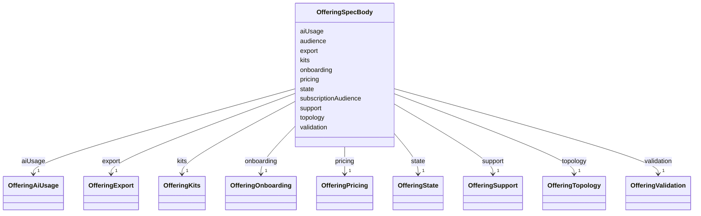

---
search:
  boost: 10.0
---

# Class: OfferingSpecBody

<div data-search-exclude markdown="1">


URI: [jumo:OfferingSpecBody](https://jumo.dev/schemas/jumo-v1/OfferingSpecBody)





<!-- no inheritance hierarchy -->

## Slots

| Name | Cardinality and Range | Description | Inheritance |
| ---  | --- | --- | --- |
| [state](state.md) | 1 <br/> [OfferingState](OfferingState.md) |  | direct |
| [audience](audience.md) | 1 <br/> [String](String.md) |  | direct |
| [subscriptionAudience](subscriptionAudience.md) | 1 <br/> [String](String.md) |  | direct |
| [pricing](pricing.md) | 1 <br/> [OfferingPricing](OfferingPricing.md) |  | direct |
| [onboarding](onboarding.md) | 1 <br/> [OfferingOnboarding](OfferingOnboarding.md) |  | direct |
| [topology](topology.md) | 1 <br/> [OfferingTopology](OfferingTopology.md) |  | direct |
| [aiUsage](aiUsage.md) | 1 <br/> [OfferingAiUsage](OfferingAiUsage.md) |  | direct |
| [support](support.md) | 1 <br/> [OfferingSupport](OfferingSupport.md) |  | direct |
| [kits](kits.md) | 1 <br/> [OfferingKits](OfferingKits.md) |  | direct |
| [export](export.md) | 1 <br/> [OfferingExport](OfferingExport.md) |  | direct |
| [validation](validation.md) | 1 <br/> [OfferingValidation](OfferingValidation.md) |  | direct |


## Usages

| used by | used in | type | used |
| ---  | --- | --- | --- |
| [OfferingSpec](OfferingSpec.md) | [spec](spec.md) | range | [OfferingSpecBody](OfferingSpecBody.md) |


## Identifier and Mapping Information


### Annotations

| property | value |
| --- | --- |
| jumo.state_authority | GIT |
| jumo.model_role | VALUE_OBJECT |
| jumo.audience | REALM_PRIVATE |
| jumo.sensitivity | PUBLIC |
| jumo.boundary_eligible | True |
| jumo.schema_profiles | draft-2020-12,native-json-schema,prompted-json-validated |


### Schema Source


* from schema: https://jumo.dev/schemas/jumo-v1


## Mappings

| Mapping Type | Mapped Value |
| ---  | ---  |
| self | jumo:OfferingSpecBody |
| native | jumo:OfferingSpecBody |


## LinkML Source

<!-- TODO: investigate https://stackoverflow.com/questions/37606292/how-to-create-tabbed-code-blocks-in-mkdocs-or-sphinx -->

### Direct

<details>
```yaml
name: OfferingSpecBody
annotations:
  jumo.state_authority:
    tag: jumo.state_authority
    value: GIT
  jumo.model_role:
    tag: jumo.model_role
    value: VALUE_OBJECT
  jumo.audience:
    tag: jumo.audience
    value: REALM_PRIVATE
  jumo.sensitivity:
    tag: jumo.sensitivity
    value: PUBLIC
  jumo.boundary_eligible:
    tag: jumo.boundary_eligible
    value: true
  jumo.schema_profiles:
    tag: jumo.schema_profiles
    value: draft-2020-12,native-json-schema,prompted-json-validated
from_schema: https://jumo.dev/schemas/jumo-v1
attributes:
  state:
    name: state
    from_schema: https://jumo.dev/schemas/jumo-v1
    rank: 1000
    ifabsent: HYPOTHESIS
    owner: OfferingSpecBody
    domain_of:
    - OfferingSpecBody
    - WorkOrderSpec
    - ImprovementRecommendationSpec
    - ChangeSetProjection
    range: OfferingState
    required: true
  audience:
    name: audience
    from_schema: https://jumo.dev/schemas/jumo-v1
    owner: OfferingSpecBody
    domain_of:
    - DocumentFrontMatter
    - OfferingSpecBody
    - SelfDescriptionAnswer
    - Surface
    - ApiOperation
    - ApiSurfaceSpec
    range: string
    required: true
    equals_string: INDEPENDENT_PROFESSIONAL
  subscriptionAudience:
    name: subscriptionAudience
    from_schema: https://jumo.dev/schemas/jumo-v1
    rank: 1000
    owner: OfferingSpecBody
    domain_of:
    - OfferingSpecBody
    range: string
    required: true
    equals_string: INDEPENDENT_PROFESSIONAL
  pricing:
    name: pricing
    from_schema: https://jumo.dev/schemas/jumo-v1
    rank: 1000
    owner: OfferingSpecBody
    domain_of:
    - OfferingSpecBody
    range: OfferingPricing
    required: true
    inlined: true
  onboarding:
    name: onboarding
    from_schema: https://jumo.dev/schemas/jumo-v1
    rank: 1000
    owner: OfferingSpecBody
    domain_of:
    - OfferingSpecBody
    range: OfferingOnboarding
    required: true
    inlined: true
  topology:
    name: topology
    from_schema: https://jumo.dev/schemas/jumo-v1
    rank: 1000
    owner: OfferingSpecBody
    domain_of:
    - OfferingSpecBody
    range: OfferingTopology
    required: true
    inlined: true
  aiUsage:
    name: aiUsage
    from_schema: https://jumo.dev/schemas/jumo-v1
    rank: 1000
    owner: OfferingSpecBody
    domain_of:
    - OfferingSpecBody
    range: OfferingAiUsage
    required: true
    inlined: true
  support:
    name: support
    from_schema: https://jumo.dev/schemas/jumo-v1
    rank: 1000
    owner: OfferingSpecBody
    domain_of:
    - OfferingSpecBody
    range: OfferingSupport
    required: true
    inlined: true
  kits:
    name: kits
    from_schema: https://jumo.dev/schemas/jumo-v1
    rank: 1000
    owner: OfferingSpecBody
    domain_of:
    - OfferingSpecBody
    range: OfferingKits
    required: true
    inlined: true
  export:
    name: export
    from_schema: https://jumo.dev/schemas/jumo-v1
    rank: 1000
    owner: OfferingSpecBody
    domain_of:
    - OfferingSpecBody
    range: OfferingExport
    required: true
    inlined: true
  validation:
    name: validation
    from_schema: https://jumo.dev/schemas/jumo-v1
    rank: 1000
    owner: OfferingSpecBody
    domain_of:
    - OfferingSpecBody
    range: OfferingValidation
    required: true
    inlined: true

```
</details>

### Induced

<details>
```yaml
name: OfferingSpecBody
annotations:
  jumo.state_authority:
    tag: jumo.state_authority
    value: GIT
  jumo.model_role:
    tag: jumo.model_role
    value: VALUE_OBJECT
  jumo.audience:
    tag: jumo.audience
    value: REALM_PRIVATE
  jumo.sensitivity:
    tag: jumo.sensitivity
    value: PUBLIC
  jumo.boundary_eligible:
    tag: jumo.boundary_eligible
    value: true
  jumo.schema_profiles:
    tag: jumo.schema_profiles
    value: draft-2020-12,native-json-schema,prompted-json-validated
from_schema: https://jumo.dev/schemas/jumo-v1
attributes:
  state:
    name: state
    from_schema: https://jumo.dev/schemas/jumo-v1
    rank: 1000
    ifabsent: HYPOTHESIS
    owner: OfferingSpecBody
    domain_of:
    - OfferingSpecBody
    - WorkOrderSpec
    - ImprovementRecommendationSpec
    - ChangeSetProjection
    range: OfferingState
    required: true
  audience:
    name: audience
    from_schema: https://jumo.dev/schemas/jumo-v1
    owner: OfferingSpecBody
    domain_of:
    - DocumentFrontMatter
    - OfferingSpecBody
    - SelfDescriptionAnswer
    - Surface
    - ApiOperation
    - ApiSurfaceSpec
    range: string
    required: true
    equals_string: INDEPENDENT_PROFESSIONAL
  subscriptionAudience:
    name: subscriptionAudience
    from_schema: https://jumo.dev/schemas/jumo-v1
    rank: 1000
    owner: OfferingSpecBody
    domain_of:
    - OfferingSpecBody
    range: string
    required: true
    equals_string: INDEPENDENT_PROFESSIONAL
  pricing:
    name: pricing
    from_schema: https://jumo.dev/schemas/jumo-v1
    rank: 1000
    owner: OfferingSpecBody
    domain_of:
    - OfferingSpecBody
    range: OfferingPricing
    required: true
    inlined: true
  onboarding:
    name: onboarding
    from_schema: https://jumo.dev/schemas/jumo-v1
    rank: 1000
    owner: OfferingSpecBody
    domain_of:
    - OfferingSpecBody
    range: OfferingOnboarding
    required: true
    inlined: true
  topology:
    name: topology
    from_schema: https://jumo.dev/schemas/jumo-v1
    rank: 1000
    owner: OfferingSpecBody
    domain_of:
    - OfferingSpecBody
    range: OfferingTopology
    required: true
    inlined: true
  aiUsage:
    name: aiUsage
    from_schema: https://jumo.dev/schemas/jumo-v1
    rank: 1000
    owner: OfferingSpecBody
    domain_of:
    - OfferingSpecBody
    range: OfferingAiUsage
    required: true
    inlined: true
  support:
    name: support
    from_schema: https://jumo.dev/schemas/jumo-v1
    rank: 1000
    owner: OfferingSpecBody
    domain_of:
    - OfferingSpecBody
    range: OfferingSupport
    required: true
    inlined: true
  kits:
    name: kits
    from_schema: https://jumo.dev/schemas/jumo-v1
    rank: 1000
    owner: OfferingSpecBody
    domain_of:
    - OfferingSpecBody
    range: OfferingKits
    required: true
    inlined: true
  export:
    name: export
    from_schema: https://jumo.dev/schemas/jumo-v1
    rank: 1000
    owner: OfferingSpecBody
    domain_of:
    - OfferingSpecBody
    range: OfferingExport
    required: true
    inlined: true
  validation:
    name: validation
    from_schema: https://jumo.dev/schemas/jumo-v1
    rank: 1000
    owner: OfferingSpecBody
    domain_of:
    - OfferingSpecBody
    range: OfferingValidation
    required: true
    inlined: true

```
</details></div>