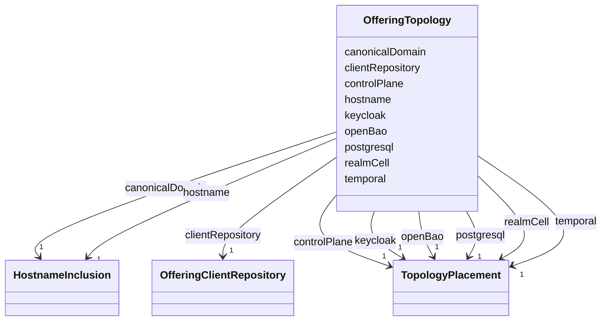

---
search:
  boost: 10.0
---

# Class: OfferingTopology

<div data-search-exclude markdown="1">


URI: [jumo:OfferingTopology](https://jumo.dev/schemas/jumo-v1/OfferingTopology)





<!-- no inheritance hierarchy -->

## Slots

| Name | Cardinality and Range | Description | Inheritance |
| ---  | --- | --- | --- |
| [realmCell](realmCell.md) | 1 <br/> [TopologyPlacement](TopologyPlacement.md) |  | direct |
| [controlPlane](controlPlane.md) | 1 <br/> [TopologyPlacement](TopologyPlacement.md) |  | direct |
| [postgresql](postgresql.md) | 1 <br/> [TopologyPlacement](TopologyPlacement.md) |  | direct |
| [temporal](temporal.md) | 1 <br/> [TopologyPlacement](TopologyPlacement.md) |  | direct |
| [keycloak](keycloak.md) | 1 <br/> [TopologyPlacement](TopologyPlacement.md) |  | direct |
| [openBao](openBao.md) | 1 <br/> [TopologyPlacement](TopologyPlacement.md) |  | direct |
| [hostname](hostname.md) | 1 <br/> [HostnameInclusion](HostnameInclusion.md) |  | direct |
| [canonicalDomain](canonicalDomain.md) | 1 <br/> [HostnameInclusion](HostnameInclusion.md) |  | direct |
| [clientRepository](clientRepository.md) | 1 <br/> [OfferingClientRepository](OfferingClientRepository.md) |  | direct |


## Usages

| used by | used in | type | used |
| ---  | --- | --- | --- |
| [OfferingSpecBody](OfferingSpecBody.md) | [topology](topology.md) | range | [OfferingTopology](OfferingTopology.md) |


## Identifier and Mapping Information


### Annotations

| property | value |
| --- | --- |
| jumo.state_authority | GIT |
| jumo.model_role | VALUE_OBJECT |
| jumo.audience | REALM_PRIVATE |
| jumo.sensitivity | PUBLIC |
| jumo.boundary_eligible | True |
| jumo.schema_profiles | draft-2020-12,native-json-schema,prompted-json-validated |


### Schema Source


* from schema: https://jumo.dev/schemas/jumo-v1


## Mappings

| Mapping Type | Mapped Value |
| ---  | ---  |
| self | jumo:OfferingTopology |
| native | jumo:OfferingTopology |


## LinkML Source

<!-- TODO: investigate https://stackoverflow.com/questions/37606292/how-to-create-tabbed-code-blocks-in-mkdocs-or-sphinx -->

### Direct

<details>
```yaml
name: OfferingTopology
annotations:
  jumo.state_authority:
    tag: jumo.state_authority
    value: GIT
  jumo.model_role:
    tag: jumo.model_role
    value: VALUE_OBJECT
  jumo.audience:
    tag: jumo.audience
    value: REALM_PRIVATE
  jumo.sensitivity:
    tag: jumo.sensitivity
    value: PUBLIC
  jumo.boundary_eligible:
    tag: jumo.boundary_eligible
    value: true
  jumo.schema_profiles:
    tag: jumo.schema_profiles
    value: draft-2020-12,native-json-schema,prompted-json-validated
from_schema: https://jumo.dev/schemas/jumo-v1
attributes:
  realmCell:
    name: realmCell
    from_schema: https://jumo.dev/schemas/jumo-v1
    rank: 1000
    ifabsent: DEDICATED
    owner: OfferingTopology
    domain_of:
    - OfferingTopology
    range: TopologyPlacement
    required: true
  controlPlane:
    name: controlPlane
    from_schema: https://jumo.dev/schemas/jumo-v1
    rank: 1000
    ifabsent: SHARED
    owner: OfferingTopology
    domain_of:
    - OfferingTopology
    range: TopologyPlacement
    required: true
  postgresql:
    name: postgresql
    from_schema: https://jumo.dev/schemas/jumo-v1
    rank: 1000
    ifabsent: SHARED
    owner: OfferingTopology
    domain_of:
    - OfferingTopology
    range: TopologyPlacement
    required: true
  temporal:
    name: temporal
    from_schema: https://jumo.dev/schemas/jumo-v1
    rank: 1000
    ifabsent: SHARED
    owner: OfferingTopology
    domain_of:
    - OfferingTopology
    range: TopologyPlacement
    required: true
  keycloak:
    name: keycloak
    from_schema: https://jumo.dev/schemas/jumo-v1
    rank: 1000
    ifabsent: SHARED
    owner: OfferingTopology
    domain_of:
    - OfferingTopology
    range: TopologyPlacement
    required: true
  openBao:
    name: openBao
    from_schema: https://jumo.dev/schemas/jumo-v1
    rank: 1000
    ifabsent: DEDICATED
    owner: OfferingTopology
    domain_of:
    - OfferingTopology
    range: TopologyPlacement
    required: true
  hostname:
    name: hostname
    from_schema: https://jumo.dev/schemas/jumo-v1
    rank: 1000
    ifabsent: INCLUDED
    owner: OfferingTopology
    domain_of:
    - OfferingTopology
    range: HostnameInclusion
    required: true
  canonicalDomain:
    name: canonicalDomain
    from_schema: https://jumo.dev/schemas/jumo-v1
    rank: 1000
    ifabsent: UNASSIGNED
    owner: OfferingTopology
    domain_of:
    - OfferingTopology
    range: HostnameInclusion
    required: true
  clientRepository:
    name: clientRepository
    from_schema: https://jumo.dev/schemas/jumo-v1
    rank: 1000
    owner: OfferingTopology
    domain_of:
    - OfferingTopology
    range: OfferingClientRepository
    required: true
    inlined: true

```
</details>

### Induced

<details>
```yaml
name: OfferingTopology
annotations:
  jumo.state_authority:
    tag: jumo.state_authority
    value: GIT
  jumo.model_role:
    tag: jumo.model_role
    value: VALUE_OBJECT
  jumo.audience:
    tag: jumo.audience
    value: REALM_PRIVATE
  jumo.sensitivity:
    tag: jumo.sensitivity
    value: PUBLIC
  jumo.boundary_eligible:
    tag: jumo.boundary_eligible
    value: true
  jumo.schema_profiles:
    tag: jumo.schema_profiles
    value: draft-2020-12,native-json-schema,prompted-json-validated
from_schema: https://jumo.dev/schemas/jumo-v1
attributes:
  realmCell:
    name: realmCell
    from_schema: https://jumo.dev/schemas/jumo-v1
    rank: 1000
    ifabsent: DEDICATED
    owner: OfferingTopology
    domain_of:
    - OfferingTopology
    range: TopologyPlacement
    required: true
  controlPlane:
    name: controlPlane
    from_schema: https://jumo.dev/schemas/jumo-v1
    rank: 1000
    ifabsent: SHARED
    owner: OfferingTopology
    domain_of:
    - OfferingTopology
    range: TopologyPlacement
    required: true
  postgresql:
    name: postgresql
    from_schema: https://jumo.dev/schemas/jumo-v1
    rank: 1000
    ifabsent: SHARED
    owner: OfferingTopology
    domain_of:
    - OfferingTopology
    range: TopologyPlacement
    required: true
  temporal:
    name: temporal
    from_schema: https://jumo.dev/schemas/jumo-v1
    rank: 1000
    ifabsent: SHARED
    owner: OfferingTopology
    domain_of:
    - OfferingTopology
    range: TopologyPlacement
    required: true
  keycloak:
    name: keycloak
    from_schema: https://jumo.dev/schemas/jumo-v1
    rank: 1000
    ifabsent: SHARED
    owner: OfferingTopology
    domain_of:
    - OfferingTopology
    range: TopologyPlacement
    required: true
  openBao:
    name: openBao
    from_schema: https://jumo.dev/schemas/jumo-v1
    rank: 1000
    ifabsent: DEDICATED
    owner: OfferingTopology
    domain_of:
    - OfferingTopology
    range: TopologyPlacement
    required: true
  hostname:
    name: hostname
    from_schema: https://jumo.dev/schemas/jumo-v1
    rank: 1000
    ifabsent: INCLUDED
    owner: OfferingTopology
    domain_of:
    - OfferingTopology
    range: HostnameInclusion
    required: true
  canonicalDomain:
    name: canonicalDomain
    from_schema: https://jumo.dev/schemas/jumo-v1
    rank: 1000
    ifabsent: UNASSIGNED
    owner: OfferingTopology
    domain_of:
    - OfferingTopology
    range: HostnameInclusion
    required: true
  clientRepository:
    name: clientRepository
    from_schema: https://jumo.dev/schemas/jumo-v1
    rank: 1000
    owner: OfferingTopology
    domain_of:
    - OfferingTopology
    range: OfferingClientRepository
    required: true
    inlined: true

```
</details></div>