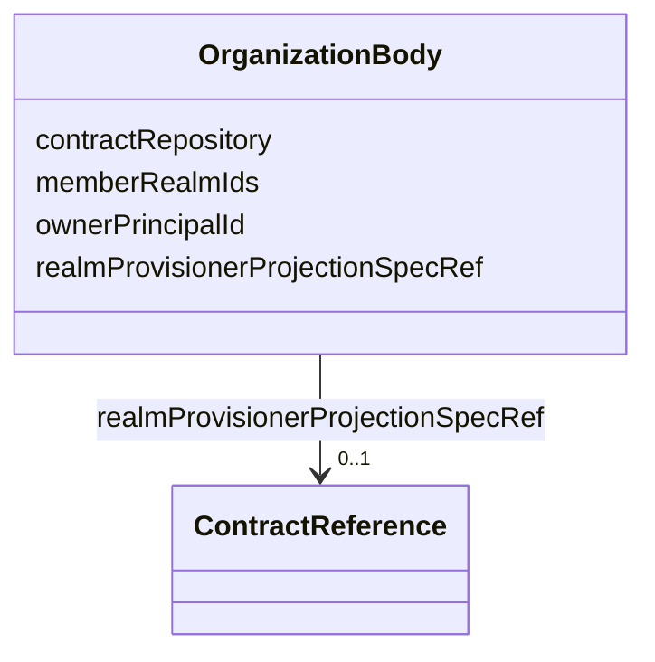

---
search:
  boost: 10.0
---

# Class: OrganizationBody

<div data-search-exclude markdown="1">


URI: [jumo:OrganizationBody](https://jumo.dev/schemas/jumo-v1/OrganizationBody)





<!-- no inheritance hierarchy -->

## Slots

| Name | Cardinality and Range | Description | Inheritance |
| ---  | --- | --- | --- |
| [contractRepository](contractRepository.md) | 1 <br/> [String](String.md) | Git repository URL or deployment-supplied reference for this Organization's  | direct |
| [memberRealmIds](memberRealmIds.md) | 1..* <br/> [Identifier](Identifier.md) |  | direct |
| [ownerPrincipalId](ownerPrincipalId.md) | 1 <br/> [String](String.md) |  | direct |
| [realmProvisionerProjectionSpecRef](realmProvisionerProjectionSpecRef.md) | 0..1 <br/> [ContractReference](ContractReference.md) | Approved bounded provisioner for self-enrolled Realm creation; never a federa... | direct |


## Usages

| used by | used in | type | used |
| ---  | --- | --- | --- |
| [Organization](Organization.md) | [spec](spec.md) | range | [OrganizationBody](OrganizationBody.md) |


## Identifier and Mapping Information


### Annotations

| property | value |
| --- | --- |
| jumo.state_authority | GIT |
| jumo.model_role | VALUE_OBJECT |
| jumo.audience | REALM_PRIVATE |
| jumo.sensitivity | INTERNAL |
| jumo.boundary_eligible | True |
| jumo.schema_profiles | draft-2020-12,native-json-schema,prompted-json-validated |


### Schema Source


* from schema: https://jumo.dev/schemas/jumo-v1


## Mappings

| Mapping Type | Mapped Value |
| ---  | ---  |
| self | jumo:OrganizationBody |
| native | jumo:OrganizationBody |


## LinkML Source

<!-- TODO: investigate https://stackoverflow.com/questions/37606292/how-to-create-tabbed-code-blocks-in-mkdocs-or-sphinx -->

### Direct

<details>
```yaml
name: OrganizationBody
annotations:
  jumo.state_authority:
    tag: jumo.state_authority
    value: GIT
  jumo.model_role:
    tag: jumo.model_role
    value: VALUE_OBJECT
  jumo.audience:
    tag: jumo.audience
    value: REALM_PRIVATE
  jumo.sensitivity:
    tag: jumo.sensitivity
    value: INTERNAL
  jumo.boundary_eligible:
    tag: jumo.boundary_eligible
    value: true
  jumo.schema_profiles:
    tag: jumo.schema_profiles
    value: draft-2020-12,native-json-schema,prompted-json-validated
from_schema: https://jumo.dev/schemas/jumo-v1
attributes:
  contractRepository:
    name: contractRepository
    description: Git repository URL or deployment-supplied reference for this Organization's
      .jumo source.
    from_schema: https://jumo.dev/schemas/jumo-v1
    owner: OrganizationBody
    domain_of:
    - RealmTemplateSpec
    - OrganizationBody
    range: string
    required: true
  memberRealmIds:
    name: memberRealmIds
    from_schema: https://jumo.dev/schemas/jumo-v1
    rank: 1000
    owner: OrganizationBody
    domain_of:
    - OrganizationBody
    range: Identifier
    required: true
    multivalued: true
    minimum_cardinality: 1
  ownerPrincipalId:
    name: ownerPrincipalId
    from_schema: https://jumo.dev/schemas/jumo-v1
    rank: 1000
    owner: OrganizationBody
    domain_of:
    - OrganizationBody
    range: string
    required: true
  realmProvisionerProjectionSpecRef:
    name: realmProvisionerProjectionSpecRef
    description: Approved bounded provisioner for self-enrolled Realm creation; never
      a federation authority.
    from_schema: https://jumo.dev/schemas/jumo-v1
    rank: 1000
    owner: OrganizationBody
    domain_of:
    - OrganizationBody
    - OrganizationEnrollmentPolicySpec
    range: ContractReference
    inlined: true

```
</details>

### Induced

<details>
```yaml
name: OrganizationBody
annotations:
  jumo.state_authority:
    tag: jumo.state_authority
    value: GIT
  jumo.model_role:
    tag: jumo.model_role
    value: VALUE_OBJECT
  jumo.audience:
    tag: jumo.audience
    value: REALM_PRIVATE
  jumo.sensitivity:
    tag: jumo.sensitivity
    value: INTERNAL
  jumo.boundary_eligible:
    tag: jumo.boundary_eligible
    value: true
  jumo.schema_profiles:
    tag: jumo.schema_profiles
    value: draft-2020-12,native-json-schema,prompted-json-validated
from_schema: https://jumo.dev/schemas/jumo-v1
attributes:
  contractRepository:
    name: contractRepository
    description: Git repository URL or deployment-supplied reference for this Organization's
      .jumo source.
    from_schema: https://jumo.dev/schemas/jumo-v1
    owner: OrganizationBody
    domain_of:
    - RealmTemplateSpec
    - OrganizationBody
    range: string
    required: true
  memberRealmIds:
    name: memberRealmIds
    from_schema: https://jumo.dev/schemas/jumo-v1
    rank: 1000
    owner: OrganizationBody
    domain_of:
    - OrganizationBody
    range: Identifier
    required: true
    multivalued: true
    minimum_cardinality: 1
  ownerPrincipalId:
    name: ownerPrincipalId
    from_schema: https://jumo.dev/schemas/jumo-v1
    rank: 1000
    owner: OrganizationBody
    domain_of:
    - OrganizationBody
    range: string
    required: true
  realmProvisionerProjectionSpecRef:
    name: realmProvisionerProjectionSpecRef
    description: Approved bounded provisioner for self-enrolled Realm creation; never
      a federation authority.
    from_schema: https://jumo.dev/schemas/jumo-v1
    rank: 1000
    owner: OrganizationBody
    domain_of:
    - OrganizationBody
    - OrganizationEnrollmentPolicySpec
    range: ContractReference
    inlined: true

```
</details></div>