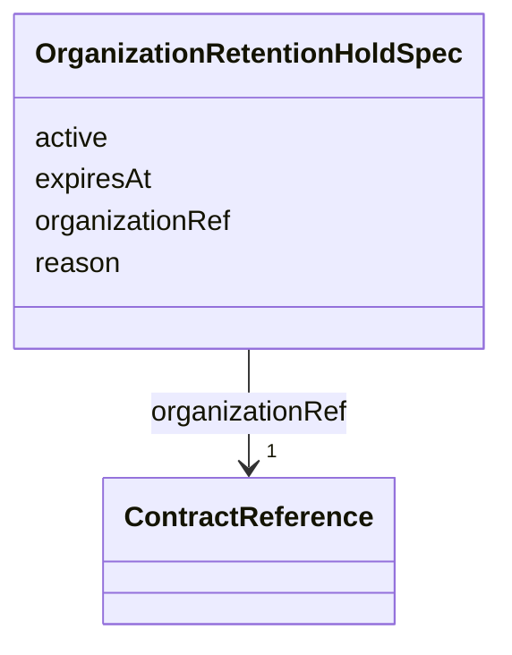

---
search:
  boost: 10.0
---

# Class: OrganizationRetentionHoldSpec

<div data-search-exclude markdown="1">


URI: [jumo:OrganizationRetentionHoldSpec](https://jumo.dev/schemas/jumo-v1/OrganizationRetentionHoldSpec)





<!-- no inheritance hierarchy -->

## Slots

| Name | Cardinality and Range | Description | Inheritance |
| ---  | --- | --- | --- |
| [organizationRef](organizationRef.md) | 1 <br/> [ContractReference](ContractReference.md) |  | direct |
| [active](active.md) | 1 <br/> [Boolean](Boolean.md) |  | direct |
| [reason](reason.md) | 1 <br/> [String](String.md) |  | direct |
| [expiresAt](expiresAt.md) | 1 <br/> [Datetime](Datetime.md) |  | direct |


## Usages

| used by | used in | type | used |
| ---  | --- | --- | --- |
| [OrganizationRetentionHold](OrganizationRetentionHold.md) | [spec](spec.md) | range | [OrganizationRetentionHoldSpec](OrganizationRetentionHoldSpec.md) |


## Identifier and Mapping Information


### Annotations

| property | value |
| --- | --- |
| jumo.state_authority | GIT |
| jumo.model_role | VALUE_OBJECT |
| jumo.audience | REALM_PRIVATE |
| jumo.sensitivity | INTERNAL |
| jumo.boundary_eligible | True |
| jumo.schema_profiles | draft-2020-12,native-json-schema,prompted-json-validated |


### Schema Source


* from schema: https://jumo.dev/schemas/jumo-v1


## Mappings

| Mapping Type | Mapped Value |
| ---  | ---  |
| self | jumo:OrganizationRetentionHoldSpec |
| native | jumo:OrganizationRetentionHoldSpec |


## LinkML Source

<!-- TODO: investigate https://stackoverflow.com/questions/37606292/how-to-create-tabbed-code-blocks-in-mkdocs-or-sphinx -->

### Direct

<details>
```yaml
name: OrganizationRetentionHoldSpec
annotations:
  jumo.state_authority:
    tag: jumo.state_authority
    value: GIT
  jumo.model_role:
    tag: jumo.model_role
    value: VALUE_OBJECT
  jumo.audience:
    tag: jumo.audience
    value: REALM_PRIVATE
  jumo.sensitivity:
    tag: jumo.sensitivity
    value: INTERNAL
  jumo.boundary_eligible:
    tag: jumo.boundary_eligible
    value: true
  jumo.schema_profiles:
    tag: jumo.schema_profiles
    value: draft-2020-12,native-json-schema,prompted-json-validated
from_schema: https://jumo.dev/schemas/jumo-v1
attributes:
  organizationRef:
    name: organizationRef
    from_schema: https://jumo.dev/schemas/jumo-v1
    owner: OrganizationRetentionHoldSpec
    domain_of:
    - OrganizationAccessBindingSpec
    - OrganizationEnrollmentPolicySpec
    - OrganizationAuditRetentionPolicySpec
    - OrganizationRetentionHoldSpec
    - OrganizationPublicationPolicySpec
    - RealmPublicationSpec
    range: ContractReference
    required: true
    inlined: true
  active:
    name: active
    from_schema: https://jumo.dev/schemas/jumo-v1
    rank: 1000
    owner: OrganizationRetentionHoldSpec
    domain_of:
    - OrganizationRetentionHoldSpec
    range: boolean
    required: true
  reason:
    name: reason
    from_schema: https://jumo.dev/schemas/jumo-v1
    rank: 1000
    owner: OrganizationRetentionHoldSpec
    domain_of:
    - OrganizationRetentionHoldSpec
    - SelectionIntentRationale
    - UpstreamToolEntry
    range: string
    required: true
    pattern: ^.{3,}$
  expiresAt:
    name: expiresAt
    from_schema: https://jumo.dev/schemas/jumo-v1
    rank: 1000
    owner: OrganizationRetentionHoldSpec
    domain_of:
    - OrganizationRetentionHoldSpec
    - MachineEnrollmentChallenge
    - MachineAdminCommand
    - WorkloadCommand
    - ExecutionCellLease
    - DelegatedSecretGrant
    - ProviderSessionBinding
    - InvocationAuthorizationReceipt
    - McpInvocationAuthorizationReceipt
    - ConnectorSessionBinding
    - EffectTestAuthorization
    range: datetime
    required: true

```
</details>

### Induced

<details>
```yaml
name: OrganizationRetentionHoldSpec
annotations:
  jumo.state_authority:
    tag: jumo.state_authority
    value: GIT
  jumo.model_role:
    tag: jumo.model_role
    value: VALUE_OBJECT
  jumo.audience:
    tag: jumo.audience
    value: REALM_PRIVATE
  jumo.sensitivity:
    tag: jumo.sensitivity
    value: INTERNAL
  jumo.boundary_eligible:
    tag: jumo.boundary_eligible
    value: true
  jumo.schema_profiles:
    tag: jumo.schema_profiles
    value: draft-2020-12,native-json-schema,prompted-json-validated
from_schema: https://jumo.dev/schemas/jumo-v1
attributes:
  organizationRef:
    name: organizationRef
    from_schema: https://jumo.dev/schemas/jumo-v1
    owner: OrganizationRetentionHoldSpec
    domain_of:
    - OrganizationAccessBindingSpec
    - OrganizationEnrollmentPolicySpec
    - OrganizationAuditRetentionPolicySpec
    - OrganizationRetentionHoldSpec
    - OrganizationPublicationPolicySpec
    - RealmPublicationSpec
    range: ContractReference
    required: true
    inlined: true
  active:
    name: active
    from_schema: https://jumo.dev/schemas/jumo-v1
    rank: 1000
    owner: OrganizationRetentionHoldSpec
    domain_of:
    - OrganizationRetentionHoldSpec
    range: boolean
    required: true
  reason:
    name: reason
    from_schema: https://jumo.dev/schemas/jumo-v1
    rank: 1000
    owner: OrganizationRetentionHoldSpec
    domain_of:
    - OrganizationRetentionHoldSpec
    - SelectionIntentRationale
    - UpstreamToolEntry
    range: string
    required: true
    pattern: ^.{3,}$
  expiresAt:
    name: expiresAt
    from_schema: https://jumo.dev/schemas/jumo-v1
    rank: 1000
    owner: OrganizationRetentionHoldSpec
    domain_of:
    - OrganizationRetentionHoldSpec
    - MachineEnrollmentChallenge
    - MachineAdminCommand
    - WorkloadCommand
    - ExecutionCellLease
    - DelegatedSecretGrant
    - ProviderSessionBinding
    - InvocationAuthorizationReceipt
    - McpInvocationAuthorizationReceipt
    - ConnectorSessionBinding
    - EffectTestAuthorization
    range: datetime
    required: true

```
</details></div>