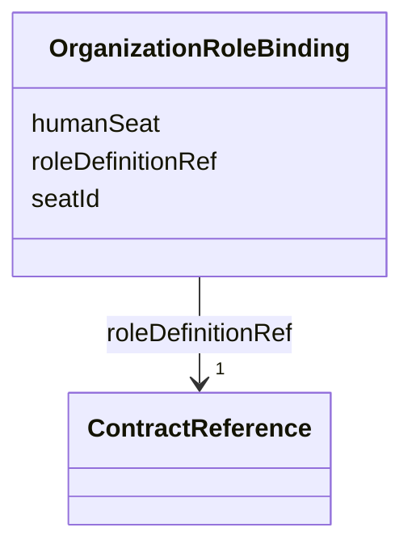

---
search:
  boost: 10.0
---

# Class: OrganizationRoleBinding

<div data-search-exclude markdown="1">


URI: [jumo:OrganizationRoleBinding](https://jumo.dev/schemas/jumo-v1/OrganizationRoleBinding)





<!-- no inheritance hierarchy -->

## Slots

| Name | Cardinality and Range | Description | Inheritance |
| ---  | --- | --- | --- |
| [seatId](seatId.md) | 1 <br/> [Identifier](Identifier.md) | A named seat in this organization, e | direct |
| [roleDefinitionRef](roleDefinitionRef.md) | 1 <br/> [ContractReference](ContractReference.md) | The RoleDefinition this seat is bound to | direct |
| [humanSeat](humanSeat.md) | 0..1 <br/> [Boolean](Boolean.md) | True for the human-owner seat, which is never filled by an AgentDefinition be... | direct |


## Usages

| used by | used in | type | used |
| ---  | --- | --- | --- |
| [OrganizationSpecBody](OrganizationSpecBody.md) | [roleRefs](roleRefs.md) | range | [OrganizationRoleBinding](OrganizationRoleBinding.md) |


## Identifier and Mapping Information


### Annotations

| property | value |
| --- | --- |
| jumo.state_authority | NONE |
| jumo.model_role | VALUE_OBJECT |
| jumo.audience | REALM_PRIVATE |
| jumo.sensitivity | INTERNAL |
| jumo.boundary_eligible | True |
| jumo.schema_profiles | draft-2020-12,native-json-schema,prompted-json-validated |


### Schema Source


* from schema: https://jumo.dev/schemas/jumo-v1


## Mappings

| Mapping Type | Mapped Value |
| ---  | ---  |
| self | jumo:OrganizationRoleBinding |
| native | jumo:OrganizationRoleBinding |


## LinkML Source

<!-- TODO: investigate https://stackoverflow.com/questions/37606292/how-to-create-tabbed-code-blocks-in-mkdocs-or-sphinx -->

### Direct

<details>
```yaml
name: OrganizationRoleBinding
annotations:
  jumo.state_authority:
    tag: jumo.state_authority
    value: NONE
  jumo.model_role:
    tag: jumo.model_role
    value: VALUE_OBJECT
  jumo.audience:
    tag: jumo.audience
    value: REALM_PRIVATE
  jumo.sensitivity:
    tag: jumo.sensitivity
    value: INTERNAL
  jumo.boundary_eligible:
    tag: jumo.boundary_eligible
    value: true
  jumo.schema_profiles:
    tag: jumo.schema_profiles
    value: draft-2020-12,native-json-schema,prompted-json-validated
from_schema: https://jumo.dev/schemas/jumo-v1
attributes:
  seatId:
    name: seatId
    description: A named seat in this organization, e.g. "chief-of-staff", "implementer",
      "reviewer", "owner".
    from_schema: https://jumo.dev/schemas/jumo-v1
    rank: 1000
    owner: OrganizationRoleBinding
    domain_of:
    - OrganizationRoleBinding
    range: Identifier
    required: true
  roleDefinitionRef:
    name: roleDefinitionRef
    description: The RoleDefinition this seat is bound to.
    from_schema: https://jumo.dev/schemas/jumo-v1
    owner: OrganizationRoleBinding
    domain_of:
    - RealmChiefOfStaffRef
    - RoleAssignmentSpec
    - TeamMember
    - ChiefOfStaffProfileSpec
    - AdvisorProfileSpec
    - OrganizationRoleBinding
    - McpRegistrySourceSpec
    - McpRegistrySourceBindingSpec
    range: ContractReference
    required: true
    inlined: true
  humanSeat:
    name: humanSeat
    description: True for the human-owner seat, which is never filled by an AgentDefinition
      bearer.
    from_schema: https://jumo.dev/schemas/jumo-v1
    rank: 1000
    ifabsent: 'false'
    owner: OrganizationRoleBinding
    domain_of:
    - OrganizationRoleBinding
    range: boolean

```
</details>

### Induced

<details>
```yaml
name: OrganizationRoleBinding
annotations:
  jumo.state_authority:
    tag: jumo.state_authority
    value: NONE
  jumo.model_role:
    tag: jumo.model_role
    value: VALUE_OBJECT
  jumo.audience:
    tag: jumo.audience
    value: REALM_PRIVATE
  jumo.sensitivity:
    tag: jumo.sensitivity
    value: INTERNAL
  jumo.boundary_eligible:
    tag: jumo.boundary_eligible
    value: true
  jumo.schema_profiles:
    tag: jumo.schema_profiles
    value: draft-2020-12,native-json-schema,prompted-json-validated
from_schema: https://jumo.dev/schemas/jumo-v1
attributes:
  seatId:
    name: seatId
    description: A named seat in this organization, e.g. "chief-of-staff", "implementer",
      "reviewer", "owner".
    from_schema: https://jumo.dev/schemas/jumo-v1
    rank: 1000
    owner: OrganizationRoleBinding
    domain_of:
    - OrganizationRoleBinding
    range: Identifier
    required: true
  roleDefinitionRef:
    name: roleDefinitionRef
    description: The RoleDefinition this seat is bound to.
    from_schema: https://jumo.dev/schemas/jumo-v1
    owner: OrganizationRoleBinding
    domain_of:
    - RealmChiefOfStaffRef
    - RoleAssignmentSpec
    - TeamMember
    - ChiefOfStaffProfileSpec
    - AdvisorProfileSpec
    - OrganizationRoleBinding
    - McpRegistrySourceSpec
    - McpRegistrySourceBindingSpec
    range: ContractReference
    required: true
    inlined: true
  humanSeat:
    name: humanSeat
    description: True for the human-owner seat, which is never filled by an AgentDefinition
      bearer.
    from_schema: https://jumo.dev/schemas/jumo-v1
    rank: 1000
    ifabsent: 'false'
    owner: OrganizationRoleBinding
    domain_of:
    - OrganizationRoleBinding
    range: boolean

```
</details></div>