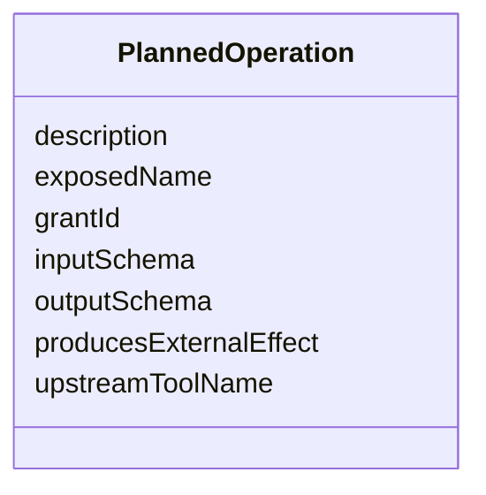

---
search:
  boost: 10.0
---

# Class: PlannedOperation


_One operation exposed by a signed MCP gateway session plan, resolved from a validated InvocationCapabilityGrant (mcp-gateway-session-plan-signing AC2). Mirrors dev.jumo.mcpgateway.plan.PlannedOperation on the gateway side._


<div data-search-exclude markdown="1">


URI: [jumo:PlannedOperation](https://jumo.dev/schemas/jumo-v1/PlannedOperation)





<!-- no inheritance hierarchy -->

## Slots

| Name | Cardinality and Range | Description | Inheritance |
| ---  | --- | --- | --- |
| [grantId](grantId.md) | 1 <br/> [Identifier](Identifier.md) |  | direct |
| [exposedName](exposedName.md) | 1 <br/> [String](String.md) |  | direct |
| [upstreamToolName](upstreamToolName.md) | 1 <br/> [String](String.md) |  | direct |
| [description](description.md) | 0..1 <br/> [String](String.md) |  | direct |
| [inputSchema](inputSchema.md) | 1 <br/> [String](String.md) |  | direct |
| [outputSchema](outputSchema.md) | 0..1 <br/> [String](String.md) |  | direct |
| [producesExternalEffect](producesExternalEffect.md) | 1 <br/> [Boolean](Boolean.md) |  | direct |


## Usages

| used by | used in | type | used |
| ---  | --- | --- | --- |
| [SessionPlan](SessionPlan.md) | [operations](operations.md) | range | [PlannedOperation](PlannedOperation.md) |


## Identifier and Mapping Information


### Annotations

| property | value |
| --- | --- |
| jumo.state_authority | NONE |
| jumo.model_role | VALUE_OBJECT |
| jumo.audience | MACHINE_MTLS |
| jumo.sensitivity | INTERNAL |
| jumo.boundary_eligible | True |
| jumo.schema_profiles | draft-2020-12,native-json-schema,prompted-json-validated |


### Schema Source


* from schema: https://jumo.dev/schemas/jumo-v1


## Mappings

| Mapping Type | Mapped Value |
| ---  | ---  |
| self | jumo:PlannedOperation |
| native | jumo:PlannedOperation |


## LinkML Source

<!-- TODO: investigate https://stackoverflow.com/questions/37606292/how-to-create-tabbed-code-blocks-in-mkdocs-or-sphinx -->

### Direct

<details>
```yaml
name: PlannedOperation
annotations:
  jumo.state_authority:
    tag: jumo.state_authority
    value: NONE
  jumo.model_role:
    tag: jumo.model_role
    value: VALUE_OBJECT
  jumo.audience:
    tag: jumo.audience
    value: MACHINE_MTLS
  jumo.sensitivity:
    tag: jumo.sensitivity
    value: INTERNAL
  jumo.boundary_eligible:
    tag: jumo.boundary_eligible
    value: true
  jumo.schema_profiles:
    tag: jumo.schema_profiles
    value: draft-2020-12,native-json-schema,prompted-json-validated
description: One operation exposed by a signed MCP gateway session plan, resolved
  from a validated InvocationCapabilityGrant (mcp-gateway-session-plan-signing AC2).
  Mirrors dev.jumo.mcpgateway.plan.PlannedOperation on the gateway side.
from_schema: https://jumo.dev/schemas/jumo-v1
attributes:
  grantId:
    name: grantId
    from_schema: https://jumo.dev/schemas/jumo-v1
    rank: 1000
    owner: PlannedOperation
    domain_of:
    - PlannedOperation
    - McpInvocationAuthorizationRequest
    - McpInvocationAuthorizationReceipt
    range: Identifier
    required: true
  exposedName:
    name: exposedName
    from_schema: https://jumo.dev/schemas/jumo-v1
    owner: PlannedOperation
    domain_of:
    - McpBundleOperation
    - PlannedOperation
    range: string
    required: true
  upstreamToolName:
    name: upstreamToolName
    from_schema: https://jumo.dev/schemas/jumo-v1
    owner: PlannedOperation
    domain_of:
    - UpstreamToolEntry
    - McpBundleOperation
    - PlannedOperation
    range: string
    required: true
  description:
    name: description
    from_schema: https://jumo.dev/schemas/jumo-v1
    owner: PlannedOperation
    domain_of:
    - PromptVariable
    - AssistedJourneySpec
    - AssistedJourneyStep
    - ActionCapability
    - MachineAdminPlaybookSpec
    - ConnectorOperation
    - McpBundleOperation
    - McpToolDescriptor
    - PlannedOperation
    - ConnectorIntegrationSpec
    - ApiResponseBinding
    range: string
  inputSchema:
    name: inputSchema
    from_schema: https://jumo.dev/schemas/jumo-v1
    owner: PlannedOperation
    domain_of:
    - McpToolDescriptor
    - PlannedOperation
    range: string
    required: true
  outputSchema:
    name: outputSchema
    from_schema: https://jumo.dev/schemas/jumo-v1
    owner: PlannedOperation
    domain_of:
    - McpToolDescriptor
    - PlannedOperation
    range: string
  producesExternalEffect:
    name: producesExternalEffect
    from_schema: https://jumo.dev/schemas/jumo-v1
    owner: PlannedOperation
    domain_of:
    - ActionCapability
    - PlannedOperation
    range: boolean
    required: true

```
</details>

### Induced

<details>
```yaml
name: PlannedOperation
annotations:
  jumo.state_authority:
    tag: jumo.state_authority
    value: NONE
  jumo.model_role:
    tag: jumo.model_role
    value: VALUE_OBJECT
  jumo.audience:
    tag: jumo.audience
    value: MACHINE_MTLS
  jumo.sensitivity:
    tag: jumo.sensitivity
    value: INTERNAL
  jumo.boundary_eligible:
    tag: jumo.boundary_eligible
    value: true
  jumo.schema_profiles:
    tag: jumo.schema_profiles
    value: draft-2020-12,native-json-schema,prompted-json-validated
description: One operation exposed by a signed MCP gateway session plan, resolved
  from a validated InvocationCapabilityGrant (mcp-gateway-session-plan-signing AC2).
  Mirrors dev.jumo.mcpgateway.plan.PlannedOperation on the gateway side.
from_schema: https://jumo.dev/schemas/jumo-v1
attributes:
  grantId:
    name: grantId
    from_schema: https://jumo.dev/schemas/jumo-v1
    rank: 1000
    owner: PlannedOperation
    domain_of:
    - PlannedOperation
    - McpInvocationAuthorizationRequest
    - McpInvocationAuthorizationReceipt
    range: Identifier
    required: true
  exposedName:
    name: exposedName
    from_schema: https://jumo.dev/schemas/jumo-v1
    owner: PlannedOperation
    domain_of:
    - McpBundleOperation
    - PlannedOperation
    range: string
    required: true
  upstreamToolName:
    name: upstreamToolName
    from_schema: https://jumo.dev/schemas/jumo-v1
    owner: PlannedOperation
    domain_of:
    - UpstreamToolEntry
    - McpBundleOperation
    - PlannedOperation
    range: string
    required: true
  description:
    name: description
    from_schema: https://jumo.dev/schemas/jumo-v1
    owner: PlannedOperation
    domain_of:
    - PromptVariable
    - AssistedJourneySpec
    - AssistedJourneyStep
    - ActionCapability
    - MachineAdminPlaybookSpec
    - ConnectorOperation
    - McpBundleOperation
    - McpToolDescriptor
    - PlannedOperation
    - ConnectorIntegrationSpec
    - ApiResponseBinding
    range: string
  inputSchema:
    name: inputSchema
    from_schema: https://jumo.dev/schemas/jumo-v1
    owner: PlannedOperation
    domain_of:
    - McpToolDescriptor
    - PlannedOperation
    range: string
    required: true
  outputSchema:
    name: outputSchema
    from_schema: https://jumo.dev/schemas/jumo-v1
    owner: PlannedOperation
    domain_of:
    - McpToolDescriptor
    - PlannedOperation
    range: string
  producesExternalEffect:
    name: producesExternalEffect
    from_schema: https://jumo.dev/schemas/jumo-v1
    owner: PlannedOperation
    domain_of:
    - ActionCapability
    - PlannedOperation
    range: boolean
    required: true

```
</details></div>