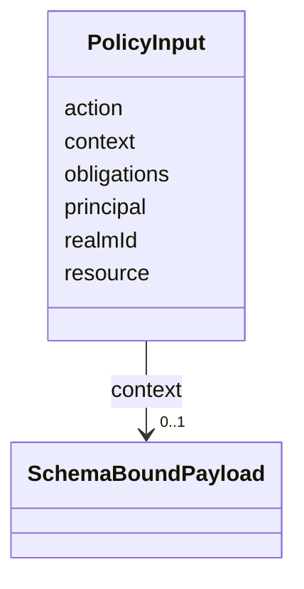

---
search:
  boost: 10.0
---

# Class: PolicyInput


_Typed input structure evaluated by OPA policies._


<div data-search-exclude markdown="1">


URI: [jumo:PolicyInput](https://jumo.dev/schemas/jumo-v1/PolicyInput)





<!-- no inheritance hierarchy -->

## Slots

| Name | Cardinality and Range | Description | Inheritance |
| ---  | --- | --- | --- |
| [action](action.md) | 1 <br/> [String](String.md) |  | direct |
| [principal](principal.md) | 1 <br/> [String](String.md) |  | direct |
| [realmId](realmId.md) | 1 <br/> [String](String.md) |  | direct |
| [resource](resource.md) | 1 <br/> [String](String.md) |  | direct |
| [context](context.md) | 0..1 <br/> [SchemaBoundPayload](SchemaBoundPayload.md) |  | direct |
| [obligations](obligations.md) | * <br/> [String](String.md) |  | direct |


## Identifier and Mapping Information


### Annotations

| property | value |
| --- | --- |
| jumo.state_authority | NONE |
| jumo.model_role | VALUE_OBJECT |
| jumo.audience | POLICY |
| jumo.sensitivity | INTERNAL |
| jumo.boundary_eligible | True |
| jumo.schema_profiles | draft-2020-12,native-json-schema,prompted-json-validated |


### Schema Source


* from schema: https://jumo.dev/schemas/jumo-v1


## Mappings

| Mapping Type | Mapped Value |
| ---  | ---  |
| self | jumo:PolicyInput |
| native | jumo:PolicyInput |


## LinkML Source

<!-- TODO: investigate https://stackoverflow.com/questions/37606292/how-to-create-tabbed-code-blocks-in-mkdocs-or-sphinx -->

### Direct

<details>
```yaml
name: PolicyInput
annotations:
  jumo.state_authority:
    tag: jumo.state_authority
    value: NONE
  jumo.model_role:
    tag: jumo.model_role
    value: VALUE_OBJECT
  jumo.audience:
    tag: jumo.audience
    value: POLICY
  jumo.sensitivity:
    tag: jumo.sensitivity
    value: INTERNAL
  jumo.boundary_eligible:
    tag: jumo.boundary_eligible
    value: true
  jumo.schema_profiles:
    tag: jumo.schema_profiles
    value: draft-2020-12,native-json-schema,prompted-json-validated
description: Typed input structure evaluated by OPA policies.
from_schema: https://jumo.dev/schemas/jumo-v1
attributes:
  action:
    name: action
    from_schema: https://jumo.dev/schemas/jumo-v1
    rank: 1000
    owner: PolicyInput
    domain_of:
    - PolicyInput
    range: string
    required: true
  principal:
    name: principal
    from_schema: https://jumo.dev/schemas/jumo-v1
    rank: 1000
    owner: PolicyInput
    domain_of:
    - PolicyInput
    range: string
    required: true
  realmId:
    name: realmId
    from_schema: https://jumo.dev/schemas/jumo-v1
    owner: PolicyInput
    domain_of:
    - AttentionSource
    - MachineEnrollmentRequest
    - MachineEnrollmentChallenge
    - ApiProblem
    - PolicyInput
    - ChangeSetProjection
    range: string
    required: true
  resource:
    name: resource
    from_schema: https://jumo.dev/schemas/jumo-v1
    rank: 1000
    owner: PolicyInput
    domain_of:
    - PolicyInput
    range: string
    required: true
  context:
    name: context
    from_schema: https://jumo.dev/schemas/jumo-v1
    owner: PolicyInput
    domain_of:
    - WorkerRequirementProfileSpec
    - PolicyInput
    range: SchemaBoundPayload
    inlined: true
  obligations:
    name: obligations
    from_schema: https://jumo.dev/schemas/jumo-v1
    owner: PolicyInput
    domain_of:
    - PolicyRule
    - ApiOperation
    - PolicyInput
    range: string
    multivalued: true

```
</details>

### Induced

<details>
```yaml
name: PolicyInput
annotations:
  jumo.state_authority:
    tag: jumo.state_authority
    value: NONE
  jumo.model_role:
    tag: jumo.model_role
    value: VALUE_OBJECT
  jumo.audience:
    tag: jumo.audience
    value: POLICY
  jumo.sensitivity:
    tag: jumo.sensitivity
    value: INTERNAL
  jumo.boundary_eligible:
    tag: jumo.boundary_eligible
    value: true
  jumo.schema_profiles:
    tag: jumo.schema_profiles
    value: draft-2020-12,native-json-schema,prompted-json-validated
description: Typed input structure evaluated by OPA policies.
from_schema: https://jumo.dev/schemas/jumo-v1
attributes:
  action:
    name: action
    from_schema: https://jumo.dev/schemas/jumo-v1
    rank: 1000
    owner: PolicyInput
    domain_of:
    - PolicyInput
    range: string
    required: true
  principal:
    name: principal
    from_schema: https://jumo.dev/schemas/jumo-v1
    rank: 1000
    owner: PolicyInput
    domain_of:
    - PolicyInput
    range: string
    required: true
  realmId:
    name: realmId
    from_schema: https://jumo.dev/schemas/jumo-v1
    owner: PolicyInput
    domain_of:
    - AttentionSource
    - MachineEnrollmentRequest
    - MachineEnrollmentChallenge
    - ApiProblem
    - PolicyInput
    - ChangeSetProjection
    range: string
    required: true
  resource:
    name: resource
    from_schema: https://jumo.dev/schemas/jumo-v1
    rank: 1000
    owner: PolicyInput
    domain_of:
    - PolicyInput
    range: string
    required: true
  context:
    name: context
    from_schema: https://jumo.dev/schemas/jumo-v1
    owner: PolicyInput
    domain_of:
    - WorkerRequirementProfileSpec
    - PolicyInput
    range: SchemaBoundPayload
    inlined: true
  obligations:
    name: obligations
    from_schema: https://jumo.dev/schemas/jumo-v1
    owner: PolicyInput
    domain_of:
    - PolicyRule
    - ApiOperation
    - PolicyInput
    range: string
    multivalued: true

```
</details></div>