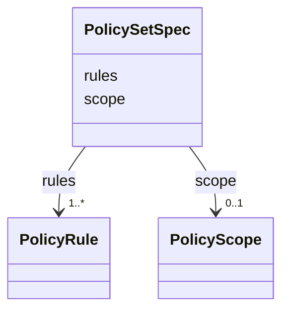

---
search:
  boost: 10.0
---

# Class: PolicySetSpec

<div data-search-exclude markdown="1">


URI: [jumo:PolicySetSpec](https://jumo.dev/schemas/jumo-v1/PolicySetSpec)





<!-- no inheritance hierarchy -->

## Slots

| Name | Cardinality and Range | Description | Inheritance |
| ---  | --- | --- | --- |
| [scope](scope.md) | 0..1 <br/> [PolicyScope](PolicyScope.md) | A lower scope may restrict but never silently expand a higher one (canonical ... | direct |
| [rules](rules.md) | 1..* <br/> [PolicyRule](PolicyRule.md) |  | direct |


## Usages

| used by | used in | type | used |
| ---  | --- | --- | --- |
| [PolicySet](PolicySet.md) | [spec](spec.md) | range | [PolicySetSpec](PolicySetSpec.md) |


## Identifier and Mapping Information


### Annotations

| property | value |
| --- | --- |
| jumo.state_authority | GIT |
| jumo.model_role | VALUE_OBJECT |
| jumo.audience | POLICY |
| jumo.sensitivity | INTERNAL |
| jumo.boundary_eligible | True |
| jumo.schema_profiles | draft-2020-12,native-json-schema,prompted-json-validated |


### Schema Source


* from schema: https://jumo.dev/schemas/jumo-v1


## Mappings

| Mapping Type | Mapped Value |
| ---  | ---  |
| self | jumo:PolicySetSpec |
| native | jumo:PolicySetSpec |


## LinkML Source

<!-- TODO: investigate https://stackoverflow.com/questions/37606292/how-to-create-tabbed-code-blocks-in-mkdocs-or-sphinx -->

### Direct

<details>
```yaml
name: PolicySetSpec
annotations:
  jumo.state_authority:
    tag: jumo.state_authority
    value: GIT
  jumo.model_role:
    tag: jumo.model_role
    value: VALUE_OBJECT
  jumo.audience:
    tag: jumo.audience
    value: POLICY
  jumo.sensitivity:
    tag: jumo.sensitivity
    value: INTERNAL
  jumo.boundary_eligible:
    tag: jumo.boundary_eligible
    value: true
  jumo.schema_profiles:
    tag: jumo.schema_profiles
    value: draft-2020-12,native-json-schema,prompted-json-validated
from_schema: https://jumo.dev/schemas/jumo-v1
attributes:
  scope:
    name: scope
    description: A lower scope may restrict but never silently expand a higher one
      (canonical decision 65).
    from_schema: https://jumo.dev/schemas/jumo-v1
    rank: 1000
    ifabsent: REALM
    owner: PolicySetSpec
    domain_of:
    - PolicySetSpec
    - ProviderQuotaObservation
    range: PolicyScope
  rules:
    name: rules
    from_schema: https://jumo.dev/schemas/jumo-v1
    rank: 1000
    owner: PolicySetSpec
    domain_of:
    - PolicySetSpec
    range: PolicyRule
    required: true
    multivalued: true
    inlined: true
    inlined_as_list: true
    minimum_cardinality: 1

```
</details>

### Induced

<details>
```yaml
name: PolicySetSpec
annotations:
  jumo.state_authority:
    tag: jumo.state_authority
    value: GIT
  jumo.model_role:
    tag: jumo.model_role
    value: VALUE_OBJECT
  jumo.audience:
    tag: jumo.audience
    value: POLICY
  jumo.sensitivity:
    tag: jumo.sensitivity
    value: INTERNAL
  jumo.boundary_eligible:
    tag: jumo.boundary_eligible
    value: true
  jumo.schema_profiles:
    tag: jumo.schema_profiles
    value: draft-2020-12,native-json-schema,prompted-json-validated
from_schema: https://jumo.dev/schemas/jumo-v1
attributes:
  scope:
    name: scope
    description: A lower scope may restrict but never silently expand a higher one
      (canonical decision 65).
    from_schema: https://jumo.dev/schemas/jumo-v1
    rank: 1000
    ifabsent: REALM
    owner: PolicySetSpec
    domain_of:
    - PolicySetSpec
    - ProviderQuotaObservation
    range: PolicyScope
  rules:
    name: rules
    from_schema: https://jumo.dev/schemas/jumo-v1
    rank: 1000
    owner: PolicySetSpec
    domain_of:
    - PolicySetSpec
    range: PolicyRule
    required: true
    multivalued: true
    inlined: true
    inlined_as_list: true
    minimum_cardinality: 1

```
</details></div>