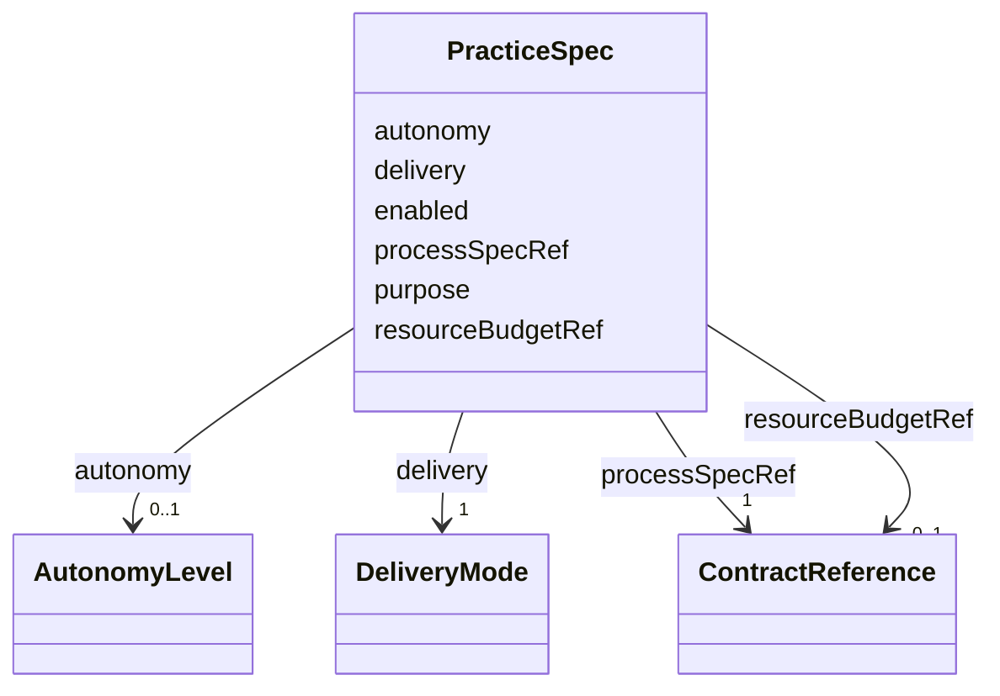

---
search:
  boost: 10.0
---

# Class: PracticeSpec

<div data-search-exclude markdown="1">


URI: [jumo:PracticeSpec](https://jumo.dev/schemas/jumo-v1/PracticeSpec)





<!-- no inheritance hierarchy -->

## Slots

| Name | Cardinality and Range | Description | Inheritance |
| ---  | --- | --- | --- |
| [purpose](purpose.md) | 1 <br/> [String](String.md) |  | direct |
| [processSpecRef](processSpecRef.md) | 1 <br/> [ContractReference](ContractReference.md) | Exact metadata id of the retained TIMER-triggered ProcessSpec release this Pr... | direct |
| [delivery](delivery.md) | 1 <br/> [DeliveryMode](DeliveryMode.md) | How the result reaches the human | direct |
| [autonomy](autonomy.md) | 0..1 <br/> [AutonomyLevel](AutonomyLevel.md) |  | direct |
| [resourceBudgetRef](resourceBudgetRef.md) | 0..1 <br/> [ContractReference](ContractReference.md) |  | direct |
| [enabled](enabled.md) | 0..1 <br/> [Boolean](Boolean.md) |  | direct |


## Usages

| used by | used in | type | used |
| ---  | --- | --- | --- |
| [Practice](Practice.md) | [spec](spec.md) | range | [PracticeSpec](PracticeSpec.md) |


## Identifier and Mapping Information


### Annotations

| property | value |
| --- | --- |
| jumo.state_authority | GIT |
| jumo.model_role | VALUE_OBJECT |
| jumo.audience | REALM_PRIVATE |
| jumo.sensitivity | INTERNAL |
| jumo.boundary_eligible | True |
| jumo.schema_profiles | draft-2020-12,native-json-schema,prompted-json-validated |


### Schema Source


* from schema: https://jumo.dev/schemas/jumo-v1


## Mappings

| Mapping Type | Mapped Value |
| ---  | ---  |
| self | jumo:PracticeSpec |
| native | jumo:PracticeSpec |


## LinkML Source

<!-- TODO: investigate https://stackoverflow.com/questions/37606292/how-to-create-tabbed-code-blocks-in-mkdocs-or-sphinx -->

### Direct

<details>
```yaml
name: PracticeSpec
annotations:
  jumo.state_authority:
    tag: jumo.state_authority
    value: GIT
  jumo.model_role:
    tag: jumo.model_role
    value: VALUE_OBJECT
  jumo.audience:
    tag: jumo.audience
    value: REALM_PRIVATE
  jumo.sensitivity:
    tag: jumo.sensitivity
    value: INTERNAL
  jumo.boundary_eligible:
    tag: jumo.boundary_eligible
    value: true
  jumo.schema_profiles:
    tag: jumo.schema_profiles
    value: draft-2020-12,native-json-schema,prompted-json-validated
from_schema: https://jumo.dev/schemas/jumo-v1
attributes:
  purpose:
    name: purpose
    from_schema: https://jumo.dev/schemas/jumo-v1
    owner: PracticeSpec
    domain_of:
    - ProjectSpec
    - TeamSpecBody
    - WorkOrderSpec
    - PracticeSpec
    - PromptTemplateSpec
    - ImprovementLoopSpec
    - ProcessingRegisterEntry
    - McpBundleSemanticProfile
    - Surface
    range: string
    required: true
    pattern: ^.{10,}$
  processSpecRef:
    name: processSpecRef
    description: Exact metadata id of the retained TIMER-triggered ProcessSpec release
      this Practice invokes. A Practice never follows a mutable logical process pointer.
    from_schema: https://jumo.dev/schemas/jumo-v1
    rank: 1000
    owner: PracticeSpec
    domain_of:
    - PracticeSpec
    - AssistedJourneyStep
    range: ContractReference
    required: true
    inlined: true
  delivery:
    name: delivery
    description: How the result reaches the human. Always LIVE is an interruption
      schedule, not a rhythm.
    from_schema: https://jumo.dev/schemas/jumo-v1
    rank: 1000
    owner: PracticeSpec
    domain_of:
    - PracticeSpec
    range: DeliveryMode
    required: true
  autonomy:
    name: autonomy
    from_schema: https://jumo.dev/schemas/jumo-v1
    rank: 1000
    owner: PracticeSpec
    domain_of:
    - PracticeSpec
    - ImprovementTarget
    range: AutonomyLevel
  resourceBudgetRef:
    name: resourceBudgetRef
    from_schema: https://jumo.dev/schemas/jumo-v1
    owner: PracticeSpec
    domain_of:
    - WorkOrderSpec
    - EngagementMethodSpec
    - PracticeSpec
    - PromptTemplateSpec
    - AssistedJourneySpec
    - ProcessSpecBody
    range: ContractReference
    inlined: true
  enabled:
    name: enabled
    from_schema: https://jumo.dev/schemas/jumo-v1
    ifabsent: 'true'
    owner: PracticeSpec
    domain_of:
    - ClarificationPolicy
    - PracticeSpec
    range: boolean

```
</details>

### Induced

<details>
```yaml
name: PracticeSpec
annotations:
  jumo.state_authority:
    tag: jumo.state_authority
    value: GIT
  jumo.model_role:
    tag: jumo.model_role
    value: VALUE_OBJECT
  jumo.audience:
    tag: jumo.audience
    value: REALM_PRIVATE
  jumo.sensitivity:
    tag: jumo.sensitivity
    value: INTERNAL
  jumo.boundary_eligible:
    tag: jumo.boundary_eligible
    value: true
  jumo.schema_profiles:
    tag: jumo.schema_profiles
    value: draft-2020-12,native-json-schema,prompted-json-validated
from_schema: https://jumo.dev/schemas/jumo-v1
attributes:
  purpose:
    name: purpose
    from_schema: https://jumo.dev/schemas/jumo-v1
    owner: PracticeSpec
    domain_of:
    - ProjectSpec
    - TeamSpecBody
    - WorkOrderSpec
    - PracticeSpec
    - PromptTemplateSpec
    - ImprovementLoopSpec
    - ProcessingRegisterEntry
    - McpBundleSemanticProfile
    - Surface
    range: string
    required: true
    pattern: ^.{10,}$
  processSpecRef:
    name: processSpecRef
    description: Exact metadata id of the retained TIMER-triggered ProcessSpec release
      this Practice invokes. A Practice never follows a mutable logical process pointer.
    from_schema: https://jumo.dev/schemas/jumo-v1
    rank: 1000
    owner: PracticeSpec
    domain_of:
    - PracticeSpec
    - AssistedJourneyStep
    range: ContractReference
    required: true
    inlined: true
  delivery:
    name: delivery
    description: How the result reaches the human. Always LIVE is an interruption
      schedule, not a rhythm.
    from_schema: https://jumo.dev/schemas/jumo-v1
    rank: 1000
    owner: PracticeSpec
    domain_of:
    - PracticeSpec
    range: DeliveryMode
    required: true
  autonomy:
    name: autonomy
    from_schema: https://jumo.dev/schemas/jumo-v1
    rank: 1000
    owner: PracticeSpec
    domain_of:
    - PracticeSpec
    - ImprovementTarget
    range: AutonomyLevel
  resourceBudgetRef:
    name: resourceBudgetRef
    from_schema: https://jumo.dev/schemas/jumo-v1
    owner: PracticeSpec
    domain_of:
    - WorkOrderSpec
    - EngagementMethodSpec
    - PracticeSpec
    - PromptTemplateSpec
    - AssistedJourneySpec
    - ProcessSpecBody
    range: ContractReference
    inlined: true
  enabled:
    name: enabled
    from_schema: https://jumo.dev/schemas/jumo-v1
    ifabsent: 'true'
    owner: PracticeSpec
    domain_of:
    - ClarificationPolicy
    - PracticeSpec
    range: boolean

```
</details></div>