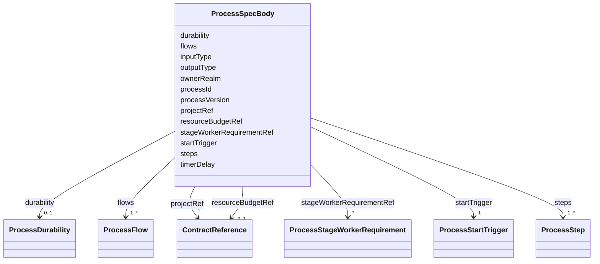

---
search:
  boost: 10.0
---

# Class: ProcessSpecBody

<div data-search-exclude markdown="1">


URI: [jumo:ProcessSpecBody](https://jumo.dev/schemas/jumo-v1/ProcessSpecBody)





<!-- no inheritance hierarchy -->

## Slots

| Name | Cardinality and Range | Description | Inheritance |
| ---  | --- | --- | --- |
| [ownerRealm](ownerRealm.md) | 1 <br/> [Identifier](Identifier.md) |  | direct |
| [projectRef](projectRef.md) | 1 <br/> [ContractReference](ContractReference.md) |  | direct |
| [processId](processId.md) | 1 <br/> [Identifier](Identifier.md) |  | direct |
| [processVersion](processVersion.md) | 1 <br/> [String](String.md) |  | direct |
| [inputType](inputType.md) | 1 <br/> [String](String.md) |  | direct |
| [outputType](outputType.md) | 1 <br/> [String](String.md) |  | direct |
| [startTrigger](startTrigger.md) | 1 <br/> [ProcessStartTrigger](ProcessStartTrigger.md) |  | direct |
| [timerDelay](timerDelay.md) | 0..1 <br/> [Duration](Duration.md) | Required only for TIMER starts; ISO-8601 duration rather than cron | direct |
| [steps](steps.md) | 1..* <br/> [ProcessStep](ProcessStep.md) | Must include exactly one START and at least one END (Rego) | direct |
| [flows](flows.md) | 1..* <br/> [ProcessFlow](ProcessFlow.md) |  | direct |
| [durability](durability.md) | 0..1 <br/> [ProcessDurability](ProcessDurability.md) |  | direct |
| [stageWorkerRequirementRef](stageWorkerRequirementRef.md) | * <br/> [ProcessStageWorkerRequirement](ProcessStageWorkerRequirement.md) | Task requirements per model-using step (source schema's open string-keyed map... | direct |
| [resourceBudgetRef](resourceBudgetRef.md) | 0..1 <br/> [ContractReference](ContractReference.md) | ResourceBudget governing this process | direct |


## Usages

| used by | used in | type | used |
| ---  | --- | --- | --- |
| [ProcessSpec](ProcessSpec.md) | [spec](spec.md) | range | [ProcessSpecBody](ProcessSpecBody.md) |


## Identifier and Mapping Information


### Annotations

| property | value |
| --- | --- |
| jumo.state_authority | GIT |
| jumo.model_role | VALUE_OBJECT |
| jumo.audience | REALM_PRIVATE |
| jumo.sensitivity | INTERNAL |
| jumo.boundary_eligible | True |
| jumo.schema_profiles | draft-2020-12,native-json-schema,prompted-json-validated |


### Schema Source


* from schema: https://jumo.dev/schemas/jumo-v1


## Mappings

| Mapping Type | Mapped Value |
| ---  | ---  |
| self | jumo:ProcessSpecBody |
| native | jumo:ProcessSpecBody |


## LinkML Source

<!-- TODO: investigate https://stackoverflow.com/questions/37606292/how-to-create-tabbed-code-blocks-in-mkdocs-or-sphinx -->

### Direct

<details>
```yaml
name: ProcessSpecBody
annotations:
  jumo.state_authority:
    tag: jumo.state_authority
    value: GIT
  jumo.model_role:
    tag: jumo.model_role
    value: VALUE_OBJECT
  jumo.audience:
    tag: jumo.audience
    value: REALM_PRIVATE
  jumo.sensitivity:
    tag: jumo.sensitivity
    value: INTERNAL
  jumo.boundary_eligible:
    tag: jumo.boundary_eligible
    value: true
  jumo.schema_profiles:
    tag: jumo.schema_profiles
    value: draft-2020-12,native-json-schema,prompted-json-validated
from_schema: https://jumo.dev/schemas/jumo-v1
attributes:
  ownerRealm:
    name: ownerRealm
    from_schema: https://jumo.dev/schemas/jumo-v1
    owner: ProcessSpecBody
    domain_of:
    - PrincipalSpec
    - PrincipalIdentityBindingSpec
    - ProjectSpec
    - KitBindingSpec
    - KitLockSpec
    - RoleDefinitionSpec
    - RoleAssignmentSpec
    - TeamSpecBody
    - CoordinationProfileSpec
    - RoutingEligibilitySpec
    - RoleLifecyclePolicySpec
    - OrganizationTemplateSpec
    - ChiefOfStaffProfileSpec
    - AdvisorProfileSpec
    - PersonalSpaceSpec
    - OrganizationSpecBody
    - RealmPublicationSpec
    - CapabilityProfileSpec
    - WorkerRequirementProfileSpec
    - GoldenTaskSetSpec
    - ImprovementLoopSpec
    - ControlCatalogSpec
    - ComplianceProfileSpec
    - EvidenceProfileSpec
    - ProcessSpecBody
    - ChangeProposalRef
    - ForgeProjectionRef
    - ProcessRunRef
    - ApprovalSignal
    - ExecutionCellProvisioningRef
    - ExecutionMachineSpec
    - MachineHostDefinitionSpec
    - McpRegistrySourceBindingSpec
    - ConnectorDefinitionSpec
    - ConnectorAppraisalSpec
    - McpBundleSpec
    - RemoteMcpServiceSpec
    - RemoteMcpAppraisalSpec
    - ExecutionCellSpec
    - ProviderSessionBinding
    - RoutingDecision
    - WorkerInvocation
    - EvidenceRecord
    - InvocationAuthorizationReceipt
    - SecretBindingSpec
    - FederatedPeerSpec
    - FederationProfileSpec
    - WorkerSubstrateSpec
    - McpInventorySnapshot
    - ConnectorIntegrationSpec
    - OAuthClientBindingSpec
    - InterfaceSurfaceSpec
    - VocabularySetSpec
    - ProjectionSpecBody
    range: Identifier
    required: true
  projectRef:
    name: projectRef
    from_schema: https://jumo.dev/schemas/jumo-v1
    owner: ProcessSpecBody
    domain_of:
    - RoutingEligibilitySpec
    - WorkOrderSpec
    - ImprovementLoopSpec
    - ProcessSpecBody
    - ChangeProposalRef
    - ForgeProjectionRef
    - ProcessRunRef
    - ApprovalSignal
    - ExecutionCellProvisioningRef
    range: ContractReference
    required: true
    inlined: true
  processId:
    name: processId
    from_schema: https://jumo.dev/schemas/jumo-v1
    rank: 1000
    owner: ProcessSpecBody
    domain_of:
    - ProcessSpecBody
    range: Identifier
    required: true
  processVersion:
    name: processVersion
    from_schema: https://jumo.dev/schemas/jumo-v1
    rank: 1000
    owner: ProcessSpecBody
    domain_of:
    - ProcessSpecBody
    range: string
    required: true
    pattern: ^\d+\.\d+\.\d+$
  inputType:
    name: inputType
    from_schema: https://jumo.dev/schemas/jumo-v1
    rank: 1000
    owner: ProcessSpecBody
    domain_of:
    - ProcessSpecBody
    range: string
    required: true
  outputType:
    name: outputType
    from_schema: https://jumo.dev/schemas/jumo-v1
    rank: 1000
    owner: ProcessSpecBody
    domain_of:
    - ProcessSpecBody
    range: string
    required: true
  startTrigger:
    name: startTrigger
    from_schema: https://jumo.dev/schemas/jumo-v1
    rank: 1000
    owner: ProcessSpecBody
    domain_of:
    - ProcessSpecBody
    range: ProcessStartTrigger
    required: true
  timerDelay:
    name: timerDelay
    description: Required only for TIMER starts; ISO-8601 duration rather than cron.
    from_schema: https://jumo.dev/schemas/jumo-v1
    rank: 1000
    owner: ProcessSpecBody
    domain_of:
    - ProcessSpecBody
    range: Duration
  steps:
    name: steps
    description: Must include exactly one START and at least one END (Rego).
    from_schema: https://jumo.dev/schemas/jumo-v1
    owner: ProcessSpecBody
    domain_of:
    - AssistedJourneySpec
    - ProcessSpecBody
    range: ProcessStep
    required: true
    multivalued: true
    inlined: true
    inlined_as_list: true
    minimum_cardinality: 2
  flows:
    name: flows
    from_schema: https://jumo.dev/schemas/jumo-v1
    rank: 1000
    owner: ProcessSpecBody
    domain_of:
    - ProcessSpecBody
    range: ProcessFlow
    required: true
    multivalued: true
    inlined: true
    inlined_as_list: true
    minimum_cardinality: 1
  durability:
    name: durability
    from_schema: https://jumo.dev/schemas/jumo-v1
    rank: 1000
    owner: ProcessSpecBody
    domain_of:
    - ProcessSpecBody
    range: ProcessDurability
    inlined: true
  stageWorkerRequirementRef:
    name: stageWorkerRequirementRef
    description: Task requirements per model-using step (source schema's open string-keyed
      map, modeled as key/value pairs -- see ThemePack for the same pattern). Every
      key must name a declared step and every value resolves to a WorkerRequirementProfile
      (Rego).
    from_schema: https://jumo.dev/schemas/jumo-v1
    rank: 1000
    owner: ProcessSpecBody
    domain_of:
    - ProcessSpecBody
    range: ProcessStageWorkerRequirement
    multivalued: true
    inlined: true
    inlined_as_list: true
  resourceBudgetRef:
    name: resourceBudgetRef
    description: ResourceBudget governing this process.
    from_schema: https://jumo.dev/schemas/jumo-v1
    owner: ProcessSpecBody
    domain_of:
    - WorkOrderSpec
    - EngagementMethodSpec
    - PracticeSpec
    - PromptTemplateSpec
    - AssistedJourneySpec
    - ProcessSpecBody
    range: ContractReference
    inlined: true

```
</details>

### Induced

<details>
```yaml
name: ProcessSpecBody
annotations:
  jumo.state_authority:
    tag: jumo.state_authority
    value: GIT
  jumo.model_role:
    tag: jumo.model_role
    value: VALUE_OBJECT
  jumo.audience:
    tag: jumo.audience
    value: REALM_PRIVATE
  jumo.sensitivity:
    tag: jumo.sensitivity
    value: INTERNAL
  jumo.boundary_eligible:
    tag: jumo.boundary_eligible
    value: true
  jumo.schema_profiles:
    tag: jumo.schema_profiles
    value: draft-2020-12,native-json-schema,prompted-json-validated
from_schema: https://jumo.dev/schemas/jumo-v1
attributes:
  ownerRealm:
    name: ownerRealm
    from_schema: https://jumo.dev/schemas/jumo-v1
    owner: ProcessSpecBody
    domain_of:
    - PrincipalSpec
    - PrincipalIdentityBindingSpec
    - ProjectSpec
    - KitBindingSpec
    - KitLockSpec
    - RoleDefinitionSpec
    - RoleAssignmentSpec
    - TeamSpecBody
    - CoordinationProfileSpec
    - RoutingEligibilitySpec
    - RoleLifecyclePolicySpec
    - OrganizationTemplateSpec
    - ChiefOfStaffProfileSpec
    - AdvisorProfileSpec
    - PersonalSpaceSpec
    - OrganizationSpecBody
    - RealmPublicationSpec
    - CapabilityProfileSpec
    - WorkerRequirementProfileSpec
    - GoldenTaskSetSpec
    - ImprovementLoopSpec
    - ControlCatalogSpec
    - ComplianceProfileSpec
    - EvidenceProfileSpec
    - ProcessSpecBody
    - ChangeProposalRef
    - ForgeProjectionRef
    - ProcessRunRef
    - ApprovalSignal
    - ExecutionCellProvisioningRef
    - ExecutionMachineSpec
    - MachineHostDefinitionSpec
    - McpRegistrySourceBindingSpec
    - ConnectorDefinitionSpec
    - ConnectorAppraisalSpec
    - McpBundleSpec
    - RemoteMcpServiceSpec
    - RemoteMcpAppraisalSpec
    - ExecutionCellSpec
    - ProviderSessionBinding
    - RoutingDecision
    - WorkerInvocation
    - EvidenceRecord
    - InvocationAuthorizationReceipt
    - SecretBindingSpec
    - FederatedPeerSpec
    - FederationProfileSpec
    - WorkerSubstrateSpec
    - McpInventorySnapshot
    - ConnectorIntegrationSpec
    - OAuthClientBindingSpec
    - InterfaceSurfaceSpec
    - VocabularySetSpec
    - ProjectionSpecBody
    range: Identifier
    required: true
  projectRef:
    name: projectRef
    from_schema: https://jumo.dev/schemas/jumo-v1
    owner: ProcessSpecBody
    domain_of:
    - RoutingEligibilitySpec
    - WorkOrderSpec
    - ImprovementLoopSpec
    - ProcessSpecBody
    - ChangeProposalRef
    - ForgeProjectionRef
    - ProcessRunRef
    - ApprovalSignal
    - ExecutionCellProvisioningRef
    range: ContractReference
    required: true
    inlined: true
  processId:
    name: processId
    from_schema: https://jumo.dev/schemas/jumo-v1
    rank: 1000
    owner: ProcessSpecBody
    domain_of:
    - ProcessSpecBody
    range: Identifier
    required: true
  processVersion:
    name: processVersion
    from_schema: https://jumo.dev/schemas/jumo-v1
    rank: 1000
    owner: ProcessSpecBody
    domain_of:
    - ProcessSpecBody
    range: string
    required: true
    pattern: ^\d+\.\d+\.\d+$
  inputType:
    name: inputType
    from_schema: https://jumo.dev/schemas/jumo-v1
    rank: 1000
    owner: ProcessSpecBody
    domain_of:
    - ProcessSpecBody
    range: string
    required: true
  outputType:
    name: outputType
    from_schema: https://jumo.dev/schemas/jumo-v1
    rank: 1000
    owner: ProcessSpecBody
    domain_of:
    - ProcessSpecBody
    range: string
    required: true
  startTrigger:
    name: startTrigger
    from_schema: https://jumo.dev/schemas/jumo-v1
    rank: 1000
    owner: ProcessSpecBody
    domain_of:
    - ProcessSpecBody
    range: ProcessStartTrigger
    required: true
  timerDelay:
    name: timerDelay
    description: Required only for TIMER starts; ISO-8601 duration rather than cron.
    from_schema: https://jumo.dev/schemas/jumo-v1
    rank: 1000
    owner: ProcessSpecBody
    domain_of:
    - ProcessSpecBody
    range: Duration
  steps:
    name: steps
    description: Must include exactly one START and at least one END (Rego).
    from_schema: https://jumo.dev/schemas/jumo-v1
    owner: ProcessSpecBody
    domain_of:
    - AssistedJourneySpec
    - ProcessSpecBody
    range: ProcessStep
    required: true
    multivalued: true
    inlined: true
    inlined_as_list: true
    minimum_cardinality: 2
  flows:
    name: flows
    from_schema: https://jumo.dev/schemas/jumo-v1
    rank: 1000
    owner: ProcessSpecBody
    domain_of:
    - ProcessSpecBody
    range: ProcessFlow
    required: true
    multivalued: true
    inlined: true
    inlined_as_list: true
    minimum_cardinality: 1
  durability:
    name: durability
    from_schema: https://jumo.dev/schemas/jumo-v1
    rank: 1000
    owner: ProcessSpecBody
    domain_of:
    - ProcessSpecBody
    range: ProcessDurability
    inlined: true
  stageWorkerRequirementRef:
    name: stageWorkerRequirementRef
    description: Task requirements per model-using step (source schema's open string-keyed
      map, modeled as key/value pairs -- see ThemePack for the same pattern). Every
      key must name a declared step and every value resolves to a WorkerRequirementProfile
      (Rego).
    from_schema: https://jumo.dev/schemas/jumo-v1
    rank: 1000
    owner: ProcessSpecBody
    domain_of:
    - ProcessSpecBody
    range: ProcessStageWorkerRequirement
    multivalued: true
    inlined: true
    inlined_as_list: true
  resourceBudgetRef:
    name: resourceBudgetRef
    description: ResourceBudget governing this process.
    from_schema: https://jumo.dev/schemas/jumo-v1
    owner: ProcessSpecBody
    domain_of:
    - WorkOrderSpec
    - EngagementMethodSpec
    - PracticeSpec
    - PromptTemplateSpec
    - AssistedJourneySpec
    - ProcessSpecBody
    range: ContractReference
    inlined: true

```
</details></div>