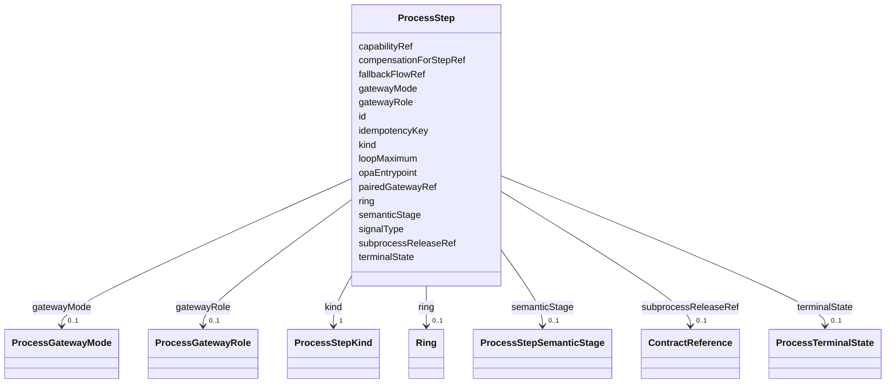

---
search:
  boost: 10.0
---

# Class: ProcessStep


_One node in the process graph. inputType/outputType/capabilityRef/opaEntrypoint are used selectively by kind: a GATEWAY step names opaEntrypoint (the OPA decision that selects its outgoing flow); a SERVICE step names capabilityRef and inputType/outputType; a TIMER START step carries the schedule fields Practice.processSpecRef (work.yaml) points at. Which fields apply to which kind is a Rego invariant, not encoded structurally here -- LinkML has no tagged-union/discriminated-class construct clean enough to justify one ProcessStep subclass per kind for what is otherwise one shape._


<div data-search-exclude markdown="1">


URI: [jumo:ProcessStep](https://jumo.dev/schemas/jumo-v1/ProcessStep)





<!-- no inheritance hierarchy -->

## Slots

| Name | Cardinality and Range | Description | Inheritance |
| ---  | --- | --- | --- |
| [id](id.md) | 1 <br/> [Identifier](Identifier.md) |  | direct |
| [kind](kind.md) | 1 <br/> [ProcessStepKind](ProcessStepKind.md) |  | direct |
| [semanticStage](semanticStage.md) | 0..1 <br/> [ProcessStepSemanticStage](ProcessStepSemanticStage.md) | The WorkflowDeclaration-era stage this step corresponds to, where applicable | direct |
| [capabilityRef](capabilityRef.md) | 0..1 <br/> [CapabilityName](CapabilityName.md) | Required on a SERVICE step (Rego); must resolve in an ActionCapabilitySet | direct |
| [ring](ring.md) | 0..1 <br/> [Ring](Ring.md) | Must not exceed the ringCeiling of capabilityRef's ActionCapability (Rego) | direct |
| [idempotencyKey](idempotencyKey.md) | 0..1 <br/> [String](String.md) | Required on a SERVICE step whose capability producesExternalEffect (Rego) | direct |
| [opaEntrypoint](opaEntrypoint.md) | 0..1 <br/> [String](String.md) | Required on a GATEWAY step (Rego): the Rego rule the ProcessSpec compiler wir... | direct |
| [terminalState](terminalState.md) | 0..1 <br/> [ProcessTerminalState](ProcessTerminalState.md) | Required on END and forbidden elsewhere | direct |
| [signalType](signalType.md) | 0..1 <br/> [String](String.md) | Required on USER and MESSAGE signals; resolves to a generated LinkML class | direct |
| [gatewayMode](gatewayMode.md) | 0..1 <br/> [ProcessGatewayMode](ProcessGatewayMode.md) |  | direct |
| [gatewayRole](gatewayRole.md) | 0..1 <br/> [ProcessGatewayRole](ProcessGatewayRole.md) |  | direct |
| [pairedGatewayRef](pairedGatewayRef.md) | 0..1 <br/> [Identifier](Identifier.md) |  | direct |
| [loopMaximum](loopMaximum.md) | 0..1 <br/> [Integer](Integer.md) |  | direct |
| [fallbackFlowRef](fallbackFlowRef.md) | 0..1 <br/> [Identifier](Identifier.md) |  | direct |
| [subprocessReleaseRef](subprocessReleaseRef.md) | 0..1 <br/> [ContractReference](ContractReference.md) | The exact ProcessSpec release this SUBPROCESS step invokes (Rego required-on-... | direct |
| [compensationForStepRef](compensationForStepRef.md) | 0..1 <br/> [Identifier](Identifier.md) |  | direct |


## Usages

| used by | used in | type | used |
| ---  | --- | --- | --- |
| [ProcessSpecBody](ProcessSpecBody.md) | [steps](steps.md) | range | [ProcessStep](ProcessStep.md) |


## Identifier and Mapping Information


### Annotations

| property | value |
| --- | --- |
| jumo.state_authority | GIT |
| jumo.model_role | CONTRACT |
| jumo.audience | REALM_PRIVATE |
| jumo.sensitivity | INTERNAL |
| jumo.boundary_eligible | True |
| jumo.schema_profiles | draft-2020-12,native-json-schema,prompted-json-validated |
| jumo.composition | ADDITIVE |


### Schema Source


* from schema: https://jumo.dev/schemas/jumo-v1


## Mappings

| Mapping Type | Mapped Value |
| ---  | ---  |
| self | jumo:ProcessStep |
| native | jumo:ProcessStep |


## LinkML Source

<!-- TODO: investigate https://stackoverflow.com/questions/37606292/how-to-create-tabbed-code-blocks-in-mkdocs-or-sphinx -->

### Direct

<details>
```yaml
name: ProcessStep
annotations:
  jumo.state_authority:
    tag: jumo.state_authority
    value: GIT
  jumo.model_role:
    tag: jumo.model_role
    value: CONTRACT
  jumo.audience:
    tag: jumo.audience
    value: REALM_PRIVATE
  jumo.sensitivity:
    tag: jumo.sensitivity
    value: INTERNAL
  jumo.boundary_eligible:
    tag: jumo.boundary_eligible
    value: true
  jumo.schema_profiles:
    tag: jumo.schema_profiles
    value: draft-2020-12,native-json-schema,prompted-json-validated
  jumo.composition:
    tag: jumo.composition
    value: ADDITIVE
description: 'One node in the process graph. inputType/outputType/capabilityRef/opaEntrypoint
  are used selectively by kind: a GATEWAY step names opaEntrypoint (the OPA decision
  that selects its outgoing flow); a SERVICE step names capabilityRef and inputType/outputType;
  a TIMER START step carries the schedule fields Practice.processSpecRef (work.yaml)
  points at. Which fields apply to which kind is a Rego invariant, not encoded structurally
  here -- LinkML has no tagged-union/discriminated-class construct clean enough to
  justify one ProcessStep subclass per kind for what is otherwise one shape.'
from_schema: https://jumo.dev/schemas/jumo-v1
attributes:
  id:
    name: id
    from_schema: https://jumo.dev/schemas/jumo-v1
    owner: ProcessStep
    domain_of:
    - ContractReference
    - Metadata
    - LayerOverride
    - Principle
    - Milestone
    - RepositoryBinding
    - KitProfile
    - KitModule
    - DispositionRule
    - SelfDescriptionSubject
    - AgentCardSkill
    - AcceptanceCriterion
    - EngagementStage
    - GoldenTaskCase
    - AssistedJourneyStep
    - PolicyRule
    - AttentionDecisionOption
    - ProcessStep
    - ProcessFlow
    - ChangeProposalRef
    - ForgeProjectionRef
    - ProcessRunRef
    - ApprovalSignal
    - ExecutionCellProvisioningRef
    - ConnectorOperation
    - McpBundleOperation
    - ProviderSessionBinding
    - RoutingDecision
    - WorkerInvocation
    - EvidenceRecord
    - Surface
    - ProjectionSection
    range: Identifier
    required: true
  kind:
    name: kind
    from_schema: https://jumo.dev/schemas/jumo-v1
    owner: ProcessStep
    domain_of:
    - ContractReference
    - Principal
    - PrincipalIdentityBinding
    - PrincipleSet
    - Project
    - RealmTemplate
    - JumoKit
    - KitBinding
    - KitLock
    - KitReleaseCertification
    - OfferingSpec
    - RoleDefinition
    - AgentDefinition
    - RoleAssignment
    - RoleBearer
    - TeamSpec
    - CoordinationProfile
    - RoutingEligibility
    - RoleLifecyclePolicy
    - OrganizationTemplate
    - ChiefOfStaffProfile
    - AdvisorProfile
    - PersonalSpace
    - Preferences
    - SelfDescription
    - SelfDescriptionSubject
    - OrganizationSpec
    - Organization
    - OrganizationAccessBinding
    - OrganizationEnrollmentPolicy
    - OrganizationAuditRetentionPolicy
    - OrganizationRetentionHold
    - OrganizationPublicationPolicy
    - RealmPublication
    - WorkOrder
    - SolicitationContract
    - EngagementMethod
    - Practice
    - CapabilityProfile
    - WorkerRequirementProfile
    - GoldenTaskSet
    - PromptTemplate
    - ResourceBudget
    - AssistedJourney
    - JourneyVerificationSpec
    - AssistedJourneyReferenceCheck
    - DocumentTemplate
    - ActionCapabilitySet
    - PolicySet
    - ImprovementLoop
    - ImprovementRecommendation
    - AttentionItem
    - ControlCatalog
    - ComplianceProfile
    - EvidenceProfile
    - ProcessSpec
    - ProcessStep
    - ExecutionMachine
    - MachineHostDefinition
    - MachineAdminPlaybook
    - MachineRuntimeInstallation
    - CliToolDefinition
    - CliRelease
    - ProviderQuotaObservation
    - McpRegistrySource
    - McpRegistrySourceBinding
    - ConnectorDefinition
    - ConnectorAppraisal
    - McpBundle
    - RemoteMcpService
    - RemoteMcpAppraisal
    - ExecutionCell
    - SecretBinding
    - FederatedPeer
    - FederationProfile
    - ProviderAccount
    - ProviderPlatform
    - ProviderQuotaWindow
    - WorkerSubstrate
    - ConnectorIntegration
    - ConnectorPackage
    - ConnectorPackageCertification
    - OAuthClientBinding
    - InterfaceSurface
    - ThemePack
    - VocabularySet
    - ApiSurface
    - ProjectionSpec
    range: ProcessStepKind
    required: true
  semanticStage:
    name: semanticStage
    description: The WorkflowDeclaration-era stage this step corresponds to, where
      applicable.
    from_schema: https://jumo.dev/schemas/jumo-v1
    rank: 1000
    owner: ProcessStep
    domain_of:
    - ProcessStep
    range: ProcessStepSemanticStage
  capabilityRef:
    name: capabilityRef
    description: Required on a SERVICE step (Rego); must resolve in an ActionCapabilitySet.
    from_schema: https://jumo.dev/schemas/jumo-v1
    owner: ProcessStep
    domain_of:
    - ImprovementTarget
    - AttentionDecisionOption
    - ProcessStep
    - ConnectorOperation
    - McpBundleOperation
    - SurfaceWritePath
    range: CapabilityName
  ring:
    name: ring
    description: Must not exceed the ringCeiling of capabilityRef's ActionCapability
      (Rego).
    from_schema: https://jumo.dev/schemas/jumo-v1
    owner: ProcessStep
    domain_of:
    - WorkOrderSpec
    - PromptTemplateSpec
    - ImprovementTarget
    - ProcessStep
    - SurfaceWritePath
    range: Ring
  idempotencyKey:
    name: idempotencyKey
    description: Required on a SERVICE step whose capability producesExternalEffect
      (Rego).
    from_schema: https://jumo.dev/schemas/jumo-v1
    rank: 1000
    owner: ProcessStep
    domain_of:
    - ProcessStep
    range: string
  opaEntrypoint:
    name: opaEntrypoint
    description: 'Required on a GATEWAY step (Rego): the Rego rule the ProcessSpec
      compiler wires as the decision selecting this gateway''s outgoing branch.'
    from_schema: https://jumo.dev/schemas/jumo-v1
    rank: 1000
    owner: ProcessStep
    domain_of:
    - ProcessStep
    range: string
    pattern: ^[a-z][a-z0-9_.]*$
  terminalState:
    name: terminalState
    description: Required on END and forbidden elsewhere.
    from_schema: https://jumo.dev/schemas/jumo-v1
    rank: 1000
    owner: ProcessStep
    domain_of:
    - ProcessStep
    range: ProcessTerminalState
  signalType:
    name: signalType
    description: Required on USER and MESSAGE signals; resolves to a generated LinkML
      class.
    from_schema: https://jumo.dev/schemas/jumo-v1
    rank: 1000
    owner: ProcessStep
    domain_of:
    - ProcessStep
    range: string
  gatewayMode:
    name: gatewayMode
    from_schema: https://jumo.dev/schemas/jumo-v1
    rank: 1000
    owner: ProcessStep
    domain_of:
    - ProcessStep
    range: ProcessGatewayMode
  gatewayRole:
    name: gatewayRole
    from_schema: https://jumo.dev/schemas/jumo-v1
    rank: 1000
    owner: ProcessStep
    domain_of:
    - ProcessStep
    range: ProcessGatewayRole
  pairedGatewayRef:
    name: pairedGatewayRef
    from_schema: https://jumo.dev/schemas/jumo-v1
    rank: 1000
    owner: ProcessStep
    domain_of:
    - ProcessStep
    range: Identifier
  loopMaximum:
    name: loopMaximum
    from_schema: https://jumo.dev/schemas/jumo-v1
    rank: 1000
    owner: ProcessStep
    domain_of:
    - ProcessStep
    range: integer
    minimum_value: 1
    maximum_value: 100
  fallbackFlowRef:
    name: fallbackFlowRef
    from_schema: https://jumo.dev/schemas/jumo-v1
    rank: 1000
    owner: ProcessStep
    domain_of:
    - ProcessStep
    range: Identifier
  subprocessReleaseRef:
    name: subprocessReleaseRef
    description: The exact ProcessSpec release this SUBPROCESS step invokes (Rego
      required-on-SUBPROCESS check in execution.rego; must resolve, see references.rego).
    from_schema: https://jumo.dev/schemas/jumo-v1
    rank: 1000
    owner: ProcessStep
    domain_of:
    - ProcessStep
    range: ContractReference
    inlined: true
  compensationForStepRef:
    name: compensationForStepRef
    from_schema: https://jumo.dev/schemas/jumo-v1
    rank: 1000
    owner: ProcessStep
    domain_of:
    - ProcessStep
    range: Identifier

```
</details>

### Induced

<details>
```yaml
name: ProcessStep
annotations:
  jumo.state_authority:
    tag: jumo.state_authority
    value: GIT
  jumo.model_role:
    tag: jumo.model_role
    value: CONTRACT
  jumo.audience:
    tag: jumo.audience
    value: REALM_PRIVATE
  jumo.sensitivity:
    tag: jumo.sensitivity
    value: INTERNAL
  jumo.boundary_eligible:
    tag: jumo.boundary_eligible
    value: true
  jumo.schema_profiles:
    tag: jumo.schema_profiles
    value: draft-2020-12,native-json-schema,prompted-json-validated
  jumo.composition:
    tag: jumo.composition
    value: ADDITIVE
description: 'One node in the process graph. inputType/outputType/capabilityRef/opaEntrypoint
  are used selectively by kind: a GATEWAY step names opaEntrypoint (the OPA decision
  that selects its outgoing flow); a SERVICE step names capabilityRef and inputType/outputType;
  a TIMER START step carries the schedule fields Practice.processSpecRef (work.yaml)
  points at. Which fields apply to which kind is a Rego invariant, not encoded structurally
  here -- LinkML has no tagged-union/discriminated-class construct clean enough to
  justify one ProcessStep subclass per kind for what is otherwise one shape.'
from_schema: https://jumo.dev/schemas/jumo-v1
attributes:
  id:
    name: id
    from_schema: https://jumo.dev/schemas/jumo-v1
    owner: ProcessStep
    domain_of:
    - ContractReference
    - Metadata
    - LayerOverride
    - Principle
    - Milestone
    - RepositoryBinding
    - KitProfile
    - KitModule
    - DispositionRule
    - SelfDescriptionSubject
    - AgentCardSkill
    - AcceptanceCriterion
    - EngagementStage
    - GoldenTaskCase
    - AssistedJourneyStep
    - PolicyRule
    - AttentionDecisionOption
    - ProcessStep
    - ProcessFlow
    - ChangeProposalRef
    - ForgeProjectionRef
    - ProcessRunRef
    - ApprovalSignal
    - ExecutionCellProvisioningRef
    - ConnectorOperation
    - McpBundleOperation
    - ProviderSessionBinding
    - RoutingDecision
    - WorkerInvocation
    - EvidenceRecord
    - Surface
    - ProjectionSection
    range: Identifier
    required: true
  kind:
    name: kind
    from_schema: https://jumo.dev/schemas/jumo-v1
    owner: ProcessStep
    domain_of:
    - ContractReference
    - Principal
    - PrincipalIdentityBinding
    - PrincipleSet
    - Project
    - RealmTemplate
    - JumoKit
    - KitBinding
    - KitLock
    - KitReleaseCertification
    - OfferingSpec
    - RoleDefinition
    - AgentDefinition
    - RoleAssignment
    - RoleBearer
    - TeamSpec
    - CoordinationProfile
    - RoutingEligibility
    - RoleLifecyclePolicy
    - OrganizationTemplate
    - ChiefOfStaffProfile
    - AdvisorProfile
    - PersonalSpace
    - Preferences
    - SelfDescription
    - SelfDescriptionSubject
    - OrganizationSpec
    - Organization
    - OrganizationAccessBinding
    - OrganizationEnrollmentPolicy
    - OrganizationAuditRetentionPolicy
    - OrganizationRetentionHold
    - OrganizationPublicationPolicy
    - RealmPublication
    - WorkOrder
    - SolicitationContract
    - EngagementMethod
    - Practice
    - CapabilityProfile
    - WorkerRequirementProfile
    - GoldenTaskSet
    - PromptTemplate
    - ResourceBudget
    - AssistedJourney
    - JourneyVerificationSpec
    - AssistedJourneyReferenceCheck
    - DocumentTemplate
    - ActionCapabilitySet
    - PolicySet
    - ImprovementLoop
    - ImprovementRecommendation
    - AttentionItem
    - ControlCatalog
    - ComplianceProfile
    - EvidenceProfile
    - ProcessSpec
    - ProcessStep
    - ExecutionMachine
    - MachineHostDefinition
    - MachineAdminPlaybook
    - MachineRuntimeInstallation
    - CliToolDefinition
    - CliRelease
    - ProviderQuotaObservation
    - McpRegistrySource
    - McpRegistrySourceBinding
    - ConnectorDefinition
    - ConnectorAppraisal
    - McpBundle
    - RemoteMcpService
    - RemoteMcpAppraisal
    - ExecutionCell
    - SecretBinding
    - FederatedPeer
    - FederationProfile
    - ProviderAccount
    - ProviderPlatform
    - ProviderQuotaWindow
    - WorkerSubstrate
    - ConnectorIntegration
    - ConnectorPackage
    - ConnectorPackageCertification
    - OAuthClientBinding
    - InterfaceSurface
    - ThemePack
    - VocabularySet
    - ApiSurface
    - ProjectionSpec
    range: ProcessStepKind
    required: true
  semanticStage:
    name: semanticStage
    description: The WorkflowDeclaration-era stage this step corresponds to, where
      applicable.
    from_schema: https://jumo.dev/schemas/jumo-v1
    rank: 1000
    owner: ProcessStep
    domain_of:
    - ProcessStep
    range: ProcessStepSemanticStage
  capabilityRef:
    name: capabilityRef
    description: Required on a SERVICE step (Rego); must resolve in an ActionCapabilitySet.
    from_schema: https://jumo.dev/schemas/jumo-v1
    owner: ProcessStep
    domain_of:
    - ImprovementTarget
    - AttentionDecisionOption
    - ProcessStep
    - ConnectorOperation
    - McpBundleOperation
    - SurfaceWritePath
    range: CapabilityName
  ring:
    name: ring
    description: Must not exceed the ringCeiling of capabilityRef's ActionCapability
      (Rego).
    from_schema: https://jumo.dev/schemas/jumo-v1
    owner: ProcessStep
    domain_of:
    - WorkOrderSpec
    - PromptTemplateSpec
    - ImprovementTarget
    - ProcessStep
    - SurfaceWritePath
    range: Ring
  idempotencyKey:
    name: idempotencyKey
    description: Required on a SERVICE step whose capability producesExternalEffect
      (Rego).
    from_schema: https://jumo.dev/schemas/jumo-v1
    rank: 1000
    owner: ProcessStep
    domain_of:
    - ProcessStep
    range: string
  opaEntrypoint:
    name: opaEntrypoint
    description: 'Required on a GATEWAY step (Rego): the Rego rule the ProcessSpec
      compiler wires as the decision selecting this gateway''s outgoing branch.'
    from_schema: https://jumo.dev/schemas/jumo-v1
    rank: 1000
    owner: ProcessStep
    domain_of:
    - ProcessStep
    range: string
    pattern: ^[a-z][a-z0-9_.]*$
  terminalState:
    name: terminalState
    description: Required on END and forbidden elsewhere.
    from_schema: https://jumo.dev/schemas/jumo-v1
    rank: 1000
    owner: ProcessStep
    domain_of:
    - ProcessStep
    range: ProcessTerminalState
  signalType:
    name: signalType
    description: Required on USER and MESSAGE signals; resolves to a generated LinkML
      class.
    from_schema: https://jumo.dev/schemas/jumo-v1
    rank: 1000
    owner: ProcessStep
    domain_of:
    - ProcessStep
    range: string
  gatewayMode:
    name: gatewayMode
    from_schema: https://jumo.dev/schemas/jumo-v1
    rank: 1000
    owner: ProcessStep
    domain_of:
    - ProcessStep
    range: ProcessGatewayMode
  gatewayRole:
    name: gatewayRole
    from_schema: https://jumo.dev/schemas/jumo-v1
    rank: 1000
    owner: ProcessStep
    domain_of:
    - ProcessStep
    range: ProcessGatewayRole
  pairedGatewayRef:
    name: pairedGatewayRef
    from_schema: https://jumo.dev/schemas/jumo-v1
    rank: 1000
    owner: ProcessStep
    domain_of:
    - ProcessStep
    range: Identifier
  loopMaximum:
    name: loopMaximum
    from_schema: https://jumo.dev/schemas/jumo-v1
    rank: 1000
    owner: ProcessStep
    domain_of:
    - ProcessStep
    range: integer
    minimum_value: 1
    maximum_value: 100
  fallbackFlowRef:
    name: fallbackFlowRef
    from_schema: https://jumo.dev/schemas/jumo-v1
    rank: 1000
    owner: ProcessStep
    domain_of:
    - ProcessStep
    range: Identifier
  subprocessReleaseRef:
    name: subprocessReleaseRef
    description: The exact ProcessSpec release this SUBPROCESS step invokes (Rego
      required-on-SUBPROCESS check in execution.rego; must resolve, see references.rego).
    from_schema: https://jumo.dev/schemas/jumo-v1
    rank: 1000
    owner: ProcessStep
    domain_of:
    - ProcessStep
    range: ContractReference
    inlined: true
  compensationForStepRef:
    name: compensationForStepRef
    from_schema: https://jumo.dev/schemas/jumo-v1
    rank: 1000
    owner: ProcessStep
    domain_of:
    - ProcessStep
    range: Identifier

```
</details></div>