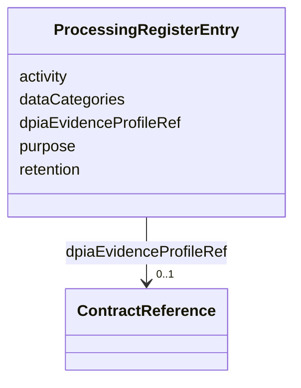

---
search:
  boost: 10.0
---

# Class: ProcessingRegisterEntry


_RGPD art. 30 register entry._


<div data-search-exclude markdown="1">


URI: [jumo:ProcessingRegisterEntry](https://jumo.dev/schemas/jumo-v1/ProcessingRegisterEntry)





<!-- no inheritance hierarchy -->

## Slots

| Name | Cardinality and Range | Description | Inheritance |
| ---  | --- | --- | --- |
| [activity](activity.md) | 1 <br/> [String](String.md) |  | direct |
| [purpose](purpose.md) | 1 <br/> [String](String.md) |  | direct |
| [dataCategories](dataCategories.md) | * <br/> [String](String.md) |  | direct |
| [retention](retention.md) | 0..1 <br/> [Duration](Duration.md) |  | direct |
| [dpiaEvidenceProfileRef](dpiaEvidenceProfileRef.md) | 0..1 <br/> [ContractReference](ContractReference.md) | References an EvidenceProfile carrying the DPIA (art | direct |


## Usages

| used by | used in | type | used |
| ---  | --- | --- | --- |
| [ComplianceProfileSpec](ComplianceProfileSpec.md) | [processingRegister](processingRegister.md) | range | [ProcessingRegisterEntry](ProcessingRegisterEntry.md) |


## Identifier and Mapping Information


### Annotations

| property | value |
| --- | --- |
| jumo.state_authority | GIT |
| jumo.model_role | VALUE_OBJECT |
| jumo.audience | REALM_PRIVATE |
| jumo.sensitivity | INTERNAL |
| jumo.boundary_eligible | True |
| jumo.schema_profiles | draft-2020-12,native-json-schema,prompted-json-validated |


### Schema Source


* from schema: https://jumo.dev/schemas/jumo-v1


## Mappings

| Mapping Type | Mapped Value |
| ---  | ---  |
| self | jumo:ProcessingRegisterEntry |
| native | jumo:ProcessingRegisterEntry |


## LinkML Source

<!-- TODO: investigate https://stackoverflow.com/questions/37606292/how-to-create-tabbed-code-blocks-in-mkdocs-or-sphinx -->

### Direct

<details>
```yaml
name: ProcessingRegisterEntry
annotations:
  jumo.state_authority:
    tag: jumo.state_authority
    value: GIT
  jumo.model_role:
    tag: jumo.model_role
    value: VALUE_OBJECT
  jumo.audience:
    tag: jumo.audience
    value: REALM_PRIVATE
  jumo.sensitivity:
    tag: jumo.sensitivity
    value: INTERNAL
  jumo.boundary_eligible:
    tag: jumo.boundary_eligible
    value: true
  jumo.schema_profiles:
    tag: jumo.schema_profiles
    value: draft-2020-12,native-json-schema,prompted-json-validated
description: RGPD art. 30 register entry.
from_schema: https://jumo.dev/schemas/jumo-v1
attributes:
  activity:
    name: activity
    from_schema: https://jumo.dev/schemas/jumo-v1
    rank: 1000
    owner: ProcessingRegisterEntry
    domain_of:
    - ProcessingRegisterEntry
    range: string
    required: true
    pattern: ^.{5,}$
  purpose:
    name: purpose
    from_schema: https://jumo.dev/schemas/jumo-v1
    owner: ProcessingRegisterEntry
    domain_of:
    - ProjectSpec
    - TeamSpecBody
    - WorkOrderSpec
    - PracticeSpec
    - PromptTemplateSpec
    - ImprovementLoopSpec
    - ProcessingRegisterEntry
    - McpBundleSemanticProfile
    - Surface
    range: string
    required: true
    pattern: ^.{5,}$
  dataCategories:
    name: dataCategories
    from_schema: https://jumo.dev/schemas/jumo-v1
    rank: 1000
    owner: ProcessingRegisterEntry
    domain_of:
    - ProcessingRegisterEntry
    range: string
    multivalued: true
  retention:
    name: retention
    from_schema: https://jumo.dev/schemas/jumo-v1
    rank: 1000
    owner: ProcessingRegisterEntry
    domain_of:
    - ProcessingRegisterEntry
    - EvidenceProfileSpec
    range: Duration
  dpiaEvidenceProfileRef:
    name: dpiaEvidenceProfileRef
    description: References an EvidenceProfile carrying the DPIA (art. 35), when required.
    from_schema: https://jumo.dev/schemas/jumo-v1
    rank: 1000
    owner: ProcessingRegisterEntry
    domain_of:
    - ProcessingRegisterEntry
    range: ContractReference
    inlined: true

```
</details>

### Induced

<details>
```yaml
name: ProcessingRegisterEntry
annotations:
  jumo.state_authority:
    tag: jumo.state_authority
    value: GIT
  jumo.model_role:
    tag: jumo.model_role
    value: VALUE_OBJECT
  jumo.audience:
    tag: jumo.audience
    value: REALM_PRIVATE
  jumo.sensitivity:
    tag: jumo.sensitivity
    value: INTERNAL
  jumo.boundary_eligible:
    tag: jumo.boundary_eligible
    value: true
  jumo.schema_profiles:
    tag: jumo.schema_profiles
    value: draft-2020-12,native-json-schema,prompted-json-validated
description: RGPD art. 30 register entry.
from_schema: https://jumo.dev/schemas/jumo-v1
attributes:
  activity:
    name: activity
    from_schema: https://jumo.dev/schemas/jumo-v1
    rank: 1000
    owner: ProcessingRegisterEntry
    domain_of:
    - ProcessingRegisterEntry
    range: string
    required: true
    pattern: ^.{5,}$
  purpose:
    name: purpose
    from_schema: https://jumo.dev/schemas/jumo-v1
    owner: ProcessingRegisterEntry
    domain_of:
    - ProjectSpec
    - TeamSpecBody
    - WorkOrderSpec
    - PracticeSpec
    - PromptTemplateSpec
    - ImprovementLoopSpec
    - ProcessingRegisterEntry
    - McpBundleSemanticProfile
    - Surface
    range: string
    required: true
    pattern: ^.{5,}$
  dataCategories:
    name: dataCategories
    from_schema: https://jumo.dev/schemas/jumo-v1
    rank: 1000
    owner: ProcessingRegisterEntry
    domain_of:
    - ProcessingRegisterEntry
    range: string
    multivalued: true
  retention:
    name: retention
    from_schema: https://jumo.dev/schemas/jumo-v1
    rank: 1000
    owner: ProcessingRegisterEntry
    domain_of:
    - ProcessingRegisterEntry
    - EvidenceProfileSpec
    range: Duration
  dpiaEvidenceProfileRef:
    name: dpiaEvidenceProfileRef
    description: References an EvidenceProfile carrying the DPIA (art. 35), when required.
    from_schema: https://jumo.dev/schemas/jumo-v1
    rank: 1000
    owner: ProcessingRegisterEntry
    domain_of:
    - ProcessingRegisterEntry
    range: ContractReference
    inlined: true

```
</details></div>