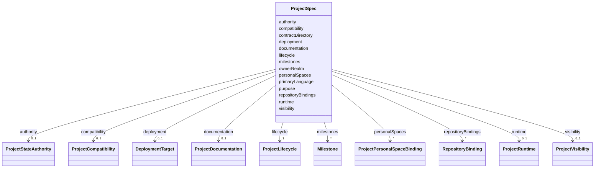

---
search:
  boost: 10.0
---

# Class: ProjectSpec

<div data-search-exclude markdown="1">


URI: [jumo:ProjectSpec](https://jumo.dev/schemas/jumo-v1/ProjectSpec)





<!-- no inheritance hierarchy -->

## Slots

| Name | Cardinality and Range | Description | Inheritance |
| ---  | --- | --- | --- |
| [contractDirectory](contractDirectory.md) | 1 <br/> [String](String.md) |  | direct |
| [ownerRealm](ownerRealm.md) | 1 <br/> [Identifier](Identifier.md) | A Project has exactly one canonical owner Realm (ADR-0004) | direct |
| [lifecycle](lifecycle.md) | 1 <br/> [ProjectLifecycle](ProjectLifecycle.md) |  | direct |
| [visibility](visibility.md) | 0..1 <br/> [ProjectVisibility](ProjectVisibility.md) |  | direct |
| [repositoryBindings](repositoryBindings.md) | * <br/> [RepositoryBinding](RepositoryBinding.md) | Zero or more Git resources governed by this Project | direct |
| [documentation](documentation.md) | 0..1 <br/> [ProjectDocumentation](ProjectDocumentation.md) | Where this Project's governed Markdown lives and who may retrieve it | direct |
| [personalSpaces](personalSpaces.md) | * <br/> [ProjectPersonalSpaceBinding](ProjectPersonalSpaceBinding.md) |  | direct |
| [compatibility](compatibility.md) | 0..1 <br/> [ProjectCompatibility](ProjectCompatibility.md) |  | direct |
| [purpose](purpose.md) | 0..1 <br/> [String](String.md) | Folded in from the retired ProjectContract kind (owner decision O3, 2026-08-2... | direct |
| [primaryLanguage](primaryLanguage.md) | 0..1 <br/> [String](String.md) |  | direct |
| [deployment](deployment.md) | 0..1 <br/> [DeploymentTarget](DeploymentTarget.md) |  | direct |
| [runtime](runtime.md) | 0..1 <br/> [ProjectRuntime](ProjectRuntime.md) |  | direct |
| [authority](authority.md) | 0..1 <br/> [ProjectStateAuthority](ProjectStateAuthority.md) | No component may treat its local representation as authority for another cate... | direct |
| [milestones](milestones.md) | * <br/> [Milestone](Milestone.md) | Declared in delivery order | direct |


## Usages

| used by | used in | type | used |
| ---  | --- | --- | --- |
| [Project](Project.md) | [spec](spec.md) | range | [ProjectSpec](ProjectSpec.md) |


## Identifier and Mapping Information


### Annotations

| property | value |
| --- | --- |
| jumo.state_authority | GIT |
| jumo.model_role | VALUE_OBJECT |
| jumo.audience | REALM_PRIVATE |
| jumo.sensitivity | INTERNAL |
| jumo.boundary_eligible | True |
| jumo.schema_profiles | draft-2020-12,native-json-schema,prompted-json-validated |


### Schema Source


* from schema: https://jumo.dev/schemas/jumo-v1


## Mappings

| Mapping Type | Mapped Value |
| ---  | ---  |
| self | jumo:ProjectSpec |
| native | jumo:ProjectSpec |


## LinkML Source

<!-- TODO: investigate https://stackoverflow.com/questions/37606292/how-to-create-tabbed-code-blocks-in-mkdocs-or-sphinx -->

### Direct

<details>
```yaml
name: ProjectSpec
annotations:
  jumo.state_authority:
    tag: jumo.state_authority
    value: GIT
  jumo.model_role:
    tag: jumo.model_role
    value: VALUE_OBJECT
  jumo.audience:
    tag: jumo.audience
    value: REALM_PRIVATE
  jumo.sensitivity:
    tag: jumo.sensitivity
    value: INTERNAL
  jumo.boundary_eligible:
    tag: jumo.boundary_eligible
    value: true
  jumo.schema_profiles:
    tag: jumo.schema_profiles
    value: draft-2020-12,native-json-schema,prompted-json-validated
from_schema: https://jumo.dev/schemas/jumo-v1
attributes:
  contractDirectory:
    name: contractDirectory
    from_schema: https://jumo.dev/schemas/jumo-v1
    rank: 1000
    owner: ProjectSpec
    domain_of:
    - ProjectSpec
    range: string
    required: true
    equals_string: .jumo
  ownerRealm:
    name: ownerRealm
    description: A Project has exactly one canonical owner Realm (ADR-0004).
    from_schema: https://jumo.dev/schemas/jumo-v1
    owner: ProjectSpec
    domain_of:
    - PrincipalSpec
    - PrincipalIdentityBindingSpec
    - ProjectSpec
    - KitBindingSpec
    - KitLockSpec
    - RoleDefinitionSpec
    - RoleAssignmentSpec
    - TeamSpecBody
    - CoordinationProfileSpec
    - RoutingEligibilitySpec
    - RoleLifecyclePolicySpec
    - OrganizationTemplateSpec
    - ChiefOfStaffProfileSpec
    - AdvisorProfileSpec
    - PersonalSpaceSpec
    - OrganizationSpecBody
    - RealmPublicationSpec
    - CapabilityProfileSpec
    - WorkerRequirementProfileSpec
    - GoldenTaskSetSpec
    - ImprovementLoopSpec
    - ControlCatalogSpec
    - ComplianceProfileSpec
    - EvidenceProfileSpec
    - ProcessSpecBody
    - ChangeProposalRef
    - ForgeProjectionRef
    - ProcessRunRef
    - ApprovalSignal
    - ExecutionCellProvisioningRef
    - ExecutionMachineSpec
    - MachineHostDefinitionSpec
    - McpRegistrySourceBindingSpec
    - ConnectorDefinitionSpec
    - ConnectorAppraisalSpec
    - McpBundleSpec
    - RemoteMcpServiceSpec
    - RemoteMcpAppraisalSpec
    - ExecutionCellSpec
    - ProviderSessionBinding
    - RoutingDecision
    - WorkerInvocation
    - EvidenceRecord
    - InvocationAuthorizationReceipt
    - SecretBindingSpec
    - FederatedPeerSpec
    - FederationProfileSpec
    - WorkerSubstrateSpec
    - McpInventorySnapshot
    - ConnectorIntegrationSpec
    - OAuthClientBindingSpec
    - InterfaceSurfaceSpec
    - VocabularySetSpec
    - ProjectionSpecBody
    range: Identifier
    required: true
  lifecycle:
    name: lifecycle
    from_schema: https://jumo.dev/schemas/jumo-v1
    rank: 1000
    owner: ProjectSpec
    domain_of:
    - ProjectSpec
    - McpRegistrySourceSpec
    - McpRegistrySourceBindingSpec
    - McpRegistrySyncStatus
    - ConnectorDefinitionSpec
    - McpBundleSpec
    - RemoteMcpServiceSpec
    - ExecutionCellSpec
    - SecretBindingSpec
    - WorkerSubstrateSpec
    range: ProjectLifecycle
    required: true
  visibility:
    name: visibility
    from_schema: https://jumo.dev/schemas/jumo-v1
    rank: 1000
    owner: ProjectSpec
    domain_of:
    - ProjectSpec
    - OfferingClientRepository
    range: ProjectVisibility
  repositoryBindings:
    name: repositoryBindings
    description: Zero or more Git resources governed by this Project. A repository-free
      Project remains valid.
    from_schema: https://jumo.dev/schemas/jumo-v1
    rank: 1000
    owner: ProjectSpec
    domain_of:
    - ProjectSpec
    range: RepositoryBinding
    multivalued: true
    inlined: true
    inlined_as_list: true
  documentation:
    name: documentation
    description: Where this Project's governed Markdown lives and who may retrieve
      it. Jumo indexes declared roots and nothing else (ADR-0014).
    from_schema: https://jumo.dev/schemas/jumo-v1
    rank: 1000
    owner: ProjectSpec
    domain_of:
    - ProjectSpec
    range: ProjectDocumentation
    inlined: true
  personalSpaces:
    name: personalSpaces
    from_schema: https://jumo.dev/schemas/jumo-v1
    rank: 1000
    owner: ProjectSpec
    domain_of:
    - ProjectSpec
    range: ProjectPersonalSpaceBinding
    multivalued: true
    inlined: true
    inlined_as_list: true
  compatibility:
    name: compatibility
    from_schema: https://jumo.dev/schemas/jumo-v1
    rank: 1000
    owner: ProjectSpec
    domain_of:
    - ProjectSpec
    range: ProjectCompatibility
    inlined: true
  purpose:
    name: purpose
    description: Folded in from the retired ProjectContract kind (owner decision O3,
      2026-08-22).
    from_schema: https://jumo.dev/schemas/jumo-v1
    rank: 1000
    owner: ProjectSpec
    domain_of:
    - ProjectSpec
    - TeamSpecBody
    - WorkOrderSpec
    - PracticeSpec
    - PromptTemplateSpec
    - ImprovementLoopSpec
    - ProcessingRegisterEntry
    - McpBundleSemanticProfile
    - Surface
    range: string
    pattern: ^.{10,}$
  primaryLanguage:
    name: primaryLanguage
    from_schema: https://jumo.dev/schemas/jumo-v1
    rank: 1000
    owner: ProjectSpec
    domain_of:
    - ProjectSpec
    range: string
  deployment:
    name: deployment
    from_schema: https://jumo.dev/schemas/jumo-v1
    rank: 1000
    owner: ProjectSpec
    domain_of:
    - ProjectSpec
    range: DeploymentTarget
  runtime:
    name: runtime
    from_schema: https://jumo.dev/schemas/jumo-v1
    rank: 1000
    owner: ProjectSpec
    domain_of:
    - ProjectSpec
    - McpBundleSpec
    range: ProjectRuntime
    inlined: true
  authority:
    name: authority
    description: No component may treat its local representation as authority for
      another category (ADR-0002).
    from_schema: https://jumo.dev/schemas/jumo-v1
    owner: ProjectSpec
    domain_of:
    - PrincipleSetSpec
    - ProjectSpec
    - ChiefOfStaffProfileSpec
    range: ProjectStateAuthority
    inlined: true
  milestones:
    name: milestones
    description: Declared in delivery order. Groups the generated roadmap and bounds
      every WorkOrder's roadmapRef (Rego corpus.work.roadmap-ref-declared).
    from_schema: https://jumo.dev/schemas/jumo-v1
    rank: 1000
    owner: ProjectSpec
    domain_of:
    - ProjectSpec
    range: Milestone
    multivalued: true
    inlined: true
    inlined_as_list: true

```
</details>

### Induced

<details>
```yaml
name: ProjectSpec
annotations:
  jumo.state_authority:
    tag: jumo.state_authority
    value: GIT
  jumo.model_role:
    tag: jumo.model_role
    value: VALUE_OBJECT
  jumo.audience:
    tag: jumo.audience
    value: REALM_PRIVATE
  jumo.sensitivity:
    tag: jumo.sensitivity
    value: INTERNAL
  jumo.boundary_eligible:
    tag: jumo.boundary_eligible
    value: true
  jumo.schema_profiles:
    tag: jumo.schema_profiles
    value: draft-2020-12,native-json-schema,prompted-json-validated
from_schema: https://jumo.dev/schemas/jumo-v1
attributes:
  contractDirectory:
    name: contractDirectory
    from_schema: https://jumo.dev/schemas/jumo-v1
    rank: 1000
    owner: ProjectSpec
    domain_of:
    - ProjectSpec
    range: string
    required: true
    equals_string: .jumo
  ownerRealm:
    name: ownerRealm
    description: A Project has exactly one canonical owner Realm (ADR-0004).
    from_schema: https://jumo.dev/schemas/jumo-v1
    owner: ProjectSpec
    domain_of:
    - PrincipalSpec
    - PrincipalIdentityBindingSpec
    - ProjectSpec
    - KitBindingSpec
    - KitLockSpec
    - RoleDefinitionSpec
    - RoleAssignmentSpec
    - TeamSpecBody
    - CoordinationProfileSpec
    - RoutingEligibilitySpec
    - RoleLifecyclePolicySpec
    - OrganizationTemplateSpec
    - ChiefOfStaffProfileSpec
    - AdvisorProfileSpec
    - PersonalSpaceSpec
    - OrganizationSpecBody
    - RealmPublicationSpec
    - CapabilityProfileSpec
    - WorkerRequirementProfileSpec
    - GoldenTaskSetSpec
    - ImprovementLoopSpec
    - ControlCatalogSpec
    - ComplianceProfileSpec
    - EvidenceProfileSpec
    - ProcessSpecBody
    - ChangeProposalRef
    - ForgeProjectionRef
    - ProcessRunRef
    - ApprovalSignal
    - ExecutionCellProvisioningRef
    - ExecutionMachineSpec
    - MachineHostDefinitionSpec
    - McpRegistrySourceBindingSpec
    - ConnectorDefinitionSpec
    - ConnectorAppraisalSpec
    - McpBundleSpec
    - RemoteMcpServiceSpec
    - RemoteMcpAppraisalSpec
    - ExecutionCellSpec
    - ProviderSessionBinding
    - RoutingDecision
    - WorkerInvocation
    - EvidenceRecord
    - InvocationAuthorizationReceipt
    - SecretBindingSpec
    - FederatedPeerSpec
    - FederationProfileSpec
    - WorkerSubstrateSpec
    - McpInventorySnapshot
    - ConnectorIntegrationSpec
    - OAuthClientBindingSpec
    - InterfaceSurfaceSpec
    - VocabularySetSpec
    - ProjectionSpecBody
    range: Identifier
    required: true
  lifecycle:
    name: lifecycle
    from_schema: https://jumo.dev/schemas/jumo-v1
    rank: 1000
    owner: ProjectSpec
    domain_of:
    - ProjectSpec
    - McpRegistrySourceSpec
    - McpRegistrySourceBindingSpec
    - McpRegistrySyncStatus
    - ConnectorDefinitionSpec
    - McpBundleSpec
    - RemoteMcpServiceSpec
    - ExecutionCellSpec
    - SecretBindingSpec
    - WorkerSubstrateSpec
    range: ProjectLifecycle
    required: true
  visibility:
    name: visibility
    from_schema: https://jumo.dev/schemas/jumo-v1
    rank: 1000
    owner: ProjectSpec
    domain_of:
    - ProjectSpec
    - OfferingClientRepository
    range: ProjectVisibility
  repositoryBindings:
    name: repositoryBindings
    description: Zero or more Git resources governed by this Project. A repository-free
      Project remains valid.
    from_schema: https://jumo.dev/schemas/jumo-v1
    rank: 1000
    owner: ProjectSpec
    domain_of:
    - ProjectSpec
    range: RepositoryBinding
    multivalued: true
    inlined: true
    inlined_as_list: true
  documentation:
    name: documentation
    description: Where this Project's governed Markdown lives and who may retrieve
      it. Jumo indexes declared roots and nothing else (ADR-0014).
    from_schema: https://jumo.dev/schemas/jumo-v1
    rank: 1000
    owner: ProjectSpec
    domain_of:
    - ProjectSpec
    range: ProjectDocumentation
    inlined: true
  personalSpaces:
    name: personalSpaces
    from_schema: https://jumo.dev/schemas/jumo-v1
    rank: 1000
    owner: ProjectSpec
    domain_of:
    - ProjectSpec
    range: ProjectPersonalSpaceBinding
    multivalued: true
    inlined: true
    inlined_as_list: true
  compatibility:
    name: compatibility
    from_schema: https://jumo.dev/schemas/jumo-v1
    rank: 1000
    owner: ProjectSpec
    domain_of:
    - ProjectSpec
    range: ProjectCompatibility
    inlined: true
  purpose:
    name: purpose
    description: Folded in from the retired ProjectContract kind (owner decision O3,
      2026-08-22).
    from_schema: https://jumo.dev/schemas/jumo-v1
    rank: 1000
    owner: ProjectSpec
    domain_of:
    - ProjectSpec
    - TeamSpecBody
    - WorkOrderSpec
    - PracticeSpec
    - PromptTemplateSpec
    - ImprovementLoopSpec
    - ProcessingRegisterEntry
    - McpBundleSemanticProfile
    - Surface
    range: string
    pattern: ^.{10,}$
  primaryLanguage:
    name: primaryLanguage
    from_schema: https://jumo.dev/schemas/jumo-v1
    rank: 1000
    owner: ProjectSpec
    domain_of:
    - ProjectSpec
    range: string
  deployment:
    name: deployment
    from_schema: https://jumo.dev/schemas/jumo-v1
    rank: 1000
    owner: ProjectSpec
    domain_of:
    - ProjectSpec
    range: DeploymentTarget
  runtime:
    name: runtime
    from_schema: https://jumo.dev/schemas/jumo-v1
    rank: 1000
    owner: ProjectSpec
    domain_of:
    - ProjectSpec
    - McpBundleSpec
    range: ProjectRuntime
    inlined: true
  authority:
    name: authority
    description: No component may treat its local representation as authority for
      another category (ADR-0002).
    from_schema: https://jumo.dev/schemas/jumo-v1
    owner: ProjectSpec
    domain_of:
    - PrincipleSetSpec
    - ProjectSpec
    - ChiefOfStaffProfileSpec
    range: ProjectStateAuthority
    inlined: true
  milestones:
    name: milestones
    description: Declared in delivery order. Groups the generated roadmap and bounds
      every WorkOrder's roadmapRef (Rego corpus.work.roadmap-ref-declared).
    from_schema: https://jumo.dev/schemas/jumo-v1
    rank: 1000
    owner: ProjectSpec
    domain_of:
    - ProjectSpec
    range: Milestone
    multivalued: true
    inlined: true
    inlined_as_list: true

```
</details></div>