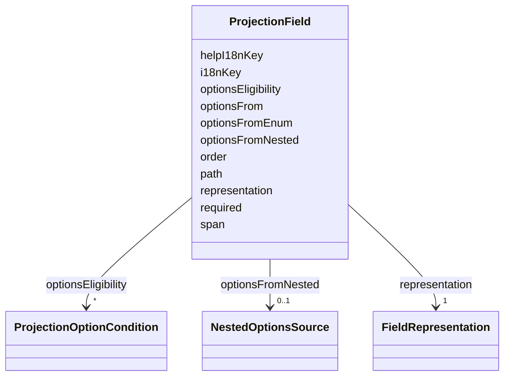

---
search:
  boost: 10.0
---

# Class: ProjectionField

<div data-search-exclude markdown="1">


URI: [jumo:ProjectionField](https://jumo.dev/schemas/jumo-v1/ProjectionField)





<!-- no inheritance hierarchy -->

## Slots

| Name | Cardinality and Range | Description | Inheritance |
| ---  | --- | --- | --- |
| [path](path.md) | 1 <br/> [String](String.md) | A slot of the ProjectionSpecBody | direct |
| [representation](representation.md) | 1 <br/> [FieldRepresentation](FieldRepresentation.md) |  | direct |
| [span](span.md) | 0..1 <br/> [Integer](Integer.md) |  | direct |
| [order](order.md) | 0..1 <br/> [Integer](Integer.md) |  | direct |
| [i18nKey](i18nKey.md) | 0..1 <br/> [String](String.md) |  | direct |
| [helpI18nKey](helpI18nKey.md) | 0..1 <br/> [String](String.md) |  | direct |
| [optionsFrom](optionsFrom.md) | 0..1 <br/> [String](String.md) | A contract kind whose declared instances populate this field's options, repla... | direct |
| [optionsFromEnum](optionsFromEnum.md) | 0..1 <br/> [String](String.md) | A generated LinkML enumeration whose permissible values populate this field's... | direct |
| [optionsFromNested](optionsFromNested.md) | 0..1 <br/> [NestedOptionsSource](NestedOptionsSource.md) | An alternative to optionsFrom for a value object with no standalone Git contr... | direct |
| [optionsEligibility](optionsEligibility.md) | * <br/> [ProjectionOptionCondition](ProjectionOptionCondition.md) | Conditions every instance of `optionsFrom` must satisfy to be offered | direct |
| [required](required.md) | 0..1 <br/> [Boolean](Boolean.md) | When an AssistedJourneyStep declares both projectionRef and requiredFields (w... | direct |


## Usages

| used by | used in | type | used |
| ---  | --- | --- | --- |
| [ProjectionSection](ProjectionSection.md) | [fields](fields.md) | range | [ProjectionField](ProjectionField.md) |


## Identifier and Mapping Information


### Annotations

| property | value |
| --- | --- |
| jumo.state_authority | GIT |
| jumo.model_role | PROJECTION |
| jumo.audience | REALM_PRIVATE |
| jumo.sensitivity | INTERNAL |
| jumo.boundary_eligible | True |
| jumo.schema_profiles | draft-2020-12,native-json-schema,prompted-json-validated |


### Schema Source


* from schema: https://jumo.dev/schemas/jumo-v1


## Mappings

| Mapping Type | Mapped Value |
| ---  | ---  |
| self | jumo:ProjectionField |
| native | jumo:ProjectionField |


## LinkML Source

<!-- TODO: investigate https://stackoverflow.com/questions/37606292/how-to-create-tabbed-code-blocks-in-mkdocs-or-sphinx -->

### Direct

<details>
```yaml
name: ProjectionField
annotations:
  jumo.state_authority:
    tag: jumo.state_authority
    value: GIT
  jumo.model_role:
    tag: jumo.model_role
    value: PROJECTION
  jumo.audience:
    tag: jumo.audience
    value: REALM_PRIVATE
  jumo.sensitivity:
    tag: jumo.sensitivity
    value: INTERNAL
  jumo.boundary_eligible:
    tag: jumo.boundary_eligible
    value: true
  jumo.schema_profiles:
    tag: jumo.schema_profiles
    value: draft-2020-12,native-json-schema,prompted-json-validated
from_schema: https://jumo.dev/schemas/jumo-v1
attributes:
  path:
    name: path
    description: A slot of the ProjectionSpecBody.of class this field projects (Rego).
    from_schema: https://jumo.dev/schemas/jumo-v1
    owner: ProjectionField
    domain_of:
    - DocumentationRoot
    - PromptBody
    - ApiOperation
    - ChangeSetFile
    - ProjectionOptionCondition
    - NestedOptionsSource
    - ProjectionField
    range: string
    required: true
  representation:
    name: representation
    from_schema: https://jumo.dev/schemas/jumo-v1
    rank: 1000
    owner: ProjectionField
    domain_of:
    - ProjectionField
    range: FieldRepresentation
    required: true
  span:
    name: span
    from_schema: https://jumo.dev/schemas/jumo-v1
    rank: 1000
    owner: ProjectionField
    domain_of:
    - ProjectionField
    range: integer
    minimum_value: 1
    maximum_value: 12
  order:
    name: order
    from_schema: https://jumo.dev/schemas/jumo-v1
    owner: ProjectionField
    domain_of:
    - Milestone
    - ProjectionField
    range: integer
  i18nKey:
    name: i18nKey
    from_schema: https://jumo.dev/schemas/jumo-v1
    owner: ProjectionField
    domain_of:
    - AssistedJourneyRequiredField
    - ProjectionSection
    - ProjectionField
    range: string
    pattern: ^[a-z][a-zA-Z0-9]*$
  helpI18nKey:
    name: helpI18nKey
    from_schema: https://jumo.dev/schemas/jumo-v1
    rank: 1000
    owner: ProjectionField
    domain_of:
    - ProjectionField
    range: string
    pattern: ^[a-z][a-zA-Z0-9]*$
  optionsFrom:
    name: optionsFrom
    description: A contract kind whose declared instances populate this field's options,
      replacing a hardcoded roster lookup with a projection over real Git contracts.
      Must name a declared kind (Rego). An instance is offered as its `metadata.id`
      labelled by its `metadata.name`; a projection selects which instances are offered,
      never how one is addressed. Mutually exclusive with optionsFromEnum and optionsFromNested
      (Rego).
    from_schema: https://jumo.dev/schemas/jumo-v1
    rank: 1000
    owner: ProjectionField
    domain_of:
    - ProjectionField
    range: string
  optionsFromEnum:
    name: optionsFromEnum
    description: 'A generated LinkML enumeration whose permissible values populate
      this field''s options, for a field whose domain is a closed vocabulary rather
      than a contract kind. Mutually exclusive with optionsFrom and optionsFromNested
      (Rego). Rego checks that an ENUMERATION field declares one of the three, not
      that this names an enumeration rather than a class: the repository facts carry
      per-class slots, not permissible values, so the narrower check waits on a fact
      this module does not produce.'
    from_schema: https://jumo.dev/schemas/jumo-v1
    rank: 1000
    owner: ProjectionField
    domain_of:
    - ProjectionField
    range: string
  optionsFromNested:
    name: optionsFromNested
    description: An alternative to optionsFrom for a value object with no standalone
      Git contract of its own, such as Project.spec.milestones -- see NestedOptionsSource.
      Mutually exclusive with optionsFrom and optionsFromEnum (Rego).
    from_schema: https://jumo.dev/schemas/jumo-v1
    rank: 1000
    owner: ProjectionField
    domain_of:
    - ProjectionField
    range: NestedOptionsSource
    inlined: true
  optionsEligibility:
    name: optionsEligibility
    description: Conditions every instance of `optionsFrom` must satisfy to be offered.
      The eligibility a selection applies is part of what the contract says the field
      means, so it is declared here rather than left to whichever surface happens
      to render the field. Conditions read the candidate's Git document only -- desired
      and contractual state; recognized runtime state (a machine's observed health)
      is a different authority and is not reachable from a projection.
    from_schema: https://jumo.dev/schemas/jumo-v1
    rank: 1000
    owner: ProjectionField
    domain_of:
    - ProjectionField
    range: ProjectionOptionCondition
    multivalued: true
    inlined: true
    inlined_as_list: true
  required:
    name: required
    description: When an AssistedJourneyStep declares both projectionRef and requiredFields
      (work.yaml), requiredFields must name exactly the fields marked required here
      (Rego) -- the two lists describe the same gate and must not be allowed to drift.
    from_schema: https://jumo.dev/schemas/jumo-v1
    ifabsent: 'false'
    owner: ProjectionField
    domain_of:
    - PromptVariable
    - AssistedJourneyFieldValidation
    - SecretRotation
    - ProjectionField
    range: boolean

```
</details>

### Induced

<details>
```yaml
name: ProjectionField
annotations:
  jumo.state_authority:
    tag: jumo.state_authority
    value: GIT
  jumo.model_role:
    tag: jumo.model_role
    value: PROJECTION
  jumo.audience:
    tag: jumo.audience
    value: REALM_PRIVATE
  jumo.sensitivity:
    tag: jumo.sensitivity
    value: INTERNAL
  jumo.boundary_eligible:
    tag: jumo.boundary_eligible
    value: true
  jumo.schema_profiles:
    tag: jumo.schema_profiles
    value: draft-2020-12,native-json-schema,prompted-json-validated
from_schema: https://jumo.dev/schemas/jumo-v1
attributes:
  path:
    name: path
    description: A slot of the ProjectionSpecBody.of class this field projects (Rego).
    from_schema: https://jumo.dev/schemas/jumo-v1
    owner: ProjectionField
    domain_of:
    - DocumentationRoot
    - PromptBody
    - ApiOperation
    - ChangeSetFile
    - ProjectionOptionCondition
    - NestedOptionsSource
    - ProjectionField
    range: string
    required: true
  representation:
    name: representation
    from_schema: https://jumo.dev/schemas/jumo-v1
    rank: 1000
    owner: ProjectionField
    domain_of:
    - ProjectionField
    range: FieldRepresentation
    required: true
  span:
    name: span
    from_schema: https://jumo.dev/schemas/jumo-v1
    rank: 1000
    owner: ProjectionField
    domain_of:
    - ProjectionField
    range: integer
    minimum_value: 1
    maximum_value: 12
  order:
    name: order
    from_schema: https://jumo.dev/schemas/jumo-v1
    owner: ProjectionField
    domain_of:
    - Milestone
    - ProjectionField
    range: integer
  i18nKey:
    name: i18nKey
    from_schema: https://jumo.dev/schemas/jumo-v1
    owner: ProjectionField
    domain_of:
    - AssistedJourneyRequiredField
    - ProjectionSection
    - ProjectionField
    range: string
    pattern: ^[a-z][a-zA-Z0-9]*$
  helpI18nKey:
    name: helpI18nKey
    from_schema: https://jumo.dev/schemas/jumo-v1
    rank: 1000
    owner: ProjectionField
    domain_of:
    - ProjectionField
    range: string
    pattern: ^[a-z][a-zA-Z0-9]*$
  optionsFrom:
    name: optionsFrom
    description: A contract kind whose declared instances populate this field's options,
      replacing a hardcoded roster lookup with a projection over real Git contracts.
      Must name a declared kind (Rego). An instance is offered as its `metadata.id`
      labelled by its `metadata.name`; a projection selects which instances are offered,
      never how one is addressed. Mutually exclusive with optionsFromEnum and optionsFromNested
      (Rego).
    from_schema: https://jumo.dev/schemas/jumo-v1
    rank: 1000
    owner: ProjectionField
    domain_of:
    - ProjectionField
    range: string
  optionsFromEnum:
    name: optionsFromEnum
    description: 'A generated LinkML enumeration whose permissible values populate
      this field''s options, for a field whose domain is a closed vocabulary rather
      than a contract kind. Mutually exclusive with optionsFrom and optionsFromNested
      (Rego). Rego checks that an ENUMERATION field declares one of the three, not
      that this names an enumeration rather than a class: the repository facts carry
      per-class slots, not permissible values, so the narrower check waits on a fact
      this module does not produce.'
    from_schema: https://jumo.dev/schemas/jumo-v1
    rank: 1000
    owner: ProjectionField
    domain_of:
    - ProjectionField
    range: string
  optionsFromNested:
    name: optionsFromNested
    description: An alternative to optionsFrom for a value object with no standalone
      Git contract of its own, such as Project.spec.milestones -- see NestedOptionsSource.
      Mutually exclusive with optionsFrom and optionsFromEnum (Rego).
    from_schema: https://jumo.dev/schemas/jumo-v1
    rank: 1000
    owner: ProjectionField
    domain_of:
    - ProjectionField
    range: NestedOptionsSource
    inlined: true
  optionsEligibility:
    name: optionsEligibility
    description: Conditions every instance of `optionsFrom` must satisfy to be offered.
      The eligibility a selection applies is part of what the contract says the field
      means, so it is declared here rather than left to whichever surface happens
      to render the field. Conditions read the candidate's Git document only -- desired
      and contractual state; recognized runtime state (a machine's observed health)
      is a different authority and is not reachable from a projection.
    from_schema: https://jumo.dev/schemas/jumo-v1
    rank: 1000
    owner: ProjectionField
    domain_of:
    - ProjectionField
    range: ProjectionOptionCondition
    multivalued: true
    inlined: true
    inlined_as_list: true
  required:
    name: required
    description: When an AssistedJourneyStep declares both projectionRef and requiredFields
      (work.yaml), requiredFields must name exactly the fields marked required here
      (Rego) -- the two lists describe the same gate and must not be allowed to drift.
    from_schema: https://jumo.dev/schemas/jumo-v1
    ifabsent: 'false'
    owner: ProjectionField
    domain_of:
    - PromptVariable
    - AssistedJourneyFieldValidation
    - SecretRotation
    - ProjectionField
    range: boolean

```
</details></div>