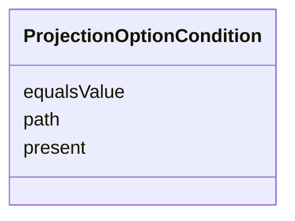

---
search:
  boost: 10.0
---

# Class: ProjectionOptionCondition


_One condition a candidate instance must satisfy to be offered as a field's option._


<div data-search-exclude markdown="1">


URI: [jumo:ProjectionOptionCondition](https://jumo.dev/schemas/jumo-v1/ProjectionOptionCondition)





<!-- no inheritance hierarchy -->

## Slots

| Name | Cardinality and Range | Description | Inheritance |
| ---  | --- | --- | --- |
| [path](path.md) | 1 <br/> [String](String.md) | A dotted path into the candidate contract document, e | direct |
| [equalsValue](equalsValue.md) | 0..1 <br/> [String](String.md) | The value at `path` must equal this string | direct |
| [present](present.md) | 0..1 <br/> [Boolean](Boolean.md) | The value at `path` must be present and non-empty | direct |


## Usages

| used by | used in | type | used |
| ---  | --- | --- | --- |
| [ProjectionField](ProjectionField.md) | [optionsEligibility](optionsEligibility.md) | range | [ProjectionOptionCondition](ProjectionOptionCondition.md) |


## Identifier and Mapping Information


### Annotations

| property | value |
| --- | --- |
| jumo.state_authority | GIT |
| jumo.model_role | PROJECTION |
| jumo.audience | REALM_PRIVATE |
| jumo.sensitivity | INTERNAL |
| jumo.boundary_eligible | True |
| jumo.schema_profiles | draft-2020-12,native-json-schema,prompted-json-validated |


### Schema Source


* from schema: https://jumo.dev/schemas/jumo-v1


## Mappings

| Mapping Type | Mapped Value |
| ---  | ---  |
| self | jumo:ProjectionOptionCondition |
| native | jumo:ProjectionOptionCondition |


## LinkML Source

<!-- TODO: investigate https://stackoverflow.com/questions/37606292/how-to-create-tabbed-code-blocks-in-mkdocs-or-sphinx -->

### Direct

<details>
```yaml
name: ProjectionOptionCondition
annotations:
  jumo.state_authority:
    tag: jumo.state_authority
    value: GIT
  jumo.model_role:
    tag: jumo.model_role
    value: PROJECTION
  jumo.audience:
    tag: jumo.audience
    value: REALM_PRIVATE
  jumo.sensitivity:
    tag: jumo.sensitivity
    value: INTERNAL
  jumo.boundary_eligible:
    tag: jumo.boundary_eligible
    value: true
  jumo.schema_profiles:
    tag: jumo.schema_profiles
    value: draft-2020-12,native-json-schema,prompted-json-validated
description: One condition a candidate instance must satisfy to be offered as a field's
  option.
from_schema: https://jumo.dev/schemas/jumo-v1
attributes:
  path:
    name: path
    description: A dotted path into the candidate contract document, e.g. `spec.desiredState`.
    from_schema: https://jumo.dev/schemas/jumo-v1
    owner: ProjectionOptionCondition
    domain_of:
    - DocumentationRoot
    - PromptBody
    - ApiOperation
    - ChangeSetFile
    - ProjectionOptionCondition
    - ProjectionField
    range: string
    required: true
  equalsValue:
    name: equalsValue
    description: The value at `path` must equal this string. Exactly one of equalsValue
      and present is required (Rego).
    from_schema: https://jumo.dev/schemas/jumo-v1
    owner: ProjectionOptionCondition
    domain_of:
    - AssistedJourneyFieldCondition
    - ProjectionOptionCondition
    range: string
  present:
    name: present
    description: The value at `path` must be present and non-empty. Exactly one of
      equalsValue and present is required (Rego).
    from_schema: https://jumo.dev/schemas/jumo-v1
    rank: 1000
    owner: ProjectionOptionCondition
    domain_of:
    - ProjectionOptionCondition
    range: boolean

```
</details>

### Induced

<details>
```yaml
name: ProjectionOptionCondition
annotations:
  jumo.state_authority:
    tag: jumo.state_authority
    value: GIT
  jumo.model_role:
    tag: jumo.model_role
    value: PROJECTION
  jumo.audience:
    tag: jumo.audience
    value: REALM_PRIVATE
  jumo.sensitivity:
    tag: jumo.sensitivity
    value: INTERNAL
  jumo.boundary_eligible:
    tag: jumo.boundary_eligible
    value: true
  jumo.schema_profiles:
    tag: jumo.schema_profiles
    value: draft-2020-12,native-json-schema,prompted-json-validated
description: One condition a candidate instance must satisfy to be offered as a field's
  option.
from_schema: https://jumo.dev/schemas/jumo-v1
attributes:
  path:
    name: path
    description: A dotted path into the candidate contract document, e.g. `spec.desiredState`.
    from_schema: https://jumo.dev/schemas/jumo-v1
    owner: ProjectionOptionCondition
    domain_of:
    - DocumentationRoot
    - PromptBody
    - ApiOperation
    - ChangeSetFile
    - ProjectionOptionCondition
    - ProjectionField
    range: string
    required: true
  equalsValue:
    name: equalsValue
    description: The value at `path` must equal this string. Exactly one of equalsValue
      and present is required (Rego).
    from_schema: https://jumo.dev/schemas/jumo-v1
    owner: ProjectionOptionCondition
    domain_of:
    - AssistedJourneyFieldCondition
    - ProjectionOptionCondition
    range: string
  present:
    name: present
    description: The value at `path` must be present and non-empty. Exactly one of
      equalsValue and present is required (Rego).
    from_schema: https://jumo.dev/schemas/jumo-v1
    rank: 1000
    owner: ProjectionOptionCondition
    domain_of:
    - ProjectionOptionCondition
    range: boolean

```
</details></div>