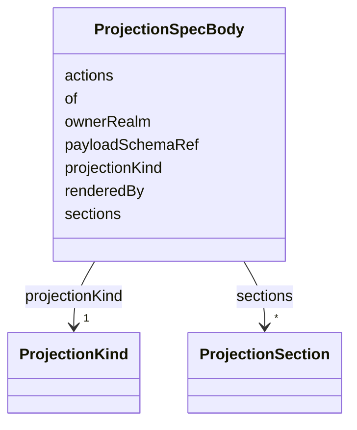

---
search:
  boost: 10.0
---

# Class: ProjectionSpecBody

<div data-search-exclude markdown="1">


URI: [jumo:ProjectionSpecBody](https://jumo.dev/schemas/jumo-v1/ProjectionSpecBody)





<!-- no inheritance hierarchy -->

## Slots

| Name | Cardinality and Range | Description | Inheritance |
| ---  | --- | --- | --- |
| [ownerRealm](ownerRealm.md) | 1 <br/> [Identifier](Identifier.md) |  | direct |
| [of](of.md) | 0..1 <br/> [String](String.md) | A generated LinkML class name (metamodel/generated/manifest | direct |
| [payloadSchemaRef](payloadSchemaRef.md) | 0..1 <br/> [String](String.md) | A JSON Schema 2020-12 document declared under a corpus schemas directory (e | direct |
| [projectionKind](projectionKind.md) | 1 <br/> [ProjectionKind](ProjectionKind.md) |  | direct |
| [renderedBy](renderedBy.md) | 1 <br/> [Identifier](Identifier.md) | The id of an InterfaceSurface `Surface` this projection is scoped to | direct |
| [sections](sections.md) | * <br/> [ProjectionSection](ProjectionSection.md) | Rendered fields grouped into sections | direct |
| [actions](actions.md) | * <br/> [CapabilityName](CapabilityName.md) | Every named action must resolve against a declared ActionCapability (Rego, sa... | direct |


## Usages

| used by | used in | type | used |
| ---  | --- | --- | --- |
| [ProjectionSpec](ProjectionSpec.md) | [spec](spec.md) | range | [ProjectionSpecBody](ProjectionSpecBody.md) |


## Identifier and Mapping Information


### Annotations

| property | value |
| --- | --- |
| jumo.state_authority | GIT |
| jumo.model_role | PROJECTION |
| jumo.audience | REALM_PRIVATE |
| jumo.sensitivity | INTERNAL |
| jumo.boundary_eligible | True |
| jumo.schema_profiles | draft-2020-12,native-json-schema,prompted-json-validated |


### Schema Source


* from schema: https://jumo.dev/schemas/jumo-v1


## Mappings

| Mapping Type | Mapped Value |
| ---  | ---  |
| self | jumo:ProjectionSpecBody |
| native | jumo:ProjectionSpecBody |


## LinkML Source

<!-- TODO: investigate https://stackoverflow.com/questions/37606292/how-to-create-tabbed-code-blocks-in-mkdocs-or-sphinx -->

### Direct

<details>
```yaml
name: ProjectionSpecBody
annotations:
  jumo.state_authority:
    tag: jumo.state_authority
    value: GIT
  jumo.model_role:
    tag: jumo.model_role
    value: PROJECTION
  jumo.audience:
    tag: jumo.audience
    value: REALM_PRIVATE
  jumo.sensitivity:
    tag: jumo.sensitivity
    value: INTERNAL
  jumo.boundary_eligible:
    tag: jumo.boundary_eligible
    value: true
  jumo.schema_profiles:
    tag: jumo.schema_profiles
    value: draft-2020-12,native-json-schema,prompted-json-validated
from_schema: https://jumo.dev/schemas/jumo-v1
attributes:
  ownerRealm:
    name: ownerRealm
    from_schema: https://jumo.dev/schemas/jumo-v1
    owner: ProjectionSpecBody
    domain_of:
    - PrincipalSpec
    - PrincipalIdentityBindingSpec
    - ProjectSpec
    - KitBindingSpec
    - KitLockSpec
    - RoleDefinitionSpec
    - RoleAssignmentSpec
    - TeamSpecBody
    - CoordinationProfileSpec
    - RoutingEligibilitySpec
    - RoleLifecyclePolicySpec
    - OrganizationTemplateSpec
    - ChiefOfStaffProfileSpec
    - AdvisorProfileSpec
    - PersonalSpaceSpec
    - OrganizationSpecBody
    - RealmPublicationSpec
    - CapabilityProfileSpec
    - WorkerRequirementProfileSpec
    - GoldenTaskSetSpec
    - ImprovementLoopSpec
    - ControlCatalogSpec
    - ComplianceProfileSpec
    - EvidenceProfileSpec
    - ProcessSpecBody
    - ChangeProposalRef
    - ForgeProjectionRef
    - ProcessRunRef
    - ApprovalSignal
    - ExecutionCellProvisioningRef
    - ExecutionMachineSpec
    - MachineHostDefinitionSpec
    - McpRegistrySourceBindingSpec
    - ConnectorDefinitionSpec
    - ConnectorAppraisalSpec
    - McpBundleSpec
    - RemoteMcpServiceSpec
    - RemoteMcpAppraisalSpec
    - ExecutionCellSpec
    - ProviderSessionBinding
    - RoutingDecision
    - WorkerInvocation
    - EvidenceRecord
    - InvocationAuthorizationReceipt
    - SecretBindingSpec
    - FederatedPeerSpec
    - FederationProfileSpec
    - WorkerSubstrateSpec
    - McpInventorySnapshot
    - ConnectorIntegrationSpec
    - OAuthClientBindingSpec
    - InterfaceSurfaceSpec
    - VocabularySetSpec
    - ProjectionSpecBody
    range: Identifier
    required: true
  of:
    name: of
    description: A generated LinkML class name (metamodel/generated/manifest.json),
      the same pattern ProcessFlow.payloadType and ProcessStep.signalType use. Must
      name a declared class (Rego). Mutually exclusive with payloadSchemaRef; exactly
      one of the two is required (Rego) -- a payload either has a generated class
      or it does not, never both.
    from_schema: https://jumo.dev/schemas/jumo-v1
    rank: 1000
    owner: ProjectionSpecBody
    domain_of:
    - ProjectionSpecBody
    range: string
  payloadSchemaRef:
    name: payloadSchemaRef
    description: A JSON Schema 2020-12 document declared under a corpus schemas directory
      (e.g. jumo-core:.jumo/schemas), for a step payload with no generated LinkML
      class of its own -- the metamodel names no such instance-specific class (canonical
      decision 15). Must resolve to a declared schema file (Rego). Mutually exclusive
      with of.
    from_schema: https://jumo.dev/schemas/jumo-v1
    rank: 1000
    owner: ProjectionSpecBody
    domain_of:
    - ProjectionSpecBody
    range: string
  projectionKind:
    name: projectionKind
    from_schema: https://jumo.dev/schemas/jumo-v1
    rank: 1000
    owner: ProjectionSpecBody
    domain_of:
    - ProjectionSpecBody
    range: ProjectionKind
    required: true
  renderedBy:
    name: renderedBy
    description: The id of an InterfaceSurface `Surface` this projection is scoped
      to. Required and checked against every declared surface (Rego), rather than
      optional, so a projection nobody lists is never silently unconstrained -- the
      same fail-closed shape as every other reference in this metamodel.
    from_schema: https://jumo.dev/schemas/jumo-v1
    rank: 1000
    owner: ProjectionSpecBody
    domain_of:
    - ProjectionSpecBody
    range: Identifier
    required: true
  sections:
    name: sections
    description: Rendered fields grouped into sections. May be empty only for an action-only
      projection, where actions is non-empty and the projection exists solely to anchor
      a headless journey step's callable capabilities (Rego).
    from_schema: https://jumo.dev/schemas/jumo-v1
    rank: 1000
    owner: ProjectionSpecBody
    domain_of:
    - ProjectionSpecBody
    range: ProjectionSection
    multivalued: true
    inlined: true
    inlined_as_list: true
  actions:
    name: actions
    description: Every named action must resolve against a declared ActionCapability
      (Rego, same check as every other capability reference in this metamodel) and
      must also be among `renderedBy`'s surface's `proposes` list (Rego) -- a projection
      can never claim an action its rendering surface does not offer.
    from_schema: https://jumo.dev/schemas/jumo-v1
    owner: ProjectionSpecBody
    domain_of:
    - PolicyRule
    - ProjectionSpecBody
    range: CapabilityName
    multivalued: true

```
</details>

### Induced

<details>
```yaml
name: ProjectionSpecBody
annotations:
  jumo.state_authority:
    tag: jumo.state_authority
    value: GIT
  jumo.model_role:
    tag: jumo.model_role
    value: PROJECTION
  jumo.audience:
    tag: jumo.audience
    value: REALM_PRIVATE
  jumo.sensitivity:
    tag: jumo.sensitivity
    value: INTERNAL
  jumo.boundary_eligible:
    tag: jumo.boundary_eligible
    value: true
  jumo.schema_profiles:
    tag: jumo.schema_profiles
    value: draft-2020-12,native-json-schema,prompted-json-validated
from_schema: https://jumo.dev/schemas/jumo-v1
attributes:
  ownerRealm:
    name: ownerRealm
    from_schema: https://jumo.dev/schemas/jumo-v1
    owner: ProjectionSpecBody
    domain_of:
    - PrincipalSpec
    - PrincipalIdentityBindingSpec
    - ProjectSpec
    - KitBindingSpec
    - KitLockSpec
    - RoleDefinitionSpec
    - RoleAssignmentSpec
    - TeamSpecBody
    - CoordinationProfileSpec
    - RoutingEligibilitySpec
    - RoleLifecyclePolicySpec
    - OrganizationTemplateSpec
    - ChiefOfStaffProfileSpec
    - AdvisorProfileSpec
    - PersonalSpaceSpec
    - OrganizationSpecBody
    - RealmPublicationSpec
    - CapabilityProfileSpec
    - WorkerRequirementProfileSpec
    - GoldenTaskSetSpec
    - ImprovementLoopSpec
    - ControlCatalogSpec
    - ComplianceProfileSpec
    - EvidenceProfileSpec
    - ProcessSpecBody
    - ChangeProposalRef
    - ForgeProjectionRef
    - ProcessRunRef
    - ApprovalSignal
    - ExecutionCellProvisioningRef
    - ExecutionMachineSpec
    - MachineHostDefinitionSpec
    - McpRegistrySourceBindingSpec
    - ConnectorDefinitionSpec
    - ConnectorAppraisalSpec
    - McpBundleSpec
    - RemoteMcpServiceSpec
    - RemoteMcpAppraisalSpec
    - ExecutionCellSpec
    - ProviderSessionBinding
    - RoutingDecision
    - WorkerInvocation
    - EvidenceRecord
    - InvocationAuthorizationReceipt
    - SecretBindingSpec
    - FederatedPeerSpec
    - FederationProfileSpec
    - WorkerSubstrateSpec
    - McpInventorySnapshot
    - ConnectorIntegrationSpec
    - OAuthClientBindingSpec
    - InterfaceSurfaceSpec
    - VocabularySetSpec
    - ProjectionSpecBody
    range: Identifier
    required: true
  of:
    name: of
    description: A generated LinkML class name (metamodel/generated/manifest.json),
      the same pattern ProcessFlow.payloadType and ProcessStep.signalType use. Must
      name a declared class (Rego). Mutually exclusive with payloadSchemaRef; exactly
      one of the two is required (Rego) -- a payload either has a generated class
      or it does not, never both.
    from_schema: https://jumo.dev/schemas/jumo-v1
    rank: 1000
    owner: ProjectionSpecBody
    domain_of:
    - ProjectionSpecBody
    range: string
  payloadSchemaRef:
    name: payloadSchemaRef
    description: A JSON Schema 2020-12 document declared under a corpus schemas directory
      (e.g. jumo-core:.jumo/schemas), for a step payload with no generated LinkML
      class of its own -- the metamodel names no such instance-specific class (canonical
      decision 15). Must resolve to a declared schema file (Rego). Mutually exclusive
      with of.
    from_schema: https://jumo.dev/schemas/jumo-v1
    rank: 1000
    owner: ProjectionSpecBody
    domain_of:
    - ProjectionSpecBody
    range: string
  projectionKind:
    name: projectionKind
    from_schema: https://jumo.dev/schemas/jumo-v1
    rank: 1000
    owner: ProjectionSpecBody
    domain_of:
    - ProjectionSpecBody
    range: ProjectionKind
    required: true
  renderedBy:
    name: renderedBy
    description: The id of an InterfaceSurface `Surface` this projection is scoped
      to. Required and checked against every declared surface (Rego), rather than
      optional, so a projection nobody lists is never silently unconstrained -- the
      same fail-closed shape as every other reference in this metamodel.
    from_schema: https://jumo.dev/schemas/jumo-v1
    rank: 1000
    owner: ProjectionSpecBody
    domain_of:
    - ProjectionSpecBody
    range: Identifier
    required: true
  sections:
    name: sections
    description: Rendered fields grouped into sections. May be empty only for an action-only
      projection, where actions is non-empty and the projection exists solely to anchor
      a headless journey step's callable capabilities (Rego).
    from_schema: https://jumo.dev/schemas/jumo-v1
    rank: 1000
    owner: ProjectionSpecBody
    domain_of:
    - ProjectionSpecBody
    range: ProjectionSection
    multivalued: true
    inlined: true
    inlined_as_list: true
  actions:
    name: actions
    description: Every named action must resolve against a declared ActionCapability
      (Rego, same check as every other capability reference in this metamodel) and
      must also be among `renderedBy`'s surface's `proposes` list (Rego) -- a projection
      can never claim an action its rendering surface does not offer.
    from_schema: https://jumo.dev/schemas/jumo-v1
    owner: ProjectionSpecBody
    domain_of:
    - PolicyRule
    - ProjectionSpecBody
    range: CapabilityName
    multivalued: true

```
</details></div>