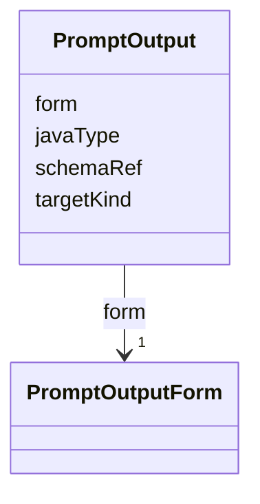

---
search:
  boost: 10.0
---

# Class: PromptOutput

<div data-search-exclude markdown="1">


URI: [jumo:PromptOutput](https://jumo.dev/schemas/jumo-v1/PromptOutput)





<!-- no inheritance hierarchy -->

## Slots

| Name | Cardinality and Range | Description | Inheritance |
| ---  | --- | --- | --- |
| [form](form.md) | 1 <br/> [PromptOutputForm](PromptOutputForm.md) |  | direct |
| [javaType](javaType.md) | 0..1 <br/> [String](String.md) | Fully qualified target type for STRUCTURED output | direct |
| [schemaRef](schemaRef.md) | 0..1 <br/> [String](String.md) |  | direct |
| [targetKind](targetKind.md) | 0..1 <br/> [String](String.md) | For a STRUCTURED output whose javaType is a reusable generic proposal shape (... | direct |


## Usages

| used by | used in | type | used |
| ---  | --- | --- | --- |
| [PromptTemplateSpec](PromptTemplateSpec.md) | [output](output.md) | range | [PromptOutput](PromptOutput.md) |


## Identifier and Mapping Information


### Annotations

| property | value |
| --- | --- |
| jumo.state_authority | GIT |
| jumo.model_role | VALUE_OBJECT |
| jumo.audience | REALM_PRIVATE |
| jumo.sensitivity | INTERNAL |
| jumo.boundary_eligible | True |
| jumo.schema_profiles | draft-2020-12,native-json-schema,prompted-json-validated |


### Schema Source


* from schema: https://jumo.dev/schemas/jumo-v1


## Mappings

| Mapping Type | Mapped Value |
| ---  | ---  |
| self | jumo:PromptOutput |
| native | jumo:PromptOutput |


## LinkML Source

<!-- TODO: investigate https://stackoverflow.com/questions/37606292/how-to-create-tabbed-code-blocks-in-mkdocs-or-sphinx -->

### Direct

<details>
```yaml
name: PromptOutput
annotations:
  jumo.state_authority:
    tag: jumo.state_authority
    value: GIT
  jumo.model_role:
    tag: jumo.model_role
    value: VALUE_OBJECT
  jumo.audience:
    tag: jumo.audience
    value: REALM_PRIVATE
  jumo.sensitivity:
    tag: jumo.sensitivity
    value: INTERNAL
  jumo.boundary_eligible:
    tag: jumo.boundary_eligible
    value: true
  jumo.schema_profiles:
    tag: jumo.schema_profiles
    value: draft-2020-12,native-json-schema,prompted-json-validated
from_schema: https://jumo.dev/schemas/jumo-v1
attributes:
  form:
    name: form
    from_schema: https://jumo.dev/schemas/jumo-v1
    rank: 1000
    owner: PromptOutput
    domain_of:
    - PromptOutput
    - ThemeObjectForm
    range: PromptOutputForm
    required: true
  javaType:
    name: javaType
    description: Fully qualified target type for STRUCTURED output.
    from_schema: https://jumo.dev/schemas/jumo-v1
    rank: 1000
    owner: PromptOutput
    domain_of:
    - PromptOutput
    range: string
  schemaRef:
    name: schemaRef
    from_schema: https://jumo.dev/schemas/jumo-v1
    rank: 1000
    owner: PromptOutput
    domain_of:
    - PromptOutput
    - FederationMessage
    range: string
  targetKind:
    name: targetKind
    description: For a STRUCTURED output whose javaType is a reusable generic proposal
      shape (for example SelectionIntentProposal), the contract kind every proposed
      ref must name -- e.g. ConnectorDefinition. The same role AssistedJourneyEmission.targetKind
      already plays -- one class serving every domain that needs the shape instead
      of one class per target kind (canonical decision 15); absent when javaType is
      not generic over a target kind.
    from_schema: https://jumo.dev/schemas/jumo-v1
    rank: 1000
    owner: PromptOutput
    domain_of:
    - PromptOutput
    - AssistedJourneyEmission
    range: string

```
</details>

### Induced

<details>
```yaml
name: PromptOutput
annotations:
  jumo.state_authority:
    tag: jumo.state_authority
    value: GIT
  jumo.model_role:
    tag: jumo.model_role
    value: VALUE_OBJECT
  jumo.audience:
    tag: jumo.audience
    value: REALM_PRIVATE
  jumo.sensitivity:
    tag: jumo.sensitivity
    value: INTERNAL
  jumo.boundary_eligible:
    tag: jumo.boundary_eligible
    value: true
  jumo.schema_profiles:
    tag: jumo.schema_profiles
    value: draft-2020-12,native-json-schema,prompted-json-validated
from_schema: https://jumo.dev/schemas/jumo-v1
attributes:
  form:
    name: form
    from_schema: https://jumo.dev/schemas/jumo-v1
    rank: 1000
    owner: PromptOutput
    domain_of:
    - PromptOutput
    - ThemeObjectForm
    range: PromptOutputForm
    required: true
  javaType:
    name: javaType
    description: Fully qualified target type for STRUCTURED output.
    from_schema: https://jumo.dev/schemas/jumo-v1
    rank: 1000
    owner: PromptOutput
    domain_of:
    - PromptOutput
    range: string
  schemaRef:
    name: schemaRef
    from_schema: https://jumo.dev/schemas/jumo-v1
    rank: 1000
    owner: PromptOutput
    domain_of:
    - PromptOutput
    - FederationMessage
    range: string
  targetKind:
    name: targetKind
    description: For a STRUCTURED output whose javaType is a reusable generic proposal
      shape (for example SelectionIntentProposal), the contract kind every proposed
      ref must name -- e.g. ConnectorDefinition. The same role AssistedJourneyEmission.targetKind
      already plays -- one class serving every domain that needs the shape instead
      of one class per target kind (canonical decision 15); absent when javaType is
      not generic over a target kind.
    from_schema: https://jumo.dev/schemas/jumo-v1
    rank: 1000
    owner: PromptOutput
    domain_of:
    - PromptOutput
    - AssistedJourneyEmission
    range: string

```
</details></div>