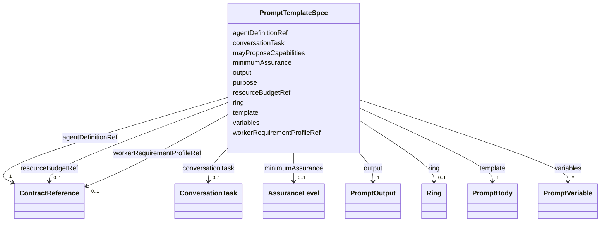

---
search:
  boost: 10.0
---

# Class: PromptTemplateSpec

<div data-search-exclude markdown="1">


URI: [jumo:PromptTemplateSpec](https://jumo.dev/schemas/jumo-v1/PromptTemplateSpec)





<!-- no inheritance hierarchy -->

## Slots

| Name | Cardinality and Range | Description | Inheritance |
| ---  | --- | --- | --- |
| [agentDefinitionRef](agentDefinitionRef.md) | 1 <br/> [ContractReference](ContractReference.md) | The owning AgentDefinition | direct |
| [purpose](purpose.md) | 1 <br/> [String](String.md) |  | direct |
| [template](template.md) | 1 <br/> [PromptBody](PromptBody.md) |  | direct |
| [variables](variables.md) | * <br/> [PromptVariable](PromptVariable.md) |  | direct |
| [output](output.md) | 1 <br/> [PromptOutput](PromptOutput.md) |  | direct |
| [mayProposeCapabilities](mayProposeCapabilities.md) | * <br/> [CapabilityName](CapabilityName.md) | Enforced as a subset of the owning AgentDefinition's requestedCapabilities (R... | direct |
| [workerRequirementProfileRef](workerRequirementProfileRef.md) | 0..1 <br/> [ContractReference](ContractReference.md) |  | direct |
| [resourceBudgetRef](resourceBudgetRef.md) | 0..1 <br/> [ContractReference](ContractReference.md) |  | direct |
| [minimumAssurance](minimumAssurance.md) | 0..1 <br/> [AssuranceLevel](AssuranceLevel.md) |  | direct |
| [ring](ring.md) | 0..1 <br/> [Ring](Ring.md) |  | direct |
| [conversationTask](conversationTask.md) | 0..1 <br/> [ConversationTask](ConversationTask.md) | The ConversationService task this prompt serves | direct |


## Usages

| used by | used in | type | used |
| ---  | --- | --- | --- |
| [PromptTemplate](PromptTemplate.md) | [spec](spec.md) | range | [PromptTemplateSpec](PromptTemplateSpec.md) |


## Identifier and Mapping Information


### Annotations

| property | value |
| --- | --- |
| jumo.state_authority | GIT |
| jumo.model_role | VALUE_OBJECT |
| jumo.audience | REALM_PRIVATE |
| jumo.sensitivity | INTERNAL |
| jumo.boundary_eligible | True |
| jumo.schema_profiles | draft-2020-12,native-json-schema,prompted-json-validated |


### Schema Source


* from schema: https://jumo.dev/schemas/jumo-v1


## Mappings

| Mapping Type | Mapped Value |
| ---  | ---  |
| self | jumo:PromptTemplateSpec |
| native | jumo:PromptTemplateSpec |


## LinkML Source

<!-- TODO: investigate https://stackoverflow.com/questions/37606292/how-to-create-tabbed-code-blocks-in-mkdocs-or-sphinx -->

### Direct

<details>
```yaml
name: PromptTemplateSpec
annotations:
  jumo.state_authority:
    tag: jumo.state_authority
    value: GIT
  jumo.model_role:
    tag: jumo.model_role
    value: VALUE_OBJECT
  jumo.audience:
    tag: jumo.audience
    value: REALM_PRIVATE
  jumo.sensitivity:
    tag: jumo.sensitivity
    value: INTERNAL
  jumo.boundary_eligible:
    tag: jumo.boundary_eligible
    value: true
  jumo.schema_profiles:
    tag: jumo.schema_profiles
    value: draft-2020-12,native-json-schema,prompted-json-validated
from_schema: https://jumo.dev/schemas/jumo-v1
attributes:
  agentDefinitionRef:
    name: agentDefinitionRef
    description: The owning AgentDefinition.
    from_schema: https://jumo.dev/schemas/jumo-v1
    owner: PromptTemplateSpec
    domain_of:
    - RoleBearer
    - EngagementMethodSpec
    - PromptTemplateSpec
    range: ContractReference
    required: true
    inlined: true
  purpose:
    name: purpose
    from_schema: https://jumo.dev/schemas/jumo-v1
    owner: PromptTemplateSpec
    domain_of:
    - ProjectSpec
    - TeamSpecBody
    - WorkOrderSpec
    - PracticeSpec
    - PromptTemplateSpec
    - ImprovementLoopSpec
    - ProcessingRegisterEntry
    - McpBundleSemanticProfile
    - Surface
    range: string
    required: true
    pattern: ^.{10,}$
  template:
    name: template
    from_schema: https://jumo.dev/schemas/jumo-v1
    rank: 1000
    owner: PromptTemplateSpec
    domain_of:
    - PromptTemplateSpec
    range: PromptBody
    required: true
    inlined: true
  variables:
    name: variables
    from_schema: https://jumo.dev/schemas/jumo-v1
    rank: 1000
    owner: PromptTemplateSpec
    domain_of:
    - PromptTemplateSpec
    - MachineAdminRequest
    - MachineAdminCommand
    range: PromptVariable
    multivalued: true
    inlined: true
    inlined_as_list: true
  output:
    name: output
    from_schema: https://jumo.dev/schemas/jumo-v1
    rank: 1000
    owner: PromptTemplateSpec
    domain_of:
    - PromptTemplateSpec
    range: PromptOutput
    required: true
    inlined: true
  mayProposeCapabilities:
    name: mayProposeCapabilities
    description: 'Enforced as a subset of the owning AgentDefinition''s requestedCapabilities
      (Rego). Proposing is still not granting: policy decides.'
    from_schema: https://jumo.dev/schemas/jumo-v1
    rank: 1000
    owner: PromptTemplateSpec
    domain_of:
    - PromptTemplateSpec
    range: CapabilityName
    multivalued: true
  workerRequirementProfileRef:
    name: workerRequirementProfileRef
    from_schema: https://jumo.dev/schemas/jumo-v1
    owner: PromptTemplateSpec
    domain_of:
    - EngagementMethodSpec
    - CapabilityProfileSpec
    - GoldenTaskSetSpec
    - PromptTemplateSpec
    - ProcessStageWorkerRequirement
    range: ContractReference
    inlined: true
  resourceBudgetRef:
    name: resourceBudgetRef
    from_schema: https://jumo.dev/schemas/jumo-v1
    owner: PromptTemplateSpec
    domain_of:
    - WorkOrderSpec
    - EngagementMethodSpec
    - PracticeSpec
    - PromptTemplateSpec
    - AssistedJourneySpec
    - ProcessSpecBody
    range: ContractReference
    inlined: true
  minimumAssurance:
    name: minimumAssurance
    from_schema: https://jumo.dev/schemas/jumo-v1
    owner: PromptTemplateSpec
    domain_of:
    - WorkerQualityRequirement
    - PromptTemplateSpec
    - ResourceBudgetSpec
    - ActionCapability
    range: AssuranceLevel
  ring:
    name: ring
    from_schema: https://jumo.dev/schemas/jumo-v1
    owner: PromptTemplateSpec
    domain_of:
    - WorkOrderSpec
    - PromptTemplateSpec
    - ImprovementTarget
    - ProcessStep
    - SurfaceWritePath
    range: Ring
  conversationTask:
    name: conversationTask
    description: The ConversationService task this prompt serves. Optional -- most
      PromptTemplate documents are referenced by a journey step, not by a conversation
      task, and leave this unset.
    from_schema: https://jumo.dev/schemas/jumo-v1
    rank: 1000
    owner: PromptTemplateSpec
    domain_of:
    - PromptTemplateSpec
    range: ConversationTask

```
</details>

### Induced

<details>
```yaml
name: PromptTemplateSpec
annotations:
  jumo.state_authority:
    tag: jumo.state_authority
    value: GIT
  jumo.model_role:
    tag: jumo.model_role
    value: VALUE_OBJECT
  jumo.audience:
    tag: jumo.audience
    value: REALM_PRIVATE
  jumo.sensitivity:
    tag: jumo.sensitivity
    value: INTERNAL
  jumo.boundary_eligible:
    tag: jumo.boundary_eligible
    value: true
  jumo.schema_profiles:
    tag: jumo.schema_profiles
    value: draft-2020-12,native-json-schema,prompted-json-validated
from_schema: https://jumo.dev/schemas/jumo-v1
attributes:
  agentDefinitionRef:
    name: agentDefinitionRef
    description: The owning AgentDefinition.
    from_schema: https://jumo.dev/schemas/jumo-v1
    owner: PromptTemplateSpec
    domain_of:
    - RoleBearer
    - EngagementMethodSpec
    - PromptTemplateSpec
    range: ContractReference
    required: true
    inlined: true
  purpose:
    name: purpose
    from_schema: https://jumo.dev/schemas/jumo-v1
    owner: PromptTemplateSpec
    domain_of:
    - ProjectSpec
    - TeamSpecBody
    - WorkOrderSpec
    - PracticeSpec
    - PromptTemplateSpec
    - ImprovementLoopSpec
    - ProcessingRegisterEntry
    - McpBundleSemanticProfile
    - Surface
    range: string
    required: true
    pattern: ^.{10,}$
  template:
    name: template
    from_schema: https://jumo.dev/schemas/jumo-v1
    rank: 1000
    owner: PromptTemplateSpec
    domain_of:
    - PromptTemplateSpec
    range: PromptBody
    required: true
    inlined: true
  variables:
    name: variables
    from_schema: https://jumo.dev/schemas/jumo-v1
    rank: 1000
    owner: PromptTemplateSpec
    domain_of:
    - PromptTemplateSpec
    - MachineAdminRequest
    - MachineAdminCommand
    range: PromptVariable
    multivalued: true
    inlined: true
    inlined_as_list: true
  output:
    name: output
    from_schema: https://jumo.dev/schemas/jumo-v1
    rank: 1000
    owner: PromptTemplateSpec
    domain_of:
    - PromptTemplateSpec
    range: PromptOutput
    required: true
    inlined: true
  mayProposeCapabilities:
    name: mayProposeCapabilities
    description: 'Enforced as a subset of the owning AgentDefinition''s requestedCapabilities
      (Rego). Proposing is still not granting: policy decides.'
    from_schema: https://jumo.dev/schemas/jumo-v1
    rank: 1000
    owner: PromptTemplateSpec
    domain_of:
    - PromptTemplateSpec
    range: CapabilityName
    multivalued: true
  workerRequirementProfileRef:
    name: workerRequirementProfileRef
    from_schema: https://jumo.dev/schemas/jumo-v1
    owner: PromptTemplateSpec
    domain_of:
    - EngagementMethodSpec
    - CapabilityProfileSpec
    - GoldenTaskSetSpec
    - PromptTemplateSpec
    - ProcessStageWorkerRequirement
    range: ContractReference
    inlined: true
  resourceBudgetRef:
    name: resourceBudgetRef
    from_schema: https://jumo.dev/schemas/jumo-v1
    owner: PromptTemplateSpec
    domain_of:
    - WorkOrderSpec
    - EngagementMethodSpec
    - PracticeSpec
    - PromptTemplateSpec
    - AssistedJourneySpec
    - ProcessSpecBody
    range: ContractReference
    inlined: true
  minimumAssurance:
    name: minimumAssurance
    from_schema: https://jumo.dev/schemas/jumo-v1
    owner: PromptTemplateSpec
    domain_of:
    - WorkerQualityRequirement
    - PromptTemplateSpec
    - ResourceBudgetSpec
    - ActionCapability
    range: AssuranceLevel
  ring:
    name: ring
    from_schema: https://jumo.dev/schemas/jumo-v1
    owner: PromptTemplateSpec
    domain_of:
    - WorkOrderSpec
    - PromptTemplateSpec
    - ImprovementTarget
    - ProcessStep
    - SurfaceWritePath
    range: Ring
  conversationTask:
    name: conversationTask
    description: The ConversationService task this prompt serves. Optional -- most
      PromptTemplate documents are referenced by a journey step, not by a conversation
      task, and leave this unset.
    from_schema: https://jumo.dev/schemas/jumo-v1
    rank: 1000
    owner: PromptTemplateSpec
    domain_of:
    - PromptTemplateSpec
    range: ConversationTask

```
</details></div>