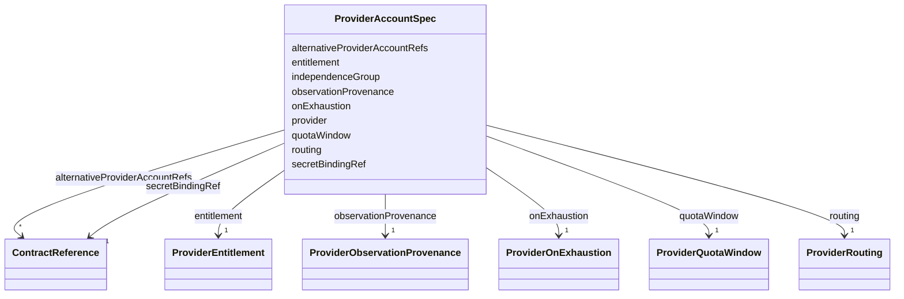

---
search:
  boost: 10.0
---

# Class: ProviderAccountSpec

<div data-search-exclude markdown="1">


URI: [jumo:ProviderAccountSpec](https://jumo.dev/schemas/jumo-v1/ProviderAccountSpec)





<!-- no inheritance hierarchy -->

## Slots

| Name | Cardinality and Range | Description | Inheritance |
| ---  | --- | --- | --- |
| [provider](provider.md) | 1 <br/> [String](String.md) | Vendor and access path, such as anthropic-cli or openai-api | direct |
| [routing](routing.md) | 1 <br/> [ProviderRouting](ProviderRouting.md) |  | direct |
| [secretBindingRef](secretBindingRef.md) | 0..1 <br/> [ContractReference](ContractReference.md) | The sole OpenBao binding that may hold this named account's credential; the v... | direct |
| [quotaWindow](quotaWindow.md) | 1 <br/> [ProviderQuotaWindow](ProviderQuotaWindow.md) |  | direct |
| [observationProvenance](observationProvenance.md) | 1 <br/> [ProviderObservationProvenance](ProviderObservationProvenance.md) |  | direct |
| [onExhaustion](onExhaustion.md) | 1 <br/> [ProviderOnExhaustion](ProviderOnExhaustion.md) |  | direct |
| [independenceGroup](independenceGroup.md) | 0..1 <br/> [Identifier](Identifier.md) | Accounts sharing a group are not independent | direct |
| [entitlement](entitlement.md) | 1 <br/> [ProviderEntitlement](ProviderEntitlement.md) |  | direct |
| [alternativeProviderAccountRefs](alternativeProviderAccountRefs.md) | * <br/> [ContractReference](ContractReference.md) |  | direct |


## Usages

| used by | used in | type | used |
| ---  | --- | --- | --- |
| [ProviderAccount](ProviderAccount.md) | [spec](spec.md) | range | [ProviderAccountSpec](ProviderAccountSpec.md) |


## Identifier and Mapping Information


### Annotations

| property | value |
| --- | --- |
| jumo.state_authority | GIT |
| jumo.model_role | VALUE_OBJECT |
| jumo.audience | REALM_PRIVATE |
| jumo.sensitivity | PERSONAL |
| jumo.boundary_eligible | True |
| jumo.schema_profiles | draft-2020-12,native-json-schema,prompted-json-validated |


### Schema Source


* from schema: https://jumo.dev/schemas/jumo-v1


## Mappings

| Mapping Type | Mapped Value |
| ---  | ---  |
| self | jumo:ProviderAccountSpec |
| native | jumo:ProviderAccountSpec |


## LinkML Source

<!-- TODO: investigate https://stackoverflow.com/questions/37606292/how-to-create-tabbed-code-blocks-in-mkdocs-or-sphinx -->

### Direct

<details>
```yaml
name: ProviderAccountSpec
annotations:
  jumo.state_authority:
    tag: jumo.state_authority
    value: GIT
  jumo.model_role:
    tag: jumo.model_role
    value: VALUE_OBJECT
  jumo.audience:
    tag: jumo.audience
    value: REALM_PRIVATE
  jumo.sensitivity:
    tag: jumo.sensitivity
    value: PERSONAL
  jumo.boundary_eligible:
    tag: jumo.boundary_eligible
    value: true
  jumo.schema_profiles:
    tag: jumo.schema_profiles
    value: draft-2020-12,native-json-schema,prompted-json-validated
from_schema: https://jumo.dev/schemas/jumo-v1
attributes:
  provider:
    name: provider
    description: Vendor and access path, such as anthropic-cli or openai-api. Two
      accounts on the same vendor are not independent of each other.
    from_schema: https://jumo.dev/schemas/jumo-v1
    owner: ProviderAccountSpec
    domain_of:
    - RepositoryBinding
    - ProviderAccountSpec
    - ChangeSetProjection
    range: string
    required: true
    pattern: ^.{2,}$
  routing:
    name: routing
    from_schema: https://jumo.dev/schemas/jumo-v1
    rank: 1000
    owner: ProviderAccountSpec
    domain_of:
    - ProviderAccountSpec
    range: ProviderRouting
    required: true
    inlined: true
  secretBindingRef:
    name: secretBindingRef
    description: The sole OpenBao binding that may hold this named account's credential;
      the value is never contractual state.
    from_schema: https://jumo.dev/schemas/jumo-v1
    owner: ProviderAccountSpec
    domain_of:
    - McpRegistrySourceSpec
    - ProviderAccountSpec
    - WorkerModelAccess
    - ConnectorSessionBinding
    range: ContractReference
    inlined: true
  quotaWindow:
    name: quotaWindow
    from_schema: https://jumo.dev/schemas/jumo-v1
    rank: 1000
    owner: ProviderAccountSpec
    domain_of:
    - ProviderAccountSpec
    range: ProviderQuotaWindow
    required: true
    inlined: true
  observationProvenance:
    name: observationProvenance
    from_schema: https://jumo.dev/schemas/jumo-v1
    rank: 1000
    owner: ProviderAccountSpec
    domain_of:
    - ProviderAccountSpec
    range: ProviderObservationProvenance
    required: true
  onExhaustion:
    name: onExhaustion
    from_schema: https://jumo.dev/schemas/jumo-v1
    owner: ProviderAccountSpec
    domain_of:
    - ClarificationPolicy
    - ResourceBudgetSpec
    - ProviderAccountSpec
    range: ProviderOnExhaustion
    required: true
  independenceGroup:
    name: independenceGroup
    description: Accounts sharing a group are not independent. Falling back within
      the same group would let one account both produce and verify (docs/concepts/positionnement-conceptuel.md#diversite-des-pannes)
      -- a declared separation, not a proof of independence; a fault-diversity vector
      (provider, model, prompt, sources, tools, framing) would be the finer-grained
      signal, not yet modeled as its own field. Inherited from the referenced ProviderPlatform's
      independenceGroup when absent.
    from_schema: https://jumo.dev/schemas/jumo-v1
    owner: ProviderAccountSpec
    domain_of:
    - RoleDefinitionSpec
    - TeamMember
    - ProviderAccountSpec
    - ProviderPlatformSpec
    range: Identifier
  entitlement:
    name: entitlement
    from_schema: https://jumo.dev/schemas/jumo-v1
    rank: 1000
    owner: ProviderAccountSpec
    domain_of:
    - ProviderAccountSpec
    range: ProviderEntitlement
    required: true
    inlined: true
  alternativeProviderAccountRefs:
    name: alternativeProviderAccountRefs
    from_schema: https://jumo.dev/schemas/jumo-v1
    rank: 1000
    owner: ProviderAccountSpec
    domain_of:
    - ProviderAccountSpec
    range: ContractReference
    multivalued: true
    inlined: true
    inlined_as_list: true

```
</details>

### Induced

<details>
```yaml
name: ProviderAccountSpec
annotations:
  jumo.state_authority:
    tag: jumo.state_authority
    value: GIT
  jumo.model_role:
    tag: jumo.model_role
    value: VALUE_OBJECT
  jumo.audience:
    tag: jumo.audience
    value: REALM_PRIVATE
  jumo.sensitivity:
    tag: jumo.sensitivity
    value: PERSONAL
  jumo.boundary_eligible:
    tag: jumo.boundary_eligible
    value: true
  jumo.schema_profiles:
    tag: jumo.schema_profiles
    value: draft-2020-12,native-json-schema,prompted-json-validated
from_schema: https://jumo.dev/schemas/jumo-v1
attributes:
  provider:
    name: provider
    description: Vendor and access path, such as anthropic-cli or openai-api. Two
      accounts on the same vendor are not independent of each other.
    from_schema: https://jumo.dev/schemas/jumo-v1
    owner: ProviderAccountSpec
    domain_of:
    - RepositoryBinding
    - ProviderAccountSpec
    - ChangeSetProjection
    range: string
    required: true
    pattern: ^.{2,}$
  routing:
    name: routing
    from_schema: https://jumo.dev/schemas/jumo-v1
    rank: 1000
    owner: ProviderAccountSpec
    domain_of:
    - ProviderAccountSpec
    range: ProviderRouting
    required: true
    inlined: true
  secretBindingRef:
    name: secretBindingRef
    description: The sole OpenBao binding that may hold this named account's credential;
      the value is never contractual state.
    from_schema: https://jumo.dev/schemas/jumo-v1
    owner: ProviderAccountSpec
    domain_of:
    - McpRegistrySourceSpec
    - ProviderAccountSpec
    - WorkerModelAccess
    - ConnectorSessionBinding
    range: ContractReference
    inlined: true
  quotaWindow:
    name: quotaWindow
    from_schema: https://jumo.dev/schemas/jumo-v1
    rank: 1000
    owner: ProviderAccountSpec
    domain_of:
    - ProviderAccountSpec
    range: ProviderQuotaWindow
    required: true
    inlined: true
  observationProvenance:
    name: observationProvenance
    from_schema: https://jumo.dev/schemas/jumo-v1
    rank: 1000
    owner: ProviderAccountSpec
    domain_of:
    - ProviderAccountSpec
    range: ProviderObservationProvenance
    required: true
  onExhaustion:
    name: onExhaustion
    from_schema: https://jumo.dev/schemas/jumo-v1
    owner: ProviderAccountSpec
    domain_of:
    - ClarificationPolicy
    - ResourceBudgetSpec
    - ProviderAccountSpec
    range: ProviderOnExhaustion
    required: true
  independenceGroup:
    name: independenceGroup
    description: Accounts sharing a group are not independent. Falling back within
      the same group would let one account both produce and verify (docs/concepts/positionnement-conceptuel.md#diversite-des-pannes)
      -- a declared separation, not a proof of independence; a fault-diversity vector
      (provider, model, prompt, sources, tools, framing) would be the finer-grained
      signal, not yet modeled as its own field. Inherited from the referenced ProviderPlatform's
      independenceGroup when absent.
    from_schema: https://jumo.dev/schemas/jumo-v1
    owner: ProviderAccountSpec
    domain_of:
    - RoleDefinitionSpec
    - TeamMember
    - ProviderAccountSpec
    - ProviderPlatformSpec
    range: Identifier
  entitlement:
    name: entitlement
    from_schema: https://jumo.dev/schemas/jumo-v1
    rank: 1000
    owner: ProviderAccountSpec
    domain_of:
    - ProviderAccountSpec
    range: ProviderEntitlement
    required: true
    inlined: true
  alternativeProviderAccountRefs:
    name: alternativeProviderAccountRefs
    from_schema: https://jumo.dev/schemas/jumo-v1
    rank: 1000
    owner: ProviderAccountSpec
    domain_of:
    - ProviderAccountSpec
    range: ContractReference
    multivalued: true
    inlined: true
    inlined_as_list: true

```
</details></div>