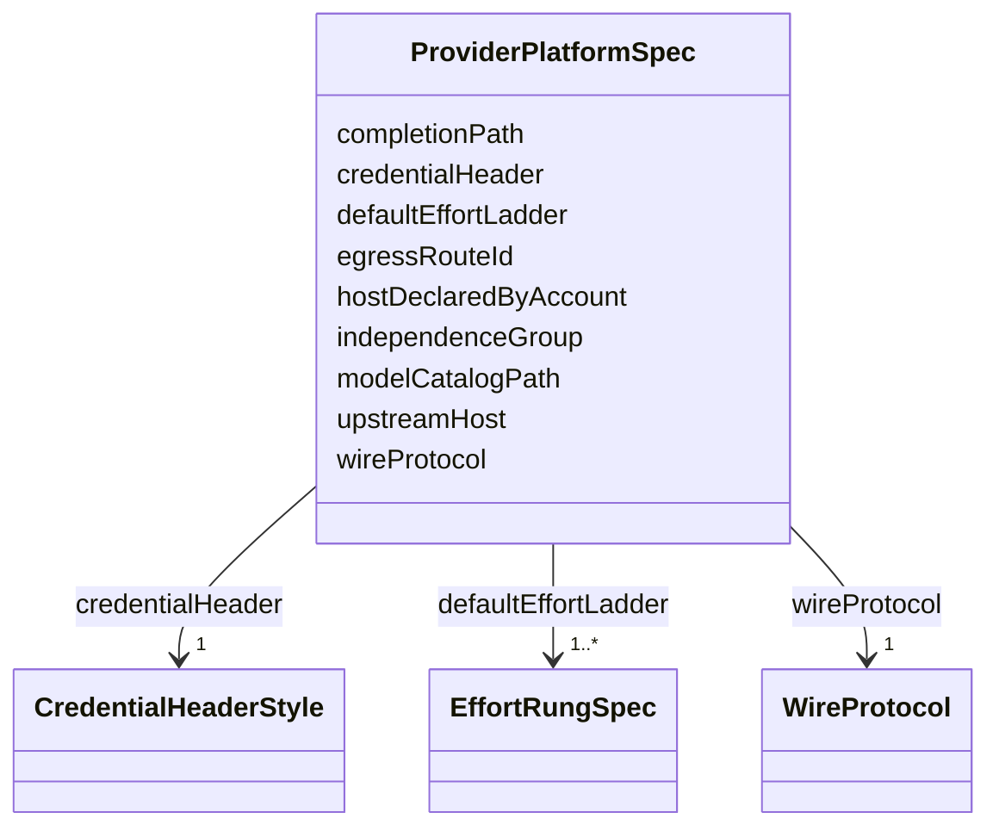

---
search:
  boost: 10.0
---

# Class: ProviderPlatformSpec

<div data-search-exclude markdown="1">


URI: [jumo:ProviderPlatformSpec](https://jumo.dev/schemas/jumo-v1/ProviderPlatformSpec)





<!-- no inheritance hierarchy -->

## Slots

| Name | Cardinality and Range | Description | Inheritance |
| ---  | --- | --- | --- |
| [wireProtocol](wireProtocol.md) | 1 <br/> [WireProtocol](WireProtocol.md) |  | direct |
| [egressRouteId](egressRouteId.md) | 1 <br/> [Identifier](Identifier.md) | Names the generated provider-egress nginx location this platform's traffic pr... | direct |
| [upstreamHost](upstreamHost.md) | 0..1 <br/> [String](String.md) | Fixed TLS upstream for an integrated platform | direct |
| [completionPath](completionPath.md) | 1 <br/> [String](String.md) |  | direct |
| [modelCatalogPath](modelCatalogPath.md) | 1 <br/> [String](String.md) |  | direct |
| [credentialHeader](credentialHeader.md) | 1 <br/> [CredentialHeaderStyle](CredentialHeaderStyle.md) |  | direct |
| [independenceGroup](independenceGroup.md) | 1 <br/> [Identifier](Identifier.md) | Default independenceGroup for an account opened against this platform when th... | direct |
| [hostDeclaredByAccount](hostDeclaredByAccount.md) | 1 <br/> [Boolean](Boolean.md) | True only for a generic platform (e | direct |
| [defaultEffortLadder](defaultEffortLadder.md) | 1..* <br/> [EffortRungSpec](EffortRungSpec.md) | The rung-by-rung ladder every account opened against this platform inherits u... | direct |


## Usages

| used by | used in | type | used |
| ---  | --- | --- | --- |
| [ProviderPlatform](ProviderPlatform.md) | [spec](spec.md) | range | [ProviderPlatformSpec](ProviderPlatformSpec.md) |


## Identifier and Mapping Information


### Annotations

| property | value |
| --- | --- |
| jumo.state_authority | GIT |
| jumo.model_role | VALUE_OBJECT |
| jumo.audience | REALM_PRIVATE |
| jumo.sensitivity | INTERNAL |
| jumo.boundary_eligible | True |
| jumo.schema_profiles | draft-2020-12,native-json-schema,prompted-json-validated |


### Schema Source


* from schema: https://jumo.dev/schemas/jumo-v1


## Mappings

| Mapping Type | Mapped Value |
| ---  | ---  |
| self | jumo:ProviderPlatformSpec |
| native | jumo:ProviderPlatformSpec |


## LinkML Source

<!-- TODO: investigate https://stackoverflow.com/questions/37606292/how-to-create-tabbed-code-blocks-in-mkdocs-or-sphinx -->

### Direct

<details>
```yaml
name: ProviderPlatformSpec
annotations:
  jumo.state_authority:
    tag: jumo.state_authority
    value: GIT
  jumo.model_role:
    tag: jumo.model_role
    value: VALUE_OBJECT
  jumo.audience:
    tag: jumo.audience
    value: REALM_PRIVATE
  jumo.sensitivity:
    tag: jumo.sensitivity
    value: INTERNAL
  jumo.boundary_eligible:
    tag: jumo.boundary_eligible
    value: true
  jumo.schema_profiles:
    tag: jumo.schema_profiles
    value: draft-2020-12,native-json-schema,prompted-json-validated
from_schema: https://jumo.dev/schemas/jumo-v1
attributes:
  wireProtocol:
    name: wireProtocol
    from_schema: https://jumo.dev/schemas/jumo-v1
    rank: 1000
    owner: ProviderPlatformSpec
    domain_of:
    - ProviderPlatformSpec
    range: WireProtocol
    required: true
  egressRouteId:
    name: egressRouteId
    description: Names the generated provider-egress nginx location this platform's
      traffic proxies through. Never a raw URL; the worker builds only /{egressRouteId}/...
      and cannot select an upstream itself.
    from_schema: https://jumo.dev/schemas/jumo-v1
    rank: 1000
    owner: ProviderPlatformSpec
    domain_of:
    - ProviderPlatformSpec
    range: Identifier
    required: true
    pattern: ^[a-z][a-z0-9-]{0,30}$
  upstreamHost:
    name: upstreamHost
    description: Fixed TLS upstream for an integrated platform. Forbidden when hostDeclaredByAccount
      is true (Rego); a generic platform's host is named per-account instead.
    from_schema: https://jumo.dev/schemas/jumo-v1
    owner: ProviderPlatformSpec
    domain_of:
    - ProviderRouting
    - ProviderPlatformSpec
    range: string
  completionPath:
    name: completionPath
    from_schema: https://jumo.dev/schemas/jumo-v1
    rank: 1000
    owner: ProviderPlatformSpec
    domain_of:
    - ProviderPlatformSpec
    range: string
    required: true
  modelCatalogPath:
    name: modelCatalogPath
    from_schema: https://jumo.dev/schemas/jumo-v1
    rank: 1000
    owner: ProviderPlatformSpec
    domain_of:
    - ProviderPlatformSpec
    range: string
    required: true
  credentialHeader:
    name: credentialHeader
    from_schema: https://jumo.dev/schemas/jumo-v1
    rank: 1000
    owner: ProviderPlatformSpec
    domain_of:
    - ProviderPlatformSpec
    range: CredentialHeaderStyle
    required: true
  independenceGroup:
    name: independenceGroup
    description: Default independenceGroup for an account opened against this platform
      when the account does not declare its own.
    from_schema: https://jumo.dev/schemas/jumo-v1
    owner: ProviderPlatformSpec
    domain_of:
    - RoleDefinitionSpec
    - TeamMember
    - ProviderAccountSpec
    - ProviderPlatformSpec
    range: Identifier
    required: true
  hostDeclaredByAccount:
    name: hostDeclaredByAccount
    description: True only for a generic platform (e.g. an OpenAI-compatible aggregator
      such as OpenRouter) whose upstream host is named per-account instead of fixed
      by this catalog entry.
    from_schema: https://jumo.dev/schemas/jumo-v1
    rank: 1000
    owner: ProviderPlatformSpec
    domain_of:
    - ProviderPlatformSpec
    range: boolean
    required: true
  defaultEffortLadder:
    name: defaultEffortLadder
    description: The rung-by-rung ladder every account opened against this platform
      inherits unless it declares its own ProviderRouting.effortLadder.
    from_schema: https://jumo.dev/schemas/jumo-v1
    rank: 1000
    owner: ProviderPlatformSpec
    domain_of:
    - ProviderPlatformSpec
    range: EffortRungSpec
    required: true
    multivalued: true
    inlined: true
    inlined_as_list: true
    minimum_cardinality: 1

```
</details>

### Induced

<details>
```yaml
name: ProviderPlatformSpec
annotations:
  jumo.state_authority:
    tag: jumo.state_authority
    value: GIT
  jumo.model_role:
    tag: jumo.model_role
    value: VALUE_OBJECT
  jumo.audience:
    tag: jumo.audience
    value: REALM_PRIVATE
  jumo.sensitivity:
    tag: jumo.sensitivity
    value: INTERNAL
  jumo.boundary_eligible:
    tag: jumo.boundary_eligible
    value: true
  jumo.schema_profiles:
    tag: jumo.schema_profiles
    value: draft-2020-12,native-json-schema,prompted-json-validated
from_schema: https://jumo.dev/schemas/jumo-v1
attributes:
  wireProtocol:
    name: wireProtocol
    from_schema: https://jumo.dev/schemas/jumo-v1
    rank: 1000
    owner: ProviderPlatformSpec
    domain_of:
    - ProviderPlatformSpec
    range: WireProtocol
    required: true
  egressRouteId:
    name: egressRouteId
    description: Names the generated provider-egress nginx location this platform's
      traffic proxies through. Never a raw URL; the worker builds only /{egressRouteId}/...
      and cannot select an upstream itself.
    from_schema: https://jumo.dev/schemas/jumo-v1
    rank: 1000
    owner: ProviderPlatformSpec
    domain_of:
    - ProviderPlatformSpec
    range: Identifier
    required: true
    pattern: ^[a-z][a-z0-9-]{0,30}$
  upstreamHost:
    name: upstreamHost
    description: Fixed TLS upstream for an integrated platform. Forbidden when hostDeclaredByAccount
      is true (Rego); a generic platform's host is named per-account instead.
    from_schema: https://jumo.dev/schemas/jumo-v1
    owner: ProviderPlatformSpec
    domain_of:
    - ProviderRouting
    - ProviderPlatformSpec
    range: string
  completionPath:
    name: completionPath
    from_schema: https://jumo.dev/schemas/jumo-v1
    rank: 1000
    owner: ProviderPlatformSpec
    domain_of:
    - ProviderPlatformSpec
    range: string
    required: true
  modelCatalogPath:
    name: modelCatalogPath
    from_schema: https://jumo.dev/schemas/jumo-v1
    rank: 1000
    owner: ProviderPlatformSpec
    domain_of:
    - ProviderPlatformSpec
    range: string
    required: true
  credentialHeader:
    name: credentialHeader
    from_schema: https://jumo.dev/schemas/jumo-v1
    rank: 1000
    owner: ProviderPlatformSpec
    domain_of:
    - ProviderPlatformSpec
    range: CredentialHeaderStyle
    required: true
  independenceGroup:
    name: independenceGroup
    description: Default independenceGroup for an account opened against this platform
      when the account does not declare its own.
    from_schema: https://jumo.dev/schemas/jumo-v1
    owner: ProviderPlatformSpec
    domain_of:
    - RoleDefinitionSpec
    - TeamMember
    - ProviderAccountSpec
    - ProviderPlatformSpec
    range: Identifier
    required: true
  hostDeclaredByAccount:
    name: hostDeclaredByAccount
    description: True only for a generic platform (e.g. an OpenAI-compatible aggregator
      such as OpenRouter) whose upstream host is named per-account instead of fixed
      by this catalog entry.
    from_schema: https://jumo.dev/schemas/jumo-v1
    rank: 1000
    owner: ProviderPlatformSpec
    domain_of:
    - ProviderPlatformSpec
    range: boolean
    required: true
  defaultEffortLadder:
    name: defaultEffortLadder
    description: The rung-by-rung ladder every account opened against this platform
      inherits unless it declares its own ProviderRouting.effortLadder.
    from_schema: https://jumo.dev/schemas/jumo-v1
    rank: 1000
    owner: ProviderPlatformSpec
    domain_of:
    - ProviderPlatformSpec
    range: EffortRungSpec
    required: true
    multivalued: true
    inlined: true
    inlined_as_list: true
    minimum_cardinality: 1

```
</details></div>