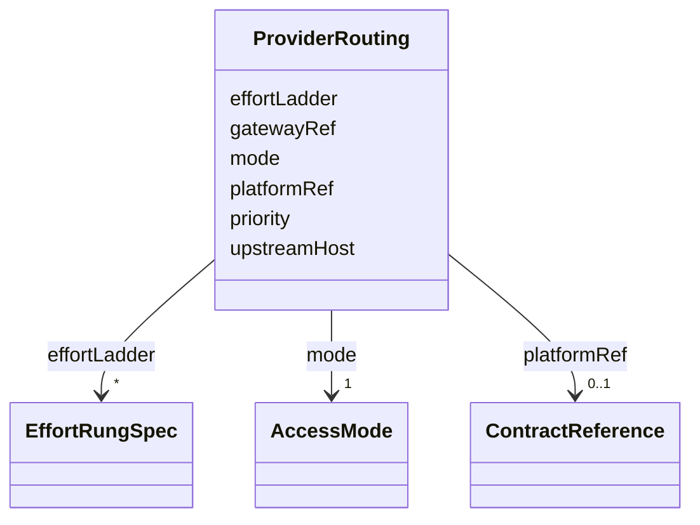

---
search:
  boost: 10.0
---

# Class: ProviderRouting

<div data-search-exclude markdown="1">


URI: [jumo:ProviderRouting](https://jumo.dev/schemas/jumo-v1/ProviderRouting)





<!-- no inheritance hierarchy -->

## Slots

| Name | Cardinality and Range | Description | Inheritance |
| ---  | --- | --- | --- |
| [priority](priority.md) | 0..1 <br/> [Integer](Integer.md) | Deterministic account selection order for a compatible worker requirement pro... | direct |
| [mode](mode.md) | 1 <br/> [AccessMode](AccessMode.md) |  | direct |
| [gatewayRef](gatewayRef.md) | 0..1 <br/> [ConfigurationRef](ConfigurationRef.md) | Required when mode is GATEWAY_ROUTED; forbidden when PLAN_DIRECT (Rego) | direct |
| [platformRef](platformRef.md) | 0..1 <br/> [ContractReference](ContractReference.md) | The ProviderPlatform catalog entry this account was opened against | direct |
| [upstreamHost](upstreamHost.md) | 0..1 <br/> [String](String.md) | Required exactly when the referenced ProviderPlatform declares hostDeclaredBy... | direct |
| [effortLadder](effortLadder.md) | * <br/> [EffortRungSpec](EffortRungSpec.md) | Overrides the platform's defaultEffortLadder rung for rung when declared | direct |


## Usages

| used by | used in | type | used |
| ---  | --- | --- | --- |
| [ProviderAccountSpec](ProviderAccountSpec.md) | [routing](routing.md) | range | [ProviderRouting](ProviderRouting.md) |


## Identifier and Mapping Information


### Annotations

| property | value |
| --- | --- |
| jumo.state_authority | GIT |
| jumo.model_role | VALUE_OBJECT |
| jumo.audience | REALM_PRIVATE |
| jumo.sensitivity | INTERNAL |
| jumo.boundary_eligible | True |
| jumo.schema_profiles | draft-2020-12,native-json-schema,prompted-json-validated |


### Schema Source


* from schema: https://jumo.dev/schemas/jumo-v1


## Mappings

| Mapping Type | Mapped Value |
| ---  | ---  |
| self | jumo:ProviderRouting |
| native | jumo:ProviderRouting |


## LinkML Source

<!-- TODO: investigate https://stackoverflow.com/questions/37606292/how-to-create-tabbed-code-blocks-in-mkdocs-or-sphinx -->

### Direct

<details>
```yaml
name: ProviderRouting
annotations:
  jumo.state_authority:
    tag: jumo.state_authority
    value: GIT
  jumo.model_role:
    tag: jumo.model_role
    value: VALUE_OBJECT
  jumo.audience:
    tag: jumo.audience
    value: REALM_PRIVATE
  jumo.sensitivity:
    tag: jumo.sensitivity
    value: INTERNAL
  jumo.boundary_eligible:
    tag: jumo.boundary_eligible
    value: true
  jumo.schema_profiles:
    tag: jumo.schema_profiles
    value: draft-2020-12,native-json-schema,prompted-json-validated
from_schema: https://jumo.dev/schemas/jumo-v1
attributes:
  priority:
    name: priority
    description: Deterministic account selection order for a compatible worker requirement
      profile. Lower values are selected first.
    from_schema: https://jumo.dev/schemas/jumo-v1
    rank: 1000
    owner: ProviderRouting
    domain_of:
    - ProviderRouting
    range: integer
    minimum_value: 1
  mode:
    name: mode
    from_schema: https://jumo.dev/schemas/jumo-v1
    owner: ProviderRouting
    domain_of:
    - AcknowledgementPolicy
    - ExecutionCellTransport
    - ProviderRouting
    - WorkerModelAccess
    range: AccessMode
    required: true
  gatewayRef:
    name: gatewayRef
    description: Required when mode is GATEWAY_ROUTED; forbidden when PLAN_DIRECT
      (Rego).
    from_schema: https://jumo.dev/schemas/jumo-v1
    rank: 1000
    owner: ProviderRouting
    domain_of:
    - ProviderRouting
    - WorkerModelAccess
    range: ConfigurationRef
  platformRef:
    name: platformRef
    description: The ProviderPlatform catalog entry this account was opened against.
      Required when mode is GATEWAY_ROUTED; forbidden when PLAN_DIRECT, which has
      no upstream provider-egress traffic (Rego).
    from_schema: https://jumo.dev/schemas/jumo-v1
    rank: 1000
    owner: ProviderRouting
    domain_of:
    - ProviderRouting
    range: ContractReference
    inlined: true
  upstreamHost:
    name: upstreamHost
    description: Required exactly when the referenced ProviderPlatform declares hostDeclaredByAccount
      true (a generic platform such as an OpenAI-compatible aggregator); forbidden
      otherwise (Rego).
    from_schema: https://jumo.dev/schemas/jumo-v1
    rank: 1000
    owner: ProviderRouting
    domain_of:
    - ProviderRouting
    - ProviderPlatformSpec
    range: string
  effortLadder:
    name: effortLadder
    description: Overrides the platform's defaultEffortLadder rung for rung when declared.
      Absent by default, so a newly declared account inherits the platform's ladder
      and is routable immediately -- the fix for the N-times-M dead account problem
      a per-account requirementAliases list produced.
    from_schema: https://jumo.dev/schemas/jumo-v1
    rank: 1000
    owner: ProviderRouting
    domain_of:
    - ProviderRouting
    range: EffortRungSpec
    multivalued: true
    inlined: true
    inlined_as_list: true

```
</details>

### Induced

<details>
```yaml
name: ProviderRouting
annotations:
  jumo.state_authority:
    tag: jumo.state_authority
    value: GIT
  jumo.model_role:
    tag: jumo.model_role
    value: VALUE_OBJECT
  jumo.audience:
    tag: jumo.audience
    value: REALM_PRIVATE
  jumo.sensitivity:
    tag: jumo.sensitivity
    value: INTERNAL
  jumo.boundary_eligible:
    tag: jumo.boundary_eligible
    value: true
  jumo.schema_profiles:
    tag: jumo.schema_profiles
    value: draft-2020-12,native-json-schema,prompted-json-validated
from_schema: https://jumo.dev/schemas/jumo-v1
attributes:
  priority:
    name: priority
    description: Deterministic account selection order for a compatible worker requirement
      profile. Lower values are selected first.
    from_schema: https://jumo.dev/schemas/jumo-v1
    rank: 1000
    owner: ProviderRouting
    domain_of:
    - ProviderRouting
    range: integer
    minimum_value: 1
  mode:
    name: mode
    from_schema: https://jumo.dev/schemas/jumo-v1
    owner: ProviderRouting
    domain_of:
    - AcknowledgementPolicy
    - ExecutionCellTransport
    - ProviderRouting
    - WorkerModelAccess
    range: AccessMode
    required: true
  gatewayRef:
    name: gatewayRef
    description: Required when mode is GATEWAY_ROUTED; forbidden when PLAN_DIRECT
      (Rego).
    from_schema: https://jumo.dev/schemas/jumo-v1
    rank: 1000
    owner: ProviderRouting
    domain_of:
    - ProviderRouting
    - WorkerModelAccess
    range: ConfigurationRef
  platformRef:
    name: platformRef
    description: The ProviderPlatform catalog entry this account was opened against.
      Required when mode is GATEWAY_ROUTED; forbidden when PLAN_DIRECT, which has
      no upstream provider-egress traffic (Rego).
    from_schema: https://jumo.dev/schemas/jumo-v1
    rank: 1000
    owner: ProviderRouting
    domain_of:
    - ProviderRouting
    range: ContractReference
    inlined: true
  upstreamHost:
    name: upstreamHost
    description: Required exactly when the referenced ProviderPlatform declares hostDeclaredByAccount
      true (a generic platform such as an OpenAI-compatible aggregator); forbidden
      otherwise (Rego).
    from_schema: https://jumo.dev/schemas/jumo-v1
    rank: 1000
    owner: ProviderRouting
    domain_of:
    - ProviderRouting
    - ProviderPlatformSpec
    range: string
  effortLadder:
    name: effortLadder
    description: Overrides the platform's defaultEffortLadder rung for rung when declared.
      Absent by default, so a newly declared account inherits the platform's ladder
      and is routable immediately -- the fix for the N-times-M dead account problem
      a per-account requirementAliases list produced.
    from_schema: https://jumo.dev/schemas/jumo-v1
    rank: 1000
    owner: ProviderRouting
    domain_of:
    - ProviderRouting
    range: EffortRungSpec
    multivalued: true
    inlined: true
    inlined_as_list: true

```
</details></div>