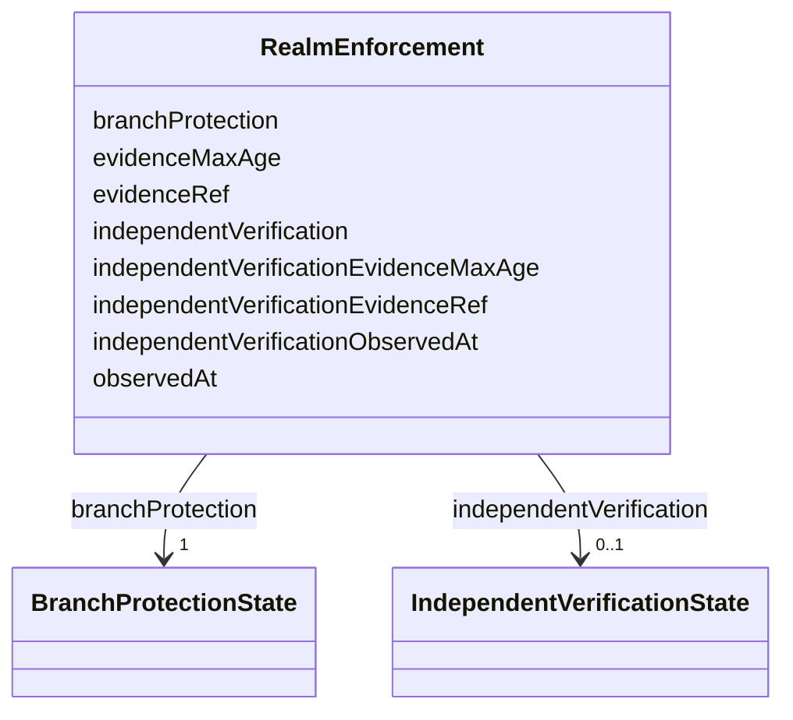

---
search:
  boost: 10.0
---

# Class: RealmEnforcement


_ENFORCED requiring observedAt/evidenceRef/evidenceMaxAge moves to Rego: claiming enforcement costs an observation and a reference to it._


<div data-search-exclude markdown="1">


URI: [jumo:RealmEnforcement](https://jumo.dev/schemas/jumo-v1/RealmEnforcement)





<!-- no inheritance hierarchy -->

## Slots

| Name | Cardinality and Range | Description | Inheritance |
| ---  | --- | --- | --- |
| [branchProtection](branchProtection.md) | 1 <br/> [BranchProtectionState](BranchProtectionState.md) |  | direct |
| [observedAt](observedAt.md) | 0..1 <br/> [Datetime](Datetime.md) |  | direct |
| [evidenceRef](evidenceRef.md) | 0..1 <br/> [String](String.md) |  | direct |
| [evidenceMaxAge](evidenceMaxAge.md) | 0..1 <br/> [Duration](Duration.md) | Maximum age of the Forge protection observation before an autonomy gate must ... | direct |
| [independentVerification](independentVerification.md) | 0..1 <br/> [IndependentVerificationState](IndependentVerificationState.md) | Optional, additive claim distinct from branchProtection | direct |
| [independentVerificationObservedAt](independentVerificationObservedAt.md) | 0..1 <br/> [Datetime](Datetime.md) |  | direct |
| [independentVerificationEvidenceRef](independentVerificationEvidenceRef.md) | 0..1 <br/> [String](String.md) |  | direct |
| [independentVerificationEvidenceMaxAge](independentVerificationEvidenceMaxAge.md) | 0..1 <br/> [Duration](Duration.md) | Maximum age of the independent-verification observation before its ENFORCED c... | direct |


## Usages

| used by | used in | type | used |
| ---  | --- | --- | --- |
| [RealmTemplateSpec](RealmTemplateSpec.md) | [enforcement](enforcement.md) | range | [RealmEnforcement](RealmEnforcement.md) |


## Identifier and Mapping Information


### Annotations

| property | value |
| --- | --- |
| jumo.state_authority | GIT |
| jumo.model_role | VALUE_OBJECT |
| jumo.audience | REALM_PRIVATE |
| jumo.sensitivity | INTERNAL |
| jumo.boundary_eligible | True |
| jumo.schema_profiles | draft-2020-12,native-json-schema,prompted-json-validated |


### Schema Source


* from schema: https://jumo.dev/schemas/jumo-v1


## Mappings

| Mapping Type | Mapped Value |
| ---  | ---  |
| self | jumo:RealmEnforcement |
| native | jumo:RealmEnforcement |


## LinkML Source

<!-- TODO: investigate https://stackoverflow.com/questions/37606292/how-to-create-tabbed-code-blocks-in-mkdocs-or-sphinx -->

### Direct

<details>
```yaml
name: RealmEnforcement
annotations:
  jumo.state_authority:
    tag: jumo.state_authority
    value: GIT
  jumo.model_role:
    tag: jumo.model_role
    value: VALUE_OBJECT
  jumo.audience:
    tag: jumo.audience
    value: REALM_PRIVATE
  jumo.sensitivity:
    tag: jumo.sensitivity
    value: INTERNAL
  jumo.boundary_eligible:
    tag: jumo.boundary_eligible
    value: true
  jumo.schema_profiles:
    tag: jumo.schema_profiles
    value: draft-2020-12,native-json-schema,prompted-json-validated
description: 'ENFORCED requiring observedAt/evidenceRef/evidenceMaxAge moves to Rego:
  claiming enforcement costs an observation and a reference to it.'
from_schema: https://jumo.dev/schemas/jumo-v1
attributes:
  branchProtection:
    name: branchProtection
    from_schema: https://jumo.dev/schemas/jumo-v1
    rank: 1000
    owner: RealmEnforcement
    domain_of:
    - RealmEnforcement
    range: BranchProtectionState
    required: true
  observedAt:
    name: observedAt
    from_schema: https://jumo.dev/schemas/jumo-v1
    rank: 1000
    owner: RealmEnforcement
    domain_of:
    - RealmEnforcement
    - MachineInventoryObservation
    - CliInstallationObservation
    - McpCatalogProvenancePin
    - McpCatalogFieldCandidate
    - RemoteMcpAppraisalSpec
    - ChangeSetProjection
    range: datetime
  evidenceRef:
    name: evidenceRef
    from_schema: https://jumo.dev/schemas/jumo-v1
    rank: 1000
    owner: RealmEnforcement
    domain_of:
    - RealmEnforcement
    - ImprovementObservation
    range: string
    pattern: ^.{1,}$
  evidenceMaxAge:
    name: evidenceMaxAge
    description: Maximum age of the Forge protection observation before an autonomy
      gate must treat the claim as stale (ADR-0028, default PT24H).
    from_schema: https://jumo.dev/schemas/jumo-v1
    rank: 1000
    owner: RealmEnforcement
    domain_of:
    - RealmEnforcement
    range: Duration
  independentVerification:
    name: independentVerification
    description: 'Optional, additive claim distinct from branchProtection. Not wired
      into whether the corpus.independence.* rules apply -- those keep running unconditionally
      regardless of this field. Only claiming ENFORCED here has any effect: it must
      then carry its own fresh independentVerificationObservedAt/independentVerificationEvidenceRef
      within independentVerificationEvidenceMaxAge (Rego), same evidence-costs-a-claim
      shape as branchProtection.'
    from_schema: https://jumo.dev/schemas/jumo-v1
    rank: 1000
    owner: RealmEnforcement
    domain_of:
    - RealmEnforcement
    range: IndependentVerificationState
  independentVerificationObservedAt:
    name: independentVerificationObservedAt
    from_schema: https://jumo.dev/schemas/jumo-v1
    rank: 1000
    owner: RealmEnforcement
    domain_of:
    - RealmEnforcement
    range: datetime
  independentVerificationEvidenceRef:
    name: independentVerificationEvidenceRef
    from_schema: https://jumo.dev/schemas/jumo-v1
    rank: 1000
    owner: RealmEnforcement
    domain_of:
    - RealmEnforcement
    range: string
    pattern: ^.{1,}$
  independentVerificationEvidenceMaxAge:
    name: independentVerificationEvidenceMaxAge
    description: Maximum age of the independent-verification observation before its
      ENFORCED claim must be treated as stale, default PT24H.
    from_schema: https://jumo.dev/schemas/jumo-v1
    rank: 1000
    owner: RealmEnforcement
    domain_of:
    - RealmEnforcement
    range: Duration

```
</details>

### Induced

<details>
```yaml
name: RealmEnforcement
annotations:
  jumo.state_authority:
    tag: jumo.state_authority
    value: GIT
  jumo.model_role:
    tag: jumo.model_role
    value: VALUE_OBJECT
  jumo.audience:
    tag: jumo.audience
    value: REALM_PRIVATE
  jumo.sensitivity:
    tag: jumo.sensitivity
    value: INTERNAL
  jumo.boundary_eligible:
    tag: jumo.boundary_eligible
    value: true
  jumo.schema_profiles:
    tag: jumo.schema_profiles
    value: draft-2020-12,native-json-schema,prompted-json-validated
description: 'ENFORCED requiring observedAt/evidenceRef/evidenceMaxAge moves to Rego:
  claiming enforcement costs an observation and a reference to it.'
from_schema: https://jumo.dev/schemas/jumo-v1
attributes:
  branchProtection:
    name: branchProtection
    from_schema: https://jumo.dev/schemas/jumo-v1
    rank: 1000
    owner: RealmEnforcement
    domain_of:
    - RealmEnforcement
    range: BranchProtectionState
    required: true
  observedAt:
    name: observedAt
    from_schema: https://jumo.dev/schemas/jumo-v1
    rank: 1000
    owner: RealmEnforcement
    domain_of:
    - RealmEnforcement
    - MachineInventoryObservation
    - CliInstallationObservation
    - McpCatalogProvenancePin
    - McpCatalogFieldCandidate
    - RemoteMcpAppraisalSpec
    - ChangeSetProjection
    range: datetime
  evidenceRef:
    name: evidenceRef
    from_schema: https://jumo.dev/schemas/jumo-v1
    rank: 1000
    owner: RealmEnforcement
    domain_of:
    - RealmEnforcement
    - ImprovementObservation
    range: string
    pattern: ^.{1,}$
  evidenceMaxAge:
    name: evidenceMaxAge
    description: Maximum age of the Forge protection observation before an autonomy
      gate must treat the claim as stale (ADR-0028, default PT24H).
    from_schema: https://jumo.dev/schemas/jumo-v1
    rank: 1000
    owner: RealmEnforcement
    domain_of:
    - RealmEnforcement
    range: Duration
  independentVerification:
    name: independentVerification
    description: 'Optional, additive claim distinct from branchProtection. Not wired
      into whether the corpus.independence.* rules apply -- those keep running unconditionally
      regardless of this field. Only claiming ENFORCED here has any effect: it must
      then carry its own fresh independentVerificationObservedAt/independentVerificationEvidenceRef
      within independentVerificationEvidenceMaxAge (Rego), same evidence-costs-a-claim
      shape as branchProtection.'
    from_schema: https://jumo.dev/schemas/jumo-v1
    rank: 1000
    owner: RealmEnforcement
    domain_of:
    - RealmEnforcement
    range: IndependentVerificationState
  independentVerificationObservedAt:
    name: independentVerificationObservedAt
    from_schema: https://jumo.dev/schemas/jumo-v1
    rank: 1000
    owner: RealmEnforcement
    domain_of:
    - RealmEnforcement
    range: datetime
  independentVerificationEvidenceRef:
    name: independentVerificationEvidenceRef
    from_schema: https://jumo.dev/schemas/jumo-v1
    rank: 1000
    owner: RealmEnforcement
    domain_of:
    - RealmEnforcement
    range: string
    pattern: ^.{1,}$
  independentVerificationEvidenceMaxAge:
    name: independentVerificationEvidenceMaxAge
    description: Maximum age of the independent-verification observation before its
      ENFORCED claim must be treated as stale, default PT24H.
    from_schema: https://jumo.dev/schemas/jumo-v1
    rank: 1000
    owner: RealmEnforcement
    domain_of:
    - RealmEnforcement
    range: Duration

```
</details></div>