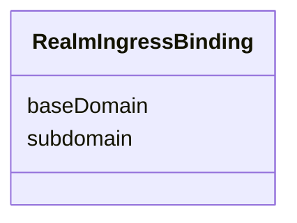

---
search:
  boost: 10.0
---

# Class: RealmIngressBinding


_Per-tenant DNS routing for one RealmTemplate. `baseDomain` is deliberately not named `canonicalDomain` or `hostname`: OfferingTopology.canonicalDomain and OfferingTopology.hostname (this same module) already use both names for an inclusion flag, not a domain value -- a third reuse of either name for a different shape would recreate the exact collision the `ProjectionSource`/`ProjectionSpec` naming warns against elsewhere in this metamodel. Deliberately carries no audience, policy, capability or other authority-bearing attribute: Rego refusing two RealmTemplates the same hostname protects routing correctness, not authorization -- that stays on RealmEnforcement._


<div data-search-exclude markdown="1">


URI: [jumo:RealmIngressBinding](https://jumo.dev/schemas/jumo-v1/RealmIngressBinding)





<!-- no inheritance hierarchy -->

## Slots

| Name | Cardinality and Range | Description | Inheritance |
| ---  | --- | --- | --- |
| [subdomain](subdomain.md) | 1 <br/> [String](String.md) | DNS label distinguishing this Realm's hostname under baseDomain | direct |
| [baseDomain](baseDomain.md) | 1 <br/> [String](String.md) | The parent domain subdomain is bound under, e | direct |


## Usages

| used by | used in | type | used |
| ---  | --- | --- | --- |
| [RealmTemplateSpec](RealmTemplateSpec.md) | [ingress](ingress.md) | range | [RealmIngressBinding](RealmIngressBinding.md) |


## Identifier and Mapping Information


### Annotations

| property | value |
| --- | --- |
| jumo.state_authority | NONE |
| jumo.model_role | VALUE_OBJECT |
| jumo.audience | REALM_PRIVATE |
| jumo.sensitivity | INTERNAL |
| jumo.boundary_eligible | True |
| jumo.schema_profiles | draft-2020-12,native-json-schema,prompted-json-validated |


### Schema Source


* from schema: https://jumo.dev/schemas/jumo-v1


## Mappings

| Mapping Type | Mapped Value |
| ---  | ---  |
| self | jumo:RealmIngressBinding |
| native | jumo:RealmIngressBinding |


## LinkML Source

<!-- TODO: investigate https://stackoverflow.com/questions/37606292/how-to-create-tabbed-code-blocks-in-mkdocs-or-sphinx -->

### Direct

<details>
```yaml
name: RealmIngressBinding
annotations:
  jumo.state_authority:
    tag: jumo.state_authority
    value: NONE
  jumo.model_role:
    tag: jumo.model_role
    value: VALUE_OBJECT
  jumo.audience:
    tag: jumo.audience
    value: REALM_PRIVATE
  jumo.sensitivity:
    tag: jumo.sensitivity
    value: INTERNAL
  jumo.boundary_eligible:
    tag: jumo.boundary_eligible
    value: true
  jumo.schema_profiles:
    tag: jumo.schema_profiles
    value: draft-2020-12,native-json-schema,prompted-json-validated
description: 'Per-tenant DNS routing for one RealmTemplate. `baseDomain` is deliberately
  not named `canonicalDomain` or `hostname`: OfferingTopology.canonicalDomain and
  OfferingTopology.hostname (this same module) already use both names for an inclusion
  flag, not a domain value -- a third reuse of either name for a different shape would
  recreate the exact collision the `ProjectionSource`/`ProjectionSpec` naming warns
  against elsewhere in this metamodel. Deliberately carries no audience, policy, capability
  or other authority-bearing attribute: Rego refusing two RealmTemplates the same
  hostname protects routing correctness, not authorization -- that stays on RealmEnforcement.'
from_schema: https://jumo.dev/schemas/jumo-v1
attributes:
  subdomain:
    name: subdomain
    description: DNS label distinguishing this Realm's hostname under baseDomain.
    from_schema: https://jumo.dev/schemas/jumo-v1
    rank: 1000
    owner: RealmIngressBinding
    domain_of:
    - RealmIngressBinding
    range: string
    required: true
    pattern: ^[a-z0-9]([a-z0-9-]{0,61}[a-z0-9])?$
  baseDomain:
    name: baseDomain
    description: The parent domain subdomain is bound under, e.g. jumo.dev or a client-owned
      domain.
    from_schema: https://jumo.dev/schemas/jumo-v1
    rank: 1000
    owner: RealmIngressBinding
    domain_of:
    - RealmIngressBinding
    range: string
    required: true
    pattern: ^[a-z0-9]([a-z0-9-]{0,61}[a-z0-9])?(\.[a-z0-9]([a-z0-9-]{0,61}[a-z0-9])?)+$

```
</details>

### Induced

<details>
```yaml
name: RealmIngressBinding
annotations:
  jumo.state_authority:
    tag: jumo.state_authority
    value: NONE
  jumo.model_role:
    tag: jumo.model_role
    value: VALUE_OBJECT
  jumo.audience:
    tag: jumo.audience
    value: REALM_PRIVATE
  jumo.sensitivity:
    tag: jumo.sensitivity
    value: INTERNAL
  jumo.boundary_eligible:
    tag: jumo.boundary_eligible
    value: true
  jumo.schema_profiles:
    tag: jumo.schema_profiles
    value: draft-2020-12,native-json-schema,prompted-json-validated
description: 'Per-tenant DNS routing for one RealmTemplate. `baseDomain` is deliberately
  not named `canonicalDomain` or `hostname`: OfferingTopology.canonicalDomain and
  OfferingTopology.hostname (this same module) already use both names for an inclusion
  flag, not a domain value -- a third reuse of either name for a different shape would
  recreate the exact collision the `ProjectionSource`/`ProjectionSpec` naming warns
  against elsewhere in this metamodel. Deliberately carries no audience, policy, capability
  or other authority-bearing attribute: Rego refusing two RealmTemplates the same
  hostname protects routing correctness, not authorization -- that stays on RealmEnforcement.'
from_schema: https://jumo.dev/schemas/jumo-v1
attributes:
  subdomain:
    name: subdomain
    description: DNS label distinguishing this Realm's hostname under baseDomain.
    from_schema: https://jumo.dev/schemas/jumo-v1
    rank: 1000
    owner: RealmIngressBinding
    domain_of:
    - RealmIngressBinding
    range: string
    required: true
    pattern: ^[a-z0-9]([a-z0-9-]{0,61}[a-z0-9])?$
  baseDomain:
    name: baseDomain
    description: The parent domain subdomain is bound under, e.g. jumo.dev or a client-owned
      domain.
    from_schema: https://jumo.dev/schemas/jumo-v1
    rank: 1000
    owner: RealmIngressBinding
    domain_of:
    - RealmIngressBinding
    range: string
    required: true
    pattern: ^[a-z0-9]([a-z0-9-]{0,61}[a-z0-9])?(\.[a-z0-9]([a-z0-9-]{0,61}[a-z0-9])?)+$

```
</details></div>