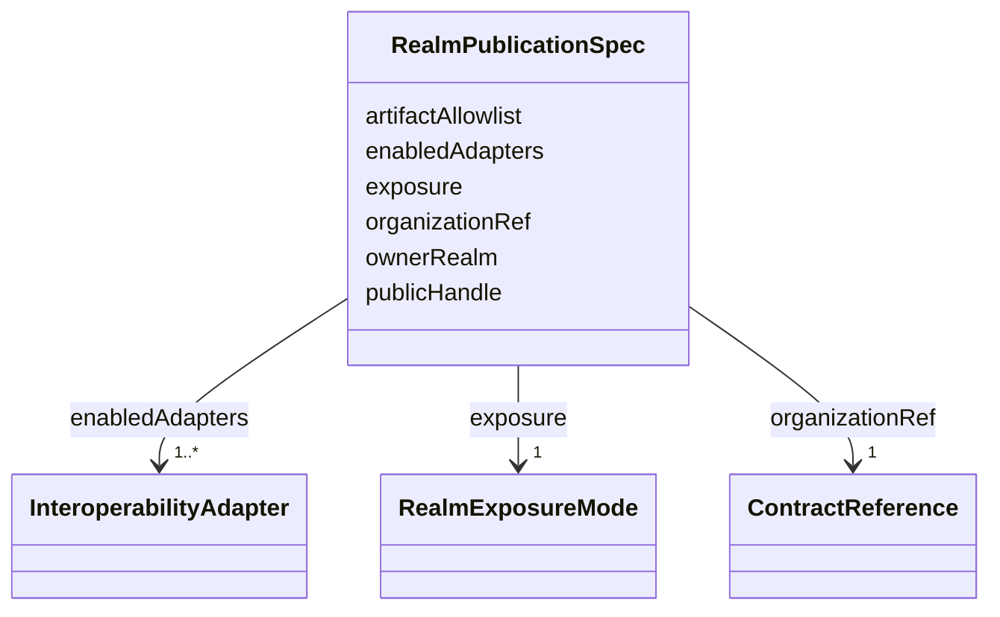

---
search:
  boost: 10.0
---

# Class: RealmPublicationSpec

<div data-search-exclude markdown="1">


URI: [jumo:RealmPublicationSpec](https://jumo.dev/schemas/jumo-v1/RealmPublicationSpec)





<!-- no inheritance hierarchy -->

## Slots

| Name | Cardinality and Range | Description | Inheritance |
| ---  | --- | --- | --- |
| [ownerRealm](ownerRealm.md) | 1 <br/> [Identifier](Identifier.md) |  | direct |
| [organizationRef](organizationRef.md) | 1 <br/> [ContractReference](ContractReference.md) |  | direct |
| [publicHandle](publicHandle.md) | 1 <br/> [String](String.md) |  | direct |
| [exposure](exposure.md) | 1 <br/> [RealmExposureMode](RealmExposureMode.md) |  | direct |
| [enabledAdapters](enabledAdapters.md) | 1..* <br/> [InteroperabilityAdapter](InteroperabilityAdapter.md) |  | direct |
| [artifactAllowlist](artifactAllowlist.md) | 1..* <br/> [String](String.md) |  | direct |


## Usages

| used by | used in | type | used |
| ---  | --- | --- | --- |
| [RealmPublication](RealmPublication.md) | [spec](spec.md) | range | [RealmPublicationSpec](RealmPublicationSpec.md) |


## Identifier and Mapping Information


### Annotations

| property | value |
| --- | --- |
| jumo.state_authority | GIT |
| jumo.model_role | VALUE_OBJECT |
| jumo.audience | REALM_PRIVATE |
| jumo.sensitivity | INTERNAL |
| jumo.boundary_eligible | True |
| jumo.schema_profiles | draft-2020-12,native-json-schema,prompted-json-validated |


### Schema Source


* from schema: https://jumo.dev/schemas/jumo-v1


## Mappings

| Mapping Type | Mapped Value |
| ---  | ---  |
| self | jumo:RealmPublicationSpec |
| native | jumo:RealmPublicationSpec |


## LinkML Source

<!-- TODO: investigate https://stackoverflow.com/questions/37606292/how-to-create-tabbed-code-blocks-in-mkdocs-or-sphinx -->

### Direct

<details>
```yaml
name: RealmPublicationSpec
annotations:
  jumo.state_authority:
    tag: jumo.state_authority
    value: GIT
  jumo.model_role:
    tag: jumo.model_role
    value: VALUE_OBJECT
  jumo.audience:
    tag: jumo.audience
    value: REALM_PRIVATE
  jumo.sensitivity:
    tag: jumo.sensitivity
    value: INTERNAL
  jumo.boundary_eligible:
    tag: jumo.boundary_eligible
    value: true
  jumo.schema_profiles:
    tag: jumo.schema_profiles
    value: draft-2020-12,native-json-schema,prompted-json-validated
from_schema: https://jumo.dev/schemas/jumo-v1
attributes:
  ownerRealm:
    name: ownerRealm
    from_schema: https://jumo.dev/schemas/jumo-v1
    owner: RealmPublicationSpec
    domain_of:
    - PrincipalSpec
    - PrincipalIdentityBindingSpec
    - ProjectSpec
    - KitBindingSpec
    - KitLockSpec
    - RoleDefinitionSpec
    - RoleAssignmentSpec
    - TeamSpecBody
    - CoordinationProfileSpec
    - RoutingEligibilitySpec
    - RoleLifecyclePolicySpec
    - OrganizationTemplateSpec
    - ChiefOfStaffProfileSpec
    - AdvisorProfileSpec
    - PersonalSpaceSpec
    - OrganizationSpecBody
    - RealmPublicationSpec
    - CapabilityProfileSpec
    - WorkerRequirementProfileSpec
    - GoldenTaskSetSpec
    - ImprovementLoopSpec
    - ControlCatalogSpec
    - ComplianceProfileSpec
    - EvidenceProfileSpec
    - ProcessSpecBody
    - ChangeProposalRef
    - ForgeProjectionRef
    - ProcessRunRef
    - ApprovalSignal
    - ExecutionCellProvisioningRef
    - ExecutionMachineSpec
    - MachineHostDefinitionSpec
    - McpRegistrySourceBindingSpec
    - ConnectorDefinitionSpec
    - ConnectorAppraisalSpec
    - McpBundleSpec
    - RemoteMcpServiceSpec
    - RemoteMcpAppraisalSpec
    - ExecutionCellSpec
    - ProviderSessionBinding
    - RoutingDecision
    - WorkerInvocation
    - EvidenceRecord
    - InvocationAuthorizationReceipt
    - SecretBindingSpec
    - FederatedPeerSpec
    - FederationProfileSpec
    - WorkerSubstrateSpec
    - McpInventorySnapshot
    - ConnectorIntegrationSpec
    - OAuthClientBindingSpec
    - InterfaceSurfaceSpec
    - VocabularySetSpec
    - ProjectionSpecBody
    range: Identifier
    required: true
  organizationRef:
    name: organizationRef
    from_schema: https://jumo.dev/schemas/jumo-v1
    owner: RealmPublicationSpec
    domain_of:
    - OrganizationAccessBindingSpec
    - OrganizationEnrollmentPolicySpec
    - OrganizationAuditRetentionPolicySpec
    - OrganizationRetentionHoldSpec
    - OrganizationPublicationPolicySpec
    - RealmPublicationSpec
    range: ContractReference
    required: true
    inlined: true
  publicHandle:
    name: publicHandle
    from_schema: https://jumo.dev/schemas/jumo-v1
    rank: 1000
    owner: RealmPublicationSpec
    domain_of:
    - RealmPublicationSpec
    range: string
    required: true
    pattern: ^[a-z0-9-_]{2,64}$
  exposure:
    name: exposure
    from_schema: https://jumo.dev/schemas/jumo-v1
    owner: RealmPublicationSpec
    domain_of:
    - RealmTemplateSpec
    - AgentCard
    - RealmPublicationSpec
    range: RealmExposureMode
    required: true
  enabledAdapters:
    name: enabledAdapters
    from_schema: https://jumo.dev/schemas/jumo-v1
    rank: 1000
    owner: RealmPublicationSpec
    domain_of:
    - RealmPublicationSpec
    range: InteroperabilityAdapter
    required: true
    multivalued: true
    minimum_cardinality: 1
  artifactAllowlist:
    name: artifactAllowlist
    from_schema: https://jumo.dev/schemas/jumo-v1
    rank: 1000
    owner: RealmPublicationSpec
    domain_of:
    - RealmPublicationSpec
    range: string
    required: true
    multivalued: true
    minimum_cardinality: 1

```
</details>

### Induced

<details>
```yaml
name: RealmPublicationSpec
annotations:
  jumo.state_authority:
    tag: jumo.state_authority
    value: GIT
  jumo.model_role:
    tag: jumo.model_role
    value: VALUE_OBJECT
  jumo.audience:
    tag: jumo.audience
    value: REALM_PRIVATE
  jumo.sensitivity:
    tag: jumo.sensitivity
    value: INTERNAL
  jumo.boundary_eligible:
    tag: jumo.boundary_eligible
    value: true
  jumo.schema_profiles:
    tag: jumo.schema_profiles
    value: draft-2020-12,native-json-schema,prompted-json-validated
from_schema: https://jumo.dev/schemas/jumo-v1
attributes:
  ownerRealm:
    name: ownerRealm
    from_schema: https://jumo.dev/schemas/jumo-v1
    owner: RealmPublicationSpec
    domain_of:
    - PrincipalSpec
    - PrincipalIdentityBindingSpec
    - ProjectSpec
    - KitBindingSpec
    - KitLockSpec
    - RoleDefinitionSpec
    - RoleAssignmentSpec
    - TeamSpecBody
    - CoordinationProfileSpec
    - RoutingEligibilitySpec
    - RoleLifecyclePolicySpec
    - OrganizationTemplateSpec
    - ChiefOfStaffProfileSpec
    - AdvisorProfileSpec
    - PersonalSpaceSpec
    - OrganizationSpecBody
    - RealmPublicationSpec
    - CapabilityProfileSpec
    - WorkerRequirementProfileSpec
    - GoldenTaskSetSpec
    - ImprovementLoopSpec
    - ControlCatalogSpec
    - ComplianceProfileSpec
    - EvidenceProfileSpec
    - ProcessSpecBody
    - ChangeProposalRef
    - ForgeProjectionRef
    - ProcessRunRef
    - ApprovalSignal
    - ExecutionCellProvisioningRef
    - ExecutionMachineSpec
    - MachineHostDefinitionSpec
    - McpRegistrySourceBindingSpec
    - ConnectorDefinitionSpec
    - ConnectorAppraisalSpec
    - McpBundleSpec
    - RemoteMcpServiceSpec
    - RemoteMcpAppraisalSpec
    - ExecutionCellSpec
    - ProviderSessionBinding
    - RoutingDecision
    - WorkerInvocation
    - EvidenceRecord
    - InvocationAuthorizationReceipt
    - SecretBindingSpec
    - FederatedPeerSpec
    - FederationProfileSpec
    - WorkerSubstrateSpec
    - McpInventorySnapshot
    - ConnectorIntegrationSpec
    - OAuthClientBindingSpec
    - InterfaceSurfaceSpec
    - VocabularySetSpec
    - ProjectionSpecBody
    range: Identifier
    required: true
  organizationRef:
    name: organizationRef
    from_schema: https://jumo.dev/schemas/jumo-v1
    owner: RealmPublicationSpec
    domain_of:
    - OrganizationAccessBindingSpec
    - OrganizationEnrollmentPolicySpec
    - OrganizationAuditRetentionPolicySpec
    - OrganizationRetentionHoldSpec
    - OrganizationPublicationPolicySpec
    - RealmPublicationSpec
    range: ContractReference
    required: true
    inlined: true
  publicHandle:
    name: publicHandle
    from_schema: https://jumo.dev/schemas/jumo-v1
    rank: 1000
    owner: RealmPublicationSpec
    domain_of:
    - RealmPublicationSpec
    range: string
    required: true
    pattern: ^[a-z0-9-_]{2,64}$
  exposure:
    name: exposure
    from_schema: https://jumo.dev/schemas/jumo-v1
    owner: RealmPublicationSpec
    domain_of:
    - RealmTemplateSpec
    - AgentCard
    - RealmPublicationSpec
    range: RealmExposureMode
    required: true
  enabledAdapters:
    name: enabledAdapters
    from_schema: https://jumo.dev/schemas/jumo-v1
    rank: 1000
    owner: RealmPublicationSpec
    domain_of:
    - RealmPublicationSpec
    range: InteroperabilityAdapter
    required: true
    multivalued: true
    minimum_cardinality: 1
  artifactAllowlist:
    name: artifactAllowlist
    from_schema: https://jumo.dev/schemas/jumo-v1
    rank: 1000
    owner: RealmPublicationSpec
    domain_of:
    - RealmPublicationSpec
    range: string
    required: true
    multivalued: true
    minimum_cardinality: 1

```
</details></div>