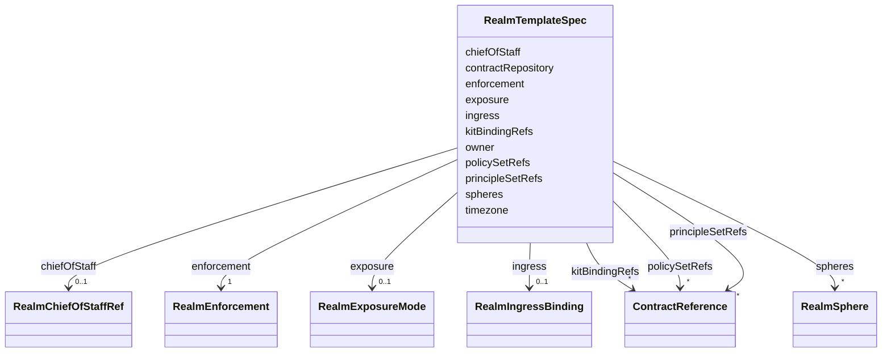

---
search:
  boost: 10.0
---

# Class: RealmTemplateSpec

<div data-search-exclude markdown="1">


URI: [jumo:RealmTemplateSpec](https://jumo.dev/schemas/jumo-v1/RealmTemplateSpec)





<!-- no inheritance hierarchy -->

## Slots

| Name | Cardinality and Range | Description | Inheritance |
| ---  | --- | --- | --- |
| [owner](owner.md) | 1 <br/> [String](String.md) | The canonical owner Principal | direct |
| [exposure](exposure.md) | 0..1 <br/> [RealmExposureMode](RealmExposureMode.md) | Realm exposure posture | direct |
| [spheres](spheres.md) | * <br/> [RealmSphere](RealmSphere.md) |  | direct |
| [chiefOfStaff](chiefOfStaff.md) | 0..1 <br/> [RealmChiefOfStaffRef](RealmChiefOfStaffRef.md) |  | direct |
| [timezone](timezone.md) | 0..1 <br/> [String](String.md) |  | direct |
| [ingress](ingress.md) | 0..1 <br/> [RealmIngressBinding](RealmIngressBinding.md) | Optional per-tenant subdomain routing | direct |
| [enforcement](enforcement.md) | 1 <br/> [RealmEnforcement](RealmEnforcement.md) |  | direct |
| [policySetRefs](policySetRefs.md) | * <br/> [ContractReference](ContractReference.md) | Relative paths to PolicySet documents | direct |
| [principleSetRefs](principleSetRefs.md) | * <br/> [ContractReference](ContractReference.md) | Relative paths to PrincipleSet documents | direct |
| [contractRepository](contractRepository.md) | 0..1 <br/> [String](String.md) | Target git repository URL or forge path for this Realm | direct |
| [kitBindingRefs](kitBindingRefs.md) | * <br/> [ContractReference](ContractReference.md) | Ordered list of kit bindings determining precedence | direct |


## Usages

| used by | used in | type | used |
| ---  | --- | --- | --- |
| [RealmTemplate](RealmTemplate.md) | [spec](spec.md) | range | [RealmTemplateSpec](RealmTemplateSpec.md) |


## Identifier and Mapping Information


### Annotations

| property | value |
| --- | --- |
| jumo.state_authority | GIT |
| jumo.model_role | VALUE_OBJECT |
| jumo.audience | REALM_PRIVATE |
| jumo.sensitivity | INTERNAL |
| jumo.boundary_eligible | True |
| jumo.schema_profiles | draft-2020-12,native-json-schema,prompted-json-validated |


### Schema Source


* from schema: https://jumo.dev/schemas/jumo-v1


## Mappings

| Mapping Type | Mapped Value |
| ---  | ---  |
| self | jumo:RealmTemplateSpec |
| native | jumo:RealmTemplateSpec |


## LinkML Source

<!-- TODO: investigate https://stackoverflow.com/questions/37606292/how-to-create-tabbed-code-blocks-in-mkdocs-or-sphinx -->

### Direct

<details>
```yaml
name: RealmTemplateSpec
annotations:
  jumo.state_authority:
    tag: jumo.state_authority
    value: GIT
  jumo.model_role:
    tag: jumo.model_role
    value: VALUE_OBJECT
  jumo.audience:
    tag: jumo.audience
    value: REALM_PRIVATE
  jumo.sensitivity:
    tag: jumo.sensitivity
    value: INTERNAL
  jumo.boundary_eligible:
    tag: jumo.boundary_eligible
    value: true
  jumo.schema_profiles:
    tag: jumo.schema_profiles
    value: draft-2020-12,native-json-schema,prompted-json-validated
from_schema: https://jumo.dev/schemas/jumo-v1
attributes:
  owner:
    name: owner
    description: The canonical owner Principal. A literal TODO is rejected (Rego).
    from_schema: https://jumo.dev/schemas/jumo-v1
    rank: 1000
    owner: RealmTemplateSpec
    domain_of:
    - RealmTemplateSpec
    range: string
    required: true
    pattern: ^.{2,}$
  exposure:
    name: exposure
    description: Realm exposure posture. Defaults to PRIVATE_STEALTH (fail-closed,
      invisible by default).
    from_schema: https://jumo.dev/schemas/jumo-v1
    rank: 1000
    ifabsent: PRIVATE_STEALTH
    owner: RealmTemplateSpec
    domain_of:
    - RealmTemplateSpec
    - AgentCard
    - RealmPublicationSpec
    range: RealmExposureMode
  spheres:
    name: spheres
    from_schema: https://jumo.dev/schemas/jumo-v1
    rank: 1000
    owner: RealmTemplateSpec
    domain_of:
    - RealmTemplateSpec
    range: RealmSphere
    multivalued: true
  chiefOfStaff:
    name: chiefOfStaff
    from_schema: https://jumo.dev/schemas/jumo-v1
    rank: 1000
    owner: RealmTemplateSpec
    domain_of:
    - RealmTemplateSpec
    range: RealmChiefOfStaffRef
    inlined: true
  timezone:
    name: timezone
    from_schema: https://jumo.dev/schemas/jumo-v1
    rank: 1000
    owner: RealmTemplateSpec
    domain_of:
    - RealmTemplateSpec
    range: string
    pattern: ^.{3,}$
  ingress:
    name: ingress
    description: Optional per-tenant subdomain routing. Absent for a Realm with no
      hosted hostname of its own, the same "field-free stays valid" shape as Project.repositoryBindings.
    from_schema: https://jumo.dev/schemas/jumo-v1
    rank: 1000
    owner: RealmTemplateSpec
    domain_of:
    - RealmTemplateSpec
    range: RealmIngressBinding
    inlined: true
  enforcement:
    name: enforcement
    from_schema: https://jumo.dev/schemas/jumo-v1
    rank: 1000
    owner: RealmTemplateSpec
    domain_of:
    - RealmTemplateSpec
    range: RealmEnforcement
    required: true
    inlined: true
  policySetRefs:
    name: policySetRefs
    description: Relative paths to PolicySet documents. Resolved and existence-checked
      (Rego).
    from_schema: https://jumo.dev/schemas/jumo-v1
    rank: 1000
    owner: RealmTemplateSpec
    domain_of:
    - RealmTemplateSpec
    range: ContractReference
    multivalued: true
    inlined: true
    inlined_as_list: true
  principleSetRefs:
    name: principleSetRefs
    description: Relative paths to PrincipleSet documents. Influence only.
    from_schema: https://jumo.dev/schemas/jumo-v1
    rank: 1000
    owner: RealmTemplateSpec
    domain_of:
    - RealmTemplateSpec
    range: ContractReference
    multivalued: true
    inlined: true
    inlined_as_list: true
  contractRepository:
    name: contractRepository
    description: Target git repository URL or forge path for this Realm.
    from_schema: https://jumo.dev/schemas/jumo-v1
    rank: 1000
    owner: RealmTemplateSpec
    domain_of:
    - RealmTemplateSpec
    - OrganizationBody
    range: string
  kitBindingRefs:
    name: kitBindingRefs
    description: Ordered list of kit bindings determining precedence.
    from_schema: https://jumo.dev/schemas/jumo-v1
    rank: 1000
    owner: RealmTemplateSpec
    domain_of:
    - RealmTemplateSpec
    range: ContractReference
    multivalued: true
    inlined: true
    inlined_as_list: true

```
</details>

### Induced

<details>
```yaml
name: RealmTemplateSpec
annotations:
  jumo.state_authority:
    tag: jumo.state_authority
    value: GIT
  jumo.model_role:
    tag: jumo.model_role
    value: VALUE_OBJECT
  jumo.audience:
    tag: jumo.audience
    value: REALM_PRIVATE
  jumo.sensitivity:
    tag: jumo.sensitivity
    value: INTERNAL
  jumo.boundary_eligible:
    tag: jumo.boundary_eligible
    value: true
  jumo.schema_profiles:
    tag: jumo.schema_profiles
    value: draft-2020-12,native-json-schema,prompted-json-validated
from_schema: https://jumo.dev/schemas/jumo-v1
attributes:
  owner:
    name: owner
    description: The canonical owner Principal. A literal TODO is rejected (Rego).
    from_schema: https://jumo.dev/schemas/jumo-v1
    rank: 1000
    owner: RealmTemplateSpec
    domain_of:
    - RealmTemplateSpec
    range: string
    required: true
    pattern: ^.{2,}$
  exposure:
    name: exposure
    description: Realm exposure posture. Defaults to PRIVATE_STEALTH (fail-closed,
      invisible by default).
    from_schema: https://jumo.dev/schemas/jumo-v1
    rank: 1000
    ifabsent: PRIVATE_STEALTH
    owner: RealmTemplateSpec
    domain_of:
    - RealmTemplateSpec
    - AgentCard
    - RealmPublicationSpec
    range: RealmExposureMode
  spheres:
    name: spheres
    from_schema: https://jumo.dev/schemas/jumo-v1
    rank: 1000
    owner: RealmTemplateSpec
    domain_of:
    - RealmTemplateSpec
    range: RealmSphere
    multivalued: true
  chiefOfStaff:
    name: chiefOfStaff
    from_schema: https://jumo.dev/schemas/jumo-v1
    rank: 1000
    owner: RealmTemplateSpec
    domain_of:
    - RealmTemplateSpec
    range: RealmChiefOfStaffRef
    inlined: true
  timezone:
    name: timezone
    from_schema: https://jumo.dev/schemas/jumo-v1
    rank: 1000
    owner: RealmTemplateSpec
    domain_of:
    - RealmTemplateSpec
    range: string
    pattern: ^.{3,}$
  ingress:
    name: ingress
    description: Optional per-tenant subdomain routing. Absent for a Realm with no
      hosted hostname of its own, the same "field-free stays valid" shape as Project.repositoryBindings.
    from_schema: https://jumo.dev/schemas/jumo-v1
    rank: 1000
    owner: RealmTemplateSpec
    domain_of:
    - RealmTemplateSpec
    range: RealmIngressBinding
    inlined: true
  enforcement:
    name: enforcement
    from_schema: https://jumo.dev/schemas/jumo-v1
    rank: 1000
    owner: RealmTemplateSpec
    domain_of:
    - RealmTemplateSpec
    range: RealmEnforcement
    required: true
    inlined: true
  policySetRefs:
    name: policySetRefs
    description: Relative paths to PolicySet documents. Resolved and existence-checked
      (Rego).
    from_schema: https://jumo.dev/schemas/jumo-v1
    rank: 1000
    owner: RealmTemplateSpec
    domain_of:
    - RealmTemplateSpec
    range: ContractReference
    multivalued: true
    inlined: true
    inlined_as_list: true
  principleSetRefs:
    name: principleSetRefs
    description: Relative paths to PrincipleSet documents. Influence only.
    from_schema: https://jumo.dev/schemas/jumo-v1
    rank: 1000
    owner: RealmTemplateSpec
    domain_of:
    - RealmTemplateSpec
    range: ContractReference
    multivalued: true
    inlined: true
    inlined_as_list: true
  contractRepository:
    name: contractRepository
    description: Target git repository URL or forge path for this Realm.
    from_schema: https://jumo.dev/schemas/jumo-v1
    rank: 1000
    owner: RealmTemplateSpec
    domain_of:
    - RealmTemplateSpec
    - OrganizationBody
    range: string
  kitBindingRefs:
    name: kitBindingRefs
    description: Ordered list of kit bindings determining precedence.
    from_schema: https://jumo.dev/schemas/jumo-v1
    rank: 1000
    owner: RealmTemplateSpec
    domain_of:
    - RealmTemplateSpec
    range: ContractReference
    multivalued: true
    inlined: true
    inlined_as_list: true

```
</details></div>