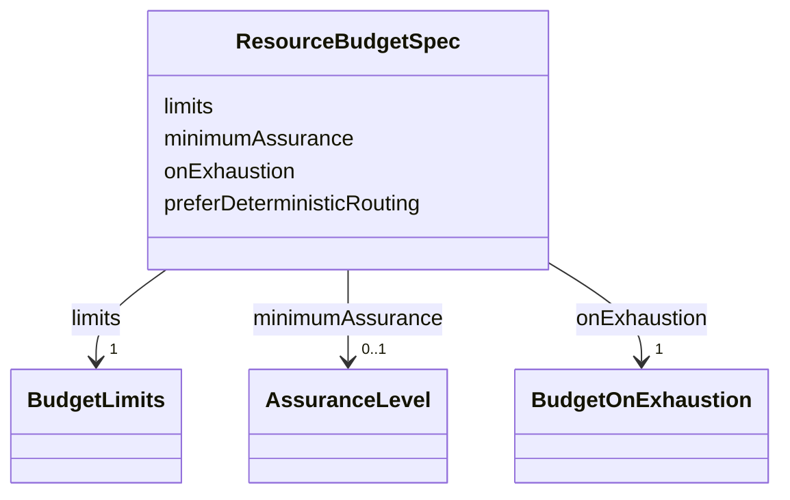

---
search:
  boost: 10.0
---

# Class: ResourceBudgetSpec

<div data-search-exclude markdown="1">


URI: [jumo:ResourceBudgetSpec](https://jumo.dev/schemas/jumo-v1/ResourceBudgetSpec)





<!-- no inheritance hierarchy -->

## Slots

| Name | Cardinality and Range | Description | Inheritance |
| ---  | --- | --- | --- |
| [limits](limits.md) | 1 <br/> [BudgetLimits](BudgetLimits.md) |  | direct |
| [minimumAssurance](minimumAssurance.md) | 0..1 <br/> [AssuranceLevel](AssuranceLevel.md) | A floor | direct |
| [onExhaustion](onExhaustion.md) | 1 <br/> [BudgetOnExhaustion](BudgetOnExhaustion.md) |  | direct |
| [preferDeterministicRouting](preferDeterministicRouting.md) | 0..1 <br/> [Boolean](Boolean.md) |  | direct |


## Usages

| used by | used in | type | used |
| ---  | --- | --- | --- |
| [ResourceBudget](ResourceBudget.md) | [spec](spec.md) | range | [ResourceBudgetSpec](ResourceBudgetSpec.md) |


## Identifier and Mapping Information


### Annotations

| property | value |
| --- | --- |
| jumo.state_authority | GIT |
| jumo.model_role | VALUE_OBJECT |
| jumo.audience | REALM_PRIVATE |
| jumo.sensitivity | INTERNAL |
| jumo.boundary_eligible | True |
| jumo.schema_profiles | draft-2020-12,native-json-schema,prompted-json-validated |


### Schema Source


* from schema: https://jumo.dev/schemas/jumo-v1


## Mappings

| Mapping Type | Mapped Value |
| ---  | ---  |
| self | jumo:ResourceBudgetSpec |
| native | jumo:ResourceBudgetSpec |


## LinkML Source

<!-- TODO: investigate https://stackoverflow.com/questions/37606292/how-to-create-tabbed-code-blocks-in-mkdocs-or-sphinx -->

### Direct

<details>
```yaml
name: ResourceBudgetSpec
annotations:
  jumo.state_authority:
    tag: jumo.state_authority
    value: GIT
  jumo.model_role:
    tag: jumo.model_role
    value: VALUE_OBJECT
  jumo.audience:
    tag: jumo.audience
    value: REALM_PRIVATE
  jumo.sensitivity:
    tag: jumo.sensitivity
    value: INTERNAL
  jumo.boundary_eligible:
    tag: jumo.boundary_eligible
    value: true
  jumo.schema_profiles:
    tag: jumo.schema_profiles
    value: draft-2020-12,native-json-schema,prompted-json-validated
from_schema: https://jumo.dev/schemas/jumo-v1
attributes:
  limits:
    name: limits
    from_schema: https://jumo.dev/schemas/jumo-v1
    owner: ResourceBudgetSpec
    domain_of:
    - WorkerRequirementProfileSpec
    - ResourceBudgetSpec
    - WorkerIsolation
    range: BudgetLimits
    required: true
    inlined: true
  minimumAssurance:
    name: minimumAssurance
    description: A floor. Exhaustion may never push the Episode below it without explicit
      policy and approval.
    from_schema: https://jumo.dev/schemas/jumo-v1
    owner: ResourceBudgetSpec
    domain_of:
    - WorkerQualityRequirement
    - PromptTemplateSpec
    - ResourceBudgetSpec
    - ActionCapability
    range: AssuranceLevel
  onExhaustion:
    name: onExhaustion
    from_schema: https://jumo.dev/schemas/jumo-v1
    owner: ResourceBudgetSpec
    domain_of:
    - ClarificationPolicy
    - ResourceBudgetSpec
    - ProviderAccountSpec
    range: BudgetOnExhaustion
    required: true
  preferDeterministicRouting:
    name: preferDeterministicRouting
    from_schema: https://jumo.dev/schemas/jumo-v1
    rank: 1000
    ifabsent: 'true'
    owner: ResourceBudgetSpec
    domain_of:
    - ResourceBudgetSpec
    range: boolean

```
</details>

### Induced

<details>
```yaml
name: ResourceBudgetSpec
annotations:
  jumo.state_authority:
    tag: jumo.state_authority
    value: GIT
  jumo.model_role:
    tag: jumo.model_role
    value: VALUE_OBJECT
  jumo.audience:
    tag: jumo.audience
    value: REALM_PRIVATE
  jumo.sensitivity:
    tag: jumo.sensitivity
    value: INTERNAL
  jumo.boundary_eligible:
    tag: jumo.boundary_eligible
    value: true
  jumo.schema_profiles:
    tag: jumo.schema_profiles
    value: draft-2020-12,native-json-schema,prompted-json-validated
from_schema: https://jumo.dev/schemas/jumo-v1
attributes:
  limits:
    name: limits
    from_schema: https://jumo.dev/schemas/jumo-v1
    owner: ResourceBudgetSpec
    domain_of:
    - WorkerRequirementProfileSpec
    - ResourceBudgetSpec
    - WorkerIsolation
    range: BudgetLimits
    required: true
    inlined: true
  minimumAssurance:
    name: minimumAssurance
    description: A floor. Exhaustion may never push the Episode below it without explicit
      policy and approval.
    from_schema: https://jumo.dev/schemas/jumo-v1
    owner: ResourceBudgetSpec
    domain_of:
    - WorkerQualityRequirement
    - PromptTemplateSpec
    - ResourceBudgetSpec
    - ActionCapability
    range: AssuranceLevel
  onExhaustion:
    name: onExhaustion
    from_schema: https://jumo.dev/schemas/jumo-v1
    owner: ResourceBudgetSpec
    domain_of:
    - ClarificationPolicy
    - ResourceBudgetSpec
    - ProviderAccountSpec
    range: BudgetOnExhaustion
    required: true
  preferDeterministicRouting:
    name: preferDeterministicRouting
    from_schema: https://jumo.dev/schemas/jumo-v1
    rank: 1000
    ifabsent: 'true'
    owner: ResourceBudgetSpec
    domain_of:
    - ResourceBudgetSpec
    range: boolean

```
</details></div>