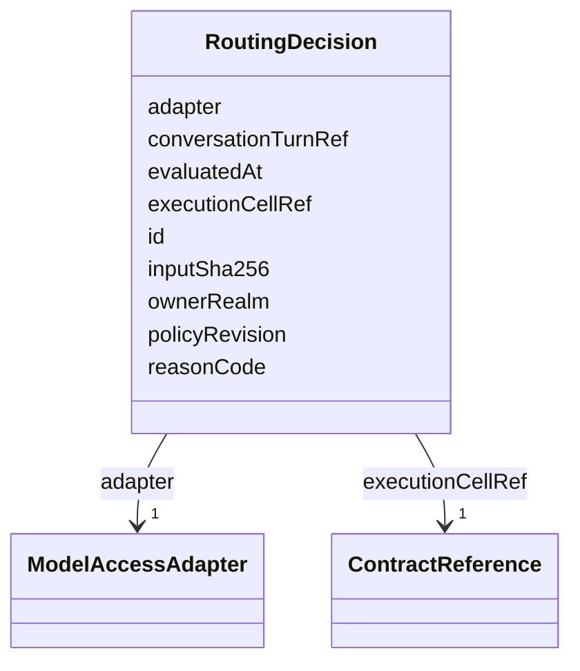

---
search:
  boost: 10.0
---

# Class: RoutingDecision


_Immutable policy-authorized adapter and cell selection for one recognized turn._


<div data-search-exclude markdown="1">


URI: [jumo:RoutingDecision](https://jumo.dev/schemas/jumo-v1/RoutingDecision)





<!-- no inheritance hierarchy -->

## Slots

| Name | Cardinality and Range | Description | Inheritance |
| ---  | --- | --- | --- |
| [id](id.md) | 1 <br/> [Identifier](Identifier.md) |  | direct |
| [ownerRealm](ownerRealm.md) | 1 <br/> [Identifier](Identifier.md) |  | direct |
| [conversationTurnRef](conversationTurnRef.md) | 1 <br/> [Identifier](Identifier.md) |  | direct |
| [executionCellRef](executionCellRef.md) | 1 <br/> [ContractReference](ContractReference.md) |  | direct |
| [adapter](adapter.md) | 1 <br/> [ModelAccessAdapter](ModelAccessAdapter.md) |  | direct |
| [policyRevision](policyRevision.md) | 1 <br/> [String](String.md) |  | direct |
| [reasonCode](reasonCode.md) | 1 <br/> [String](String.md) |  | direct |
| [inputSha256](inputSha256.md) | 1 <br/> [String](String.md) |  | direct |
| [evaluatedAt](evaluatedAt.md) | 1 <br/> [Datetime](Datetime.md) |  | direct |


## Identifier and Mapping Information


### Annotations

| property | value |
| --- | --- |
| jumo.state_authority | POSTGRES |
| jumo.model_role | VALUE_OBJECT |
| jumo.audience | REALM_PRIVATE |
| jumo.sensitivity | INTERNAL |
| jumo.boundary_eligible | True |
| jumo.schema_profiles | draft-2020-12,native-json-schema,prompted-json-validated |


### Schema Source


* from schema: https://jumo.dev/schemas/jumo-v1


## Mappings

| Mapping Type | Mapped Value |
| ---  | ---  |
| self | jumo:RoutingDecision |
| native | jumo:RoutingDecision |


## LinkML Source

<!-- TODO: investigate https://stackoverflow.com/questions/37606292/how-to-create-tabbed-code-blocks-in-mkdocs-or-sphinx -->

### Direct

<details>
```yaml
name: RoutingDecision
annotations:
  jumo.state_authority:
    tag: jumo.state_authority
    value: POSTGRES
  jumo.model_role:
    tag: jumo.model_role
    value: VALUE_OBJECT
  jumo.audience:
    tag: jumo.audience
    value: REALM_PRIVATE
  jumo.sensitivity:
    tag: jumo.sensitivity
    value: INTERNAL
  jumo.boundary_eligible:
    tag: jumo.boundary_eligible
    value: true
  jumo.schema_profiles:
    tag: jumo.schema_profiles
    value: draft-2020-12,native-json-schema,prompted-json-validated
description: Immutable policy-authorized adapter and cell selection for one recognized
  turn.
from_schema: https://jumo.dev/schemas/jumo-v1
attributes:
  id:
    name: id
    from_schema: https://jumo.dev/schemas/jumo-v1
    owner: RoutingDecision
    domain_of:
    - ContractReference
    - Metadata
    - LayerOverride
    - Principle
    - Milestone
    - RepositoryBinding
    - KitProfile
    - KitModule
    - DispositionRule
    - SelfDescriptionSubject
    - AgentCardSkill
    - AcceptanceCriterion
    - EngagementStage
    - GoldenTaskCase
    - AssistedJourneyStep
    - PolicyRule
    - AttentionDecisionOption
    - ProcessStep
    - ProcessFlow
    - ChangeProposalRef
    - ForgeProjectionRef
    - ProcessRunRef
    - ApprovalSignal
    - ExecutionCellProvisioningRef
    - ConnectorOperation
    - McpBundleOperation
    - ProviderSessionBinding
    - RoutingDecision
    - WorkerInvocation
    - EvidenceRecord
    - Surface
    - ProjectionSection
    range: Identifier
    required: true
  ownerRealm:
    name: ownerRealm
    from_schema: https://jumo.dev/schemas/jumo-v1
    owner: RoutingDecision
    domain_of:
    - PrincipalSpec
    - PrincipalIdentityBindingSpec
    - ProjectSpec
    - KitBindingSpec
    - KitLockSpec
    - RoleDefinitionSpec
    - RoleAssignmentSpec
    - TeamSpecBody
    - CoordinationProfileSpec
    - RoutingEligibilitySpec
    - RoleLifecyclePolicySpec
    - OrganizationTemplateSpec
    - ChiefOfStaffProfileSpec
    - AdvisorProfileSpec
    - PersonalSpaceSpec
    - OrganizationSpecBody
    - RealmPublicationSpec
    - CapabilityProfileSpec
    - WorkerRequirementProfileSpec
    - GoldenTaskSetSpec
    - ImprovementLoopSpec
    - ControlCatalogSpec
    - ComplianceProfileSpec
    - EvidenceProfileSpec
    - ProcessSpecBody
    - ChangeProposalRef
    - ForgeProjectionRef
    - ProcessRunRef
    - ApprovalSignal
    - ExecutionCellProvisioningRef
    - ExecutionMachineSpec
    - MachineHostDefinitionSpec
    - McpRegistrySourceBindingSpec
    - ConnectorDefinitionSpec
    - ConnectorAppraisalSpec
    - McpBundleSpec
    - RemoteMcpServiceSpec
    - RemoteMcpAppraisalSpec
    - ExecutionCellSpec
    - ProviderSessionBinding
    - RoutingDecision
    - WorkerInvocation
    - EvidenceRecord
    - InvocationAuthorizationReceipt
    - SecretBindingSpec
    - FederatedPeerSpec
    - FederationProfileSpec
    - WorkerSubstrateSpec
    - McpInventorySnapshot
    - ConnectorIntegrationSpec
    - OAuthClientBindingSpec
    - InterfaceSurfaceSpec
    - VocabularySetSpec
    - ProjectionSpecBody
    range: Identifier
    required: true
  conversationTurnRef:
    name: conversationTurnRef
    from_schema: https://jumo.dev/schemas/jumo-v1
    rank: 1000
    owner: RoutingDecision
    domain_of:
    - RoutingDecision
    range: Identifier
    required: true
  executionCellRef:
    name: executionCellRef
    from_schema: https://jumo.dev/schemas/jumo-v1
    rank: 1000
    owner: RoutingDecision
    domain_of:
    - RoutingDecision
    - WorkerInvocation
    range: ContractReference
    required: true
    inlined: true
  adapter:
    name: adapter
    from_schema: https://jumo.dev/schemas/jumo-v1
    owner: RoutingDecision
    domain_of:
    - McpRegistrySourceSpec
    - ProviderSessionBinding
    - RoutingDecision
    range: ModelAccessAdapter
    required: true
  policyRevision:
    name: policyRevision
    from_schema: https://jumo.dev/schemas/jumo-v1
    rank: 1000
    owner: RoutingDecision
    domain_of:
    - RoutingDecision
    range: string
    required: true
  reasonCode:
    name: reasonCode
    from_schema: https://jumo.dev/schemas/jumo-v1
    owner: RoutingDecision
    domain_of:
    - PolicyRule
    - RoutingDecision
    range: string
    required: true
  inputSha256:
    name: inputSha256
    from_schema: https://jumo.dev/schemas/jumo-v1
    rank: 1000
    owner: RoutingDecision
    domain_of:
    - RoutingDecision
    range: string
    required: true
    pattern: ^sha256:[0-9a-f]{64}$
  evaluatedAt:
    name: evaluatedAt
    from_schema: https://jumo.dev/schemas/jumo-v1
    rank: 1000
    owner: RoutingDecision
    domain_of:
    - RoutingDecision
    range: datetime
    required: true

```
</details>

### Induced

<details>
```yaml
name: RoutingDecision
annotations:
  jumo.state_authority:
    tag: jumo.state_authority
    value: POSTGRES
  jumo.model_role:
    tag: jumo.model_role
    value: VALUE_OBJECT
  jumo.audience:
    tag: jumo.audience
    value: REALM_PRIVATE
  jumo.sensitivity:
    tag: jumo.sensitivity
    value: INTERNAL
  jumo.boundary_eligible:
    tag: jumo.boundary_eligible
    value: true
  jumo.schema_profiles:
    tag: jumo.schema_profiles
    value: draft-2020-12,native-json-schema,prompted-json-validated
description: Immutable policy-authorized adapter and cell selection for one recognized
  turn.
from_schema: https://jumo.dev/schemas/jumo-v1
attributes:
  id:
    name: id
    from_schema: https://jumo.dev/schemas/jumo-v1
    owner: RoutingDecision
    domain_of:
    - ContractReference
    - Metadata
    - LayerOverride
    - Principle
    - Milestone
    - RepositoryBinding
    - KitProfile
    - KitModule
    - DispositionRule
    - SelfDescriptionSubject
    - AgentCardSkill
    - AcceptanceCriterion
    - EngagementStage
    - GoldenTaskCase
    - AssistedJourneyStep
    - PolicyRule
    - AttentionDecisionOption
    - ProcessStep
    - ProcessFlow
    - ChangeProposalRef
    - ForgeProjectionRef
    - ProcessRunRef
    - ApprovalSignal
    - ExecutionCellProvisioningRef
    - ConnectorOperation
    - McpBundleOperation
    - ProviderSessionBinding
    - RoutingDecision
    - WorkerInvocation
    - EvidenceRecord
    - Surface
    - ProjectionSection
    range: Identifier
    required: true
  ownerRealm:
    name: ownerRealm
    from_schema: https://jumo.dev/schemas/jumo-v1
    owner: RoutingDecision
    domain_of:
    - PrincipalSpec
    - PrincipalIdentityBindingSpec
    - ProjectSpec
    - KitBindingSpec
    - KitLockSpec
    - RoleDefinitionSpec
    - RoleAssignmentSpec
    - TeamSpecBody
    - CoordinationProfileSpec
    - RoutingEligibilitySpec
    - RoleLifecyclePolicySpec
    - OrganizationTemplateSpec
    - ChiefOfStaffProfileSpec
    - AdvisorProfileSpec
    - PersonalSpaceSpec
    - OrganizationSpecBody
    - RealmPublicationSpec
    - CapabilityProfileSpec
    - WorkerRequirementProfileSpec
    - GoldenTaskSetSpec
    - ImprovementLoopSpec
    - ControlCatalogSpec
    - ComplianceProfileSpec
    - EvidenceProfileSpec
    - ProcessSpecBody
    - ChangeProposalRef
    - ForgeProjectionRef
    - ProcessRunRef
    - ApprovalSignal
    - ExecutionCellProvisioningRef
    - ExecutionMachineSpec
    - MachineHostDefinitionSpec
    - McpRegistrySourceBindingSpec
    - ConnectorDefinitionSpec
    - ConnectorAppraisalSpec
    - McpBundleSpec
    - RemoteMcpServiceSpec
    - RemoteMcpAppraisalSpec
    - ExecutionCellSpec
    - ProviderSessionBinding
    - RoutingDecision
    - WorkerInvocation
    - EvidenceRecord
    - InvocationAuthorizationReceipt
    - SecretBindingSpec
    - FederatedPeerSpec
    - FederationProfileSpec
    - WorkerSubstrateSpec
    - McpInventorySnapshot
    - ConnectorIntegrationSpec
    - OAuthClientBindingSpec
    - InterfaceSurfaceSpec
    - VocabularySetSpec
    - ProjectionSpecBody
    range: Identifier
    required: true
  conversationTurnRef:
    name: conversationTurnRef
    from_schema: https://jumo.dev/schemas/jumo-v1
    rank: 1000
    owner: RoutingDecision
    domain_of:
    - RoutingDecision
    range: Identifier
    required: true
  executionCellRef:
    name: executionCellRef
    from_schema: https://jumo.dev/schemas/jumo-v1
    rank: 1000
    owner: RoutingDecision
    domain_of:
    - RoutingDecision
    - WorkerInvocation
    range: ContractReference
    required: true
    inlined: true
  adapter:
    name: adapter
    from_schema: https://jumo.dev/schemas/jumo-v1
    owner: RoutingDecision
    domain_of:
    - McpRegistrySourceSpec
    - ProviderSessionBinding
    - RoutingDecision
    range: ModelAccessAdapter
    required: true
  policyRevision:
    name: policyRevision
    from_schema: https://jumo.dev/schemas/jumo-v1
    rank: 1000
    owner: RoutingDecision
    domain_of:
    - RoutingDecision
    range: string
    required: true
  reasonCode:
    name: reasonCode
    from_schema: https://jumo.dev/schemas/jumo-v1
    owner: RoutingDecision
    domain_of:
    - PolicyRule
    - RoutingDecision
    range: string
    required: true
  inputSha256:
    name: inputSha256
    from_schema: https://jumo.dev/schemas/jumo-v1
    rank: 1000
    owner: RoutingDecision
    domain_of:
    - RoutingDecision
    range: string
    required: true
    pattern: ^sha256:[0-9a-f]{64}$
  evaluatedAt:
    name: evaluatedAt
    from_schema: https://jumo.dev/schemas/jumo-v1
    rank: 1000
    owner: RoutingDecision
    domain_of:
    - RoutingDecision
    range: datetime
    required: true

```
</details></div>