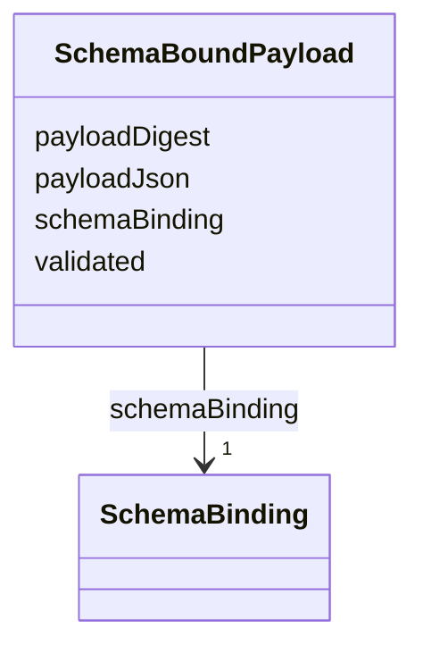

---
search:
  boost: 10.0
---

# Class: SchemaBoundPayload


_Bounded dynamic JSON payload guaranteed by a validated SchemaBinding._


<div data-search-exclude markdown="1">


URI: [jumo:SchemaBoundPayload](https://jumo.dev/schemas/jumo-v1/SchemaBoundPayload)





<!-- no inheritance hierarchy -->

## Slots

| Name | Cardinality and Range | Description | Inheritance |
| ---  | --- | --- | --- |
| [schemaBinding](schemaBinding.md) | 1 <br/> [SchemaBinding](SchemaBinding.md) |  | direct |
| [payloadJson](payloadJson.md) | 1 <br/> [String](String.md) |  | direct |
| [payloadDigest](payloadDigest.md) | 0..1 <br/> [String](String.md) |  | direct |
| [validated](validated.md) | 0..1 <br/> [Boolean](Boolean.md) |  | direct |


## Usages

| used by | used in | type | used |
| ---  | --- | --- | --- |
| [MachineAdminRequest](MachineAdminRequest.md) | [variables](variables.md) | range | [SchemaBoundPayload](SchemaBoundPayload.md) |
| [MachineAdminCommand](MachineAdminCommand.md) | [variables](variables.md) | range | [SchemaBoundPayload](SchemaBoundPayload.md) |
| [WorkloadCommand](WorkloadCommand.md) | [payload](payload.md) | range | [SchemaBoundPayload](SchemaBoundPayload.md) |
| [CliInvocationResult](CliInvocationResult.md) | [sanitizedOutputPayload](sanitizedOutputPayload.md) | range | [SchemaBoundPayload](SchemaBoundPayload.md) |
| [McpToolDescriptor](McpToolDescriptor.md) | [inputSchema](inputSchema.md) | range | [SchemaBoundPayload](SchemaBoundPayload.md) |
| [McpToolDescriptor](McpToolDescriptor.md) | [outputSchema](outputSchema.md) | range | [SchemaBoundPayload](SchemaBoundPayload.md) |
| [ConnectorTestCase](ConnectorTestCase.md) | [inputPayload](inputPayload.md) | range | [SchemaBoundPayload](SchemaBoundPayload.md) |
| [ConnectorTestCase](ConnectorTestCase.md) | [rollbackPayload](rollbackPayload.md) | range | [SchemaBoundPayload](SchemaBoundPayload.md) |
| [PolicyInput](PolicyInput.md) | [context](context.md) | range | [SchemaBoundPayload](SchemaBoundPayload.md) |


## Identifier and Mapping Information


### Annotations

| property | value |
| --- | --- |
| jumo.state_authority | NONE |
| jumo.model_role | VALUE_OBJECT |
| jumo.audience | REALM_PRIVATE |
| jumo.sensitivity | INTERNAL |
| jumo.boundary_eligible | True |
| jumo.schema_profiles | draft-2020-12,native-json-schema,prompted-json-validated |


### Schema Source


* from schema: https://jumo.dev/schemas/jumo-v1


## Mappings

| Mapping Type | Mapped Value |
| ---  | ---  |
| self | jumo:SchemaBoundPayload |
| native | jumo:SchemaBoundPayload |


## LinkML Source

<!-- TODO: investigate https://stackoverflow.com/questions/37606292/how-to-create-tabbed-code-blocks-in-mkdocs-or-sphinx -->

### Direct

<details>
```yaml
name: SchemaBoundPayload
annotations:
  jumo.state_authority:
    tag: jumo.state_authority
    value: NONE
  jumo.model_role:
    tag: jumo.model_role
    value: VALUE_OBJECT
  jumo.audience:
    tag: jumo.audience
    value: REALM_PRIVATE
  jumo.sensitivity:
    tag: jumo.sensitivity
    value: INTERNAL
  jumo.boundary_eligible:
    tag: jumo.boundary_eligible
    value: true
  jumo.schema_profiles:
    tag: jumo.schema_profiles
    value: draft-2020-12,native-json-schema,prompted-json-validated
description: Bounded dynamic JSON payload guaranteed by a validated SchemaBinding.
from_schema: https://jumo.dev/schemas/jumo-v1
attributes:
  schemaBinding:
    name: schemaBinding
    from_schema: https://jumo.dev/schemas/jumo-v1
    rank: 1000
    owner: SchemaBoundPayload
    domain_of:
    - SchemaBoundPayload
    - ApiResponseBinding
    range: SchemaBinding
    required: true
    inlined: true
  payloadJson:
    name: payloadJson
    from_schema: https://jumo.dev/schemas/jumo-v1
    owner: SchemaBoundPayload
    domain_of:
    - CliInvocationEvent
    - SchemaBoundPayload
    range: string
    required: true
  payloadDigest:
    name: payloadDigest
    from_schema: https://jumo.dev/schemas/jumo-v1
    rank: 1000
    owner: SchemaBoundPayload
    domain_of:
    - SchemaBoundPayload
    range: string
  validated:
    name: validated
    from_schema: https://jumo.dev/schemas/jumo-v1
    rank: 1000
    ifabsent: 'false'
    owner: SchemaBoundPayload
    domain_of:
    - SchemaBoundPayload
    range: boolean

```
</details>

### Induced

<details>
```yaml
name: SchemaBoundPayload
annotations:
  jumo.state_authority:
    tag: jumo.state_authority
    value: NONE
  jumo.model_role:
    tag: jumo.model_role
    value: VALUE_OBJECT
  jumo.audience:
    tag: jumo.audience
    value: REALM_PRIVATE
  jumo.sensitivity:
    tag: jumo.sensitivity
    value: INTERNAL
  jumo.boundary_eligible:
    tag: jumo.boundary_eligible
    value: true
  jumo.schema_profiles:
    tag: jumo.schema_profiles
    value: draft-2020-12,native-json-schema,prompted-json-validated
description: Bounded dynamic JSON payload guaranteed by a validated SchemaBinding.
from_schema: https://jumo.dev/schemas/jumo-v1
attributes:
  schemaBinding:
    name: schemaBinding
    from_schema: https://jumo.dev/schemas/jumo-v1
    rank: 1000
    owner: SchemaBoundPayload
    domain_of:
    - SchemaBoundPayload
    - ApiResponseBinding
    range: SchemaBinding
    required: true
    inlined: true
  payloadJson:
    name: payloadJson
    from_schema: https://jumo.dev/schemas/jumo-v1
    owner: SchemaBoundPayload
    domain_of:
    - CliInvocationEvent
    - SchemaBoundPayload
    range: string
    required: true
  payloadDigest:
    name: payloadDigest
    from_schema: https://jumo.dev/schemas/jumo-v1
    rank: 1000
    owner: SchemaBoundPayload
    domain_of:
    - SchemaBoundPayload
    range: string
  validated:
    name: validated
    from_schema: https://jumo.dev/schemas/jumo-v1
    rank: 1000
    ifabsent: 'false'
    owner: SchemaBoundPayload
    domain_of:
    - SchemaBoundPayload
    range: boolean

```
</details></div>