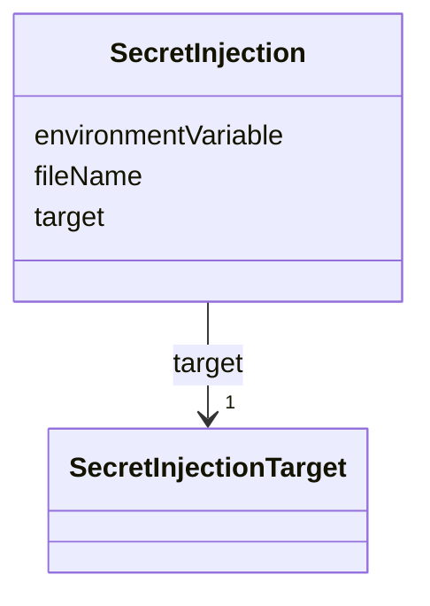

---
search:
  boost: 10.0
---

# Class: SecretInjection

<div data-search-exclude markdown="1">


URI: [jumo:SecretInjection](https://jumo.dev/schemas/jumo-v1/SecretInjection)





<!-- no inheritance hierarchy -->

## Slots

| Name | Cardinality and Range | Description | Inheritance |
| ---  | --- | --- | --- |
| [target](target.md) | 1 <br/> [SecretInjectionTarget](SecretInjectionTarget.md) |  | direct |
| [environmentVariable](environmentVariable.md) | 0..1 <br/> [String](String.md) |  | direct |
| [fileName](fileName.md) | 0..1 <br/> [String](String.md) |  | direct |


## Usages

| used by | used in | type | used |
| ---  | --- | --- | --- |
| [SecretBindingSpec](SecretBindingSpec.md) | [injection](injection.md) | range | [SecretInjection](SecretInjection.md) |


## Identifier and Mapping Information


### Annotations

| property | value |
| --- | --- |
| jumo.state_authority | GIT |
| jumo.model_role | VALUE_OBJECT |
| jumo.audience | REALM_PRIVATE |
| jumo.sensitivity | SECRET |
| jumo.boundary_eligible | False |
| jumo.schema_profiles | draft-2020-12,native-json-schema,prompted-json-validated |


### Schema Source


* from schema: https://jumo.dev/schemas/jumo-v1


## Mappings

| Mapping Type | Mapped Value |
| ---  | ---  |
| self | jumo:SecretInjection |
| native | jumo:SecretInjection |


## LinkML Source

<!-- TODO: investigate https://stackoverflow.com/questions/37606292/how-to-create-tabbed-code-blocks-in-mkdocs-or-sphinx -->

### Direct

<details>
```yaml
name: SecretInjection
annotations:
  jumo.state_authority:
    tag: jumo.state_authority
    value: GIT
  jumo.model_role:
    tag: jumo.model_role
    value: VALUE_OBJECT
  jumo.audience:
    tag: jumo.audience
    value: REALM_PRIVATE
  jumo.sensitivity:
    tag: jumo.sensitivity
    value: SECRET
  jumo.boundary_eligible:
    tag: jumo.boundary_eligible
    value: false
  jumo.schema_profiles:
    tag: jumo.schema_profiles
    value: draft-2020-12,native-json-schema,prompted-json-validated
from_schema: https://jumo.dev/schemas/jumo-v1
attributes:
  target:
    name: target
    from_schema: https://jumo.dev/schemas/jumo-v1
    owner: SecretInjection
    domain_of:
    - AttentionItemSpec
    - SecretInjection
    - SurfaceWritePath
    range: SecretInjectionTarget
    required: true
  environmentVariable:
    name: environmentVariable
    from_schema: https://jumo.dev/schemas/jumo-v1
    rank: 1000
    owner: SecretInjection
    domain_of:
    - SecretInjection
    range: string
    pattern: ^[A-Z][A-Z0-9_]{1,127}$
  fileName:
    name: fileName
    from_schema: https://jumo.dev/schemas/jumo-v1
    rank: 1000
    owner: SecretInjection
    domain_of:
    - SecretInjection
    range: string
    pattern: ^[A-Za-z0-9][A-Za-z0-9._-]{0,127}$

```
</details>

### Induced

<details>
```yaml
name: SecretInjection
annotations:
  jumo.state_authority:
    tag: jumo.state_authority
    value: GIT
  jumo.model_role:
    tag: jumo.model_role
    value: VALUE_OBJECT
  jumo.audience:
    tag: jumo.audience
    value: REALM_PRIVATE
  jumo.sensitivity:
    tag: jumo.sensitivity
    value: SECRET
  jumo.boundary_eligible:
    tag: jumo.boundary_eligible
    value: false
  jumo.schema_profiles:
    tag: jumo.schema_profiles
    value: draft-2020-12,native-json-schema,prompted-json-validated
from_schema: https://jumo.dev/schemas/jumo-v1
attributes:
  target:
    name: target
    from_schema: https://jumo.dev/schemas/jumo-v1
    owner: SecretInjection
    domain_of:
    - AttentionItemSpec
    - SecretInjection
    - SurfaceWritePath
    range: SecretInjectionTarget
    required: true
  environmentVariable:
    name: environmentVariable
    from_schema: https://jumo.dev/schemas/jumo-v1
    rank: 1000
    owner: SecretInjection
    domain_of:
    - SecretInjection
    range: string
    pattern: ^[A-Z][A-Z0-9_]{1,127}$
  fileName:
    name: fileName
    from_schema: https://jumo.dev/schemas/jumo-v1
    rank: 1000
    owner: SecretInjection
    domain_of:
    - SecretInjection
    range: string
    pattern: ^[A-Za-z0-9][A-Za-z0-9._-]{0,127}$

```
</details></div>