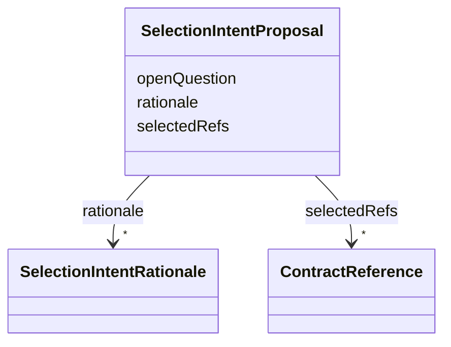

---
search:
  boost: 10.0
---

# Class: SelectionIntentProposal


_Structured output of a DIALOGUE_COLLECT step capturing what the assistant proposes selecting, from a declared catalog, in response to the user's stated intent (AssistedJourneyStep.promptRef, PromptOutput form: STRUCTURED; PromptOutput.targetKind names the ContractReference kind every selectedRefs entry must be, e.g. ConnectorDefinition). A proposal, never a grant or a configuration: selectedRefs must be drawn only from the realm's declared catalog of that kind, supplied as the prompt's RAG context (the same corpus ContractLoader loads for CapabilityGatewayService), never invented by the model. The user still confirms selection explicitly; this class only bounds what the model may say back. One declaration reused across every domain that needs this shape, instead of one class per target kind (canonical decision 15)._


<div data-search-exclude markdown="1">


URI: [jumo:SelectionIntentProposal](https://jumo.dev/schemas/jumo-v1/SelectionIntentProposal)





<!-- no inheritance hierarchy -->

## Slots

| Name | Cardinality and Range | Description | Inheritance |
| ---  | --- | --- | --- |
| [selectedRefs](selectedRefs.md) | * <br/> [ContractReference](ContractReference.md) | Ids proposed, of the kind PromptOutput | direct |
| [rationale](rationale.md) | * <br/> [SelectionIntentRationale](SelectionIntentRationale.md) | One entry per selectedRefs, explaining the match to the stated intent | direct |
| [openQuestion](openQuestion.md) | 0..1 <br/> [String](String.md) | A clarifying question to continue the dialogue when intent is still ambiguous | direct |


## Identifier and Mapping Information


### Annotations

| property | value |
| --- | --- |
| jumo.state_authority | GIT |
| jumo.model_role | VALUE_OBJECT |
| jumo.audience | REALM_PRIVATE |
| jumo.sensitivity | INTERNAL |
| jumo.boundary_eligible | True |
| jumo.schema_profiles | draft-2020-12,native-json-schema,prompted-json-validated |


### Schema Source


* from schema: https://jumo.dev/schemas/jumo-v1


## Mappings

| Mapping Type | Mapped Value |
| ---  | ---  |
| self | jumo:SelectionIntentProposal |
| native | jumo:SelectionIntentProposal |


## LinkML Source

<!-- TODO: investigate https://stackoverflow.com/questions/37606292/how-to-create-tabbed-code-blocks-in-mkdocs-or-sphinx -->

### Direct

<details>
```yaml
name: SelectionIntentProposal
annotations:
  jumo.state_authority:
    tag: jumo.state_authority
    value: GIT
  jumo.model_role:
    tag: jumo.model_role
    value: VALUE_OBJECT
  jumo.audience:
    tag: jumo.audience
    value: REALM_PRIVATE
  jumo.sensitivity:
    tag: jumo.sensitivity
    value: INTERNAL
  jumo.boundary_eligible:
    tag: jumo.boundary_eligible
    value: true
  jumo.schema_profiles:
    tag: jumo.schema_profiles
    value: draft-2020-12,native-json-schema,prompted-json-validated
description: 'Structured output of a DIALOGUE_COLLECT step capturing what the assistant
  proposes selecting, from a declared catalog, in response to the user''s stated intent
  (AssistedJourneyStep.promptRef, PromptOutput form: STRUCTURED; PromptOutput.targetKind
  names the ContractReference kind every selectedRefs entry must be, e.g. ConnectorDefinition).
  A proposal, never a grant or a configuration: selectedRefs must be drawn only from
  the realm''s declared catalog of that kind, supplied as the prompt''s RAG context
  (the same corpus ContractLoader loads for CapabilityGatewayService), never invented
  by the model. The user still confirms selection explicitly; this class only bounds
  what the model may say back. One declaration reused across every domain that needs
  this shape, instead of one class per target kind (canonical decision 15).'
from_schema: https://jumo.dev/schemas/jumo-v1
attributes:
  selectedRefs:
    name: selectedRefs
    description: Ids proposed, of the kind PromptOutput.targetKind names, referencing
      the supplied catalog only.
    from_schema: https://jumo.dev/schemas/jumo-v1
    rank: 1000
    owner: SelectionIntentProposal
    domain_of:
    - SelectionIntentProposal
    range: ContractReference
    multivalued: true
    inlined: true
    inlined_as_list: true
  rationale:
    name: rationale
    description: One entry per selectedRefs, explaining the match to the stated intent.
    from_schema: https://jumo.dev/schemas/jumo-v1
    rank: 1000
    owner: SelectionIntentProposal
    domain_of:
    - SelectionIntentProposal
    range: SelectionIntentRationale
    multivalued: true
    inlined: true
    inlined_as_list: true
  openQuestion:
    name: openQuestion
    description: A clarifying question to continue the dialogue when intent is still
      ambiguous. Absent once the proposal is considered final for this turn.
    from_schema: https://jumo.dev/schemas/jumo-v1
    rank: 1000
    owner: SelectionIntentProposal
    domain_of:
    - SelectionIntentProposal
    range: string

```
</details>

### Induced

<details>
```yaml
name: SelectionIntentProposal
annotations:
  jumo.state_authority:
    tag: jumo.state_authority
    value: GIT
  jumo.model_role:
    tag: jumo.model_role
    value: VALUE_OBJECT
  jumo.audience:
    tag: jumo.audience
    value: REALM_PRIVATE
  jumo.sensitivity:
    tag: jumo.sensitivity
    value: INTERNAL
  jumo.boundary_eligible:
    tag: jumo.boundary_eligible
    value: true
  jumo.schema_profiles:
    tag: jumo.schema_profiles
    value: draft-2020-12,native-json-schema,prompted-json-validated
description: 'Structured output of a DIALOGUE_COLLECT step capturing what the assistant
  proposes selecting, from a declared catalog, in response to the user''s stated intent
  (AssistedJourneyStep.promptRef, PromptOutput form: STRUCTURED; PromptOutput.targetKind
  names the ContractReference kind every selectedRefs entry must be, e.g. ConnectorDefinition).
  A proposal, never a grant or a configuration: selectedRefs must be drawn only from
  the realm''s declared catalog of that kind, supplied as the prompt''s RAG context
  (the same corpus ContractLoader loads for CapabilityGatewayService), never invented
  by the model. The user still confirms selection explicitly; this class only bounds
  what the model may say back. One declaration reused across every domain that needs
  this shape, instead of one class per target kind (canonical decision 15).'
from_schema: https://jumo.dev/schemas/jumo-v1
attributes:
  selectedRefs:
    name: selectedRefs
    description: Ids proposed, of the kind PromptOutput.targetKind names, referencing
      the supplied catalog only.
    from_schema: https://jumo.dev/schemas/jumo-v1
    rank: 1000
    owner: SelectionIntentProposal
    domain_of:
    - SelectionIntentProposal
    range: ContractReference
    multivalued: true
    inlined: true
    inlined_as_list: true
  rationale:
    name: rationale
    description: One entry per selectedRefs, explaining the match to the stated intent.
    from_schema: https://jumo.dev/schemas/jumo-v1
    rank: 1000
    owner: SelectionIntentProposal
    domain_of:
    - SelectionIntentProposal
    range: SelectionIntentRationale
    multivalued: true
    inlined: true
    inlined_as_list: true
  openQuestion:
    name: openQuestion
    description: A clarifying question to continue the dialogue when intent is still
      ambiguous. Absent once the proposal is considered final for this turn.
    from_schema: https://jumo.dev/schemas/jumo-v1
    rank: 1000
    owner: SelectionIntentProposal
    domain_of:
    - SelectionIntentProposal
    range: string

```
</details></div>