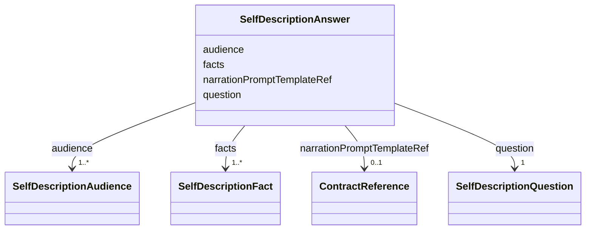

---
search:
  boost: 10.0
---

# Class: SelfDescriptionAnswer

<div data-search-exclude markdown="1">


URI: [jumo:SelfDescriptionAnswer](https://jumo.dev/schemas/jumo-v1/SelfDescriptionAnswer)





<!-- no inheritance hierarchy -->

## Slots

| Name | Cardinality and Range | Description | Inheritance |
| ---  | --- | --- | --- |
| [question](question.md) | 1 <br/> [SelfDescriptionQuestion](SelfDescriptionQuestion.md) |  | direct |
| [facts](facts.md) | 1..* <br/> [SelfDescriptionFact](SelfDescriptionFact.md) |  | direct |
| [narrationPromptTemplateRef](narrationPromptTemplateRef.md) | 0..1 <br/> [ContractReference](ContractReference.md) | Optional PromptTemplate that phrases the extracted facts | direct |
| [audience](audience.md) | 1..* <br/> [SelfDescriptionAudience](SelfDescriptionAudience.md) |  | direct |


## Usages

| used by | used in | type | used |
| ---  | --- | --- | --- |
| [SelfDescriptionSpec](SelfDescriptionSpec.md) | [answers](answers.md) | range | [SelfDescriptionAnswer](SelfDescriptionAnswer.md) |


## Identifier and Mapping Information


### Annotations

| property | value |
| --- | --- |
| jumo.state_authority | GIT |
| jumo.model_role | VALUE_OBJECT |
| jumo.audience | REALM_PRIVATE |
| jumo.sensitivity | INTERNAL |
| jumo.boundary_eligible | True |
| jumo.schema_profiles | draft-2020-12,native-json-schema,prompted-json-validated |


### Schema Source


* from schema: https://jumo.dev/schemas/jumo-v1


## Mappings

| Mapping Type | Mapped Value |
| ---  | ---  |
| self | jumo:SelfDescriptionAnswer |
| native | jumo:SelfDescriptionAnswer |


## LinkML Source

<!-- TODO: investigate https://stackoverflow.com/questions/37606292/how-to-create-tabbed-code-blocks-in-mkdocs-or-sphinx -->

### Direct

<details>
```yaml
name: SelfDescriptionAnswer
annotations:
  jumo.state_authority:
    tag: jumo.state_authority
    value: GIT
  jumo.model_role:
    tag: jumo.model_role
    value: VALUE_OBJECT
  jumo.audience:
    tag: jumo.audience
    value: REALM_PRIVATE
  jumo.sensitivity:
    tag: jumo.sensitivity
    value: INTERNAL
  jumo.boundary_eligible:
    tag: jumo.boundary_eligible
    value: true
  jumo.schema_profiles:
    tag: jumo.schema_profiles
    value: draft-2020-12,native-json-schema,prompted-json-validated
from_schema: https://jumo.dev/schemas/jumo-v1
attributes:
  question:
    name: question
    from_schema: https://jumo.dev/schemas/jumo-v1
    rank: 1000
    owner: SelfDescriptionAnswer
    domain_of:
    - SelfDescriptionAnswer
    range: SelfDescriptionQuestion
    required: true
  facts:
    name: facts
    from_schema: https://jumo.dev/schemas/jumo-v1
    rank: 1000
    owner: SelfDescriptionAnswer
    domain_of:
    - SelfDescriptionAnswer
    range: SelfDescriptionFact
    required: true
    multivalued: true
    inlined: true
    inlined_as_list: true
    minimum_cardinality: 1
  narrationPromptTemplateRef:
    name: narrationPromptTemplateRef
    description: Optional PromptTemplate that phrases the extracted facts.
    from_schema: https://jumo.dev/schemas/jumo-v1
    rank: 1000
    owner: SelfDescriptionAnswer
    domain_of:
    - SelfDescriptionAnswer
    range: ContractReference
    inlined: true
  audience:
    name: audience
    from_schema: https://jumo.dev/schemas/jumo-v1
    owner: SelfDescriptionAnswer
    domain_of:
    - DocumentFrontMatter
    - OfferingSpecBody
    - SelfDescriptionAnswer
    - Surface
    - ApiOperation
    - ApiSurfaceSpec
    range: SelfDescriptionAudience
    required: true
    multivalued: true
    minimum_cardinality: 1

```
</details>

### Induced

<details>
```yaml
name: SelfDescriptionAnswer
annotations:
  jumo.state_authority:
    tag: jumo.state_authority
    value: GIT
  jumo.model_role:
    tag: jumo.model_role
    value: VALUE_OBJECT
  jumo.audience:
    tag: jumo.audience
    value: REALM_PRIVATE
  jumo.sensitivity:
    tag: jumo.sensitivity
    value: INTERNAL
  jumo.boundary_eligible:
    tag: jumo.boundary_eligible
    value: true
  jumo.schema_profiles:
    tag: jumo.schema_profiles
    value: draft-2020-12,native-json-schema,prompted-json-validated
from_schema: https://jumo.dev/schemas/jumo-v1
attributes:
  question:
    name: question
    from_schema: https://jumo.dev/schemas/jumo-v1
    rank: 1000
    owner: SelfDescriptionAnswer
    domain_of:
    - SelfDescriptionAnswer
    range: SelfDescriptionQuestion
    required: true
  facts:
    name: facts
    from_schema: https://jumo.dev/schemas/jumo-v1
    rank: 1000
    owner: SelfDescriptionAnswer
    domain_of:
    - SelfDescriptionAnswer
    range: SelfDescriptionFact
    required: true
    multivalued: true
    inlined: true
    inlined_as_list: true
    minimum_cardinality: 1
  narrationPromptTemplateRef:
    name: narrationPromptTemplateRef
    description: Optional PromptTemplate that phrases the extracted facts.
    from_schema: https://jumo.dev/schemas/jumo-v1
    rank: 1000
    owner: SelfDescriptionAnswer
    domain_of:
    - SelfDescriptionAnswer
    range: ContractReference
    inlined: true
  audience:
    name: audience
    from_schema: https://jumo.dev/schemas/jumo-v1
    owner: SelfDescriptionAnswer
    domain_of:
    - DocumentFrontMatter
    - OfferingSpecBody
    - SelfDescriptionAnswer
    - Surface
    - ApiOperation
    - ApiSurfaceSpec
    range: SelfDescriptionAudience
    required: true
    multivalued: true
    minimum_cardinality: 1

```
</details></div>