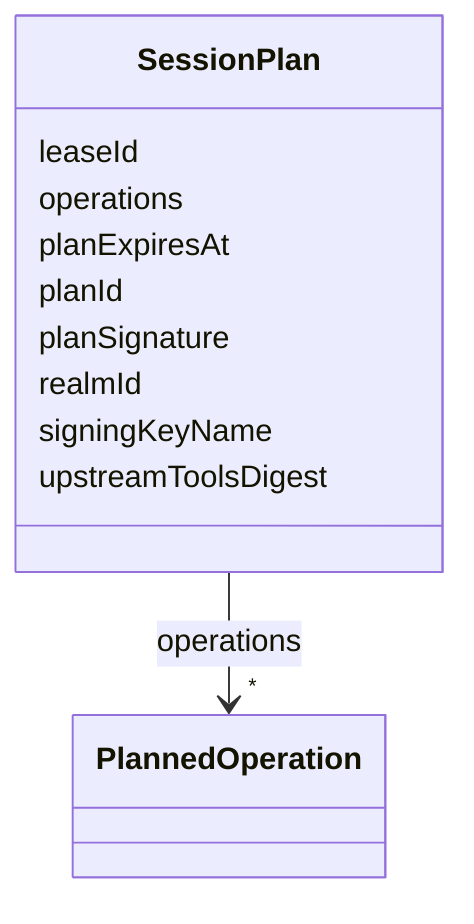

---
search:
  boost: 10.0
---

# Class: SessionPlan


_Signed MCP gateway session plan scoped to one ExecutionCellLease (mcp-gateway-session-plan-signing AC2) -- carries the planSignature envelope dev.jumo.mcpgateway.plan.SessionPlan's javadoc names but does not yet have a field for._


<div data-search-exclude markdown="1">


URI: [jumo:SessionPlan](https://jumo.dev/schemas/jumo-v1/SessionPlan)





<!-- no inheritance hierarchy -->

## Slots

| Name | Cardinality and Range | Description | Inheritance |
| ---  | --- | --- | --- |
| [planId](planId.md) | 1 <br/> [Identifier](Identifier.md) |  | direct |
| [realmId](realmId.md) | 1 <br/> [Identifier](Identifier.md) |  | direct |
| [leaseId](leaseId.md) | 1 <br/> [Identifier](Identifier.md) |  | direct |
| [upstreamToolsDigest](upstreamToolsDigest.md) | 1 <br/> [String](String.md) | Digest of the complete discovered tool inventory of the one upstream connecto... | direct |
| [operations](operations.md) | * <br/> [PlannedOperation](PlannedOperation.md) |  | direct |
| [planExpiresAt](planExpiresAt.md) | 1 <br/> [String](String.md) |  | direct |
| [signingKeyName](signingKeyName.md) | 1 <br/> [String](String.md) |  | direct |
| [planSignature](planSignature.md) | 1 <br/> [String](String.md) |  | direct |


## Identifier and Mapping Information


### Annotations

| property | value |
| --- | --- |
| jumo.state_authority | NONE |
| jumo.model_role | COMMAND |
| jumo.audience | MACHINE_MTLS |
| jumo.sensitivity | INTERNAL |
| jumo.boundary_eligible | True |
| jumo.schema_profiles | draft-2020-12,native-json-schema,prompted-json-validated |


### Schema Source


* from schema: https://jumo.dev/schemas/jumo-v1


## Mappings

| Mapping Type | Mapped Value |
| ---  | ---  |
| self | jumo:SessionPlan |
| native | jumo:SessionPlan |


## LinkML Source

<!-- TODO: investigate https://stackoverflow.com/questions/37606292/how-to-create-tabbed-code-blocks-in-mkdocs-or-sphinx -->

### Direct

<details>
```yaml
name: SessionPlan
annotations:
  jumo.state_authority:
    tag: jumo.state_authority
    value: NONE
  jumo.model_role:
    tag: jumo.model_role
    value: COMMAND
  jumo.audience:
    tag: jumo.audience
    value: MACHINE_MTLS
  jumo.sensitivity:
    tag: jumo.sensitivity
    value: INTERNAL
  jumo.boundary_eligible:
    tag: jumo.boundary_eligible
    value: true
  jumo.schema_profiles:
    tag: jumo.schema_profiles
    value: draft-2020-12,native-json-schema,prompted-json-validated
description: Signed MCP gateway session plan scoped to one ExecutionCellLease (mcp-gateway-session-plan-signing
  AC2) -- carries the planSignature envelope dev.jumo.mcpgateway.plan.SessionPlan's
  javadoc names but does not yet have a field for.
from_schema: https://jumo.dev/schemas/jumo-v1
attributes:
  planId:
    name: planId
    from_schema: https://jumo.dev/schemas/jumo-v1
    rank: 1000
    owner: SessionPlan
    domain_of:
    - SessionPlan
    - ConnectorTestPlan
    - ConnectorTestResult
    range: Identifier
    required: true
  realmId:
    name: realmId
    from_schema: https://jumo.dev/schemas/jumo-v1
    owner: SessionPlan
    domain_of:
    - AttentionSource
    - MachineEnrollmentRequest
    - MachineEnrollmentChallenge
    - DelegatedSecretGrant
    - SessionPlan
    - ApiProblem
    - PolicyInput
    - ChangeSetProjection
    range: Identifier
    required: true
  leaseId:
    name: leaseId
    from_schema: https://jumo.dev/schemas/jumo-v1
    owner: SessionPlan
    domain_of:
    - WorkloadCommand
    - ExecutionCellLease
    - DelegatedSecretGrant
    - CliInvocationRequest
    - SessionPlanRequest
    - SessionPlan
    - McpInvocationAuthorizationRequest
    - McpInvocationAuthorizationReceipt
    - McpInvocationOutcome
    range: Identifier
    required: true
  upstreamToolsDigest:
    name: upstreamToolsDigest
    description: Digest of the complete discovered tool inventory of the one upstream
      connector accepted for this plan, using mcp-tools-jcs-v1. Signed with the plan
      so a gateway can refuse a later upstream inventory change before dispatch.
    from_schema: https://jumo.dev/schemas/jumo-v1
    rank: 1000
    owner: SessionPlan
    domain_of:
    - SessionPlan
    range: string
    required: true
  operations:
    name: operations
    from_schema: https://jumo.dev/schemas/jumo-v1
    owner: SessionPlan
    domain_of:
    - ConnectorDefinitionSpec
    - McpBundleSemanticProfile
    - SessionPlan
    - ApiSurfaceSpec
    range: PlannedOperation
    multivalued: true
    inlined: true
    inlined_as_list: true
  planExpiresAt:
    name: planExpiresAt
    from_schema: https://jumo.dev/schemas/jumo-v1
    rank: 1000
    owner: SessionPlan
    domain_of:
    - SessionPlan
    range: string
    required: true
  signingKeyName:
    name: signingKeyName
    from_schema: https://jumo.dev/schemas/jumo-v1
    rank: 1000
    owner: SessionPlan
    domain_of:
    - SessionPlan
    - McpInvocationAuthorizationReceipt
    range: string
    required: true
  planSignature:
    name: planSignature
    from_schema: https://jumo.dev/schemas/jumo-v1
    rank: 1000
    owner: SessionPlan
    domain_of:
    - SessionPlan
    range: string
    required: true

```
</details>

### Induced

<details>
```yaml
name: SessionPlan
annotations:
  jumo.state_authority:
    tag: jumo.state_authority
    value: NONE
  jumo.model_role:
    tag: jumo.model_role
    value: COMMAND
  jumo.audience:
    tag: jumo.audience
    value: MACHINE_MTLS
  jumo.sensitivity:
    tag: jumo.sensitivity
    value: INTERNAL
  jumo.boundary_eligible:
    tag: jumo.boundary_eligible
    value: true
  jumo.schema_profiles:
    tag: jumo.schema_profiles
    value: draft-2020-12,native-json-schema,prompted-json-validated
description: Signed MCP gateway session plan scoped to one ExecutionCellLease (mcp-gateway-session-plan-signing
  AC2) -- carries the planSignature envelope dev.jumo.mcpgateway.plan.SessionPlan's
  javadoc names but does not yet have a field for.
from_schema: https://jumo.dev/schemas/jumo-v1
attributes:
  planId:
    name: planId
    from_schema: https://jumo.dev/schemas/jumo-v1
    rank: 1000
    owner: SessionPlan
    domain_of:
    - SessionPlan
    - ConnectorTestPlan
    - ConnectorTestResult
    range: Identifier
    required: true
  realmId:
    name: realmId
    from_schema: https://jumo.dev/schemas/jumo-v1
    owner: SessionPlan
    domain_of:
    - AttentionSource
    - MachineEnrollmentRequest
    - MachineEnrollmentChallenge
    - DelegatedSecretGrant
    - SessionPlan
    - ApiProblem
    - PolicyInput
    - ChangeSetProjection
    range: Identifier
    required: true
  leaseId:
    name: leaseId
    from_schema: https://jumo.dev/schemas/jumo-v1
    owner: SessionPlan
    domain_of:
    - WorkloadCommand
    - ExecutionCellLease
    - DelegatedSecretGrant
    - CliInvocationRequest
    - SessionPlanRequest
    - SessionPlan
    - McpInvocationAuthorizationRequest
    - McpInvocationAuthorizationReceipt
    - McpInvocationOutcome
    range: Identifier
    required: true
  upstreamToolsDigest:
    name: upstreamToolsDigest
    description: Digest of the complete discovered tool inventory of the one upstream
      connector accepted for this plan, using mcp-tools-jcs-v1. Signed with the plan
      so a gateway can refuse a later upstream inventory change before dispatch.
    from_schema: https://jumo.dev/schemas/jumo-v1
    rank: 1000
    owner: SessionPlan
    domain_of:
    - SessionPlan
    range: string
    required: true
  operations:
    name: operations
    from_schema: https://jumo.dev/schemas/jumo-v1
    owner: SessionPlan
    domain_of:
    - ConnectorDefinitionSpec
    - McpBundleSemanticProfile
    - SessionPlan
    - ApiSurfaceSpec
    range: PlannedOperation
    multivalued: true
    inlined: true
    inlined_as_list: true
  planExpiresAt:
    name: planExpiresAt
    from_schema: https://jumo.dev/schemas/jumo-v1
    rank: 1000
    owner: SessionPlan
    domain_of:
    - SessionPlan
    range: string
    required: true
  signingKeyName:
    name: signingKeyName
    from_schema: https://jumo.dev/schemas/jumo-v1
    rank: 1000
    owner: SessionPlan
    domain_of:
    - SessionPlan
    - McpInvocationAuthorizationReceipt
    range: string
    required: true
  planSignature:
    name: planSignature
    from_schema: https://jumo.dev/schemas/jumo-v1
    rank: 1000
    owner: SessionPlan
    domain_of:
    - SessionPlan
    range: string
    required: true

```
</details></div>