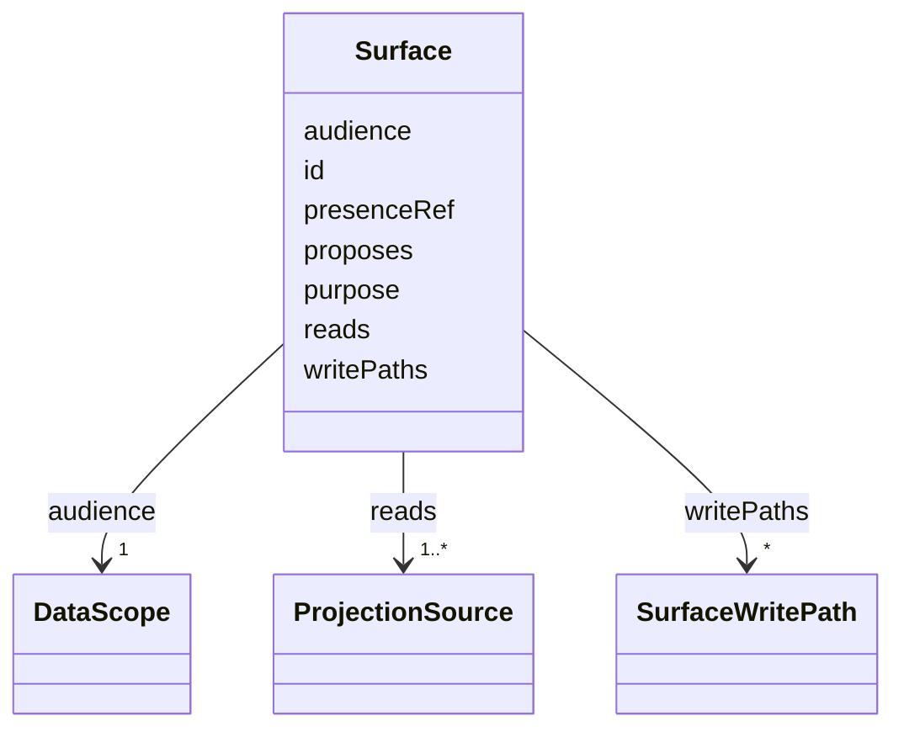

---
search:
  boost: 10.0
---

# Class: Surface


_Conditional (reads containing FORGE_PROJECTIONS forces audience REALM_PRIVATE) moves to Rego._


<div data-search-exclude markdown="1">


URI: [jumo:Surface](https://jumo.dev/schemas/jumo-v1/Surface)





<!-- no inheritance hierarchy -->

## Slots

| Name | Cardinality and Range | Description | Inheritance |
| ---  | --- | --- | --- |
| [id](id.md) | 1 <br/> [Identifier](Identifier.md) |  | direct |
| [purpose](purpose.md) | 1 <br/> [String](String.md) |  | direct |
| [audience](audience.md) | 1 <br/> [DataScope](DataScope.md) |  | direct |
| [reads](reads.md) | 1..* <br/> [ProjectionSource](ProjectionSource.md) |  | direct |
| [proposes](proposes.md) | * <br/> [CapabilityName](CapabilityName.md) |  | direct |
| [writePaths](writePaths.md) | * <br/> [SurfaceWritePath](SurfaceWritePath.md) |  | direct |
| [presenceRef](presenceRef.md) | 0..1 <br/> [String](String.md) |  | direct |


## Usages

| used by | used in | type | used |
| ---  | --- | --- | --- |
| [InterfaceSurfaceSpec](InterfaceSurfaceSpec.md) | [surfaces](surfaces.md) | range | [Surface](Surface.md) |


## Identifier and Mapping Information


### Annotations

| property | value |
| --- | --- |
| jumo.state_authority | GIT |
| jumo.model_role | VALUE_OBJECT |
| jumo.audience | REALM_PRIVATE |
| jumo.sensitivity | INTERNAL |
| jumo.boundary_eligible | True |
| jumo.schema_profiles | draft-2020-12,native-json-schema,prompted-json-validated |


### Schema Source


* from schema: https://jumo.dev/schemas/jumo-v1


## Mappings

| Mapping Type | Mapped Value |
| ---  | ---  |
| self | jumo:Surface |
| native | jumo:Surface |


## LinkML Source

<!-- TODO: investigate https://stackoverflow.com/questions/37606292/how-to-create-tabbed-code-blocks-in-mkdocs-or-sphinx -->

### Direct

<details>
```yaml
name: Surface
annotations:
  jumo.state_authority:
    tag: jumo.state_authority
    value: GIT
  jumo.model_role:
    tag: jumo.model_role
    value: VALUE_OBJECT
  jumo.audience:
    tag: jumo.audience
    value: REALM_PRIVATE
  jumo.sensitivity:
    tag: jumo.sensitivity
    value: INTERNAL
  jumo.boundary_eligible:
    tag: jumo.boundary_eligible
    value: true
  jumo.schema_profiles:
    tag: jumo.schema_profiles
    value: draft-2020-12,native-json-schema,prompted-json-validated
description: Conditional (reads containing FORGE_PROJECTIONS forces audience REALM_PRIVATE)
  moves to Rego.
from_schema: https://jumo.dev/schemas/jumo-v1
attributes:
  id:
    name: id
    from_schema: https://jumo.dev/schemas/jumo-v1
    owner: Surface
    domain_of:
    - ContractReference
    - Metadata
    - LayerOverride
    - Principle
    - Milestone
    - RepositoryBinding
    - KitProfile
    - KitModule
    - DispositionRule
    - SelfDescriptionSubject
    - AgentCardSkill
    - AcceptanceCriterion
    - EngagementStage
    - GoldenTaskCase
    - AssistedJourneyStep
    - PolicyRule
    - AttentionDecisionOption
    - ProcessStep
    - ProcessFlow
    - ChangeProposalRef
    - ForgeProjectionRef
    - ProcessRunRef
    - ApprovalSignal
    - ExecutionCellProvisioningRef
    - ConnectorOperation
    - McpBundleOperation
    - ProviderSessionBinding
    - RoutingDecision
    - WorkerInvocation
    - EvidenceRecord
    - Surface
    - ProjectionSection
    range: Identifier
    required: true
  purpose:
    name: purpose
    from_schema: https://jumo.dev/schemas/jumo-v1
    owner: Surface
    domain_of:
    - ProjectSpec
    - TeamSpecBody
    - WorkOrderSpec
    - PracticeSpec
    - PromptTemplateSpec
    - ImprovementLoopSpec
    - ProcessingRegisterEntry
    - McpBundleSemanticProfile
    - Surface
    range: string
    required: true
    pattern: ^.{10,}$
  audience:
    name: audience
    from_schema: https://jumo.dev/schemas/jumo-v1
    owner: Surface
    domain_of:
    - DocumentFrontMatter
    - OfferingSpecBody
    - SelfDescriptionAnswer
    - Surface
    - ApiOperation
    - ApiSurfaceSpec
    range: DataScope
    required: true
  reads:
    name: reads
    from_schema: https://jumo.dev/schemas/jumo-v1
    rank: 1000
    owner: Surface
    domain_of:
    - Surface
    range: ProjectionSource
    required: true
    multivalued: true
    minimum_cardinality: 1
  proposes:
    name: proposes
    from_schema: https://jumo.dev/schemas/jumo-v1
    rank: 1000
    owner: Surface
    domain_of:
    - Surface
    range: CapabilityName
    multivalued: true
  writePaths:
    name: writePaths
    from_schema: https://jumo.dev/schemas/jumo-v1
    rank: 1000
    owner: Surface
    domain_of:
    - Surface
    range: SurfaceWritePath
    multivalued: true
    inlined: true
    inlined_as_list: true
  presenceRef:
    name: presenceRef
    from_schema: https://jumo.dev/schemas/jumo-v1
    owner: Surface
    domain_of:
    - CapabilityProfileSpec
    - Surface
    range: string
    pattern: ^[a-z][a-zA-Z0-9]*$

```
</details>

### Induced

<details>
```yaml
name: Surface
annotations:
  jumo.state_authority:
    tag: jumo.state_authority
    value: GIT
  jumo.model_role:
    tag: jumo.model_role
    value: VALUE_OBJECT
  jumo.audience:
    tag: jumo.audience
    value: REALM_PRIVATE
  jumo.sensitivity:
    tag: jumo.sensitivity
    value: INTERNAL
  jumo.boundary_eligible:
    tag: jumo.boundary_eligible
    value: true
  jumo.schema_profiles:
    tag: jumo.schema_profiles
    value: draft-2020-12,native-json-schema,prompted-json-validated
description: Conditional (reads containing FORGE_PROJECTIONS forces audience REALM_PRIVATE)
  moves to Rego.
from_schema: https://jumo.dev/schemas/jumo-v1
attributes:
  id:
    name: id
    from_schema: https://jumo.dev/schemas/jumo-v1
    owner: Surface
    domain_of:
    - ContractReference
    - Metadata
    - LayerOverride
    - Principle
    - Milestone
    - RepositoryBinding
    - KitProfile
    - KitModule
    - DispositionRule
    - SelfDescriptionSubject
    - AgentCardSkill
    - AcceptanceCriterion
    - EngagementStage
    - GoldenTaskCase
    - AssistedJourneyStep
    - PolicyRule
    - AttentionDecisionOption
    - ProcessStep
    - ProcessFlow
    - ChangeProposalRef
    - ForgeProjectionRef
    - ProcessRunRef
    - ApprovalSignal
    - ExecutionCellProvisioningRef
    - ConnectorOperation
    - McpBundleOperation
    - ProviderSessionBinding
    - RoutingDecision
    - WorkerInvocation
    - EvidenceRecord
    - Surface
    - ProjectionSection
    range: Identifier
    required: true
  purpose:
    name: purpose
    from_schema: https://jumo.dev/schemas/jumo-v1
    owner: Surface
    domain_of:
    - ProjectSpec
    - TeamSpecBody
    - WorkOrderSpec
    - PracticeSpec
    - PromptTemplateSpec
    - ImprovementLoopSpec
    - ProcessingRegisterEntry
    - McpBundleSemanticProfile
    - Surface
    range: string
    required: true
    pattern: ^.{10,}$
  audience:
    name: audience
    from_schema: https://jumo.dev/schemas/jumo-v1
    owner: Surface
    domain_of:
    - DocumentFrontMatter
    - OfferingSpecBody
    - SelfDescriptionAnswer
    - Surface
    - ApiOperation
    - ApiSurfaceSpec
    range: DataScope
    required: true
  reads:
    name: reads
    from_schema: https://jumo.dev/schemas/jumo-v1
    rank: 1000
    owner: Surface
    domain_of:
    - Surface
    range: ProjectionSource
    required: true
    multivalued: true
    minimum_cardinality: 1
  proposes:
    name: proposes
    from_schema: https://jumo.dev/schemas/jumo-v1
    rank: 1000
    owner: Surface
    domain_of:
    - Surface
    range: CapabilityName
    multivalued: true
  writePaths:
    name: writePaths
    from_schema: https://jumo.dev/schemas/jumo-v1
    rank: 1000
    owner: Surface
    domain_of:
    - Surface
    range: SurfaceWritePath
    multivalued: true
    inlined: true
    inlined_as_list: true
  presenceRef:
    name: presenceRef
    from_schema: https://jumo.dev/schemas/jumo-v1
    owner: Surface
    domain_of:
    - CapabilityProfileSpec
    - Surface
    range: string
    pattern: ^[a-z][a-zA-Z0-9]*$

```
</details></div>