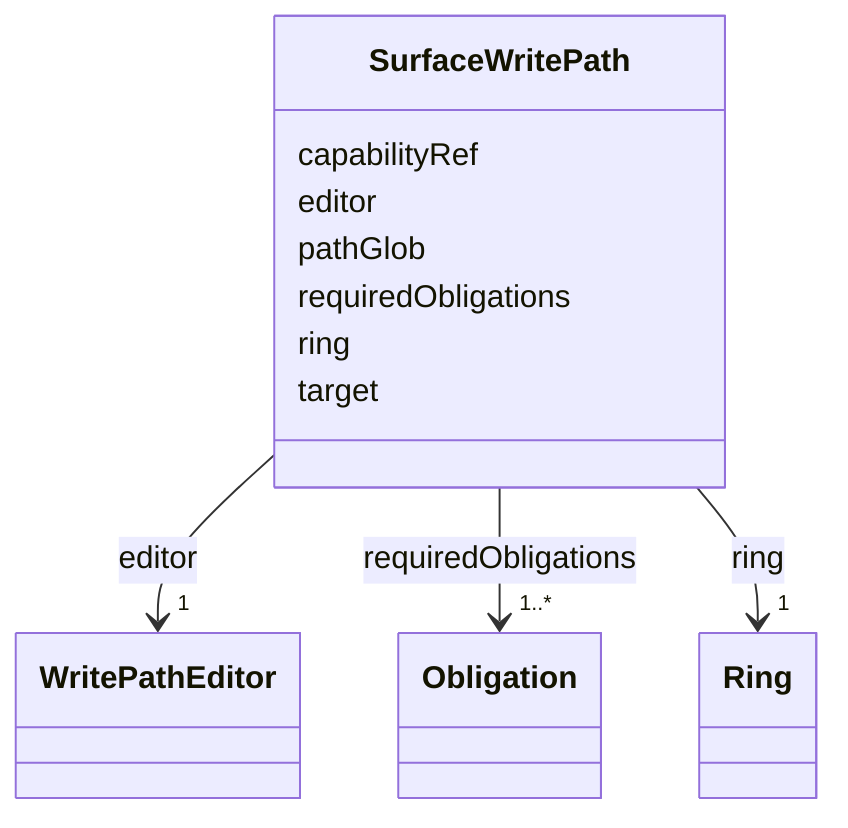

---
search:
  boost: 10.0
---

# Class: SurfaceWritePath


_Path traversal, editor-to-path compatibility, and required-obligation preservation are semantic constraints enforced by Rego._


<div data-search-exclude markdown="1">


URI: [jumo:SurfaceWritePath](https://jumo.dev/schemas/jumo-v1/SurfaceWritePath)





<!-- no inheritance hierarchy -->

## Slots

| Name | Cardinality and Range | Description | Inheritance |
| ---  | --- | --- | --- |
| [target](target.md) | 0..1 <br/> [String](String.md) |  | direct |
| [pathGlob](pathGlob.md) | 1 <br/> [String](String.md) |  | direct |
| [ring](ring.md) | 1 <br/> [Ring](Ring.md) |  | direct |
| [capabilityRef](capabilityRef.md) | 1 <br/> [CapabilityName](CapabilityName.md) |  | direct |
| [editor](editor.md) | 1 <br/> [WritePathEditor](WritePathEditor.md) |  | direct |
| [requiredObligations](requiredObligations.md) | 1..* <br/> [Obligation](Obligation.md) |  | direct |


## Usages

| used by | used in | type | used |
| ---  | --- | --- | --- |
| [Surface](Surface.md) | [writePaths](writePaths.md) | range | [SurfaceWritePath](SurfaceWritePath.md) |


## Identifier and Mapping Information


### Annotations

| property | value |
| --- | --- |
| jumo.state_authority | GIT |
| jumo.model_role | VALUE_OBJECT |
| jumo.audience | REALM_PRIVATE |
| jumo.sensitivity | INTERNAL |
| jumo.boundary_eligible | True |
| jumo.schema_profiles | draft-2020-12,native-json-schema,prompted-json-validated |


### Schema Source


* from schema: https://jumo.dev/schemas/jumo-v1


## Mappings

| Mapping Type | Mapped Value |
| ---  | ---  |
| self | jumo:SurfaceWritePath |
| native | jumo:SurfaceWritePath |


## LinkML Source

<!-- TODO: investigate https://stackoverflow.com/questions/37606292/how-to-create-tabbed-code-blocks-in-mkdocs-or-sphinx -->

### Direct

<details>
```yaml
name: SurfaceWritePath
annotations:
  jumo.state_authority:
    tag: jumo.state_authority
    value: GIT
  jumo.model_role:
    tag: jumo.model_role
    value: VALUE_OBJECT
  jumo.audience:
    tag: jumo.audience
    value: REALM_PRIVATE
  jumo.sensitivity:
    tag: jumo.sensitivity
    value: INTERNAL
  jumo.boundary_eligible:
    tag: jumo.boundary_eligible
    value: true
  jumo.schema_profiles:
    tag: jumo.schema_profiles
    value: draft-2020-12,native-json-schema,prompted-json-validated
description: Path traversal, editor-to-path compatibility, and required-obligation
  preservation are semantic constraints enforced by Rego.
from_schema: https://jumo.dev/schemas/jumo-v1
attributes:
  target:
    name: target
    from_schema: https://jumo.dev/schemas/jumo-v1
    ifabsent: PROJECT_REPOSITORY
    owner: SurfaceWritePath
    domain_of:
    - AttentionItemSpec
    - SecretInjection
    - SurfaceWritePath
    range: string
    equals_string: PROJECT_REPOSITORY
  pathGlob:
    name: pathGlob
    from_schema: https://jumo.dev/schemas/jumo-v1
    owner: SurfaceWritePath
    domain_of:
    - ImprovementTarget
    - SurfaceWritePath
    range: string
    required: true
    pattern: ^[A-Za-z0-9._*-]+(/[A-Za-z0-9._*-]+)*$
  ring:
    name: ring
    from_schema: https://jumo.dev/schemas/jumo-v1
    owner: SurfaceWritePath
    domain_of:
    - WorkOrderSpec
    - PromptTemplateSpec
    - ImprovementTarget
    - ProcessStep
    - SurfaceWritePath
    range: Ring
    required: true
  capabilityRef:
    name: capabilityRef
    from_schema: https://jumo.dev/schemas/jumo-v1
    owner: SurfaceWritePath
    domain_of:
    - ImprovementTarget
    - AttentionDecisionOption
    - ProcessStep
    - ConnectorOperation
    - McpBundleOperation
    - SurfaceWritePath
    range: CapabilityName
    required: true
  editor:
    name: editor
    from_schema: https://jumo.dev/schemas/jumo-v1
    rank: 1000
    owner: SurfaceWritePath
    domain_of:
    - SurfaceWritePath
    range: WritePathEditor
    required: true
  requiredObligations:
    name: requiredObligations
    from_schema: https://jumo.dev/schemas/jumo-v1
    owner: SurfaceWritePath
    domain_of:
    - AssistedJourneyStep
    - ActionCapability
    - ImprovementTarget
    - SurfaceWritePath
    range: Obligation
    required: true
    multivalued: true
    minimum_cardinality: 1

```
</details>

### Induced

<details>
```yaml
name: SurfaceWritePath
annotations:
  jumo.state_authority:
    tag: jumo.state_authority
    value: GIT
  jumo.model_role:
    tag: jumo.model_role
    value: VALUE_OBJECT
  jumo.audience:
    tag: jumo.audience
    value: REALM_PRIVATE
  jumo.sensitivity:
    tag: jumo.sensitivity
    value: INTERNAL
  jumo.boundary_eligible:
    tag: jumo.boundary_eligible
    value: true
  jumo.schema_profiles:
    tag: jumo.schema_profiles
    value: draft-2020-12,native-json-schema,prompted-json-validated
description: Path traversal, editor-to-path compatibility, and required-obligation
  preservation are semantic constraints enforced by Rego.
from_schema: https://jumo.dev/schemas/jumo-v1
attributes:
  target:
    name: target
    from_schema: https://jumo.dev/schemas/jumo-v1
    ifabsent: PROJECT_REPOSITORY
    owner: SurfaceWritePath
    domain_of:
    - AttentionItemSpec
    - SecretInjection
    - SurfaceWritePath
    range: string
    equals_string: PROJECT_REPOSITORY
  pathGlob:
    name: pathGlob
    from_schema: https://jumo.dev/schemas/jumo-v1
    owner: SurfaceWritePath
    domain_of:
    - ImprovementTarget
    - SurfaceWritePath
    range: string
    required: true
    pattern: ^[A-Za-z0-9._*-]+(/[A-Za-z0-9._*-]+)*$
  ring:
    name: ring
    from_schema: https://jumo.dev/schemas/jumo-v1
    owner: SurfaceWritePath
    domain_of:
    - WorkOrderSpec
    - PromptTemplateSpec
    - ImprovementTarget
    - ProcessStep
    - SurfaceWritePath
    range: Ring
    required: true
  capabilityRef:
    name: capabilityRef
    from_schema: https://jumo.dev/schemas/jumo-v1
    owner: SurfaceWritePath
    domain_of:
    - ImprovementTarget
    - AttentionDecisionOption
    - ProcessStep
    - ConnectorOperation
    - McpBundleOperation
    - SurfaceWritePath
    range: CapabilityName
    required: true
  editor:
    name: editor
    from_schema: https://jumo.dev/schemas/jumo-v1
    rank: 1000
    owner: SurfaceWritePath
    domain_of:
    - SurfaceWritePath
    range: WritePathEditor
    required: true
  requiredObligations:
    name: requiredObligations
    from_schema: https://jumo.dev/schemas/jumo-v1
    owner: SurfaceWritePath
    domain_of:
    - AssistedJourneyStep
    - ActionCapability
    - ImprovementTarget
    - SurfaceWritePath
    range: Obligation
    required: true
    multivalued: true
    minimum_cardinality: 1

```
</details></div>