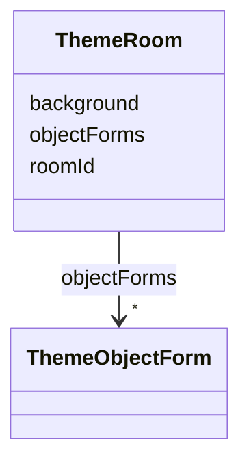

---
search:
  boost: 10.0
---

# Class: ThemeRoom

<div data-search-exclude markdown="1">


URI: [jumo:ThemeRoom](https://jumo.dev/schemas/jumo-v1/ThemeRoom)





<!-- no inheritance hierarchy -->

## Slots

| Name | Cardinality and Range | Description | Inheritance |
| ---  | --- | --- | --- |
| [roomId](roomId.md) | 1 <br/> [String](String.md) |  | direct |
| [background](background.md) | 1 <br/> [String](String.md) | Asset reference for the room's illustrated 2D backdrop | direct |
| [objectForms](objectForms.md) | * <br/> [ThemeObjectForm](ThemeObjectForm.md) | Themed representation by business entity key -- the business term stays visib... | direct |


## Usages

| used by | used in | type | used |
| ---  | --- | --- | --- |
| [ThemeVisualization](ThemeVisualization.md) | [rooms](rooms.md) | range | [ThemeRoom](ThemeRoom.md) |


## Identifier and Mapping Information


### Annotations

| property | value |
| --- | --- |
| jumo.state_authority | GIT |
| jumo.model_role | VALUE_OBJECT |
| jumo.audience | REALM_PRIVATE |
| jumo.sensitivity | PUBLIC |
| jumo.boundary_eligible | True |
| jumo.schema_profiles | draft-2020-12,native-json-schema,prompted-json-validated |


### Schema Source


* from schema: https://jumo.dev/schemas/jumo-v1


## Mappings

| Mapping Type | Mapped Value |
| ---  | ---  |
| self | jumo:ThemeRoom |
| native | jumo:ThemeRoom |


## LinkML Source

<!-- TODO: investigate https://stackoverflow.com/questions/37606292/how-to-create-tabbed-code-blocks-in-mkdocs-or-sphinx -->

### Direct

<details>
```yaml
name: ThemeRoom
annotations:
  jumo.state_authority:
    tag: jumo.state_authority
    value: GIT
  jumo.model_role:
    tag: jumo.model_role
    value: VALUE_OBJECT
  jumo.audience:
    tag: jumo.audience
    value: REALM_PRIVATE
  jumo.sensitivity:
    tag: jumo.sensitivity
    value: PUBLIC
  jumo.boundary_eligible:
    tag: jumo.boundary_eligible
    value: true
  jumo.schema_profiles:
    tag: jumo.schema_profiles
    value: draft-2020-12,native-json-schema,prompted-json-validated
from_schema: https://jumo.dev/schemas/jumo-v1
attributes:
  roomId:
    name: roomId
    from_schema: https://jumo.dev/schemas/jumo-v1
    rank: 1000
    owner: ThemeRoom
    domain_of:
    - ThemeRoom
    range: string
    required: true
    pattern: ^[a-z][a-z0-9-]*$
  background:
    name: background
    description: Asset reference for the room's illustrated 2D backdrop.
    from_schema: https://jumo.dev/schemas/jumo-v1
    rank: 1000
    owner: ThemeRoom
    domain_of:
    - ThemeRoom
    range: string
    required: true
    pattern: ^.{3,}$
  objectForms:
    name: objectForms
    description: Themed representation by business entity key -- the business term
      stays visible next to the metaphor (decision 216).
    from_schema: https://jumo.dev/schemas/jumo-v1
    rank: 1000
    owner: ThemeRoom
    domain_of:
    - ThemeRoom
    range: ThemeObjectForm
    multivalued: true
    inlined: true
    inlined_as_list: true

```
</details>

### Induced

<details>
```yaml
name: ThemeRoom
annotations:
  jumo.state_authority:
    tag: jumo.state_authority
    value: GIT
  jumo.model_role:
    tag: jumo.model_role
    value: VALUE_OBJECT
  jumo.audience:
    tag: jumo.audience
    value: REALM_PRIVATE
  jumo.sensitivity:
    tag: jumo.sensitivity
    value: PUBLIC
  jumo.boundary_eligible:
    tag: jumo.boundary_eligible
    value: true
  jumo.schema_profiles:
    tag: jumo.schema_profiles
    value: draft-2020-12,native-json-schema,prompted-json-validated
from_schema: https://jumo.dev/schemas/jumo-v1
attributes:
  roomId:
    name: roomId
    from_schema: https://jumo.dev/schemas/jumo-v1
    rank: 1000
    owner: ThemeRoom
    domain_of:
    - ThemeRoom
    range: string
    required: true
    pattern: ^[a-z][a-z0-9-]*$
  background:
    name: background
    description: Asset reference for the room's illustrated 2D backdrop.
    from_schema: https://jumo.dev/schemas/jumo-v1
    rank: 1000
    owner: ThemeRoom
    domain_of:
    - ThemeRoom
    range: string
    required: true
    pattern: ^.{3,}$
  objectForms:
    name: objectForms
    description: Themed representation by business entity key -- the business term
      stays visible next to the metaphor (decision 216).
    from_schema: https://jumo.dev/schemas/jumo-v1
    rank: 1000
    owner: ThemeRoom
    domain_of:
    - ThemeRoom
    range: ThemeObjectForm
    multivalued: true
    inlined: true
    inlined_as_list: true

```
</details></div>