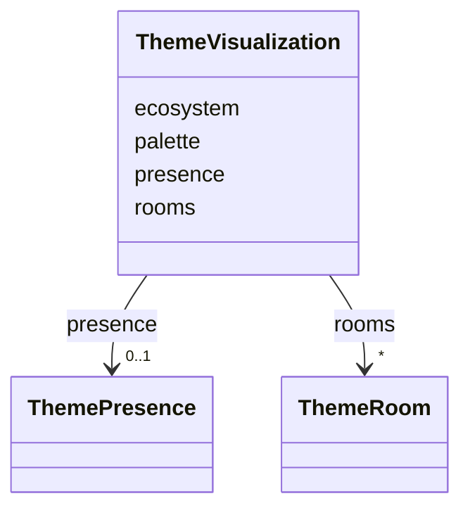

---
search:
  boost: 10.0
---

# Class: ThemeVisualization

<div data-search-exclude markdown="1">


URI: [jumo:ThemeVisualization](https://jumo.dev/schemas/jumo-v1/ThemeVisualization)





<!-- no inheritance hierarchy -->

## Slots

| Name | Cardinality and Range | Description | Inheritance |
| ---  | --- | --- | --- |
| [ecosystem](ecosystem.md) | 0..1 <br/> [String](String.md) |  | direct |
| [palette](palette.md) | 0..1 <br/> [String](String.md) |  | direct |
| [presence](presence.md) | 0..1 <br/> [ThemePresence](ThemePresence.md) |  | direct |
| [rooms](rooms.md) | * <br/> [ThemeRoom](ThemeRoom.md) | Illustrated room decor keyed by surface id (ADR-0087) | direct |


## Usages

| used by | used in | type | used |
| ---  | --- | --- | --- |
| [ThemePackSpec](ThemePackSpec.md) | [visualization](visualization.md) | range | [ThemeVisualization](ThemeVisualization.md) |


## Identifier and Mapping Information


### Annotations

| property | value |
| --- | --- |
| jumo.state_authority | GIT |
| jumo.model_role | VALUE_OBJECT |
| jumo.audience | REALM_PRIVATE |
| jumo.sensitivity | PUBLIC |
| jumo.boundary_eligible | True |
| jumo.schema_profiles | draft-2020-12,native-json-schema,prompted-json-validated |


### Schema Source


* from schema: https://jumo.dev/schemas/jumo-v1


## Mappings

| Mapping Type | Mapped Value |
| ---  | ---  |
| self | jumo:ThemeVisualization |
| native | jumo:ThemeVisualization |


## LinkML Source

<!-- TODO: investigate https://stackoverflow.com/questions/37606292/how-to-create-tabbed-code-blocks-in-mkdocs-or-sphinx -->

### Direct

<details>
```yaml
name: ThemeVisualization
annotations:
  jumo.state_authority:
    tag: jumo.state_authority
    value: GIT
  jumo.model_role:
    tag: jumo.model_role
    value: VALUE_OBJECT
  jumo.audience:
    tag: jumo.audience
    value: REALM_PRIVATE
  jumo.sensitivity:
    tag: jumo.sensitivity
    value: PUBLIC
  jumo.boundary_eligible:
    tag: jumo.boundary_eligible
    value: true
  jumo.schema_profiles:
    tag: jumo.schema_profiles
    value: draft-2020-12,native-json-schema,prompted-json-validated
from_schema: https://jumo.dev/schemas/jumo-v1
attributes:
  ecosystem:
    name: ecosystem
    from_schema: https://jumo.dev/schemas/jumo-v1
    rank: 1000
    owner: ThemeVisualization
    domain_of:
    - ThemeVisualization
    range: string
    pattern: ^.{3,}$
  palette:
    name: palette
    from_schema: https://jumo.dev/schemas/jumo-v1
    rank: 1000
    owner: ThemeVisualization
    domain_of:
    - ThemeVisualization
    range: string
    pattern: ^.{3,}$
  presence:
    name: presence
    from_schema: https://jumo.dev/schemas/jumo-v1
    rank: 1000
    owner: ThemeVisualization
    domain_of:
    - ThemeVisualization
    range: ThemePresence
    inlined: true
  rooms:
    name: rooms
    description: Illustrated room decor keyed by surface id (ADR-0087). A missing
      entry renders the classic view rather than failing.
    from_schema: https://jumo.dev/schemas/jumo-v1
    rank: 1000
    owner: ThemeVisualization
    domain_of:
    - ThemeVisualization
    range: ThemeRoom
    multivalued: true
    inlined: true
    inlined_as_list: true

```
</details>

### Induced

<details>
```yaml
name: ThemeVisualization
annotations:
  jumo.state_authority:
    tag: jumo.state_authority
    value: GIT
  jumo.model_role:
    tag: jumo.model_role
    value: VALUE_OBJECT
  jumo.audience:
    tag: jumo.audience
    value: REALM_PRIVATE
  jumo.sensitivity:
    tag: jumo.sensitivity
    value: PUBLIC
  jumo.boundary_eligible:
    tag: jumo.boundary_eligible
    value: true
  jumo.schema_profiles:
    tag: jumo.schema_profiles
    value: draft-2020-12,native-json-schema,prompted-json-validated
from_schema: https://jumo.dev/schemas/jumo-v1
attributes:
  ecosystem:
    name: ecosystem
    from_schema: https://jumo.dev/schemas/jumo-v1
    rank: 1000
    owner: ThemeVisualization
    domain_of:
    - ThemeVisualization
    range: string
    pattern: ^.{3,}$
  palette:
    name: palette
    from_schema: https://jumo.dev/schemas/jumo-v1
    rank: 1000
    owner: ThemeVisualization
    domain_of:
    - ThemeVisualization
    range: string
    pattern: ^.{3,}$
  presence:
    name: presence
    from_schema: https://jumo.dev/schemas/jumo-v1
    rank: 1000
    owner: ThemeVisualization
    domain_of:
    - ThemeVisualization
    range: ThemePresence
    inlined: true
  rooms:
    name: rooms
    description: Illustrated room decor keyed by surface id (ADR-0087). A missing
      entry renders the classic view rather than failing.
    from_schema: https://jumo.dev/schemas/jumo-v1
    rank: 1000
    owner: ThemeVisualization
    domain_of:
    - ThemeVisualization
    range: ThemeRoom
    multivalued: true
    inlined: true
    inlined_as_list: true

```
</details></div>