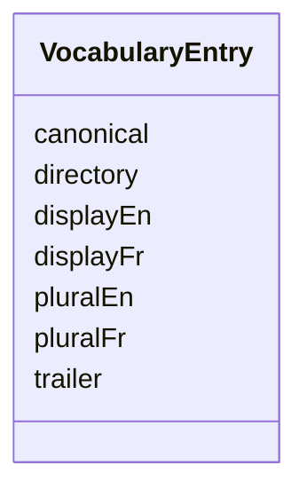

---
search:
  boost: 10.0
---

# Class: VocabularyEntry


_One CONTRACT kind's names. directory and trailer are target-state values the atomic rename (vocabulary-glossary-and-rename AC2/AC3) has not applied everywhere yet -- they are not cross-checked against the current filesystem or commit-msg hook._


<div data-search-exclude markdown="1">


URI: [jumo:VocabularyEntry](https://jumo.dev/schemas/jumo-v1/VocabularyEntry)





<!-- no inheritance hierarchy -->

## Slots

| Name | Cardinality and Range | Description | Inheritance |
| ---  | --- | --- | --- |
| [canonical](canonical.md) | 1 <br/> [String](String.md) |  | direct |
| [displayEn](displayEn.md) | 1 <br/> [String](String.md) |  | direct |
| [displayFr](displayFr.md) | 1 <br/> [String](String.md) |  | direct |
| [pluralEn](pluralEn.md) | 1 <br/> [String](String.md) |  | direct |
| [pluralFr](pluralFr.md) | 1 <br/> [String](String.md) |  | direct |
| [directory](directory.md) | 0..1 <br/> [String](String.md) |  | direct |
| [trailer](trailer.md) | 0..1 <br/> [String](String.md) |  | direct |


## Usages

| used by | used in | type | used |
| ---  | --- | --- | --- |
| [VocabularySetSpec](VocabularySetSpec.md) | [entries](entries.md) | range | [VocabularyEntry](VocabularyEntry.md) |


## Identifier and Mapping Information


### Annotations

| property | value |
| --- | --- |
| jumo.state_authority | GIT |
| jumo.model_role | VALUE_OBJECT |
| jumo.audience | REALM_PRIVATE |
| jumo.sensitivity | INTERNAL |
| jumo.boundary_eligible | True |
| jumo.schema_profiles | draft-2020-12,native-json-schema,prompted-json-validated |


### Schema Source


* from schema: https://jumo.dev/schemas/jumo-v1


## Mappings

| Mapping Type | Mapped Value |
| ---  | ---  |
| self | jumo:VocabularyEntry |
| native | jumo:VocabularyEntry |


## LinkML Source

<!-- TODO: investigate https://stackoverflow.com/questions/37606292/how-to-create-tabbed-code-blocks-in-mkdocs-or-sphinx -->

### Direct

<details>
```yaml
name: VocabularyEntry
annotations:
  jumo.state_authority:
    tag: jumo.state_authority
    value: GIT
  jumo.model_role:
    tag: jumo.model_role
    value: VALUE_OBJECT
  jumo.audience:
    tag: jumo.audience
    value: REALM_PRIVATE
  jumo.sensitivity:
    tag: jumo.sensitivity
    value: INTERNAL
  jumo.boundary_eligible:
    tag: jumo.boundary_eligible
    value: true
  jumo.schema_profiles:
    tag: jumo.schema_profiles
    value: draft-2020-12,native-json-schema,prompted-json-validated
description: One CONTRACT kind's names. directory and trailer are target-state values
  the atomic rename (vocabulary-glossary-and-rename AC2/AC3) has not applied everywhere
  yet -- they are not cross-checked against the current filesystem or commit-msg hook.
from_schema: https://jumo.dev/schemas/jumo-v1
attributes:
  canonical:
    name: canonical
    from_schema: https://jumo.dev/schemas/jumo-v1
    rank: 1000
    owner: VocabularyEntry
    domain_of:
    - VocabularyEntry
    range: string
    required: true
    pattern: ^[A-Z][A-Za-z0-9]*$
  displayEn:
    name: displayEn
    from_schema: https://jumo.dev/schemas/jumo-v1
    rank: 1000
    owner: VocabularyEntry
    domain_of:
    - VocabularyEntry
    range: string
    required: true
    pattern: ^.{1,}$
  displayFr:
    name: displayFr
    from_schema: https://jumo.dev/schemas/jumo-v1
    rank: 1000
    owner: VocabularyEntry
    domain_of:
    - VocabularyEntry
    range: string
    required: true
    pattern: ^.{1,}$
  pluralEn:
    name: pluralEn
    from_schema: https://jumo.dev/schemas/jumo-v1
    rank: 1000
    owner: VocabularyEntry
    domain_of:
    - VocabularyEntry
    range: string
    required: true
    pattern: ^.{1,}$
  pluralFr:
    name: pluralFr
    from_schema: https://jumo.dev/schemas/jumo-v1
    rank: 1000
    owner: VocabularyEntry
    domain_of:
    - VocabularyEntry
    range: string
    required: true
    pattern: ^.{1,}$
  directory:
    name: directory
    from_schema: https://jumo.dev/schemas/jumo-v1
    rank: 1000
    owner: VocabularyEntry
    domain_of:
    - VocabularyEntry
    range: string
    pattern: ^[a-z][a-z0-9-]*$
  trailer:
    name: trailer
    from_schema: https://jumo.dev/schemas/jumo-v1
    rank: 1000
    owner: VocabularyEntry
    domain_of:
    - VocabularyEntry
    range: string
    pattern: ^Jumo-[A-Za-z-]+$

```
</details>

### Induced

<details>
```yaml
name: VocabularyEntry
annotations:
  jumo.state_authority:
    tag: jumo.state_authority
    value: GIT
  jumo.model_role:
    tag: jumo.model_role
    value: VALUE_OBJECT
  jumo.audience:
    tag: jumo.audience
    value: REALM_PRIVATE
  jumo.sensitivity:
    tag: jumo.sensitivity
    value: INTERNAL
  jumo.boundary_eligible:
    tag: jumo.boundary_eligible
    value: true
  jumo.schema_profiles:
    tag: jumo.schema_profiles
    value: draft-2020-12,native-json-schema,prompted-json-validated
description: One CONTRACT kind's names. directory and trailer are target-state values
  the atomic rename (vocabulary-glossary-and-rename AC2/AC3) has not applied everywhere
  yet -- they are not cross-checked against the current filesystem or commit-msg hook.
from_schema: https://jumo.dev/schemas/jumo-v1
attributes:
  canonical:
    name: canonical
    from_schema: https://jumo.dev/schemas/jumo-v1
    rank: 1000
    owner: VocabularyEntry
    domain_of:
    - VocabularyEntry
    range: string
    required: true
    pattern: ^[A-Z][A-Za-z0-9]*$
  displayEn:
    name: displayEn
    from_schema: https://jumo.dev/schemas/jumo-v1
    rank: 1000
    owner: VocabularyEntry
    domain_of:
    - VocabularyEntry
    range: string
    required: true
    pattern: ^.{1,}$
  displayFr:
    name: displayFr
    from_schema: https://jumo.dev/schemas/jumo-v1
    rank: 1000
    owner: VocabularyEntry
    domain_of:
    - VocabularyEntry
    range: string
    required: true
    pattern: ^.{1,}$
  pluralEn:
    name: pluralEn
    from_schema: https://jumo.dev/schemas/jumo-v1
    rank: 1000
    owner: VocabularyEntry
    domain_of:
    - VocabularyEntry
    range: string
    required: true
    pattern: ^.{1,}$
  pluralFr:
    name: pluralFr
    from_schema: https://jumo.dev/schemas/jumo-v1
    rank: 1000
    owner: VocabularyEntry
    domain_of:
    - VocabularyEntry
    range: string
    required: true
    pattern: ^.{1,}$
  directory:
    name: directory
    from_schema: https://jumo.dev/schemas/jumo-v1
    rank: 1000
    owner: VocabularyEntry
    domain_of:
    - VocabularyEntry
    range: string
    pattern: ^[a-z][a-z0-9-]*$
  trailer:
    name: trailer
    from_schema: https://jumo.dev/schemas/jumo-v1
    rank: 1000
    owner: VocabularyEntry
    domain_of:
    - VocabularyEntry
    range: string
    pattern: ^Jumo-[A-Za-z-]+$

```
</details></div>