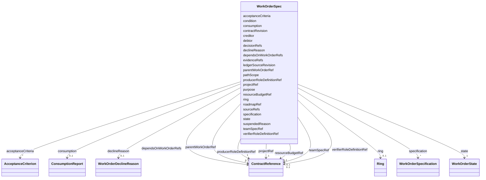

---
search:
  boost: 10.0
---

# Class: WorkOrderSpec

<div data-search-exclude markdown="1">


URI: [jumo:WorkOrderSpec](https://jumo.dev/schemas/jumo-v1/WorkOrderSpec)





<!-- no inheritance hierarchy -->

## Slots

| Name | Cardinality and Range | Description | Inheritance |
| ---  | --- | --- | --- |
| [purpose](purpose.md) | 1 <br/> [String](String.md) |  | direct |
| [producerRoleDefinitionRef](producerRoleDefinitionRef.md) | 1 <br/> [ContractReference](ContractReference.md) | The individual accountable role | direct |
| [teamSpecRef](teamSpecRef.md) | 0..1 <br/> [ContractReference](ContractReference.md) |  | direct |
| [projectRef](projectRef.md) | 1 <br/> [ContractReference](ContractReference.md) |  | direct |
| [roadmapRef](roadmapRef.md) | 0..1 <br/> [Identifier](Identifier.md) | Groups durable work contracts into a generated roadmap projection | direct |
| [decisionRefs](decisionRefs.md) | * <br/> [DecisionReference](DecisionReference.md) | Architecture decisions this work implements or expects | direct |
| [verifierRoleDefinitionRef](verifierRoleDefinitionRef.md) | 0..1 <br/> [ContractReference](ContractReference.md) | The role that checks the result against the criteria below | direct |
| [state](state.md) | 1 <br/> [WorkOrderState](WorkOrderState.md) |  | direct |
| [declineReason](declineReason.md) | 0..1 <br/> [WorkOrderDeclineReason](WorkOrderDeclineReason.md) |  | direct |
| [suspendedReason](suspendedReason.md) | 0..1 <br/> [String](String.md) | Set when state is PROPOSED after having been ACCEPTED or IN_PROGRESS, to reco... | direct |
| [debtor](debtor.md) | 0..1 <br/> [Identifier](Identifier.md) | The role or team that owes this work (commitment lifecycle addition, conceptu... | direct |
| [creditor](creditor.md) | 0..1 <br/> [Identifier](Identifier.md) | The role, team, or Project the work is owed to | direct |
| [condition](condition.md) | 0..1 <br/> [String](String.md) | The condition under which this commitment is discharged, in addition to (not ... | direct |
| [acceptanceCriteria](acceptanceCriteria.md) | * <br/> [AcceptanceCriterion](AcceptanceCriterion.md) | What the result is checked against | direct |
| [specification](specification.md) | * <br/> [WorkOrderSpecification](WorkOrderSpecification.md) | Long-form design lots too large for purpose/condition/acceptanceCriteria -- M... | direct |
| [pathScope](pathScope.md) | * <br/> [String](String.md) | Glob patterns the work may touch | direct |
| [ring](ring.md) | 0..1 <br/> [Ring](Ring.md) | The ring this work acts on | direct |
| [dependsOnWorkOrderRefs](dependsOnWorkOrderRefs.md) | * <br/> [ContractReference](ContractReference.md) | WorkOrders that must be COMPLETED before this one starts | direct |
| [parentWorkOrderRef](parentWorkOrderRef.md) | 0..1 <br/> [ContractReference](ContractReference.md) | The larger item this decomposes | direct |
| [sourceRefs](sourceRefs.md) | * <br/> [String](String.md) |  | direct |
| [contractRevision](contractRevision.md) | 1 <br/> [String](String.md) | Commit the contracts were read at | direct |
| [evidenceRefs](evidenceRefs.md) | * <br/> [String](String.md) |  | direct |
| [ledgerSourceRevision](ledgerSourceRevision.md) | 0..1 <br/> [String](String.md) | Commit that carried the last full (pre-compaction) revision of this record, f... | direct |
| [consumption](consumption.md) | 0..1 <br/> [ConsumptionReport](ConsumptionReport.md) |  | direct |
| [resourceBudgetRef](resourceBudgetRef.md) | 0..1 <br/> [ContractReference](ContractReference.md) |  | direct |


## Usages

| used by | used in | type | used |
| ---  | --- | --- | --- |
| [WorkOrder](WorkOrder.md) | [spec](spec.md) | range | [WorkOrderSpec](WorkOrderSpec.md) |


## Identifier and Mapping Information


### Annotations

| property | value |
| --- | --- |
| jumo.state_authority | GIT |
| jumo.model_role | VALUE_OBJECT |
| jumo.audience | REALM_PRIVATE |
| jumo.sensitivity | INTERNAL |
| jumo.boundary_eligible | True |
| jumo.schema_profiles | draft-2020-12,native-json-schema,prompted-json-validated |


### Schema Source


* from schema: https://jumo.dev/schemas/jumo-v1


## Mappings

| Mapping Type | Mapped Value |
| ---  | ---  |
| self | jumo:WorkOrderSpec |
| native | jumo:WorkOrderSpec |


## LinkML Source

<!-- TODO: investigate https://stackoverflow.com/questions/37606292/how-to-create-tabbed-code-blocks-in-mkdocs-or-sphinx -->

### Direct

<details>
```yaml
name: WorkOrderSpec
annotations:
  jumo.state_authority:
    tag: jumo.state_authority
    value: GIT
  jumo.model_role:
    tag: jumo.model_role
    value: VALUE_OBJECT
  jumo.audience:
    tag: jumo.audience
    value: REALM_PRIVATE
  jumo.sensitivity:
    tag: jumo.sensitivity
    value: INTERNAL
  jumo.boundary_eligible:
    tag: jumo.boundary_eligible
    value: true
  jumo.schema_profiles:
    tag: jumo.schema_profiles
    value: draft-2020-12,native-json-schema,prompted-json-validated
from_schema: https://jumo.dev/schemas/jumo-v1
attributes:
  purpose:
    name: purpose
    from_schema: https://jumo.dev/schemas/jumo-v1
    owner: WorkOrderSpec
    domain_of:
    - ProjectSpec
    - TeamSpecBody
    - WorkOrderSpec
    - PracticeSpec
    - PromptTemplateSpec
    - ImprovementLoopSpec
    - ProcessingRegisterEntry
    - McpBundleSemanticProfile
    - Surface
    range: string
    required: true
    pattern: ^.{10,}$
  producerRoleDefinitionRef:
    name: producerRoleDefinitionRef
    description: The individual accountable role. A team is never the final accountable
      addressee.
    from_schema: https://jumo.dev/schemas/jumo-v1
    rank: 1000
    owner: WorkOrderSpec
    domain_of:
    - WorkOrderSpec
    range: ContractReference
    required: true
    inlined: true
  teamSpecRef:
    name: teamSpecRef
    from_schema: https://jumo.dev/schemas/jumo-v1
    owner: WorkOrderSpec
    domain_of:
    - TeamMember
    - WorkOrderSpec
    range: ContractReference
    inlined: true
  projectRef:
    name: projectRef
    from_schema: https://jumo.dev/schemas/jumo-v1
    owner: WorkOrderSpec
    domain_of:
    - RoutingEligibilitySpec
    - WorkOrderSpec
    - ImprovementLoopSpec
    - ProcessSpecBody
    - ChangeProposalRef
    - ForgeProjectionRef
    - ProcessRunRef
    - ApprovalSignal
    - ExecutionCellProvisioningRef
    range: ContractReference
    required: true
    inlined: true
  roadmapRef:
    name: roadmapRef
    description: Groups durable work contracts into a generated roadmap projection.
    from_schema: https://jumo.dev/schemas/jumo-v1
    rank: 1000
    owner: WorkOrderSpec
    domain_of:
    - WorkOrderSpec
    range: Identifier
  decisionRefs:
    name: decisionRefs
    description: Architecture decisions this work implements or expects.
    from_schema: https://jumo.dev/schemas/jumo-v1
    rank: 1000
    owner: WorkOrderSpec
    domain_of:
    - WorkOrderSpec
    range: DecisionReference
    multivalued: true
  verifierRoleDefinitionRef:
    name: verifierRoleDefinitionRef
    description: The role that checks the result against the criteria below. May not
      be the producer; resolves through teamSpecRef to prove a different independence
      group (Rego).
    from_schema: https://jumo.dev/schemas/jumo-v1
    rank: 1000
    owner: WorkOrderSpec
    domain_of:
    - WorkOrderSpec
    range: ContractReference
    inlined: true
  state:
    name: state
    from_schema: https://jumo.dev/schemas/jumo-v1
    owner: WorkOrderSpec
    domain_of:
    - OfferingSpecBody
    - WorkOrderSpec
    - ImprovementRecommendationSpec
    - ChangeSetProjection
    range: WorkOrderState
    required: true
  declineReason:
    name: declineReason
    from_schema: https://jumo.dev/schemas/jumo-v1
    rank: 1000
    owner: WorkOrderSpec
    domain_of:
    - WorkOrderSpec
    range: WorkOrderDeclineReason
  suspendedReason:
    name: suspendedReason
    description: Set when state is PROPOSED after having been ACCEPTED or IN_PROGRESS,
      to record why work paused rather than why it was declined. Distinct from declineReason,
      which is permanent.
    from_schema: https://jumo.dev/schemas/jumo-v1
    rank: 1000
    owner: WorkOrderSpec
    domain_of:
    - WorkOrderSpec
    range: string
    pattern: ^.{1,160}$
  debtor:
    name: debtor
    description: The role or team that owes this work (commitment lifecycle addition,
      conceptual upgrades table). Defaults conceptually to producerRoleDefinitionRef/teamSpecRef;
      kept as an explicit field so a WorkOrder assigned onward carries an accountable
      debtor independent of who drafted it.
    from_schema: https://jumo.dev/schemas/jumo-v1
    rank: 1000
    owner: WorkOrderSpec
    domain_of:
    - WorkOrderSpec
    range: Identifier
  creditor:
    name: creditor
    description: The role, team, or Project the work is owed to.
    from_schema: https://jumo.dev/schemas/jumo-v1
    rank: 1000
    owner: WorkOrderSpec
    domain_of:
    - WorkOrderSpec
    range: Identifier
  condition:
    name: condition
    description: The condition under which this commitment is discharged, in addition
      to (not instead of) acceptanceCriteria -- acceptanceCriteria is what is checked;
      condition is the commitment-theoretic statement of when the debt is considered
      settled.
    from_schema: https://jumo.dev/schemas/jumo-v1
    rank: 1000
    owner: WorkOrderSpec
    domain_of:
    - WorkOrderSpec
    range: string
  acceptanceCriteria:
    name: acceptanceCriteria
    description: What the result is checked against. Required from ACCEPTED onward
      (Rego, same as the source schema's conditional).
    from_schema: https://jumo.dev/schemas/jumo-v1
    rank: 1000
    owner: WorkOrderSpec
    domain_of:
    - WorkOrderSpec
    range: AcceptanceCriterion
    multivalued: true
    inlined: true
    inlined_as_list: true
  specification:
    name: specification
    description: Long-form design lots too large for purpose/condition/acceptanceCriteria
      -- Markdown body, no language restriction (WorkOrder specification prose is
      exempt from the English-only rule, AGENTS.md).
    from_schema: https://jumo.dev/schemas/jumo-v1
    rank: 1000
    owner: WorkOrderSpec
    domain_of:
    - WorkOrderSpec
    range: WorkOrderSpecification
    multivalued: true
    inlined: true
    inlined_as_list: true
  pathScope:
    name: pathScope
    description: Glob patterns the work may touch.
    from_schema: https://jumo.dev/schemas/jumo-v1
    rank: 1000
    owner: WorkOrderSpec
    domain_of:
    - WorkOrderSpec
    range: string
    multivalued: true
    pattern: ^.{1,}$
  ring:
    name: ring
    description: 'The ring this work acts on. RING_0_ROOT_OF_TRUST exclusion (source
      schema''s `not: const`) moves to Rego.'
    from_schema: https://jumo.dev/schemas/jumo-v1
    rank: 1000
    owner: WorkOrderSpec
    domain_of:
    - WorkOrderSpec
    - PromptTemplateSpec
    - ImprovementTarget
    - ProcessStep
    - SurfaceWritePath
    range: Ring
  dependsOnWorkOrderRefs:
    name: dependsOnWorkOrderRefs
    description: WorkOrders that must be COMPLETED before this one starts.
    from_schema: https://jumo.dev/schemas/jumo-v1
    rank: 1000
    owner: WorkOrderSpec
    domain_of:
    - WorkOrderSpec
    range: ContractReference
    multivalued: true
    inlined: true
    inlined_as_list: true
  parentWorkOrderRef:
    name: parentWorkOrderRef
    description: The larger item this decomposes.
    from_schema: https://jumo.dev/schemas/jumo-v1
    rank: 1000
    owner: WorkOrderSpec
    domain_of:
    - WorkOrderSpec
    range: ContractReference
    inlined: true
  sourceRefs:
    name: sourceRefs
    from_schema: https://jumo.dev/schemas/jumo-v1
    rank: 1000
    owner: WorkOrderSpec
    domain_of:
    - WorkOrderSpec
    range: string
    multivalued: true
    pattern: ^.{1,}$
  contractRevision:
    name: contractRevision
    description: Commit the contracts were read at.
    from_schema: https://jumo.dev/schemas/jumo-v1
    rank: 1000
    owner: WorkOrderSpec
    domain_of:
    - WorkOrderSpec
    - MachineAdminCommand
    - WorkloadCommand
    - McpInventorySnapshot
    range: string
    required: true
    pattern: ^.{7,}$
  evidenceRefs:
    name: evidenceRefs
    from_schema: https://jumo.dev/schemas/jumo-v1
    owner: WorkOrderSpec
    domain_of:
    - KitReleaseCertificationSpec
    - WorkOrderSpec
    - AttentionItemSpec
    - ControlAssessment
    - ConnectorAppraisalSpec
    - RemoteMcpAppraisalSpec
    range: string
    multivalued: true
    pattern: ^.{1,}$
  ledgerSourceRevision:
    name: ledgerSourceRevision
    description: Commit that carried the last full (pre-compaction) revision of this
      record, for a COMPLETED WorkOrder compacted into .jumo/work/ledger/. Set by
      scripts/migrate/compact-completed-work.py, never by hand.
    from_schema: https://jumo.dev/schemas/jumo-v1
    rank: 1000
    owner: WorkOrderSpec
    domain_of:
    - WorkOrderSpec
    range: string
    pattern: ^.{7,}$
  consumption:
    name: consumption
    from_schema: https://jumo.dev/schemas/jumo-v1
    rank: 1000
    owner: WorkOrderSpec
    domain_of:
    - WorkOrderSpec
    range: ConsumptionReport
    inlined: true
  resourceBudgetRef:
    name: resourceBudgetRef
    from_schema: https://jumo.dev/schemas/jumo-v1
    rank: 1000
    owner: WorkOrderSpec
    domain_of:
    - WorkOrderSpec
    - EngagementMethodSpec
    - PracticeSpec
    - PromptTemplateSpec
    - AssistedJourneySpec
    - ProcessSpecBody
    range: ContractReference
    inlined: true

```
</details>

### Induced

<details>
```yaml
name: WorkOrderSpec
annotations:
  jumo.state_authority:
    tag: jumo.state_authority
    value: GIT
  jumo.model_role:
    tag: jumo.model_role
    value: VALUE_OBJECT
  jumo.audience:
    tag: jumo.audience
    value: REALM_PRIVATE
  jumo.sensitivity:
    tag: jumo.sensitivity
    value: INTERNAL
  jumo.boundary_eligible:
    tag: jumo.boundary_eligible
    value: true
  jumo.schema_profiles:
    tag: jumo.schema_profiles
    value: draft-2020-12,native-json-schema,prompted-json-validated
from_schema: https://jumo.dev/schemas/jumo-v1
attributes:
  purpose:
    name: purpose
    from_schema: https://jumo.dev/schemas/jumo-v1
    owner: WorkOrderSpec
    domain_of:
    - ProjectSpec
    - TeamSpecBody
    - WorkOrderSpec
    - PracticeSpec
    - PromptTemplateSpec
    - ImprovementLoopSpec
    - ProcessingRegisterEntry
    - McpBundleSemanticProfile
    - Surface
    range: string
    required: true
    pattern: ^.{10,}$
  producerRoleDefinitionRef:
    name: producerRoleDefinitionRef
    description: The individual accountable role. A team is never the final accountable
      addressee.
    from_schema: https://jumo.dev/schemas/jumo-v1
    rank: 1000
    owner: WorkOrderSpec
    domain_of:
    - WorkOrderSpec
    range: ContractReference
    required: true
    inlined: true
  teamSpecRef:
    name: teamSpecRef
    from_schema: https://jumo.dev/schemas/jumo-v1
    owner: WorkOrderSpec
    domain_of:
    - TeamMember
    - WorkOrderSpec
    range: ContractReference
    inlined: true
  projectRef:
    name: projectRef
    from_schema: https://jumo.dev/schemas/jumo-v1
    owner: WorkOrderSpec
    domain_of:
    - RoutingEligibilitySpec
    - WorkOrderSpec
    - ImprovementLoopSpec
    - ProcessSpecBody
    - ChangeProposalRef
    - ForgeProjectionRef
    - ProcessRunRef
    - ApprovalSignal
    - ExecutionCellProvisioningRef
    range: ContractReference
    required: true
    inlined: true
  roadmapRef:
    name: roadmapRef
    description: Groups durable work contracts into a generated roadmap projection.
    from_schema: https://jumo.dev/schemas/jumo-v1
    rank: 1000
    owner: WorkOrderSpec
    domain_of:
    - WorkOrderSpec
    range: Identifier
  decisionRefs:
    name: decisionRefs
    description: Architecture decisions this work implements or expects.
    from_schema: https://jumo.dev/schemas/jumo-v1
    rank: 1000
    owner: WorkOrderSpec
    domain_of:
    - WorkOrderSpec
    range: DecisionReference
    multivalued: true
  verifierRoleDefinitionRef:
    name: verifierRoleDefinitionRef
    description: The role that checks the result against the criteria below. May not
      be the producer; resolves through teamSpecRef to prove a different independence
      group (Rego).
    from_schema: https://jumo.dev/schemas/jumo-v1
    rank: 1000
    owner: WorkOrderSpec
    domain_of:
    - WorkOrderSpec
    range: ContractReference
    inlined: true
  state:
    name: state
    from_schema: https://jumo.dev/schemas/jumo-v1
    owner: WorkOrderSpec
    domain_of:
    - OfferingSpecBody
    - WorkOrderSpec
    - ImprovementRecommendationSpec
    - ChangeSetProjection
    range: WorkOrderState
    required: true
  declineReason:
    name: declineReason
    from_schema: https://jumo.dev/schemas/jumo-v1
    rank: 1000
    owner: WorkOrderSpec
    domain_of:
    - WorkOrderSpec
    range: WorkOrderDeclineReason
  suspendedReason:
    name: suspendedReason
    description: Set when state is PROPOSED after having been ACCEPTED or IN_PROGRESS,
      to record why work paused rather than why it was declined. Distinct from declineReason,
      which is permanent.
    from_schema: https://jumo.dev/schemas/jumo-v1
    rank: 1000
    owner: WorkOrderSpec
    domain_of:
    - WorkOrderSpec
    range: string
    pattern: ^.{1,160}$
  debtor:
    name: debtor
    description: The role or team that owes this work (commitment lifecycle addition,
      conceptual upgrades table). Defaults conceptually to producerRoleDefinitionRef/teamSpecRef;
      kept as an explicit field so a WorkOrder assigned onward carries an accountable
      debtor independent of who drafted it.
    from_schema: https://jumo.dev/schemas/jumo-v1
    rank: 1000
    owner: WorkOrderSpec
    domain_of:
    - WorkOrderSpec
    range: Identifier
  creditor:
    name: creditor
    description: The role, team, or Project the work is owed to.
    from_schema: https://jumo.dev/schemas/jumo-v1
    rank: 1000
    owner: WorkOrderSpec
    domain_of:
    - WorkOrderSpec
    range: Identifier
  condition:
    name: condition
    description: The condition under which this commitment is discharged, in addition
      to (not instead of) acceptanceCriteria -- acceptanceCriteria is what is checked;
      condition is the commitment-theoretic statement of when the debt is considered
      settled.
    from_schema: https://jumo.dev/schemas/jumo-v1
    rank: 1000
    owner: WorkOrderSpec
    domain_of:
    - WorkOrderSpec
    range: string
  acceptanceCriteria:
    name: acceptanceCriteria
    description: What the result is checked against. Required from ACCEPTED onward
      (Rego, same as the source schema's conditional).
    from_schema: https://jumo.dev/schemas/jumo-v1
    rank: 1000
    owner: WorkOrderSpec
    domain_of:
    - WorkOrderSpec
    range: AcceptanceCriterion
    multivalued: true
    inlined: true
    inlined_as_list: true
  specification:
    name: specification
    description: Long-form design lots too large for purpose/condition/acceptanceCriteria
      -- Markdown body, no language restriction (WorkOrder specification prose is
      exempt from the English-only rule, AGENTS.md).
    from_schema: https://jumo.dev/schemas/jumo-v1
    rank: 1000
    owner: WorkOrderSpec
    domain_of:
    - WorkOrderSpec
    range: WorkOrderSpecification
    multivalued: true
    inlined: true
    inlined_as_list: true
  pathScope:
    name: pathScope
    description: Glob patterns the work may touch.
    from_schema: https://jumo.dev/schemas/jumo-v1
    rank: 1000
    owner: WorkOrderSpec
    domain_of:
    - WorkOrderSpec
    range: string
    multivalued: true
    pattern: ^.{1,}$
  ring:
    name: ring
    description: 'The ring this work acts on. RING_0_ROOT_OF_TRUST exclusion (source
      schema''s `not: const`) moves to Rego.'
    from_schema: https://jumo.dev/schemas/jumo-v1
    rank: 1000
    owner: WorkOrderSpec
    domain_of:
    - WorkOrderSpec
    - PromptTemplateSpec
    - ImprovementTarget
    - ProcessStep
    - SurfaceWritePath
    range: Ring
  dependsOnWorkOrderRefs:
    name: dependsOnWorkOrderRefs
    description: WorkOrders that must be COMPLETED before this one starts.
    from_schema: https://jumo.dev/schemas/jumo-v1
    rank: 1000
    owner: WorkOrderSpec
    domain_of:
    - WorkOrderSpec
    range: ContractReference
    multivalued: true
    inlined: true
    inlined_as_list: true
  parentWorkOrderRef:
    name: parentWorkOrderRef
    description: The larger item this decomposes.
    from_schema: https://jumo.dev/schemas/jumo-v1
    rank: 1000
    owner: WorkOrderSpec
    domain_of:
    - WorkOrderSpec
    range: ContractReference
    inlined: true
  sourceRefs:
    name: sourceRefs
    from_schema: https://jumo.dev/schemas/jumo-v1
    rank: 1000
    owner: WorkOrderSpec
    domain_of:
    - WorkOrderSpec
    range: string
    multivalued: true
    pattern: ^.{1,}$
  contractRevision:
    name: contractRevision
    description: Commit the contracts were read at.
    from_schema: https://jumo.dev/schemas/jumo-v1
    rank: 1000
    owner: WorkOrderSpec
    domain_of:
    - WorkOrderSpec
    - MachineAdminCommand
    - WorkloadCommand
    - McpInventorySnapshot
    range: string
    required: true
    pattern: ^.{7,}$
  evidenceRefs:
    name: evidenceRefs
    from_schema: https://jumo.dev/schemas/jumo-v1
    owner: WorkOrderSpec
    domain_of:
    - KitReleaseCertificationSpec
    - WorkOrderSpec
    - AttentionItemSpec
    - ControlAssessment
    - ConnectorAppraisalSpec
    - RemoteMcpAppraisalSpec
    range: string
    multivalued: true
    pattern: ^.{1,}$
  ledgerSourceRevision:
    name: ledgerSourceRevision
    description: Commit that carried the last full (pre-compaction) revision of this
      record, for a COMPLETED WorkOrder compacted into .jumo/work/ledger/. Set by
      scripts/migrate/compact-completed-work.py, never by hand.
    from_schema: https://jumo.dev/schemas/jumo-v1
    rank: 1000
    owner: WorkOrderSpec
    domain_of:
    - WorkOrderSpec
    range: string
    pattern: ^.{7,}$
  consumption:
    name: consumption
    from_schema: https://jumo.dev/schemas/jumo-v1
    rank: 1000
    owner: WorkOrderSpec
    domain_of:
    - WorkOrderSpec
    range: ConsumptionReport
    inlined: true
  resourceBudgetRef:
    name: resourceBudgetRef
    from_schema: https://jumo.dev/schemas/jumo-v1
    rank: 1000
    owner: WorkOrderSpec
    domain_of:
    - WorkOrderSpec
    - EngagementMethodSpec
    - PracticeSpec
    - PromptTemplateSpec
    - AssistedJourneySpec
    - ProcessSpecBody
    range: ContractReference
    inlined: true

```
</details></div>