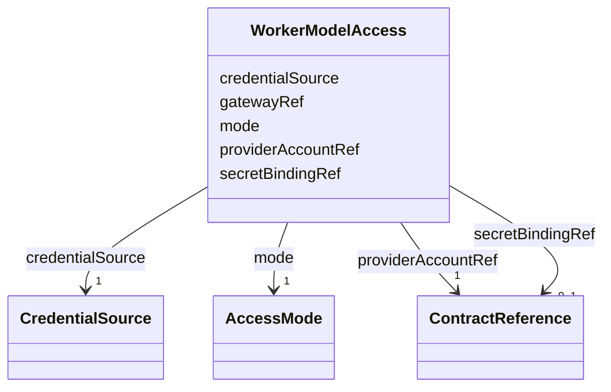

---
search:
  boost: 10.0
---

# Class: WorkerModelAccess

<div data-search-exclude markdown="1">


URI: [jumo:WorkerModelAccess](https://jumo.dev/schemas/jumo-v1/WorkerModelAccess)





<!-- no inheritance hierarchy -->

## Slots

| Name | Cardinality and Range | Description | Inheritance |
| ---  | --- | --- | --- |
| [mode](mode.md) | 1 <br/> [AccessMode](AccessMode.md) |  | direct |
| [providerAccountRef](providerAccountRef.md) | 1 <br/> [ContractReference](ContractReference.md) |  | direct |
| [credentialSource](credentialSource.md) | 1 <br/> [CredentialSource](CredentialSource.md) | MODEL_WORKER_PROCESS may consume only an OpenBao-rendered file bound to this ... | direct |
| [gatewayRef](gatewayRef.md) | 0..1 <br/> [ConfigurationRef](ConfigurationRef.md) |  | direct |
| [secretBindingRef](secretBindingRef.md) | 0..1 <br/> [ContractReference](ContractReference.md) |  | direct |


## Usages

| used by | used in | type | used |
| ---  | --- | --- | --- |
| [WorkerSubstrateSpec](WorkerSubstrateSpec.md) | [modelAccess](modelAccess.md) | range | [WorkerModelAccess](WorkerModelAccess.md) |


## Identifier and Mapping Information


### Annotations

| property | value |
| --- | --- |
| jumo.state_authority | GIT |
| jumo.model_role | VALUE_OBJECT |
| jumo.audience | REALM_PRIVATE |
| jumo.sensitivity | INTERNAL |
| jumo.boundary_eligible | True |
| jumo.schema_profiles | draft-2020-12,native-json-schema,prompted-json-validated |


### Schema Source


* from schema: https://jumo.dev/schemas/jumo-v1


## Mappings

| Mapping Type | Mapped Value |
| ---  | ---  |
| self | jumo:WorkerModelAccess |
| native | jumo:WorkerModelAccess |


## LinkML Source

<!-- TODO: investigate https://stackoverflow.com/questions/37606292/how-to-create-tabbed-code-blocks-in-mkdocs-or-sphinx -->

### Direct

<details>
```yaml
name: WorkerModelAccess
annotations:
  jumo.state_authority:
    tag: jumo.state_authority
    value: GIT
  jumo.model_role:
    tag: jumo.model_role
    value: VALUE_OBJECT
  jumo.audience:
    tag: jumo.audience
    value: REALM_PRIVATE
  jumo.sensitivity:
    tag: jumo.sensitivity
    value: INTERNAL
  jumo.boundary_eligible:
    tag: jumo.boundary_eligible
    value: true
  jumo.schema_profiles:
    tag: jumo.schema_profiles
    value: draft-2020-12,native-json-schema,prompted-json-validated
from_schema: https://jumo.dev/schemas/jumo-v1
attributes:
  mode:
    name: mode
    from_schema: https://jumo.dev/schemas/jumo-v1
    owner: WorkerModelAccess
    domain_of:
    - AcknowledgementPolicy
    - ExecutionCellTransport
    - ProviderRouting
    - WorkerModelAccess
    range: AccessMode
    required: true
  providerAccountRef:
    name: providerAccountRef
    from_schema: https://jumo.dev/schemas/jumo-v1
    owner: WorkerModelAccess
    domain_of:
    - ProviderSessionBinding
    - WorkerModelAccess
    range: ContractReference
    required: true
    inlined: true
  credentialSource:
    name: credentialSource
    description: MODEL_WORKER_PROCESS may consume only an OpenBao-rendered file bound
      to this substrate; no environment value, repository mount, or ambient credential
      is permitted.
    from_schema: https://jumo.dev/schemas/jumo-v1
    rank: 1000
    owner: WorkerModelAccess
    domain_of:
    - WorkerModelAccess
    range: CredentialSource
    required: true
  gatewayRef:
    name: gatewayRef
    from_schema: https://jumo.dev/schemas/jumo-v1
    owner: WorkerModelAccess
    domain_of:
    - ProviderRouting
    - WorkerModelAccess
    range: ConfigurationRef
  secretBindingRef:
    name: secretBindingRef
    from_schema: https://jumo.dev/schemas/jumo-v1
    owner: WorkerModelAccess
    domain_of:
    - DelegatedSecretGrant
    - McpRegistrySourceSpec
    - ProviderAccountSpec
    - WorkerModelAccess
    - ConnectorSessionBinding
    range: ContractReference
    inlined: true

```
</details>

### Induced

<details>
```yaml
name: WorkerModelAccess
annotations:
  jumo.state_authority:
    tag: jumo.state_authority
    value: GIT
  jumo.model_role:
    tag: jumo.model_role
    value: VALUE_OBJECT
  jumo.audience:
    tag: jumo.audience
    value: REALM_PRIVATE
  jumo.sensitivity:
    tag: jumo.sensitivity
    value: INTERNAL
  jumo.boundary_eligible:
    tag: jumo.boundary_eligible
    value: true
  jumo.schema_profiles:
    tag: jumo.schema_profiles
    value: draft-2020-12,native-json-schema,prompted-json-validated
from_schema: https://jumo.dev/schemas/jumo-v1
attributes:
  mode:
    name: mode
    from_schema: https://jumo.dev/schemas/jumo-v1
    owner: WorkerModelAccess
    domain_of:
    - AcknowledgementPolicy
    - ExecutionCellTransport
    - ProviderRouting
    - WorkerModelAccess
    range: AccessMode
    required: true
  providerAccountRef:
    name: providerAccountRef
    from_schema: https://jumo.dev/schemas/jumo-v1
    owner: WorkerModelAccess
    domain_of:
    - ProviderSessionBinding
    - WorkerModelAccess
    range: ContractReference
    required: true
    inlined: true
  credentialSource:
    name: credentialSource
    description: MODEL_WORKER_PROCESS may consume only an OpenBao-rendered file bound
      to this substrate; no environment value, repository mount, or ambient credential
      is permitted.
    from_schema: https://jumo.dev/schemas/jumo-v1
    rank: 1000
    owner: WorkerModelAccess
    domain_of:
    - WorkerModelAccess
    range: CredentialSource
    required: true
  gatewayRef:
    name: gatewayRef
    from_schema: https://jumo.dev/schemas/jumo-v1
    owner: WorkerModelAccess
    domain_of:
    - ProviderRouting
    - WorkerModelAccess
    range: ConfigurationRef
  secretBindingRef:
    name: secretBindingRef
    from_schema: https://jumo.dev/schemas/jumo-v1
    owner: WorkerModelAccess
    domain_of:
    - DelegatedSecretGrant
    - McpRegistrySourceSpec
    - ProviderAccountSpec
    - WorkerModelAccess
    - ConnectorSessionBinding
    range: ContractReference
    inlined: true

```
</details></div>