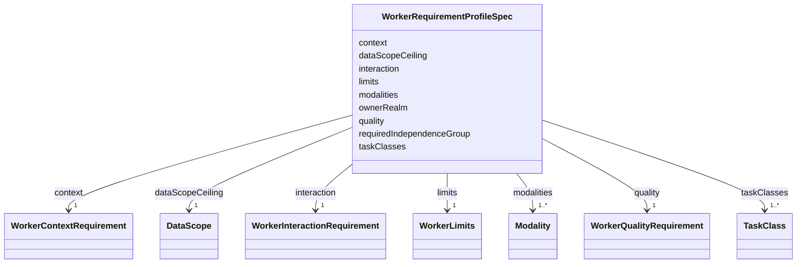

---
search:
  boost: 10.0
---

# Class: WorkerRequirementProfileSpec

<div data-search-exclude markdown="1">


URI: [jumo:WorkerRequirementProfileSpec](https://jumo.dev/schemas/jumo-v1/WorkerRequirementProfileSpec)





<!-- no inheritance hierarchy -->

## Slots

| Name | Cardinality and Range | Description | Inheritance |
| ---  | --- | --- | --- |
| [ownerRealm](ownerRealm.md) | 1 <br/> [Identifier](Identifier.md) |  | direct |
| [taskClasses](taskClasses.md) | 1..* <br/> [TaskClass](TaskClass.md) |  | direct |
| [modalities](modalities.md) | 1..* <br/> [Modality](Modality.md) |  | direct |
| [dataScopeCeiling](dataScopeCeiling.md) | 1 <br/> [DataScope](DataScope.md) |  | direct |
| [context](context.md) | 1 <br/> [WorkerContextRequirement](WorkerContextRequirement.md) |  | direct |
| [interaction](interaction.md) | 1 <br/> [WorkerInteractionRequirement](WorkerInteractionRequirement.md) |  | direct |
| [quality](quality.md) | 1 <br/> [WorkerQualityRequirement](WorkerQualityRequirement.md) |  | direct |
| [limits](limits.md) | 1 <br/> [WorkerLimits](WorkerLimits.md) |  | direct |
| [requiredIndependenceGroup](requiredIndependenceGroup.md) | 0..1 <br/> [Identifier](Identifier.md) | Narrows eligible ProviderAccounts to those sharing this independenceGroup (ow... | direct |


## Usages

| used by | used in | type | used |
| ---  | --- | --- | --- |
| [WorkerRequirementProfile](WorkerRequirementProfile.md) | [spec](spec.md) | range | [WorkerRequirementProfileSpec](WorkerRequirementProfileSpec.md) |


## Identifier and Mapping Information


### Annotations

| property | value |
| --- | --- |
| jumo.state_authority | GIT |
| jumo.model_role | VALUE_OBJECT |
| jumo.audience | REALM_PRIVATE |
| jumo.sensitivity | PERSONAL |
| jumo.boundary_eligible | True |
| jumo.schema_profiles | draft-2020-12,native-json-schema,prompted-json-validated |


### Schema Source


* from schema: https://jumo.dev/schemas/jumo-v1


## Mappings

| Mapping Type | Mapped Value |
| ---  | ---  |
| self | jumo:WorkerRequirementProfileSpec |
| native | jumo:WorkerRequirementProfileSpec |


## LinkML Source

<!-- TODO: investigate https://stackoverflow.com/questions/37606292/how-to-create-tabbed-code-blocks-in-mkdocs-or-sphinx -->

### Direct

<details>
```yaml
name: WorkerRequirementProfileSpec
annotations:
  jumo.state_authority:
    tag: jumo.state_authority
    value: GIT
  jumo.model_role:
    tag: jumo.model_role
    value: VALUE_OBJECT
  jumo.audience:
    tag: jumo.audience
    value: REALM_PRIVATE
  jumo.sensitivity:
    tag: jumo.sensitivity
    value: PERSONAL
  jumo.boundary_eligible:
    tag: jumo.boundary_eligible
    value: true
  jumo.schema_profiles:
    tag: jumo.schema_profiles
    value: draft-2020-12,native-json-schema,prompted-json-validated
from_schema: https://jumo.dev/schemas/jumo-v1
attributes:
  ownerRealm:
    name: ownerRealm
    from_schema: https://jumo.dev/schemas/jumo-v1
    owner: WorkerRequirementProfileSpec
    domain_of:
    - PrincipalSpec
    - PrincipalIdentityBindingSpec
    - ProjectSpec
    - KitBindingSpec
    - KitLockSpec
    - RoleDefinitionSpec
    - RoleAssignmentSpec
    - TeamSpecBody
    - CoordinationProfileSpec
    - RoutingEligibilitySpec
    - RoleLifecyclePolicySpec
    - OrganizationTemplateSpec
    - ChiefOfStaffProfileSpec
    - AdvisorProfileSpec
    - PersonalSpaceSpec
    - OrganizationSpecBody
    - RealmPublicationSpec
    - CapabilityProfileSpec
    - WorkerRequirementProfileSpec
    - GoldenTaskSetSpec
    - ImprovementLoopSpec
    - ControlCatalogSpec
    - ComplianceProfileSpec
    - EvidenceProfileSpec
    - ProcessSpecBody
    - ChangeProposalRef
    - ForgeProjectionRef
    - ProcessRunRef
    - ApprovalSignal
    - ExecutionCellProvisioningRef
    - ExecutionMachineSpec
    - MachineHostDefinitionSpec
    - McpRegistrySourceBindingSpec
    - ConnectorDefinitionSpec
    - ConnectorAppraisalSpec
    - McpBundleSpec
    - RemoteMcpServiceSpec
    - RemoteMcpAppraisalSpec
    - ExecutionCellSpec
    - ProviderSessionBinding
    - RoutingDecision
    - WorkerInvocation
    - EvidenceRecord
    - InvocationAuthorizationReceipt
    - SecretBindingSpec
    - FederatedPeerSpec
    - FederationProfileSpec
    - WorkerSubstrateSpec
    - McpInventorySnapshot
    - ConnectorIntegrationSpec
    - OAuthClientBindingSpec
    - InterfaceSurfaceSpec
    - VocabularySetSpec
    - ProjectionSpecBody
    range: Identifier
    required: true
  taskClasses:
    name: taskClasses
    from_schema: https://jumo.dev/schemas/jumo-v1
    rank: 1000
    owner: WorkerRequirementProfileSpec
    domain_of:
    - WorkerRequirementProfileSpec
    range: TaskClass
    required: true
    multivalued: true
    minimum_cardinality: 1
  modalities:
    name: modalities
    from_schema: https://jumo.dev/schemas/jumo-v1
    rank: 1000
    owner: WorkerRequirementProfileSpec
    domain_of:
    - WorkerRequirementProfileSpec
    range: Modality
    required: true
    multivalued: true
    minimum_cardinality: 1
  dataScopeCeiling:
    name: dataScopeCeiling
    from_schema: https://jumo.dev/schemas/jumo-v1
    rank: 1000
    owner: WorkerRequirementProfileSpec
    domain_of:
    - WorkerRequirementProfileSpec
    range: DataScope
    required: true
  context:
    name: context
    from_schema: https://jumo.dev/schemas/jumo-v1
    rank: 1000
    owner: WorkerRequirementProfileSpec
    domain_of:
    - WorkerRequirementProfileSpec
    - PolicyInput
    range: WorkerContextRequirement
    required: true
    inlined: true
  interaction:
    name: interaction
    from_schema: https://jumo.dev/schemas/jumo-v1
    rank: 1000
    owner: WorkerRequirementProfileSpec
    domain_of:
    - WorkerRequirementProfileSpec
    range: WorkerInteractionRequirement
    required: true
    inlined: true
  quality:
    name: quality
    from_schema: https://jumo.dev/schemas/jumo-v1
    rank: 1000
    owner: WorkerRequirementProfileSpec
    domain_of:
    - WorkerRequirementProfileSpec
    range: WorkerQualityRequirement
    required: true
    inlined: true
  limits:
    name: limits
    from_schema: https://jumo.dev/schemas/jumo-v1
    rank: 1000
    owner: WorkerRequirementProfileSpec
    domain_of:
    - WorkerRequirementProfileSpec
    - ResourceBudgetSpec
    - WorkerIsolation
    range: WorkerLimits
    required: true
    inlined: true
  requiredIndependenceGroup:
    name: requiredIndependenceGroup
    description: Narrows eligible ProviderAccounts to those sharing this independenceGroup
      (own, or inherited from their ProviderPlatform). Two profiles at the same reasoningEffort
      rung are otherwise indistinguishable for routing purposes (provider-platform-catalog
      lot); a producing and a verifying role's profiles declare disjoint values here
      when ADR-0019's independence separation must hold operationally, not just architecturally.
      Absent by default -- most profiles route on rung alone.
    from_schema: https://jumo.dev/schemas/jumo-v1
    rank: 1000
    owner: WorkerRequirementProfileSpec
    domain_of:
    - WorkerRequirementProfileSpec
    range: Identifier

```
</details>

### Induced

<details>
```yaml
name: WorkerRequirementProfileSpec
annotations:
  jumo.state_authority:
    tag: jumo.state_authority
    value: GIT
  jumo.model_role:
    tag: jumo.model_role
    value: VALUE_OBJECT
  jumo.audience:
    tag: jumo.audience
    value: REALM_PRIVATE
  jumo.sensitivity:
    tag: jumo.sensitivity
    value: PERSONAL
  jumo.boundary_eligible:
    tag: jumo.boundary_eligible
    value: true
  jumo.schema_profiles:
    tag: jumo.schema_profiles
    value: draft-2020-12,native-json-schema,prompted-json-validated
from_schema: https://jumo.dev/schemas/jumo-v1
attributes:
  ownerRealm:
    name: ownerRealm
    from_schema: https://jumo.dev/schemas/jumo-v1
    owner: WorkerRequirementProfileSpec
    domain_of:
    - PrincipalSpec
    - PrincipalIdentityBindingSpec
    - ProjectSpec
    - KitBindingSpec
    - KitLockSpec
    - RoleDefinitionSpec
    - RoleAssignmentSpec
    - TeamSpecBody
    - CoordinationProfileSpec
    - RoutingEligibilitySpec
    - RoleLifecyclePolicySpec
    - OrganizationTemplateSpec
    - ChiefOfStaffProfileSpec
    - AdvisorProfileSpec
    - PersonalSpaceSpec
    - OrganizationSpecBody
    - RealmPublicationSpec
    - CapabilityProfileSpec
    - WorkerRequirementProfileSpec
    - GoldenTaskSetSpec
    - ImprovementLoopSpec
    - ControlCatalogSpec
    - ComplianceProfileSpec
    - EvidenceProfileSpec
    - ProcessSpecBody
    - ChangeProposalRef
    - ForgeProjectionRef
    - ProcessRunRef
    - ApprovalSignal
    - ExecutionCellProvisioningRef
    - ExecutionMachineSpec
    - MachineHostDefinitionSpec
    - McpRegistrySourceBindingSpec
    - ConnectorDefinitionSpec
    - ConnectorAppraisalSpec
    - McpBundleSpec
    - RemoteMcpServiceSpec
    - RemoteMcpAppraisalSpec
    - ExecutionCellSpec
    - ProviderSessionBinding
    - RoutingDecision
    - WorkerInvocation
    - EvidenceRecord
    - InvocationAuthorizationReceipt
    - SecretBindingSpec
    - FederatedPeerSpec
    - FederationProfileSpec
    - WorkerSubstrateSpec
    - McpInventorySnapshot
    - ConnectorIntegrationSpec
    - OAuthClientBindingSpec
    - InterfaceSurfaceSpec
    - VocabularySetSpec
    - ProjectionSpecBody
    range: Identifier
    required: true
  taskClasses:
    name: taskClasses
    from_schema: https://jumo.dev/schemas/jumo-v1
    rank: 1000
    owner: WorkerRequirementProfileSpec
    domain_of:
    - WorkerRequirementProfileSpec
    range: TaskClass
    required: true
    multivalued: true
    minimum_cardinality: 1
  modalities:
    name: modalities
    from_schema: https://jumo.dev/schemas/jumo-v1
    rank: 1000
    owner: WorkerRequirementProfileSpec
    domain_of:
    - WorkerRequirementProfileSpec
    range: Modality
    required: true
    multivalued: true
    minimum_cardinality: 1
  dataScopeCeiling:
    name: dataScopeCeiling
    from_schema: https://jumo.dev/schemas/jumo-v1
    rank: 1000
    owner: WorkerRequirementProfileSpec
    domain_of:
    - WorkerRequirementProfileSpec
    range: DataScope
    required: true
  context:
    name: context
    from_schema: https://jumo.dev/schemas/jumo-v1
    rank: 1000
    owner: WorkerRequirementProfileSpec
    domain_of:
    - WorkerRequirementProfileSpec
    - PolicyInput
    range: WorkerContextRequirement
    required: true
    inlined: true
  interaction:
    name: interaction
    from_schema: https://jumo.dev/schemas/jumo-v1
    rank: 1000
    owner: WorkerRequirementProfileSpec
    domain_of:
    - WorkerRequirementProfileSpec
    range: WorkerInteractionRequirement
    required: true
    inlined: true
  quality:
    name: quality
    from_schema: https://jumo.dev/schemas/jumo-v1
    rank: 1000
    owner: WorkerRequirementProfileSpec
    domain_of:
    - WorkerRequirementProfileSpec
    range: WorkerQualityRequirement
    required: true
    inlined: true
  limits:
    name: limits
    from_schema: https://jumo.dev/schemas/jumo-v1
    rank: 1000
    owner: WorkerRequirementProfileSpec
    domain_of:
    - WorkerRequirementProfileSpec
    - ResourceBudgetSpec
    - WorkerIsolation
    range: WorkerLimits
    required: true
    inlined: true
  requiredIndependenceGroup:
    name: requiredIndependenceGroup
    description: Narrows eligible ProviderAccounts to those sharing this independenceGroup
      (own, or inherited from their ProviderPlatform). Two profiles at the same reasoningEffort
      rung are otherwise indistinguishable for routing purposes (provider-platform-catalog
      lot); a producing and a verifying role's profiles declare disjoint values here
      when ADR-0019's independence separation must hold operationally, not just architecturally.
      Absent by default -- most profiles route on rung alone.
    from_schema: https://jumo.dev/schemas/jumo-v1
    rank: 1000
    owner: WorkerRequirementProfileSpec
    domain_of:
    - WorkerRequirementProfileSpec
    range: Identifier

```
</details></div>