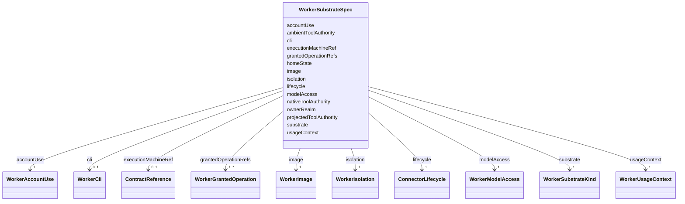

---
search:
  boost: 10.0
---

# Class: WorkerSubstrateSpec

<div data-search-exclude markdown="1">


URI: [jumo:WorkerSubstrateSpec](https://jumo.dev/schemas/jumo-v1/WorkerSubstrateSpec)





<!-- no inheritance hierarchy -->

## Slots

| Name | Cardinality and Range | Description | Inheritance |
| ---  | --- | --- | --- |
| [ownerRealm](ownerRealm.md) | 1 <br/> [Identifier](Identifier.md) |  | direct |
| [executionMachineRef](executionMachineRef.md) | 0..1 <br/> [ContractReference](ContractReference.md) | Durable execution machine selected for this CLI substrate; an ExecutionCellLe... | direct |
| [lifecycle](lifecycle.md) | 1 <br/> [ConnectorLifecycle](ConnectorLifecycle.md) |  | direct |
| [substrate](substrate.md) | 1 <br/> [WorkerSubstrateKind](WorkerSubstrateKind.md) |  | direct |
| [cli](cli.md) | 0..1 <br/> [WorkerCli](WorkerCli.md) |  | direct |
| [image](image.md) | 1 <br/> [WorkerImage](WorkerImage.md) |  | direct |
| [isolation](isolation.md) | 1 <br/> [WorkerIsolation](WorkerIsolation.md) |  | direct |
| [homeState](homeState.md) | 1 <br/> [String](String.md) | A mounted CLI home carries native connectors, consent history and trusted fol... | direct |
| [modelAccess](modelAccess.md) | 1 <br/> [WorkerModelAccess](WorkerModelAccess.md) |  | direct |
| [grantedOperationRefs](grantedOperationRefs.md) | 1..* <br/> [WorkerGrantedOperation](WorkerGrantedOperation.md) | The only external reach available to the substrate | direct |
| [nativeToolAuthority](nativeToolAuthority.md) | 1 <br/> [String](String.md) | CLI-native connectors and MCP servers are disabled so the fact is reviewable ... | direct |
| [ambientToolAuthority](ambientToolAuthority.md) | 1 <br/> [String](String.md) | No CLI home, image, plugin, repository file, or provider default silently gra... | direct |
| [projectedToolAuthority](projectedToolAuthority.md) | 1 <br/> [String](String.md) | Tool capabilities are dynamically projected by the Jumo capability gateway vi... | direct |
| [usageContext](usageContext.md) | 1 <br/> [WorkerUsageContext](WorkerUsageContext.md) | Licensing and entitlement fact only | direct |
| [accountUse](accountUse.md) | 1 <br/> [WorkerAccountUse](WorkerAccountUse.md) | Which ProviderAccount use context this substrate is authorized to consume, ex... | direct |


## Usages

| used by | used in | type | used |
| ---  | --- | --- | --- |
| [WorkerSubstrate](WorkerSubstrate.md) | [spec](spec.md) | range | [WorkerSubstrateSpec](WorkerSubstrateSpec.md) |


## Identifier and Mapping Information


### Annotations

| property | value |
| --- | --- |
| jumo.state_authority | GIT |
| jumo.model_role | VALUE_OBJECT |
| jumo.audience | REALM_PRIVATE |
| jumo.sensitivity | INTERNAL |
| jumo.boundary_eligible | True |
| jumo.schema_profiles | draft-2020-12,native-json-schema,prompted-json-validated |


### Schema Source


* from schema: https://jumo.dev/schemas/jumo-v1


## Mappings

| Mapping Type | Mapped Value |
| ---  | ---  |
| self | jumo:WorkerSubstrateSpec |
| native | jumo:WorkerSubstrateSpec |


## LinkML Source

<!-- TODO: investigate https://stackoverflow.com/questions/37606292/how-to-create-tabbed-code-blocks-in-mkdocs-or-sphinx -->

### Direct

<details>
```yaml
name: WorkerSubstrateSpec
annotations:
  jumo.state_authority:
    tag: jumo.state_authority
    value: GIT
  jumo.model_role:
    tag: jumo.model_role
    value: VALUE_OBJECT
  jumo.audience:
    tag: jumo.audience
    value: REALM_PRIVATE
  jumo.sensitivity:
    tag: jumo.sensitivity
    value: INTERNAL
  jumo.boundary_eligible:
    tag: jumo.boundary_eligible
    value: true
  jumo.schema_profiles:
    tag: jumo.schema_profiles
    value: draft-2020-12,native-json-schema,prompted-json-validated
from_schema: https://jumo.dev/schemas/jumo-v1
attributes:
  ownerRealm:
    name: ownerRealm
    from_schema: https://jumo.dev/schemas/jumo-v1
    owner: WorkerSubstrateSpec
    domain_of:
    - PrincipalSpec
    - PrincipalIdentityBindingSpec
    - ProjectSpec
    - KitBindingSpec
    - KitLockSpec
    - RoleDefinitionSpec
    - RoleAssignmentSpec
    - TeamSpecBody
    - CoordinationProfileSpec
    - RoutingEligibilitySpec
    - RoleLifecyclePolicySpec
    - OrganizationTemplateSpec
    - ChiefOfStaffProfileSpec
    - AdvisorProfileSpec
    - PersonalSpaceSpec
    - OrganizationSpecBody
    - RealmPublicationSpec
    - CapabilityProfileSpec
    - WorkerRequirementProfileSpec
    - GoldenTaskSetSpec
    - ImprovementLoopSpec
    - ControlCatalogSpec
    - ComplianceProfileSpec
    - EvidenceProfileSpec
    - ProcessSpecBody
    - ChangeProposalRef
    - ForgeProjectionRef
    - ProcessRunRef
    - ApprovalSignal
    - ExecutionCellProvisioningRef
    - ExecutionMachineSpec
    - MachineHostDefinitionSpec
    - McpRegistrySourceBindingSpec
    - ConnectorDefinitionSpec
    - ConnectorAppraisalSpec
    - McpBundleSpec
    - RemoteMcpServiceSpec
    - RemoteMcpAppraisalSpec
    - ExecutionCellSpec
    - ProviderSessionBinding
    - RoutingDecision
    - WorkerInvocation
    - EvidenceRecord
    - InvocationAuthorizationReceipt
    - SecretBindingSpec
    - FederatedPeerSpec
    - FederationProfileSpec
    - WorkerSubstrateSpec
    - McpInventorySnapshot
    - ConnectorIntegrationSpec
    - OAuthClientBindingSpec
    - InterfaceSurfaceSpec
    - VocabularySetSpec
    - ProjectionSpecBody
    range: Identifier
    required: true
  executionMachineRef:
    name: executionMachineRef
    description: Durable execution machine selected for this CLI substrate; an ExecutionCellLease
      remains invocation-scoped.
    from_schema: https://jumo.dev/schemas/jumo-v1
    owner: WorkerSubstrateSpec
    domain_of:
    - McpRegistrySourceBindingSpec
    - ProviderSessionBinding
    - WorkerSubstrateSpec
    - McpInventorySnapshot
    range: ContractReference
    inlined: true
  lifecycle:
    name: lifecycle
    from_schema: https://jumo.dev/schemas/jumo-v1
    owner: WorkerSubstrateSpec
    domain_of:
    - ProjectSpec
    - McpRegistrySourceSpec
    - McpRegistrySourceBindingSpec
    - McpRegistrySyncStatus
    - ConnectorDefinitionSpec
    - McpBundleSpec
    - RemoteMcpServiceSpec
    - ExecutionCellSpec
    - SecretBindingSpec
    - WorkerSubstrateSpec
    range: ConnectorLifecycle
    required: true
  substrate:
    name: substrate
    from_schema: https://jumo.dev/schemas/jumo-v1
    rank: 1000
    owner: WorkerSubstrateSpec
    domain_of:
    - WorkerSubstrateSpec
    range: WorkerSubstrateKind
    required: true
  cli:
    name: cli
    from_schema: https://jumo.dev/schemas/jumo-v1
    owner: WorkerSubstrateSpec
    domain_of:
    - CliToolDefinitionSpec
    - WorkerSubstrateSpec
    range: WorkerCli
  image:
    name: image
    from_schema: https://jumo.dev/schemas/jumo-v1
    owner: WorkerSubstrateSpec
    domain_of:
    - AssistedJourneyStep
    - WorkerSubstrateSpec
    range: WorkerImage
    required: true
    inlined: true
  isolation:
    name: isolation
    from_schema: https://jumo.dev/schemas/jumo-v1
    rank: 1000
    owner: WorkerSubstrateSpec
    domain_of:
    - WorkerSubstrateSpec
    range: WorkerIsolation
    required: true
    inlined: true
  homeState:
    name: homeState
    description: A mounted CLI home carries native connectors, consent history and
      trusted folders; isolated per-invocation state removes that duplicated authority.
    from_schema: https://jumo.dev/schemas/jumo-v1
    rank: 1000
    owner: WorkerSubstrateSpec
    domain_of:
    - WorkerSubstrateSpec
    range: string
    required: true
    equals_string: ISOLATED_PER_INVOCATION
  modelAccess:
    name: modelAccess
    from_schema: https://jumo.dev/schemas/jumo-v1
    rank: 1000
    owner: WorkerSubstrateSpec
    domain_of:
    - WorkerSubstrateSpec
    range: WorkerModelAccess
    required: true
    inlined: true
  grantedOperationRefs:
    name: grantedOperationRefs
    description: The only external reach available to the substrate.
    from_schema: https://jumo.dev/schemas/jumo-v1
    rank: 1000
    owner: WorkerSubstrateSpec
    domain_of:
    - WorkerSubstrateSpec
    range: WorkerGrantedOperation
    required: true
    multivalued: true
    inlined: true
    inlined_as_list: true
  nativeToolAuthority:
    name: nativeToolAuthority
    description: CLI-native connectors and MCP servers are disabled so the fact is
      reviewable rather than hidden in an image. Unaffected by AGENTS.md's development-agent
      MCP directives -- those govern a human's own terminal session, not a dispatched
      worker.
    from_schema: https://jumo.dev/schemas/jumo-v1
    rank: 1000
    owner: WorkerSubstrateSpec
    domain_of:
    - WorkerSubstrateSpec
    range: string
    required: true
    equals_string: DISABLED
  ambientToolAuthority:
    name: ambientToolAuthority
    description: No CLI home, image, plugin, repository file, or provider default
      silently grants tool access.
    from_schema: https://jumo.dev/schemas/jumo-v1
    rank: 1000
    owner: WorkerSubstrateSpec
    domain_of:
    - WorkerSubstrateSpec
    range: string
    required: true
    equals_string: DISABLED
  projectedToolAuthority:
    name: projectedToolAuthority
    description: Tool capabilities are dynamically projected by the Jumo capability
      gateway via an invocation-scoped Streamable HTTP MCP endpoint based on explicit
      InvocationCapabilityGrants.
    from_schema: https://jumo.dev/schemas/jumo-v1
    rank: 1000
    owner: WorkerSubstrateSpec
    domain_of:
    - WorkerSubstrateSpec
    range: string
    required: true
    equals_string: GRANT_ONLY
  usageContext:
    name: usageContext
    description: Licensing and entitlement fact only. Not a security boundary and
      not a sphere.
    from_schema: https://jumo.dev/schemas/jumo-v1
    rank: 1000
    owner: WorkerSubstrateSpec
    domain_of:
    - WorkerSubstrateSpec
    range: WorkerUsageContext
    required: true
  accountUse:
    name: accountUse
    description: Which ProviderAccount use context this substrate is authorized to
      consume, explicit so a declared substrate never silently upgrades from holder-operated
      to Jumo-managed use.
    from_schema: https://jumo.dev/schemas/jumo-v1
    rank: 1000
    owner: WorkerSubstrateSpec
    domain_of:
    - WorkerSubstrateSpec
    range: WorkerAccountUse
    required: true

```
</details>

### Induced

<details>
```yaml
name: WorkerSubstrateSpec
annotations:
  jumo.state_authority:
    tag: jumo.state_authority
    value: GIT
  jumo.model_role:
    tag: jumo.model_role
    value: VALUE_OBJECT
  jumo.audience:
    tag: jumo.audience
    value: REALM_PRIVATE
  jumo.sensitivity:
    tag: jumo.sensitivity
    value: INTERNAL
  jumo.boundary_eligible:
    tag: jumo.boundary_eligible
    value: true
  jumo.schema_profiles:
    tag: jumo.schema_profiles
    value: draft-2020-12,native-json-schema,prompted-json-validated
from_schema: https://jumo.dev/schemas/jumo-v1
attributes:
  ownerRealm:
    name: ownerRealm
    from_schema: https://jumo.dev/schemas/jumo-v1
    owner: WorkerSubstrateSpec
    domain_of:
    - PrincipalSpec
    - PrincipalIdentityBindingSpec
    - ProjectSpec
    - KitBindingSpec
    - KitLockSpec
    - RoleDefinitionSpec
    - RoleAssignmentSpec
    - TeamSpecBody
    - CoordinationProfileSpec
    - RoutingEligibilitySpec
    - RoleLifecyclePolicySpec
    - OrganizationTemplateSpec
    - ChiefOfStaffProfileSpec
    - AdvisorProfileSpec
    - PersonalSpaceSpec
    - OrganizationSpecBody
    - RealmPublicationSpec
    - CapabilityProfileSpec
    - WorkerRequirementProfileSpec
    - GoldenTaskSetSpec
    - ImprovementLoopSpec
    - ControlCatalogSpec
    - ComplianceProfileSpec
    - EvidenceProfileSpec
    - ProcessSpecBody
    - ChangeProposalRef
    - ForgeProjectionRef
    - ProcessRunRef
    - ApprovalSignal
    - ExecutionCellProvisioningRef
    - ExecutionMachineSpec
    - MachineHostDefinitionSpec
    - McpRegistrySourceBindingSpec
    - ConnectorDefinitionSpec
    - ConnectorAppraisalSpec
    - McpBundleSpec
    - RemoteMcpServiceSpec
    - RemoteMcpAppraisalSpec
    - ExecutionCellSpec
    - ProviderSessionBinding
    - RoutingDecision
    - WorkerInvocation
    - EvidenceRecord
    - InvocationAuthorizationReceipt
    - SecretBindingSpec
    - FederatedPeerSpec
    - FederationProfileSpec
    - WorkerSubstrateSpec
    - McpInventorySnapshot
    - ConnectorIntegrationSpec
    - OAuthClientBindingSpec
    - InterfaceSurfaceSpec
    - VocabularySetSpec
    - ProjectionSpecBody
    range: Identifier
    required: true
  executionMachineRef:
    name: executionMachineRef
    description: Durable execution machine selected for this CLI substrate; an ExecutionCellLease
      remains invocation-scoped.
    from_schema: https://jumo.dev/schemas/jumo-v1
    owner: WorkerSubstrateSpec
    domain_of:
    - McpRegistrySourceBindingSpec
    - ProviderSessionBinding
    - WorkerSubstrateSpec
    - McpInventorySnapshot
    range: ContractReference
    inlined: true
  lifecycle:
    name: lifecycle
    from_schema: https://jumo.dev/schemas/jumo-v1
    owner: WorkerSubstrateSpec
    domain_of:
    - ProjectSpec
    - McpRegistrySourceSpec
    - McpRegistrySourceBindingSpec
    - McpRegistrySyncStatus
    - ConnectorDefinitionSpec
    - McpBundleSpec
    - RemoteMcpServiceSpec
    - ExecutionCellSpec
    - SecretBindingSpec
    - WorkerSubstrateSpec
    range: ConnectorLifecycle
    required: true
  substrate:
    name: substrate
    from_schema: https://jumo.dev/schemas/jumo-v1
    rank: 1000
    owner: WorkerSubstrateSpec
    domain_of:
    - WorkerSubstrateSpec
    range: WorkerSubstrateKind
    required: true
  cli:
    name: cli
    from_schema: https://jumo.dev/schemas/jumo-v1
    owner: WorkerSubstrateSpec
    domain_of:
    - CliToolDefinitionSpec
    - WorkerSubstrateSpec
    range: WorkerCli
  image:
    name: image
    from_schema: https://jumo.dev/schemas/jumo-v1
    owner: WorkerSubstrateSpec
    domain_of:
    - AssistedJourneyStep
    - WorkerSubstrateSpec
    range: WorkerImage
    required: true
    inlined: true
  isolation:
    name: isolation
    from_schema: https://jumo.dev/schemas/jumo-v1
    rank: 1000
    owner: WorkerSubstrateSpec
    domain_of:
    - WorkerSubstrateSpec
    range: WorkerIsolation
    required: true
    inlined: true
  homeState:
    name: homeState
    description: A mounted CLI home carries native connectors, consent history and
      trusted folders; isolated per-invocation state removes that duplicated authority.
    from_schema: https://jumo.dev/schemas/jumo-v1
    rank: 1000
    owner: WorkerSubstrateSpec
    domain_of:
    - WorkerSubstrateSpec
    range: string
    required: true
    equals_string: ISOLATED_PER_INVOCATION
  modelAccess:
    name: modelAccess
    from_schema: https://jumo.dev/schemas/jumo-v1
    rank: 1000
    owner: WorkerSubstrateSpec
    domain_of:
    - WorkerSubstrateSpec
    range: WorkerModelAccess
    required: true
    inlined: true
  grantedOperationRefs:
    name: grantedOperationRefs
    description: The only external reach available to the substrate.
    from_schema: https://jumo.dev/schemas/jumo-v1
    rank: 1000
    owner: WorkerSubstrateSpec
    domain_of:
    - WorkerSubstrateSpec
    range: WorkerGrantedOperation
    required: true
    multivalued: true
    inlined: true
    inlined_as_list: true
  nativeToolAuthority:
    name: nativeToolAuthority
    description: CLI-native connectors and MCP servers are disabled so the fact is
      reviewable rather than hidden in an image. Unaffected by AGENTS.md's development-agent
      MCP directives -- those govern a human's own terminal session, not a dispatched
      worker.
    from_schema: https://jumo.dev/schemas/jumo-v1
    rank: 1000
    owner: WorkerSubstrateSpec
    domain_of:
    - WorkerSubstrateSpec
    range: string
    required: true
    equals_string: DISABLED
  ambientToolAuthority:
    name: ambientToolAuthority
    description: No CLI home, image, plugin, repository file, or provider default
      silently grants tool access.
    from_schema: https://jumo.dev/schemas/jumo-v1
    rank: 1000
    owner: WorkerSubstrateSpec
    domain_of:
    - WorkerSubstrateSpec
    range: string
    required: true
    equals_string: DISABLED
  projectedToolAuthority:
    name: projectedToolAuthority
    description: Tool capabilities are dynamically projected by the Jumo capability
      gateway via an invocation-scoped Streamable HTTP MCP endpoint based on explicit
      InvocationCapabilityGrants.
    from_schema: https://jumo.dev/schemas/jumo-v1
    rank: 1000
    owner: WorkerSubstrateSpec
    domain_of:
    - WorkerSubstrateSpec
    range: string
    required: true
    equals_string: GRANT_ONLY
  usageContext:
    name: usageContext
    description: Licensing and entitlement fact only. Not a security boundary and
      not a sphere.
    from_schema: https://jumo.dev/schemas/jumo-v1
    rank: 1000
    owner: WorkerSubstrateSpec
    domain_of:
    - WorkerSubstrateSpec
    range: WorkerUsageContext
    required: true
  accountUse:
    name: accountUse
    description: Which ProviderAccount use context this substrate is authorized to
      consume, explicit so a declared substrate never silently upgrades from holder-operated
      to Jumo-managed use.
    from_schema: https://jumo.dev/schemas/jumo-v1
    rank: 1000
    owner: WorkerSubstrateSpec
    domain_of:
    - WorkerSubstrateSpec
    range: WorkerAccountUse
    required: true

```
</details></div>